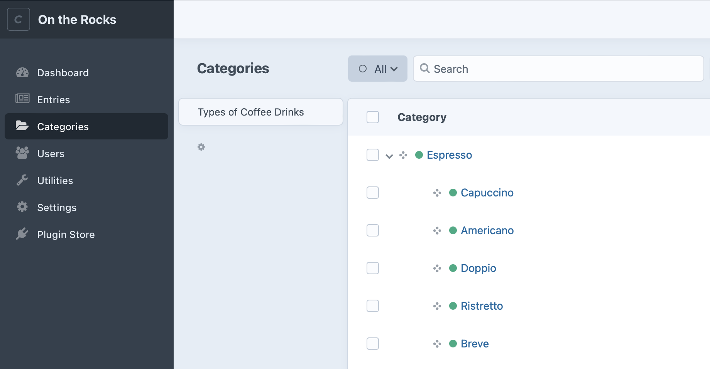
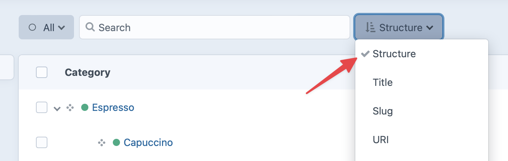
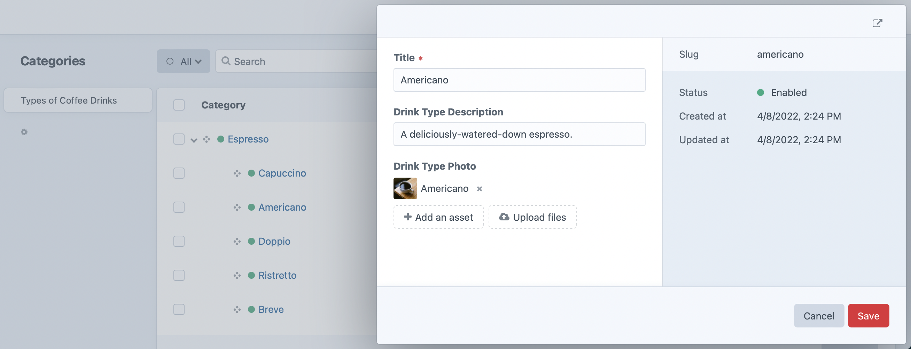

# Categories

You can create taxonomies for your [entries](entries.md), [users](users.md), and [assets](assets.md) using Categories.

## Category Groups

Before you can create categories, you must create Category Groups to contain them. Each Category Group lets you define the following:

- Category Group name
- Category Group handle (how you’ll refer to the Category Group in your templates)
- Maximum number of levels you can nest categories in the group
- The format of the category URI
- Which template should load if a category’s URL is accessed
- Which [fields](fields.md) categories in the group should have

To create a new category group, go to **Settings** → **Categories** and click “New Category Group”.

After you create at least one category group, you will be able to create categories for that group.

## Category Field Layout

Each Category Group can have its own Field Layout, which allows you to customize the data that’s associated with each category in the group. By default, every category will have a Title field (the category name).

You can also add additional fields using all of the available field types in Craft. If a field doesn’t yet exist, you must first create it via **Settings** → **Fields**. The new field will then be available to assign to the Field Layout of your Category Group.

## Creating and Editing Categories

When there’s at least one category group, **Categories** will appear in the primary control panel navigation. Clicking it will take you to the category index. From there, you can choose a category group from the sidebar, and add/reorder/delete categories within it:



::: tip
Select the “Structure” sort to work with a drag-and-drop hierarchy:

:::

Double-clicking a category’s status icon opens a slideout for quickly editing that category’s details:



You can also click a category’s title to visit its edit page just like an entry.

When you create a category, you have the following options:

- Fill out the category fields (if you didn’t define any then the only field available will be Title)
- Edit the slug (it’s automatically populated based on the title).
- Choose a Parent category. The new category will have a hierarchical relationship with its parent. This is helpful for creating taxonomies with multiple levels. You also have the option of creating a new category while assigning the Parent.

::: tip
You can only nest categories up to the level specified in the **Max Level** field Category Group settings. If it’s empty, the nesting level is unlimited.
:::

## Assigning Categories

To assign categories to things (entries, assets, users, etc.), you must first create a [Categories field](categories-fields.md).

Each Categories field is connected to a single category group. Whatever you attach the field to will be able to create [relations](relations.md) to any of the categories within that group.

## Querying Categories

You can fetch categories in your templates or PHP code using **category queries**.

::: code
```twig
{# Create a new category query #}

```
```php
// Create a new category query
$myCategoryQuery = \craft\elements\Category::find();
```
:::

Once you’ve created a category query, you can set [parameters](#parameters) on it to narrow down the results, and then [execute it](element-queries.md#executing-element-queries) by calling `.all()`. An array of [Category](craft3:craft\elements\Category) objects will be returned.

::: tip
See [Element Queries](element-queries.md) to learn about how element queries work.
:::

### Example

We can display a navigation for all the categories in a category group called “Topics” by doing the following:

1. Create a category query with `craft.categories()`.
2. Set the [group](#group) parameter on it.
3. Fetch the categories with `.all()`.
4. Loop through the categories using a [nav](dev/tags.html#nav) tag to create the navigation HTML.

```twig
{# Create a category query with the 'group' parameter #}


{# Fetch the categories #}


{# Display the navigation #}
<ul>
  
    <li>
      <a href="{{ category.url }}">{{ category.title }}</a>
      
        <ul>
          
        </ul>
      
    </li>
  
</ul>
```

::: tip
To maintain the exact order you see in the control panel, add `orderBy('lft ASC')` to your query:
```twig

```
:::

### Parameters

Category queries support the following parameters:

<!-- This section of the page is dynamically generated! Changes to the file below may be overwritten by automated tools. -->
!!!include(docs/.artifacts/cms/3.x/categories.md)!!!
