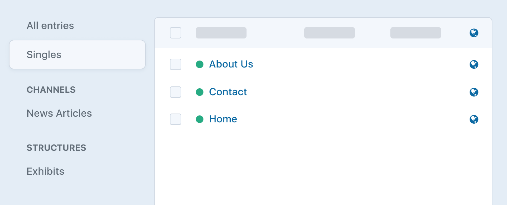

# Entries

Entries hold the content that you want to display on your web pages. Each entry has an Author, a Post Date, an Expiration Date (if desired), a status (enabled or disabled), and of course, content.

You can also create drafts of entries that live alongside the current live version of the entry.

Typically each entry will have a stake in its own primary URL on your site, though Craft can fetch any entry from anywhere if your template needs it.

## Sections

Before you can create entries, you must create Sections to contain them. In each Section you can define the following:

- Whether entries in the section have URLs
- What the entries’ URLs should look like
- Which template should get loaded if an entry’s URL is requested
- What types of entries should be available in the section, and which fields each of those entry types should have

If you’re using Craft with multiple sites then you can also define in your Section:

- Which sites’ entries in the section should target
- Which sites are enabled by default for new entries

To create a new section, go to **Settings** → **Sections** and choose **New Section**.

### Section Types

Craft has three different types of sections:

#### Singles



Singles are used for one-off pages that have unique content requirements, such as:

- the homepage
- an About Us page
- a Contact Us page

Unlike the other section types, Singles only have one entry associated with them, and they don’t have an editable Author, Post Date, or Expiration Date.

#### Channels


Channels are used for streams of similar content, such as:

- a Blog
- a News section
- recipes

#### Structures

Structures are good for times when you need to store multiple similar entries, and sort them into a specific order. They can also be hierarchical.


Unlike other sections, Structures have a “Structure” sort option that provies the manually-ordered, drag-and-drop hierarchy seen above:


Examples include:

- Documentation
- a Services section, where the order of services matters
- a company organization chart

### Entry URI Formats

Channel and Structure sections can choose whether their entries should be assigned URLs in the system, by filling in the “Entry URI Format” setting. (Singles have a “URI” setting.)

The template designated for an “Entry URI Format” or “URI” can use a special `entry` variable that’s automatically populated with the relevant section entry.

Entry URI Formats are mini Twig templates, which will be rendered each time an entry in the section is saved. The rendering result will be saved as the entry’s URI in the system.

The entry being saved will be available to the template as a variable named `object`, and each of the entry’s properties and custom field values will also be available as their own variables. So something like this is possible:

```twig
{{ author.username }}/{{ slug }}
```

A shortcut syntax is also available for output tags that reference a property on the entry:

```twig
{author.username}/{slug}
```

Structure sections may want to have nested paths for child entries:

```twig
{parent.uri}/{slug}
```

With the above Entry URI Format, a top-level entry’s URI might end up as `templating`, whereas a nested entry’s URI might end up as `templating/tags`.

Structure sections might also want to include a segment before the nested path:

```twig
{parent.uri ?? 'docs'}/{slug}
```

The above template could also be expressed with this syntax:

```twig
docs{parent.uri}/{slug}
```

With the above Entry URI Format, a top-level entry’s URI might end up as `docs/templating`, whereas a nested entry’s URI might end up as `docs/templating/tags`.

::: tip
You can designate any one entry as a site’s homepage using a special `__home__` URI.
:::

::: tip
You can use an attribute from a query in the entry’s URI. Use double curly braces (e.g. `{{craft.entries().section('mySingle').one().slug}}/news`).
:::

::: tip
You can use aliases in the entry’s URI. Use the `alias()` function in double curly braces (e.g. `{{alias(@rootUrl)}}/news`, `{{alias(@mySectionUri)}}`). See [Environmental Configuration](config/#environmental-configuration) to learn more about how those work.
:::

### Preview Targets

If you’re using Craft Pro, your section can have one or more **preview targets**, which are URLs of pages that your entries will show up on, making it possible for authors to preview entries as they are writing them in the control panel.

Like entry URI formats, these preview target URLs are mini Twig templates that can contain entry properties and other dynamic values.

Use single curly braces to render attributes on the entry. For example if entries in your section have their own URLs, then you can create a preview target for the entry’s primary URL using the URL template, `{url}`.

Create additional preview targets for any other areas the entry might show up, such as `news`, or `archive/{postDate|date('Y')}`. If the entries show up on the homepage, you can create a preview target with a blank URL.


::: tip
If you want to include the entry’s ID or UID in a preview target URL, use `{canonicalId}` or `{canonicalUid}` rather than `{id}` or `{uid}`, so the source entry’s ID or UID is used rather than the draft’s.
:::

::: tip
You can use environment variables and aliases in the preview target URL. These do not get wrapped in curly braces (e.g. `$NEWS_INDEX`, `@rootUrl/news`, `@rootUrl/news/{slug}`). See [Environmental Configuration](config/#environmental-configuration) to learn more about how those work.
:::

::: tip
Preview target URLs can include an attribute on the result of a query. Here double curly braces must be used (e.g. `{{ craft.entries().section('mySingle').one().url }}`).
:::

When an author is editing an entry from a section with custom preview targets, the **View** button will be replaced with a menu that lists the **Primary entry page** (if the section has an Entry URI Format), plus the names of each preview target.


If you share a link from this menu that includes a preview token, it will expire by default after one day. You can customize this with the [defaultTokenDuration](config3:defaultTokenDuration) config setting.

The targets will also be available within **Preview**.

#### Previewing Decoupled Front Ends

If your site’s front end lives outside of Craft, for example as a Vue or React app, you can still support previewing drafts and revisions with **Preview** or **Share** buttons. To do that, your front end must check for the existence of a `token` query string parameter (or whatever your <config3:tokenParam> config setting is set to). If it’s in the URL, then you will need to pass that same token in the Craft API request that loads the page content. This token will cause the API request to respond with the correct content based on what’s actually being previewed.

You can pass the token via either a query string parameter named after your <config3:tokenParam> config setting, or an `X-Craft-Token` header.

::: tip
For live preview, you should also consider [enabling iFrame Resizer](config3:useIframeResizer) so that Craft can maintain the page scroll position between page loads.
:::

## Entry Types

Both Channel and Structure sections let you define multiple types of entries using Entry Types.

You can manage your sections’ Entry Types by choosing **Edit Entry Types** link beside the section’s name in **Settings** → **Sections**. That’ll take you to the section’s entry type index. Choosing on an entry type’s name takes you to its settings page:


Entry types have the following settings:

- **Name** – The entry type’s name
- **Handle** – The entry type’s template-facing handle
- **Show the Title field?** – Whether a Title field is displayed for entries of this type
- **Title Field Label** – What the Title field label should be.

### Dynamic Entry Titles

If you want your entries to have auto-generated titles rather than requiring authors to enter them, you can uncheck the **Show the Title field?** checkbox. When you do, a new **Title Format** setting will appear, where you can define what the auto-generated titles should look like.

The Title Format is a full-blown Twig template, and it will get parsed whenever your entries are saved.

The entry is passed to this template as a variable named `object`. You can reference the entry’s [properties](craft3:craft\elements\Entry#public-properties) in two ways:

1. normal Twig syntax: `{{ object.property }}`
2. shortcut Twig syntax: `{property}`

::: tip
Shortcut syntax only has one set of curly braces.
:::

If Craft finds any of these in your Title Format, it will replace the `{` with `{{object.` and the `}` with `}}`, before passing the template off to Twig for parsing.

You can use Twig filters in both syntaxes:

```twig
{{ object.postDate|date('M j, Y') }}
{postDate|date('M j, Y')}
```

Craft’s [global variables](dev/global-variables.md) are available to these templates as well:

```twig
{{ now|date('Y-m-d') }}
{{ currentUser.username }}
```

Conditionals are also fair game. There’s no shortcut syntax for those, so if you want to use a conditional on one of the entry’s properties, you will need to reference it with the `object` variable:

```twig
{postDate|date('M j, Y')}{{ now|date('M j, Y') }}
```

## Editing Entries

If you have at least one section, there will be an **Entries** menu item in the primary control panel navigation. Clicking on it will take you to the entry index. From there you can navigate to the entry you wish to edit, or create a new one.

You can perform the following actions from the Edit Entry page:

- Choose the entry type (if there’s at least two to choose from)
- Edit the entry’s title
- Edit the entry’s slug
- Edit the entry’s custom field content
- Choose the entry’s author (Pro edition only)
- Choose the entry’s parent (if it’s within a Structure section)
- Choose the entry’s Post Date
- Choose the entry’s Expiration Date (optional)
- Choose whether the entry is enabled or not
- Save changes to the entry
- Save a new draft of the entry
- Publish a draft
- View past versions of the entry

If you leave the Post Date blank, Craft will automatically set it the first time an entry is saved as enabled.

## Querying Entries

While an entry’s configured template will automatically make an `entry` variable available, you can fetch entries throughout your templates or PHP code using **entry queries**.

::: code
```twig
{# Create a new entry query #}

```
```php
// Create a new entry query
$myEntryQuery = \craft\elements\Entry::find();
```
:::

Once you’ve created an entry query, you can set [parameters](#parameters) on it to narrow down the results, and then [execute it](element-queries.md#executing-element-queries) by calling `.all()`. An array of [Entry](craft3:craft\elements\Entry) objects will be returned.

::: tip
See [Element Queries](element-queries.md) to learn about how element queries work.
:::

### Example

We can display the 10 most recent entries in a “Blog” section by doing the following:

1. Create an entry query with `craft.entries()`.
2. Set the [section](#section) and [limit](#limit) parameters on it.
3. Fetch the entries with `.all()`.
4. Loop through the entries using a [for](https://twig.symfony.com/doc/2.x/tags/for.html) tag to output the blog post HTML.

```twig
{# Create an entry query with the 'section' and 'limit' parameters #}


{# Fetch the entries #}


{# Display the entries #}

  <article>
    <h1><a href="{{ entry.url }}">{{ entry.title }}</a></h1>
    {{ entry.summary }}
    <a href="{{ entry.url }}">Continue reading</a>
  </article>

```

### Parameters

Entry queries support the following parameters:

<!-- This section of the page is dynamically generated! Changes to the file below may be overwritten by automated tools. -->
!!!include(docs/.artifacts/3.x/entries.md)!!!
