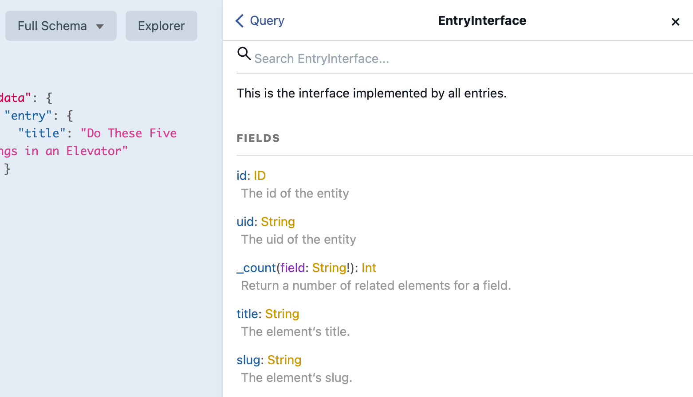
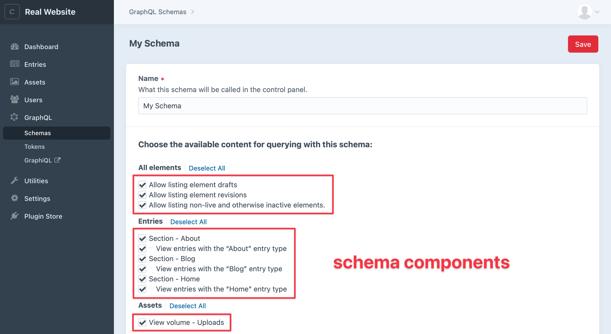

# Extending GraphQL

Developers can use Craft’s [GraphQL implementation](../graphql.md) to provide their own GraphQL data and access level for custom plugins and modules.

If you’ve created a custom element or field type, chances are you’ll want to make its data available via the GraphQL API.

## Overview

Unlike Craft’s element queries that are built on the fly, a GraphQL schema needs to define every possible query and data type up front.

This fundamental difference between Craft and GraphQL APIs, combined with Craft’s flexible content modeling, means _mapping out_ your custom implementation will probably take more effort than writing the code to make it happen.

Important questions to consider:

1. What kinds of data do you need to expose, and how complex is each?\
(Are there nested objects or multiple types? Will you need to support eager loading?)
2. What sort of arguments, if any, do you need to make available for narrowing your result set?
3. Should this data be available in the public schema, or will you need to add and honor schema “permissions”?

Craft relies on the [webonyx/graphql-php](https://github.com/webonyx/graphql-php) library and we’ll assume you’ve familiarized yourself with [GraphQL basics](https://graphql.org/learn/). It’s worth taking a look at each if you haven’t already.

::: tip
Be mindful of Craft vs. GraphQL terminology, because there are overlapping terms that can be confusing. It helps to pay careful attention to namespacing when looking at code examples.
:::

The rest of this page will cover each of the main things you may need to work with. If you’d like some concrete examples, have a look at Craft’s own pieces in the [`src/gql/` directory](https://github.com/craftcms/cms/tree/main/src/gql).

### Limitations

If you’re planning advanced or elaborate GraphQL features, please be aware of the following limitations with Craft’s GraphQL implementation:

- GraphQL subscriptions aren’t currently supported.
- Advanced query builder functions [are not exposed for GraphQL](https://github.com/craftcms/cms/issues/7842).

## Folder Structure

Here’s a high-level look at the folder structure we’ll explore in our example adding a “Widget” element. You can structure things however you want, we’re just following [Craft’s organization](https://github.com/craftcms/cms/tree/main/src/gql):

```treeview
src/gql/
├── arguments/
│   └── elements/
│       └── Widget.php
├── directives/
│   └── BarTheFoo.php
├── interfaces/
│   └── elements/
│       └── Widget.php
├── queries/
│   └── Widget.php
├── resolvers/
│   └── elements/
│       └── Widget.php
└── types/
    ├── elements/
    │    └── Widget.php
    ├── generators/
    │   └── WidgetType.php
    └── input/
        └── Widget.php
```

## The Gql Service

The <craft3:craft\services\Gql> class offers methods mostly for managing schemas and tokens and executing queries, so you won’t need to do much with it if you’re primarily exposing data to GraphQL. The Gql class does, however, define and trigger the events you’ll use to register any components you’d like to add to the system. (We’ll get to those in a moment.)

### Modifying Queries Before or After Execution

The Gql service includes events you can use to modfiy [queries](#queries) before and after they’re executed.

#### beforeExecuteGqlQuery

```php
use craft\events\ExecuteGqlQueryEvent;
use craft\services\Gql;
use yii\base\Event;

Event::on(
    Gql::class,
    Gql::EVENT_BEFORE_EXECUTE_GQL_QUERY,
    function(ExecuteGqlQueryEvent $event) {
        // Set the result from cache
        $event->result = ...;
    }
);
```

#### afterExecuteGqlQuery

```php
use craft\events\ExecuteGqlQueryEvent;
use craft\services\Gql;
use yii\base\Event;

Event::on(
    Gql::class,
    Gql::EVENT_AFTER_EXECUTE_GQL_QUERY,
    function(ExecuteGqlQueryEvent $event) {
        // Cache results from $event->result or just tweak them
    }
);
```

## Queries

Queries are the top-level starting points someone will use fetching data from the GraphQL API. Craft includes query definitions for `entries` and `entry`, for example, and Craft Commerce adds its own custom queries for `products` and `product`.

Imagine we’ve added a custom element type for “Widgets”.

A simple query to list `widgets` titles might look like this:

```graphql{2}
{
  widgets {
    title
  }
}
```

A <craft3:craft\gql\base\Query> class provides one or more query names, each describing a GraphQL type it will return, any arguments that can be used to tailor results, and pointing to a resolver that will be responsible for translating the GraphQL query into equivalent logic with Craft’s APIs.

### Example Query Class

This example provides a `widgets` query that returns an array of custom [interfaces](#interfaces), optionally filtered by custom [arguments](#arguments). The [resolver](#resolver) describes how to provide data for each interface.

```php
namespace mynamespace\gql\queries;

use GraphQL\Type\Definition\Type;
use mynamespace\helpers\Gql as GqlHelper;
use mynamespace\gql\interfaces\elements\Widget as WidgetInterface;
use mynamespace\gql\arguments\elements\Widget as WidgetArguments;
use mynamespace\gql\resolvers\elements\Widget as WidgetResolver;

class Widget extends craft\gql\base\Query
{
    public static function getQueries($checkToken = true): array
    {
        // Make sure the current token’s schema allows querying widgets
        if ($checkToken && !GqlHelper::canQueryWidgets()) {
            return [];
        }

        // Provide one or more query definitions
        return [
            'widgets' => [
                'type' => Type::listOf(WidgetInterface::getType()),
                'args' => WidgetArguments::getArguments(),
                'resolve' => WidgetResolver::class . '::resolve',
                'description' => 'This query is used to query for custom widgets.'
            ],
        ];
    }
}
```

::: tip
The careful reader will notice a custom GqlHelper class above, which is a tiny extension of <craft3:craft\helpers\Gql> that makes it trivial to check whether entities are allowed by the schema:

```php
public static function canQueryWidgets(): bool
{
    $allowedEntities = self::extractAllowedEntitiesFromSchema();
    return isset($allowedEntities['widgets']);
}
```
:::

### Registering Queries

You can register one or more query classes using the [registerGqlQueries](craft3:craft\services\Gql::EVENT_REGISTER_GQL_QUERIES) event and appending them to the `queries` array:

```php
use craft\events\RegisterGqlQueriesEvent;
use craft\services\Gql;
use yii\base\Event;
use mynamespace\gql\queries\Widget;

Event::on(
    Gql::class,
    Gql::EVENT_REGISTER_GQL_QUERIES,
    function(RegisterGqlQueriesEvent $event) {
        $event->queries[] = Widget::class;
    }
);
```

## Arguments

A [query](#queries) can support any number of arguments someone can use to filter results.

Any Craft element can be filtered by `id`, `slug`, or its `enabledForSite` property, for example.

Our pretend Widget element could provide its own `approved` argument for narrowing results to approved widgets:

```graphql{2}
{
  widgets(approved: true) {
    title
  }
}
```

### Example Arguments Class

```php
namespace mynamespace\gql\arguments\elements;

use GraphQL\Type\Definition\Type;

class Widget extends craft\gql\base\ElementArguments
{
    public static function getArguments(): array
    {
        // append our argument to common element arguments and any from custom fields
        return array_merge(parent::getArguments(), self::getContentArguments(), [
            'approved' => [
                'name' => 'approved',
                'type' => Type::boolean(),
                'description' => 'Narrows query results based on approved status.'
            ],
        );
    }
}
```

::: tip
This example extends <craft3:craft\gql\base\ElementArguments> in order to take advantage of common element arguments for free. It’s fine if you don’t have your own element type or even a class for arguments; you ultimately just need to provide an array of argument definitions for your queries if you want to use them.
:::

## Types

Not to be confused with Craft’s entry types, GraphQL types are the vital and specific descriptions of whatever the API can return.

::: tip
GraphQL is a _type system_, and if you’re not already familiar we recommend reading about its [schema and types](https://graphql.org/learn/schema/) for context.
:::

Each type must exhaustively describe what it contains—including any nested types—and every type in the GraphQL schema must be unique.

Everything has a `__typename`:

::: code

```graphql GraphQL Query
{
  __typename
  entry {
    __typename
  }
  user {
    __typename
  }
  widget {
    __typename
  }
}
```

```json JSON Response
{
  "data": {
    "__typename": "Query",
    "entry": {
      "__typename": "blog_blog_Entry"
    },
    "user": {
      "__typename": "User"
    },
    "widget": {
      "__typename": "Widget"
    }
  }
}
```

:::

Every available part of Craft’s content model, and every kind of data your custom plugin or module needs to expose via GraphQL, needs to be translated into an explicitly-named GraphQL type.

Craft’s <craft3:craft\gql\GqlEntityRegistry> keeps track of these GraphQL types, and you’ll use it to add, fetch, and modify them.

When adding fields to a given type, you should run them through <craft3:craft\gql\TypeManager::prepareFieldDefinitions()>. This makes it possible for others to programmatically [modify type fields](#modifying-type-fields) you’re introducing.

Pay special attention to the [GraphQL\Type\Definition\Type](https://github.com/webonyx/graphql-php/blob/master/src/Type/Definition/Type.php) class, which you’ll probably want to use for returning scalar types.

::: tip
For consistency, use the `ID` type—and not `Int`—when you’re returning IDs.
:::

### Example Type Class

This example extends Craft’s element GraphQL [interface](#interfaces).

It does this in order to define a single GraphQL type for our custom Widget element that adds a custom `approved` field:

```php
namespace mynamespace\gql\interfaces\elements;

use GraphQL\Type\Definition\Type;
use GraphQL\Type\Definition\InterfaceType;
use craft\gql\GqlEntityRegistry;

class Widget extends craft\gql\interfaces\Element
{
    public static function getName(): string
    {
        return 'WidgetInterface';
    }

    public static function getType($fields = null): Type
    {
        // Return the type if it’s already been created
        if ($type = GqlEntityRegistry::getEntity(self::getName())) {
            return $type;
        }

        // Otherwise create the type via the entity registry, which handles prefixing
        return GqlEntityRegistry::createEntity(self::getName(), new InterfaceType([
            'name' => static::getName(),
            'fields' => self::class . '::getFieldDefinitions',
            'description' => 'This is the interface implemented by all widgets.',
            'resolveType' => self::class . '::resolveElementTypeName',
        ]));
    }

    public static function getFieldDefinitions(): array
    {
        // Add our custom widget’s field to common ones for all elements
        return TypeManager::prepareFieldDefinitions(array_merge(
            parent::getFieldDefinitions(),
            [
                'approved' => [
                    'name' => 'approved',
                    'type' => Type::boolean(),
                    'description' => 'User account ID of the partner listing’s owner.'
                ],
            ]
        ), self::getName());
    }
}
```

While there are many GraphQL types you could implement, your custom objects will most likely want to provide interfaces that describe data models and input types for any [mutations](#mutations).

### Registering Types

The Gql service includes a `registerGqlTypes` event you can use to register your types.

Here we’re registering the `Widget` interface we just looked at above. While you’re not limited to adding interfaces, any class you add must have a `getType()` method that returns a valid GraphQL type definition.

```php
use craft\events\RegisterGqlTypesEvent;
use craft\services\Gql;
use yii\base\Event;
use mynamespace\gql\interfaces\elements\Widget as WidgetInterface;

Event::on(
    Gql::class,
    Gql::EVENT_REGISTER_GQL_TYPES,
    function(RegisterGqlTypesEvent $event) {
        $event->types[] = WidgetInterface::class;
    }
);
```

### Modifying Type Fields

Craft’s <craft3:craft\gql\TypeManager> includes a `defineGqlTypeFields` event you can use to add, remove or modify fields on any GraphQL type.

Below we’re removing IDs throughout the schema in favor of UIDs, and adding an `authorEmail` field to the entry interface:

```php
use craft\events\DefineGqlTypeFields;
use craft\gql\TypeManager;
use yii\base\Event;

Event::on(
    TypeManager::class,
    TypeManager::EVENT_DEFINE_GQL_TYPE_FIELDS,
    function(DefineGqlTypeFields $e) {
        // Remove all ids to enforce use of uids
        unset($event->fields['id']);

        // Add author email to all entries
        if ($event->typeName == 'EntryInterface') {
            $event->fields['authorEmail'] = [
                'name' => 'authorEmail',
                'type' => Type::string(),
                'resolve' => function($source, $arguments, $context, $resolveInfo) {
                    // Illustrative only; a query per entry would perform poorly
                    return $source->getAuthor()->email;
                }
            ];
        }
    }
);
```

## Interfaces

Just like PHP interfaces, GraphQL interfaces are abstract types that describe the fields a type must implement.



You don’t have to use interfaces, but they’re a nice way of formalizing the fields exposed by your type. Craft provides GraphQL interfaces for each included element type:

- <craft3:craft\gql\interfaces\Element>
- <craft3:craft\gql\interfaces\Structure>
- <craft3:craft\gql\interfaces\elements\Asset>
- <craft3:craft\gql\interfaces\elements\Category>
- <craft3:craft\gql\interfaces\elements\Entry>
- <craft3:craft\gql\interfaces\elements\GlobalSet>
- <craft3:craft\gql\interfaces\elements\MatrixBlock>
- <craft3:craft\gql\interfaces\elements\Tag>
- <craft3:craft\gql\interfaces\elements\User>

## Resolvers

A resolver is responsible for mapping a GraphQL API field to its Craft API equivalent.

You won’t see or interact with a resolver querying the GraphQL API because the resolver works behind the scenes to connect the query or mutation to the value it’s supposed to return.

### Example Resolver Class

This example resolver extends the base [ElementResolver](craft3:craft\gql\base\ElementResolver) and implements a single [prepareQuery()](craft3:craft\gql\base\ElementResolver::prepareQuery()) method whose job is to return an element query:

```php
namespace mynamespace\gql\resolvers\elements;

use mynamespace\elements\Widget as WidgetElement;
use mynamespace\helpers\Gql as GqlHelper;

class Widget extends craft\gql\base\ElementResolver
{
    public static function prepareQuery($source, array $arguments, $fieldName = null)
    {
        if ($source === null) {
            // If this is the beginning of a resolver chain, start fresh
            $query = WidgetElement::find();
        } else {
            // If not, get the prepared element query
            $query = $source->$fieldName;
        }

        // Return the query if it’s preloaded
        if (is_array($query)) {
            return $query;
        }

        foreach ($arguments as $key => $value) {
            if (method_exists($query, $key)) {
                $query->$key($value);
            } elseif (property_exists($query, $key)) {
                $query->$key = $value;
            } else {
                // Catch custom field queries
                $query->$key($value);
            }
        }

        // Don’t return anything that’s not allowed
        if (!GqlHelper::canQueryWidgets()) {
            return [];
        }

        return $query;
    }
}
```

If this wasn’t a custom element type, we’d need a class to extend <craft3:craft\gql\base\Resolver> instead, implementing a [resolve()](craft3:craft\gql\base\Resolver::resolve()) method to return the field’s value rather than translating it into an element query.

## Generators

Craft introduces the concept of generators to bridge the gap between a complex content model and a GraphQL schema that needs to detail every potential type of content.

In the [example interface](#example-type-class) above, we kept things simple by adding only one GraphQL type to the schema. In other words, our widget only comes in one “flavor.” If the data you’re representing only appears in one form, that may work great!

It’s common in Craft, however, for elements to have multiple types: entries have sections and entry types, assets have volumes, categories have groups, and so on. The site developer can create however many of these flavors they’d like, and yet we still need each one to be accounted for in the GraphQL schema. This is exactly the situation generators help with.


Like the name implies, a generator can dynamically create GraphQL types based on whatever _contexts_ are needed. The generator needs to know about the unique scopes in which an element may appear for each unique flavor or context.

For example:

- An Asset’s context is its volume: `volumes.[UID]`
- A category’s context is its category group: `categorygroups.[UID]`
- An entry’s context is its entry type, and it has an additional section context: \
`sections.[section UID]`, `entrytypes.[UID]`

If you’ll benefit from using a generator, you will need to write a class that extends <craft3:craft\gql\base\Generator> and implements <craft3:craft\gql\base\GeneratorInterface> and <craft3:craft\gql\base\SingleGeneratorInterface>.

Generator provides a `getContentFields()` method that gets custom fields for a given context, while the interfaces require `generateTypes()` and `generateType()` respectively—responsible for registering types based on the provided context.

### Example Generator Classes

Our single-flavor widget wouldn’t actually need to generate multiple types since it only has one context. It wouldn’t need a generator class, so just for illustration a single-type generator could look like this:

```php
namespace mynamespace\gql\types\generators;

use mynamespace\elements\Widget as WidgetElement;
use mynamespace\gql\types\elements\Widget as WidgetType;
use mynamespace\gql\interfaces\elements\Widget as WidgetInterface;
use craft\gql\base\GeneratorInterface;
use craft\gql\GqlEntityRegistry;
use craft\gql\TypeManager;

class WidgetType implements GeneratorInterface
{
    public static function generateTypes($context = null): array
    {
        // Widgets have no context
        $type = static::generateType($context);
        return [$type->name => $type];
    }

    public static function generateType($context): ObjectType
    {
        $pluginType = new WidgetElement();
        $typeName = $pluginType->getGqlTypeName();
        $widgetFields = TypeManager::prepareFieldDefinitions(
            WidgetInterface::getFieldDefinitions(),
            $typeName
        );

        // Return the type if it exists, otherwise create and return it
        return GqlEntityRegistry::getEntity($typeName) ?:
            GqlEntityRegistry::createEntity(
                $typeName,
                new WidgetType([
                    'name' => $typeName,
                    'fields' => function() use ($widgetFields) {
                        return $widgetFields;
                    },
                ])
            );
    }
}
```

::: tip
We’re assuming `mynamespace\elements\Widget` was an existing [element class](element-types.md#element-class).
:::

Now let’s spice things up and pretend our widgets come in multiple flavors, each one having custom field layouts—similar to Craft’s entry types.

We can think of each “flavor” as a context that widget might appear in, and use the generator to dynamically create a type for each context.

This example pretends a `getAllWidgetTypes()` method can give us back the context we need to account for, then loops through them to generate an array of GraphQL types. The `generateTypes()` method does the work of determining which types we need, handing each one off to `generateType()` in order to get a context-specific GraphQL type definition:

```php
namespace mynamespace\gql\types\generators;

use mynamespace\Plugin;
use mynamespace\elements\Widget as WidgetElement;
use mynamespace\gql\types\elements\Widget as WidgetType;
use mynamespace\gql\interfaces\elements\Widget as WidgetInterface;
use mynamespace\helpers\Gql as MyGqlHelper;
use craft\gql\base\GeneratorInterface;
use craft\gql\GqlEntityRegistry;
use craft\gql\TypeManager;

class WidgetType implements GeneratorInterface
{
    public static function generateTypes($context = null): array
    {
        // Fetch all our pretend widget types to be used as contexts
        $widgetTypes = Plugin::getInstance()->getAllWidgetTypes();
        $gqlTypes = [];

        foreach ($widgetTypes as $widgetType) {
            // Get relevant scopes that may limit schema access
            $requiredContexts = WidgetElement::gqlScopesByContext($widgetType);

            // Ignore this widget variation if the schema doesn’t include it
            if (!MyGqlHelper::isSchemaAwareOf($requiredContexts)) {
                continue;
            }

            // Generate a GQL type for this widget type
            $type = static::generateType($widgetType);
            $gqlTypes[$type->name] = $type;
        }

        return $gqlTypes;
    }

    public static function generateType($context): ObjectType
    {
        // Get the intended GQL type name as determined by the element type
        $typeName = WidgetElement::gqlTypeNameByContext($widgetType);

        // Get element’s user-defined content fields and
        $contentFieldGqlTypes = self::getContentFields($context);

        // Merge in GQL types for the widget element’s own custom fields
        $widgetFields = TypeManager::prepareFieldDefinitions(
            array_merge(
                WidgetInterface::getFieldDefinitions(),
                $contentFieldGqlTypes
            ),
            $typeName
        );

        // Return the type if it exists, otherwise create and return it
        return GqlEntityRegistry::getEntity($typeName) ?:
            GqlEntityRegistry::createEntity(
                $typeName,
                new WidgetType([
                    'name' => $typeName,
                    'fields' => function() use ($widgetFields) {
                        return $widgetFields;
                    },
                ])
            );
    }
}
```

The term “context” here is deliberately vague because you’re the one that decides what that should be.

Since Craft elements and field types are relevant to the GraphQL API, their base classes include methods for describing their type names:

- <craft3:craft\base\Element::getGqlTypeName()>
- <craft3:craft\base\Element::gqlTypeNameByContext()>
- <craft3:craft\base\Field::getContentGqlType()>

These include sensible defaults since Craft can make some assumptions about how elements and fields will be used.

::: tip
A field can also use <craft3:craft\base\Field::includeInGqlSchema()>—`true` by default—to determine whether it should appear in a given schema.
:::

## Directives

Directives return types that can be used to transform result data in specified locations relative to the GraphQL query.

The [`formatDateTime` directive](../graphql.md#the-formatdatetime-directive), for example, can be used to return any date in a specific format:

```graphql{3}
{
  widgets {
    dateCreated @formatDateTime (format: "Y-m-d")
  }
}
```

Craft’s included directives apply exclusively to requested fields, though they may be applied in mutations and numerous parts of the type system.

A directive needs to provide a name, description, and the relevant query location(s) it can be applied. It can optionally take arguments.

### Example Directive Class

This simple example returns the field value, replacing any instances of `foo` with `bar`.

```php
namespace mynamespace\gql\directives;

use craft\gql\base\Directive;
use craft\gql\GqlEntityRegistry;
use GraphQL\Type\Definition\Directive as GqlDirective;

class BarTheFoo extends Directive
{

    public static function create(): GqlDirective
    {
        if ($type = GqlEntityRegistry::getEntity(self::name())) {
            return $type;
        }

        $type = GqlEntityRegistry::createEntity(static::name(), new self([
            'name' => static::name(),
            'locations' => [
                DirectiveLocation::FIELD,
            ],
            'description' => 'Replace `foo` with `bar`.',
            'args' => [],
        ]));

        return $type;
    }

    public static function name(): string
    {
        return 'fooTheBar';
    }

    public static function apply($source, $value, array $arguments, ResolveInfo $resolveInfo)
    {
        return str_replace('foo', 'bar', (string)$value);
    }
}
```

### Registering Directives

You can register your directive by appending its class name to the `directives` array on the [registerGqlDirectives](craft3:craft\services\Gql::EVENT_REGISTER_GQL_DIRECTIVES) event object:

```php
use craft\events\RegisterGqlDirectivesEvent;
use craft\services\Gql;
use yii\base\Event;
use MyGqlDirective;

Event::on(
    Gql::class,
    Gql::EVENT_REGISTER_GQL_DIRECTIVES,
    function(RegisterGqlDirectivesEvent $event) {
        $event->directives[] = MyGqlDirective::class;
    }
);
```

## Mutations

A Mutation class defines named mutations that should be available, including consideration for permissions, each one including arguments, a type, and a mutation resolver responsible for modifying data using Craft’s APIs.

input objects

- <craft3:craft\base\Element::gqlMutationNameByContext()>


### Example Mutation Class

TODO: add

```php
```

### Registering Mutations

```php
use craft\events\RegisterGqlMutationsEvent;
use craft\services\Gql;
use GraphQL\Type\Definition\Type;
use yii\base\Event;
use MyGqlElementInterface;
use MyGqlArguments;

Event::on(
    Gql::class,
    Gql::EVENT_REGISTER_GQL_MUTATIONS,
    function(RegisterGqlMutationsEvent $event) {
        $event->mutations[] = [
            'myCustomElementData' => [
                'type' => Type::listOf(MyGqlElementInterface::getType()),
                'args' => MyGqlArguments::getArguments(),
            ]
        ];
    }
);
```

## Advanced Components

### Schema Components

Schema components define the distinct parts that can be enabled in Craft’s GraphQL schemas:



A schema’s configuration of these components directly determines how it’s built. How you label, organize, and enforce them is entirely up to you.

Each component’s key may include an applicable action scope in `:action` format. So the `widget` component having a `read` action would be `widget:read`.

The default action is `read`, and the available actions are:

- `read`
- `edit`
- `save`

- <craft3:craft\base\Element::gqlScopesByContext()>


#### Registering Schema Components

The Gql service provides a `registerGqlSchemaComponents` event you can use to append your own schema components to the event object’s `queries` and/or `mutations` arrays:

```php
use craft\events\RegisterGqlSchemaComponentsEvent;
use craft\services\Gql;
use yii\base\Event;

Event::on(
    Gql::class,
    Gql::EVENT_REGISTER_GQL_SCHEMA_COMPONENTS,
    function(RegisterGqlSchemaComponentsEvent $event) {
        $event->queries = array_merge($event->queries, [
            // “Widgets” group
            'Widgets' => [
                // widget component with read action, labelled “View Widgets” in UI
                'widget:read' => ['label' => 'View Widgets']
            ],
        ]);

        // Same format applies for $event->mutations
    }
);
```

::: warning
If your GraphQL implementation doesn’t add and honor permissions, it will be available by default to the public schema. Once you register schema components and check for them in your code, they’ll only be available for each schema in which they’re explicitly enabled.
:::

### Eager Loading

TODO: add

### Argument Handlers

Argument handlers are another concept specific to Craft CMS. These are like the inverse of directives, used for pre-processing an argument’s value before a query is executed.

### Complexity Values

GraphQL complexity values are numeric scores assigned to fields that indicate how much processing power will be needed to return a result.

The combined values are limited by Craft’s <craft3:maxGraphqlComplexity> setting. If a query or mutation’s complexity exceeds that limit, it will not be executed. Assigning appropriate complexity values ensures that a Craft site developer may manage that threshold for a safe, optimal use of compute resources.

TODO: how to set

### Validation Rules

GraphQL queries are validated against the schema, and in some cases you may want to adjust the GraphQL validation rules that are applied.

Craft, for example, removes validation rules when <config3:devMode> is enabled so faulty queries can be investigated in a development environment. (Those same faults may cause problems in production.)

#### Registering Validation Rules

```php
use craft\events\DefineGqlValidationRulesEvent;
use craft\services\Gql;
use yii\base\Event;
use GraphQL\Type\Definition\Type;
use GraphQL\Validator\Rules\DisableIntrospection;

Event::on(
    Gql::class,
    Gql::::EVENT_DEFINE_GQL_VALIDATION_RULES,
    function (DefineGqlValidationRulesEvent $event) {
        // Permanently disable introspection
        $event->validationRules[DisableIntrospection::class] = new DisableIntrospection();
    }
);
```
