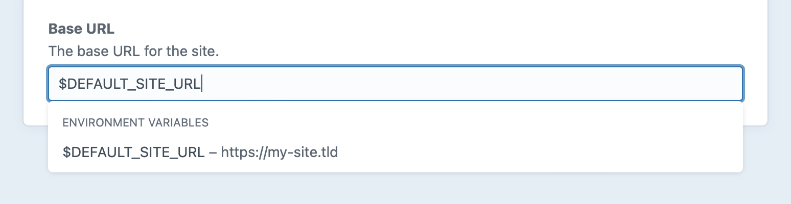

---
# This feature hasn't been merged yet--just stashing for later!
related:
  - uri: https://nystudio107.com/blog/fluent-multi-environment-config-for-craft-cms-4
    label: Fluent multi-environment config for Craft CMS
  - uri: /project-config
---

# Configuring Craft

Craft can be configured to work in a way that makes sense for you, your team, and your infrastructure.

Broadly, configuration refers to how Craft will behave in a particular environment. Most applications will only require [database connection information](db.md) to work, but as you get familiar with more of Craft’s features, install plugins, or start using additional services, you may need to provide additional config.

We’ll start by looking at how Craft builds its config in a context-aware way, then get into some specific options. Keep in mind that—unlike most aspects of a Craft project—this will require some basic PHP knowledge.

::: tip
[Project config](/project-config) is a discrete concept, but was designed to integrate with the core config system. We’ll look at some examples in just a moment.
:::

## Where Configuration Happens

### Config Files

The most common way to customize your Craft project is by editing files in the [`config/` folder](../directory-structure.md). These files act as a canonical map of what customizations you’ve made to a project, and connect specific settings with [environment-specific values](#setting-and-resolving-options).

| Concern | File(s) | Description
| ------- | -------- | -----------
| [General Configuration](#general) | `general.php` | Global options that can affect the front-end, control panel, debugging, etc.
| [Database Settings](#database) | `db.php` | Connection settings for your database.
| [Custom Options](#custom-settings) | `custom.php` | Arbitrary key-value storage for your own options.
| [Routing](#url-rules) | `routes.php` | Custom HTTP routes.
| [Application Configuration](#application-configuration) | `app.php`, `app.web.php`, `app.console.php` | Overrides for the root Application and any of its [Components](https://www.yiiframework.com/doc/guide/2.0/en/concept-components).
| Plugin Settings | `{plugin-handle}.php`, or other custom files | Consult the plugin’s documentation for specifics.
| [Advanced](#advanced) | | Specific library options and/or behaviors that may be exposed in a non-standard way.

::: tip
You may find other files in the `config/` folder, like `license.key` or the `project/` folder. Craft (and many plugins) will ask you to place config-adjacent files here, even if they don’t work in a consistent way.
:::

Sensitive credentials like your database’s password should be kept out of tracked files—but instead of ignoring config files outright, let’s take a look at some options.

### `.env`

Out of the box, Craft uses [DotEnv](https://github.com/vlucas/phpdotenv) to load values into the environment from a `.env` file in the root of your project. A basic `.env` file contains pairs of keys and values:

```env
CRAFT_APP_ID=my-project
CRAFT_ENVIRONMENT=dev

# ...and comments!
```

These values can be referenced in your config files by calling [App::env()](craft4:craft\helpers\App::env()), or using them directly in a [control panel setting](#aliases-and-environment-variables). Use of `getenv()` directly is discouraged, due to [issues with thread-safety](https://github.com/craftcms/cms/issues/3631).

Craft doesn’t require your variables to follow any kind of naming convention, but it will automatically discover [some specific environment variables](#environment-overrides) for general and database settings.

The `.env` file is the only place where secrets should be stored. Avoid checking it in to version control!

::: tip
Some platforms (especially those that have ephemeral filesystems) provide a GUI for managing environment variables, and automatically inject them when the server or process starts. `App::env()` is still recommended, in this situation.
:::

## Setting and Resolving Options

Each setting accepts specific [types and values](#types-and-values) (like an integer, interval expression string, or boolean), but Craft is able to resolve them in a few different ways:

- **Static:** A value is explicitly set in a config file, and is the same for all environments. Use case: customize file types that can be uploaded.
- **Environment-dependent:** Explicit values are set for [different known environments](#multi-environment-configs), like `dev` and `production`. Use case: Make sessions last indefinitely during development.
- **Dynamic:** A value is determined either by a call to `craft\helpers\App::env('MY_ENVIRONMENT_VAR')` (using a key that you expect to be defined in the target environments), or by using an [alias](#aliases) that is resolved at runtime. Use case: database hostnames or public storage bucket URLs are different in all environments.

You can combine these methods to create flexibility where you need it and rigidity where you don’t.

::: tip
When working on a team or deploying your project in a new environment, it ought to be easy to discover what Craft options were configured to make the site or application work as intended. While some of the following strategies are convenient, consider their impact on clarity.
:::

### Priority

Craft will begin resolving values in this order, overwriting previous values when they are discovered:

0. **Defaults:** Every option has a default value, even if it’s `null`. You can find these defaults in the documentation for each setting.
1. **Config Files:** Craft [evaluates and merges](#multi-environment-configs) PHP config files.
2. **Environment Overrides:** For general and database settings, Craft looks for [special environment variables](#environment-overrides).

### Style: Map vs. Fluent

At its simplest, a config file might only return a map of settings:

```php
use craft\helpers\App;

return [
    'devMode' => App::env('CRAFT_ENVIRONMENT') === 'dev',
    'userSessionDuration' => 'P1D',
];
```

If you are interested in auto-completion and type hints from your editor, the equivalent "fluent" style declaration <Since ver="4.2" feature="Fluent config" /> would look like this:

```php
use craft\config\GeneralConfig;
use craft\helpers\App;

return GeneralConfig::create()
    ->devMode(App::env('CRAFT_ENVIRONMENT') === 'dev')
    ->userSessionDuration('P1D');
```

Each option becomes a method call, returning the modified config object to allow chaining. You can dynamically set values with an in-line expression (see above) or by breaking the chain into logical chunks:

```php{5,8-10}
use craft\config\GeneralConfig;
use craft\helpers\App;

$config = GeneralConfig::create()
    ->devMode(false)
    ->userSessionDuration('P1D');

if (App::env('CRAFT_ENVIRONMENT') === 'dev') {
    $config->devMode(true);
}

return $config;
```

::: warning
Fluent config is currently only available for _general_ and _database_ settings, and not all plugins support it. When in doubt, use a config map!
:::

### Types and Values

Most config settings expect a [scalar](https://www.php.net/manual/en/function.is-scalar.php) value, and will generate exceptions if they are not (and can not be coerced to) the correct type.

Normalization may occur on some values. For instance, any setting that expects a “file size” will interpret an integer value in bytes, but a string will be parsed by [ConfigHelper::sizeInBytes()](craft4:craft\helpers\ConfigHelper::sizeInBytes()). bringing support for other formats like `256M` or `1G`.

A few settings support complex types, like arrays and closures:

```php
return [
    // Arrays and nested arrays:
    'extraFileKinds' => [
        'fonts' => [
            'extensions' => ['otf', 'ttf', 'woff', 'woff2'],
        ],
    ],

    // Functions or "closures":
    'postLoginRedirect' => function($siteHandle) {
        // Perform tests on the signed-in User:
        $user = Craft::$app->getUser()->getIdentity();

        // Send to their account, if their profile is incomplete...
        if (empty($user->someProfileField)) {
            return 'account/profile';
        }

        // ...or the homepage, by default:
        return '/';
    },
];
```

In this example, the `postLoginRedirect` function will be called by [ConfigHelper::localizedValue()](craft4:craft\helpers\ConfigHelper::localizedValue()), with the current site's handle. Keep in mind that while scalar values are automatically "normalized" during configuration, the return value of a function *is not*.

::: tip
Refer to a config property's documentation for a full list of its supported types and values!
:::

### Multi-Environment Configs

Config files can be set up to supply separate values for each environment by declaring a `*` key at the top-level of the returned array.

Any options set in the `*` are applied to all environments. Additional options nested within a key matching the [`CRAFT_ENVIRONMENT`](#craft-environment) PHP constant or environment variable are merged on top of it—this means you can use `*` to set up your own "defaults," while still being able to override them in a specific environment.

```php
// -- config/general.php --
return [
    // Activate multi-environment config:
    '*' => [
        // Applies to all environments:
        'omitScriptNameInUrls' => true,
    ],

    'dev' => [
        // Only applies to development environments, overriding anything in `*`:
        'devMode' => true,
    ],

    'production' => [
        // Only applies to the production environment, overriding anything in `*`:
        'cpTrigger' => 'secret-word',
    ],
];
```

Presuming your environment was evaluated to `dev`, Craft would combine the `*` and `dev` keys to create a config object equivalent to:

```php
return [
    'omitScriptNameInUrls' => true,
    'devMode' => true,
    // `cpTrigger` does not take effect!
];
```

::: tip
Make sure your key(s) are sufficiently unique! Craft reads your array of config settings from top to bottom, applying config settings wherever the `CRAFT_ENVIRONMENT` value *contains* the key.

If the environment cannot be determined, your server’s hostname will be used.
:::

#### Flattening Configuration

If you prefer to use a single, “flat” configuration object, it's still possible to alter configuration based on the environment. The example above might look like this, instead:

```php
use craft\helpers\App;

// Set up tests for particular target environment(s):
$isDev = App::env('CRAFT_ENVIRONMENT') === 'dev';

return [
    'omitScriptNameInUrls' => true,
    // Assign the computed boolean value, directly...
    'devMode' => $isDev,
    // ...or use ternary logic:
    'cpTrigger' => $isDev ? null : 'secret-word',
];
```

The same strategy can be seen in the [fluent config](#style-map-vs-fluent) section!

### Aliases

Some settings and functions in Craft support [Yii aliases](https://www.yiiframework.com/doc/guide/2.0/en/concept-aliases), which are most often used as placeholders for file system paths and URLs.

Out of the box, Craft provides these aliases—but you can override them or provide new ones with the <config4:aliases> config setting:

| Alias | Description
| ----- | -----------
| `@app` | Path to `vendor/craftcms/cms/src/`
| `@config` | Path to your `config/` folder
| `@contentMigrations` | Path to your `migrations/` folder
| `@craft` | Path to `vendor/craftcms/cms/src/`
| `@lib` | Path to `vendor/craftcms/cms/lib/`
| `@root` | The root project path (same as the [CRAFT_BASE_PATH](#craft-base-path) PHP constant)
| `@runtime` | Path to your `storage/runtime/` folder
| `@storage` | Path to your `storage/` folder
| `@templates` | Path to your `templates/` folder
| `@translations` | Path to your `translations/` folder
| `@vendor` | Path to your `vendor/` folder
| `@web` | URL to the folder that contains the `index.php` file that was loaded for the request
| `@webroot` | Path to the folder that contains the `index.php` file that was loaded for the request

::: tip
We recommend overriding the `@web` alias if you plan on using it, to avoid a cache poisoning vulnerability.
:::

Aliases can be set to explicit values, or to the content of an environment variable. Keep in mind that aliases are resolved recursively, so you can define one based on another (including in values coming from the environment):

```php
use craft\helpers\App;

return [
    'aliases' => [
        '@web' => App::env('DEFAULT_SITE_URL'),
        '@shared' => App::env('SHARED_PATH'),
        '@uploads' => '@shared/uploads',
        '@assets' => '@web/uploads',
    ],
];
```

### Environment Overrides

Craft allows some settings to be defined directly from environment variables using the special `CRAFT_` prefix.

Add the prefix to any [general config](config-settings.md) (`CRAFT_`) or [database connection settings](db.md) (`CRAFT_DB_`) in [screaming snake case](https://dev.to/fission/screaming-snake-case-43kj). For example:

- General: <config4:allowUpdates> &rarr; `CRAFT_ALLOW_UPDATES`
- Database: [`port`](db.md#port) &rarr; `CRAFT_DB_PORT`
- General: <config4:testToEmailAddress> &rarr; `CRAFT_TEST_TO_EMAIL_ADDRESS`

::: danger
Note that any environment variable names matching the format of a known config setting will have the highest priority! The `CRAFT_` prefix is intended to reduce the likelihood of collisions with other environment variables that a site, server, or platform might inject—so it’s actually _inadvisable_ to use this naming convention for site-specific variables you maintain.
:::

Enforcing a structure for database connection details (even with a multi-environment config file) can cause problems when working with others, or across environments—magic variables make it possible to use whatever connection parameters are available in the current environment, without having to maintain a config file just to map variables to config settings.

::: tip
If you are working with others and your `.env` isn’t checked in to version control (it probably shouldn’t be!), make sure you have a way of communicating what options are required to get your application running! A `.env.example` file is a great place to store keys + comments, without exposing secrets—and it lets you simply copy the file when spinning up a new environment.
:::

## Using Configured Values

Most configuration is applied automatically on every request, and requires no additional action.

However, Craft provides a powerful way to use dynamically-resolved config values in other parts of the system.

### Control Panel Settings

Most values in the **Settings** area of Craft’s control panel are recorded in [Project config](../project-config). While this makes schema changes much easier to move between environments, it presents a challenge when something like a URL needs to change per-environment, or an API key leaks into YAML files.

For this reason, Craft provides a way to bind system settings to dynamic aliases and environment variables.



Whenever you see this UI, you can provide a valid alias or environment variable name, in addition to plain values. Craft will always store and display the raw, unparsed value, but uses [App::parseEnv()](craft4:craft\helpers\App::parseEnv()) when the value is consumed. Here are some examples of settings for which dynamic values are useful:

- **General Settings:** System Name, Status, and Time Zone;
- **Sites:** Base URLs;
- **Sections:** Preview Target URIs;
- **Asset Volumes:** Base URL, File System Path (Local only);
- **Email:** System Email Address, Sender Name, Email Template path, SMTP credentials;

Focusing one of these fields will immediately suggest some values. Type `$` followed by an environment variable’s name or `@` followed by an alias to narrow the suggestions and find your placeholder.

Aliases have the extra benefit of allowing extra path segments, so `@web/uploads` is a perfectly valid setting. If a combination of alias and path is used frequently, though, it might make sense to define a specific `@uploads` alias and use that in the control panel, instead.

::: tip
Plugins can add support for environment variables and aliases in their settings as well. See [Environmental Settings](../extend/environmental-settings.md) to learn how.
:::

### Templates + Modules

#### Accessing Config Values

You can check the final resolved value of a setting in your templates or a module via the `Config` service. For example, if you wanted to switch some debugging information on or off, you could do the following:

::: code
```twig
{# Output entry ID for debugging: #}

  ID: <code>{{ entry.id }}</code>

```
```php
// Add `DevMode` header when active:
if (Craft::$app->config->general->devMode) {
  Craft::$app->request->headers->set('DevMode', 'On');
}
```
:::

#### Aliases and Environment Variables

In the event you need to evaluate an alias or environment variable directly in Twig or PHP, Craft provides some helpers:

::: code
```twig
{# Resolve an alias, recursively: #}
{{ alias('@uploadsBaseUrl') }}

{# Access a specific environment variable: #}
{{ getenv('SOME_ENV_VAR') }}

{# Fully resolve a value, as though it came from a control panel setting: #}
{{ parseEnv(craft.app.config.custom.myDynamicValue) }}
```
```php
// Resolve an alias, recursively:
Craft::getAlias('@uploadsBaseUrl');

// Access a specific environment variable:
craft\helpers\App::env('SOME_ENV_VAR');

// Fully resolve a value, as though it came from a control panel setting:
craft\helpers\App::parseEnv(Craft::$app->config->custom->myDynamicValue);
```
:::

## Config Categories

To make config settings easier to find, they’re organized into a few groups.

### General

[General config settings](config-settings.md) are set via the `config/general.php` file or special environment variables.

### Database

Your [database connection settings](db.md) are set via the `config/db.php` file.

### URL Rules

You can define custom [URL rules](https://www.yiiframework.com/doc/guide/2.0/en/runtime-routing#url-rules) in `config/routes.php`. See [Routing](../routing.md) for more details.

### Application Configuration

Some projects may require customization of Craft [application components](app.md) beyond what is exposed through specific config files. This is done directly via the `config/app.php` file.

### Advanced

In rare cases, you may need to customize parts of Craft that don’t follow the normal configuration scheme.

#### Guzzle

Craft uses [Guzzle](http://docs.guzzlephp.org/en/latest/) to make HTTP requests, when…

- …checking for Craft updates;
- …sending a support request from the Craft Support widget;
- …loading RSS feeds from the Feeds widget;
- …working with assets on remote volumes, like Amazon S3;

You can customize the settings passed to Guzzle when initializing these requests by creating a `guzzle.php` file in your `config/` folder. The file does not support Craft’s [multi-environment configuration](#multi-environment-configs) and should only ever return an array with your config overrides at the top level.

```php
return [
    'headers' => ['Foo' => 'Bar'],
    'query'   => ['testing' => '123'],
    'auth'    => ['username', 'password'],
    'proxy'   => 'https://myproxy:1234',
];
```

The options defined here will be passed into new `GuzzleHttp\Client` instances. See [Guzzle’s documentation](http://docs.guzzlephp.org/en/latest/) for a list of available options.

### Custom Settings

Settings defined in a `config/custom.php` file don’t map to or affect any built-in Craft features, but can useful to centralize data, flags, or secrets that otherwise don’t have a place to live.

```php
return [
    'serviceBaseUrl' => 'https://api.service.com/v1',
    'servicePublishableKey' => App::env('SERVICE_PUBLISHABLE_KEY'),
    'servicePrivateKey' => App::env('SERVICE_PRIVATE_KEY'),
];
```

Custom config follows the same multi-environment structure as other files, so you can use the resolved values in a predictable way in any context:

::: code
```twig



```
```php
$privateKey = Craft::$app->config->custom->servicePrivateKey;

$client = Craft::createGuzzleClient([
    'base_uri' => Craft::$app->config->custom->serviceBaseUrl,
]);

$client->post('/donations', [
    'auth' => ['apiuser', $privateKey],
    'json' => [
        'amount' => 1000,
    ],
]);
```
:::

::: tip
If these settings need to be changed frequently, edited by a control panel user, or don’t depend on the environment, they may be a better fit for a [Global Set](../globals.md).
:::

## PHP Constants

You can define certain PHP constants that Craft will take into account as it boots up. Depending on your installation, you may keep these in `web/index.php` and the `craft` CLI entry points, or consolidate common values into a single `required` file, as the [composter starter project](https://github.com/craftcms/craft) does—but they'll get picked up as long as they're set prior to calling `$app->run()`.

::: tip
Constants you set in `web/index.php` will be used for web-based requests, while any you set in your root `craft` file will be used for console requests.
:::

### `CRAFT_BASE_PATH`

The path to the **base directory** that Craft will look for [config/](../directory-structure.md#config), [templates/](../directory-structure.md#templates), and other directories within by default. (It is assumed to be the parent of the `vendor/` folder by default.)

```php
// Tell Craft to look for config/, templates/, etc., two levels up from here
define('CRAFT_BASE_PATH', dirname(__DIR__, 2));
```

### `CRAFT_COMPOSER_PATH`

The path to the [composer.json](../directory-structure.md#composer-json) file. (It is assumed to live within the base directory by default.)

```php
define('CRAFT_COMPOSER_PATH', 'path/to/composer.json');
```

### `CRAFT_CONFIG_PATH`

The path to the [config/](../directory-structure.md#config) folder. (It is assumed to live within the base directory by default.)

### `CRAFT_CONTENT_MIGRATIONS_PATH`

The path to the [migrations/](../directory-structure.md#migrations) folder used to store content migrations. (It is assumed to live within the base directory by default.)

### `CRAFT_CP`

Dictates whether the current request should be treated as a control panel request.

```php
// Tell Craft that this is a control panel request
define('CRAFT_CP', true);
```

If this isn’t defined, Craft will treat the request as a control panel request if either of these are true:

- The <config4:baseCpUrl> setting **is** set, and the request URL begins with it (plus the <config4:cpTrigger> setting, if set).
- The <config4:baseCpUrl> setting **is not** set, and the request URI begins with the <config4:cpTrigger> setting.

### `CRAFT_ENVIRONMENT`

The environment name that [multi-environment configs](../config/README.md#multi-environment-configs) can reference when defining their environment-specific config arrays.

::: warning
Prior to Craft 4, `craftcms/craft` projects had `CRAFT_ENVIRONMENT` fall back to a value of `production` by default. This is no longer the case, as the default is [explicitly set to `dev`](https://github.com/craftcms/craft/blob/main/.env.example#L5).
:::

### `CRAFT_EPHEMERAL`

When set to `true`, Craft will skip file system permission checks and operations that are not available in an environment with ephemeral or read-only storage.

### `CRAFT_LICENSE_KEY`

Your Craft license key, if for some reason that must be defined by PHP rather than a license key file. (Don’t set this until you have a valid license key.)

```php
// Tell Craft to get its license key from a `LICENSE_KEY` environment variable
define('CRAFT_LICENSE_KEY', craft\helpers\App::env('LICENSE_KEY'));
```

### `CRAFT_LICENSE_KEY_PATH`

The path that Craft should store its license key file, including its filename. (It will be stored as `license.key` within your [config/](../directory-structure.md#config) folder by default.)

### `CRAFT_LOG_PHP_ERRORS`

Can be set to `false` to prevent Craft from setting PHP’s [log_errors](https://php.net/manual/en/errorfunc.configuration.php#ini.log-errors) and [error_log](https://php.net/manual/en/errorfunc.configuration.php#ini.error-log) settings, leaving it up to whatever’s set in `php.ini`.

```php
// Don’t send PHP error logs to storage/logs/phperrors.log
define('CRAFT_LOG_PHP_ERRORS', false);
```

### `CRAFT_SITE`

The Site handle or ID that Craft should be serving from this `index.php` file. (Only set this if you have a good reason to. Craft will automatically serve the correct site by inspecting the requested URL, unless this is set.)

```php
// Show the German site
define('CRAFT_SITE', 'de');
```

### `CRAFT_STORAGE_PATH`

The path to the [storage/](../directory-structure.md#storage) folder. (It is assumed to live within the base directory by default.)

::: tip
Make sure you set this to a valid folder path, otherwise it will be ignored.
:::

### `CRAFT_STREAM_LOG`

When set to `true`, Craft will send log output to `stderr` and `stdout`, instead of to log files. PHP fatal errors will be sent to `stderr`.

### `CRAFT_TEMPLATES_PATH`

The path to the [templates/](../directory-structure.md#templates) folder. (It is assumed to live within the base directory by default.)

### `CRAFT_TRANSLATIONS_PATH`

The path to the `translations/` folder. (It is assumed to live within the base directory by default.)

### `CRAFT_VENDOR_PATH`

The path to the [vendor/](../directory-structure.md#vendor) folder. (It is assumed to live 4 directories up from the bootstrap script by default.)
