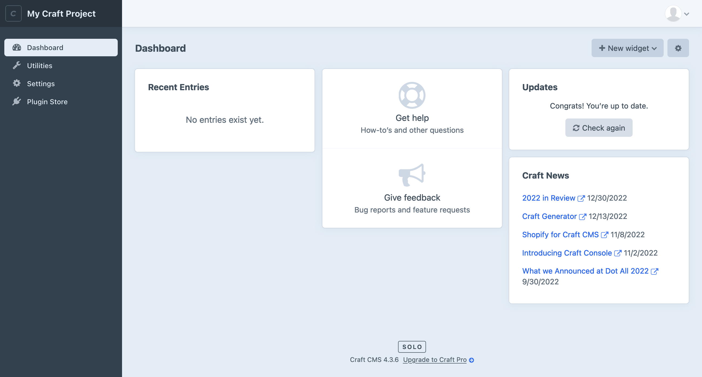
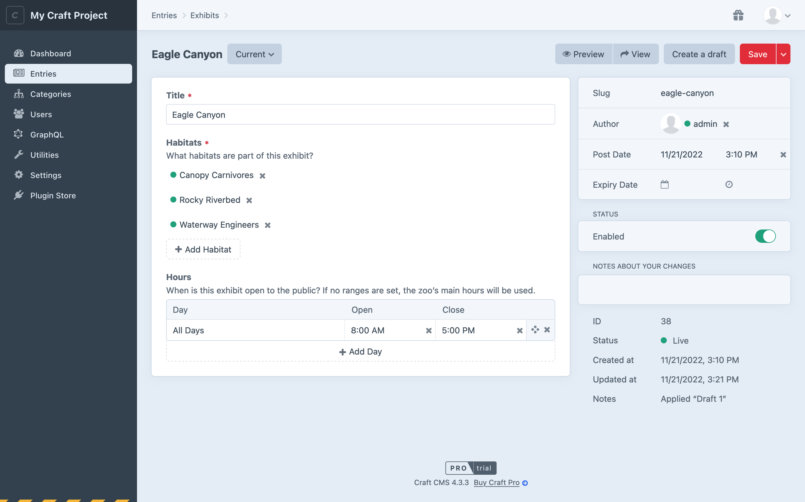
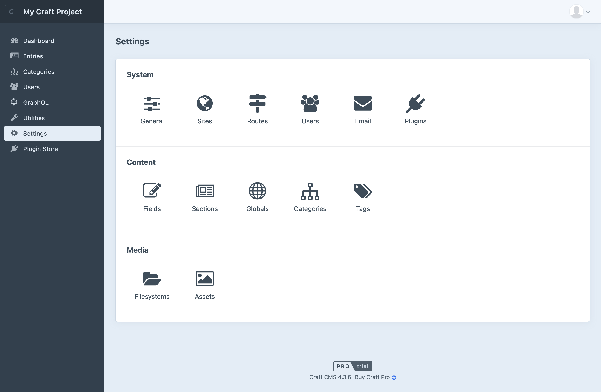
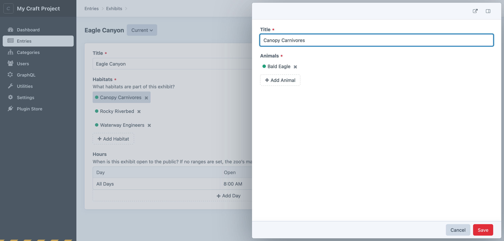

# Control Panel

The control panel is one of Craft’s greatest strengths. Developers and content authors appreciate its smart design and powerful feature set:

- Locate and edit content quickly and confidently;
- Design a schema that makes sense for your site or application;
- Customize views into deep and complex data;
- Invite users and work collaboratively;
- Find, install, and configure first- and third-party plugins;

We are working to make these features available to _everyone_ as part of our established [accessibility remediation process](https://craftcms.com/accessibility/accessibility-conformance-report).

<BrowserShot url="https://my-craft-project.ddev.site/admin" :link="false" caption="The Craft control panel viewed in a fresh installation.">

</BrowserShot>

::: tip
If this is your first time using Craft, it might feel a little bit empty—don’t worry, that’s by design! Craft doesn’t impose a content model on your site, so you won’t see any default features like posts or pages—instead, you’re given tools to create the features you do need from agnostic [element types](./elements.md) and other [settings](#settings).
:::

## Tour

The appearance and organization of the control panel can differ based on what types of content you’ve set up, your permissions, user preferences, and the environment—but the general structure will always be the same.

<BrowserShot
    url="https://my-craft-project.ddev.site/admin/entries/exhibits/38"
    id="tour"
    :poi="{
        navigation: [13, 10],
        globalHeader: [60, 3],
        header: [40, 11],
        content: [55, 40],
        details: [79, 21],
    }"
    :link="false"
    caption="An entry edit screen in the control panel.">

</BrowserShot>

Let’s take a quick spin around a typical control panel “screen:”
- On the left edge is the _main navigation_ <Poi label="1" target="tour" id="navigation" />. At the top of this bar, your system name and icon are displayed. Below, each [main section](#main-sections) of the control panel you have access to is linked, and the current one is highlighted.
- At the top, the _global header_ <Poi label="2" target="tour" id="globalHeader" /> contains breadcrumbs (when working with nested content or settings) and the user menu.
- The current screen’s _main container_ takes up the remainder of the horizontal space, and will scroll if the content is tall enough. Within this region, you’ll find some combination of the following features:
    - A _header_ <Poi label="3" target="tour" id="header" />, displaying a title and controls for the current screen;
    - A _sub-menu_ at the left edge (not pictured), listing siblings of the current screen;
    - A _content container_ <Poi label="4" target="tour" id="content" /> for the screen’s primary content (usually set off from the background on a lighter color);
    - _Tabs_, splitting the screen’s content or settings into logical groups (not pictured);
    - A _details_ <Poi label="5" target="tour" id="details" /> pane at the right edge, with metadata and controls specific to the type of content being viewed;

#### Main Sections

You may not see (or need) all these sections in your _main navigation_. They’ll appear only when Craft determines that they’ll be useful to the logged-in user—for example, _Categories_ is hidden until you’ve configured at least one [Category Group](./categories.md#category-groups).

Section | Description
------- | -----------
[Dashboard](#dashboard) | Customizable landing page.
[Assets](./assets.md) | Create and edit Asset elements.
[Entries](./entries.md) | Create and edit Entry elements.
[Categories](./categories.md) | Create and edit Category elements.
[Globals](./globals.md) | Manage Globals.
[Users](./users.md) | <Badge type="edition" vertical="middle" title="Only available in Craft Pro">Pro</Badge> Create and edit User elements.
[GraphQL](./graphql.md) | <Badge type="edition" vertical="middle" title="Only available in Craft Pro">Pro</Badge> Configure GraphQL schemas, create tokens, and access the built-in playground.
[Utilities](#utilities) | Get system info and perform a variety of upkeep actions.
[Settings](#settings) | Configure Craft’s system settings and content model.
[Plugin Store](#plugin-store) | Browse, install, and purchase Craft and plugin licenses from the official store.
…and more! | Some plugins provide their own control panel screens; others may only have a pane in the [Settings](#settings) section.

#### Announcements

Keep an eye on the _global header_ for a <Icon kind="gift" /> gift icon—Craft and any installed plugins may send notifications about new features to all control panel users, when updates are applied.

### Dashboard

After logging in, control panel users are directed to their **dashboard**. Each user manages their own dashboard, which is comprised of _widgets_. Craft comes with a few widgets:

- **Support:** Get official support from the Craft team.
- **Feed:** Scrape an external RSS feed.
- **Drafts:** Viewing your unpublished entry drafts.
- **New Users:** Visualize new registrations.
- **Quick Post:** Provide a simplified [entry](./entries.md) form for publishing new content with one click.
- **Recent Entries:** Display a list of recently-posted entries from one or more sections.
- **Updates:** Keep tabs on Craft and plugin updates.

Widgets can be rearranged, resized, and customized based on the user’s needs, and will be available to them wherever they log in.

::: tip
Plugins can [register their own widgets](./extend/widget-types.md)!
:::

### Utilities

Utilities expose bundles of miscellaneous functionality to users with the correct permissions.

All Craft installations will include these utilities:

- **Updates:** View Craft and plugin updates, and apply them (when <config4:allowAdminChanges> is on).
- **System Report:** Get information about the Craft installation and server.
- **Project Config:** View the state of [Project Config](./project-config.md).
- **PHP Info:** Additional information about your server’s PHP installation.
- **System Messages:** Customize email messages that are sent by the system.
- **Asset Indexes:** Rebuild an [asset](./assets.md) volume from its underlying storage medium.
- **Queue Manager:** Audit running and queued background jobs.
- **Caches:** Flush caches for various parts of the Craft application.
- **Deprecation Warnings:** View or clear deprecation warnings generated by templates and plugins.
- **Database Backup:** Capture and download a backup of Craft’s primary database.
- **Find and Replace:** Search for (and replace) a string across all element content.
- **Migrations:** View (and apply) pending migrations, or view a history of all previously-run content migrations.

Plugins can [register utilities](./extend/utility-types.md), and Craft will give each one a corresponding permission.

::: danger
Access to utilities should be granted only to trusted users, especially the innocuous _System Messages_ pane. Messages can include arbitrary Twig code, which effectively gives the author access to the entire Craft API—including the ability to modify their own permissions.

Keep in mind that any user marked as an “Admin” implicitly has access to _all_ utilities.
:::

#### Disabling Utilities

You can disable a utility for all users with the [`disabledUtilities` config setting](config4:disabledUtilities). <Since ver="4.6.0" feature="Disabling utilities" /> Refer to each [utility class](repo:craftcms/cms)’s `id()` method for their handles—including those provided by plugins.

### Settings

The **Settings** screen is where you’ll configure the system and design your content model. Settings complement [configuration](./config/README.md) are typically stored in [Project Config](./project-config.md) so that you can easily deploy them to other environments.

::: tip
Don’t see **Settings** in the main navigation? Make sure you have admin privileges, and that <config4:allowAdminChanges> is enabled.

We recommend that this is enabled only in development environments.
:::

<BrowserShot
    url="https://my-craft-project.ddev.site/admin/settings"
    :link="false"
    caption="The settings screen in Craft."
    id="settings"
    :poi="{
        system: [80, 24],
        content: [80, 46],
        media: [80, 68],
    }">

</BrowserShot>

#### System <Poi label="1" target="settings" id="system" />

System settings govern low-level Craft behaviors that often influence how other content and media features are used.

Group | Description
----- | -----------
**General** | Turn your site on or off, set a timezone, and configure the login page and site icon.
**Sites** | Define [Sites and Site Groups](./sites.md) to organize and localize your content.
**Routes** | Manage [dynamic routes](./routing.md#dynamic-routes).
**Users** | Set [registration policies](./user-management.md#public-registration), define your [permissions structure](./user-management.md#permissions) with [user groups](./user-management.md#user-groups), and add [custom fields](./fields.md) to users.
**Email** | Configure how Craft sends email.
**Plugins** | Manage available [plugins](./plugins.md).

#### Content <Poi label="2" target="settings" id="content" />

Combined with [sites](./sites.md), the **Content** section is where you design your schema.

Group | Description
----- | -----------
**Fields** | Create and organize [custom fields](./fields.md) available to your elements.
**Sections** | Manage entry [sections](./entries.md#sections) and [types](./entries.md#entry-types).
**Globals** | Configure [globals](./globals.md).
**Categories** | Define complex taxonomies with [category groups](./categories.md#category-groups).
**Tags** | Define simple taxonomies with [tag groups](./tags.md#tag-groups).

#### Media <Poi label="3" target="settings" id="media" />

Decide how you want to store and organize uploaded files.

Group | Description
----- | -----------
**Filesystems** | Set up local or remote storage for an [asset volume](./assets.md#filesystems).
**Volumes** | Create buckets for organizing [assets](./assets.md), and attach them to filesystems.

#### Plugins

Additional tiles may appear in this row when installing [plugins](./plugins.md).

### Plugin Store

The control panel provides an easy way to browse the [Plugin Store](./plugins.md#the-plugin-store) and try or buy plugins with one click.

## Tips + Tricks

The control panel has some cool tricks up its sleeve.

### Slideouts

Slideouts are used in a number of situations to simplify or contextualize an editing experience.

Any time you see an _element_ attached to a [relational field](./relations.md) or in an [index](./elements.md#indexes), you can double-click it to summon a _slideout_:

<BrowserShot url="https://my-craft-project.ddev.site/admin/entries/habitats/1234-eagle-canyon" :link="false" caption="Slideouts can also be opened from other slideouts! In this example, double-clicking “Canopy Carnivores” opened the current one; double-clicking “Bald Eagle” would open another; and so on.">

</BrowserShot>

Slideouts also work for creating new elements on-the-fly from an [element browser](./elements.md#browser).

::: tip
There is one exception, here: slideouts cannot be opened if the user doesn’t have permission to edit the element—even if they were able to attach it to a relational field.
:::

While slideouts support most element edit screen features, you may find that it’s more comfortable to open it in a new window—just click the icon in the upper-right corner. Features you’d normally find in the sidebar have been tucked into a secondary panel for slideouts; this can be toggled with the button next to the pop-out link.

### Keyboard Shortcuts

#### Saving

Any time you are on a screen dominated by a single editable record or form, <kbd>Command</kbd>+<kbd>S</kbd> will save it and keep you on the page. In most places the save shortcut is supported, <kbd>Command</kbd>+<kbd>Shift</kbd>+<kbd>S</kbd> will save the current record and set you up to create another.

::: tip
Always check combo-box menus for more shortcuts.
:::

#### Group Selections

Throughout the control panel, you will find groups of checkboxes or other focusable controls in a list of items. Ticking one checkbox, then holding <kbd>Shift</kbd> and clicking a second one will tick all the intermediate ones, as well. Element indexes are a great place to try this out—but it will also work on Matrix Blocks.

### Drag-and-Drop

The <Icon kind="move" /> move icon indicates that something can be dragged into a new position—like an element in a [structure](./elements.md#structures), a [Matrix Block](./matrix-fields.md), or a [table row](./table-fields.md).

In some situations, dragging can be combined with [group selections](#group-selections)!

### Search

Craft has a powerful [search](./searching.md) system that complements the [condition builder](./elements.md#filters-and-columns) on every element index.
