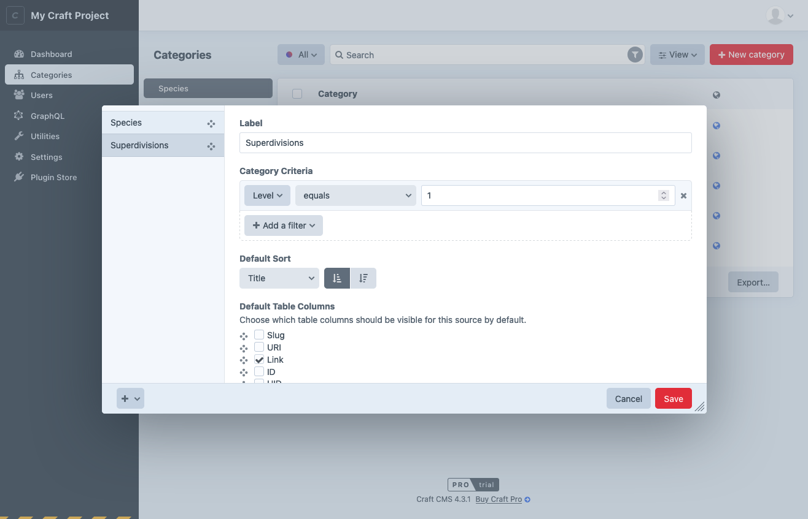
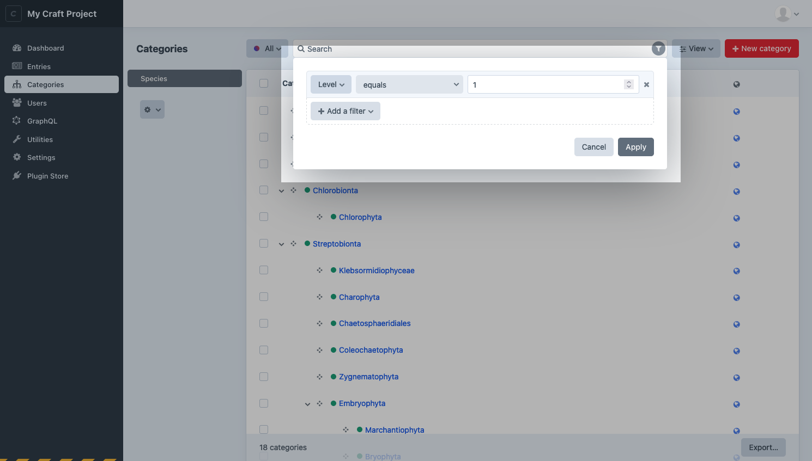
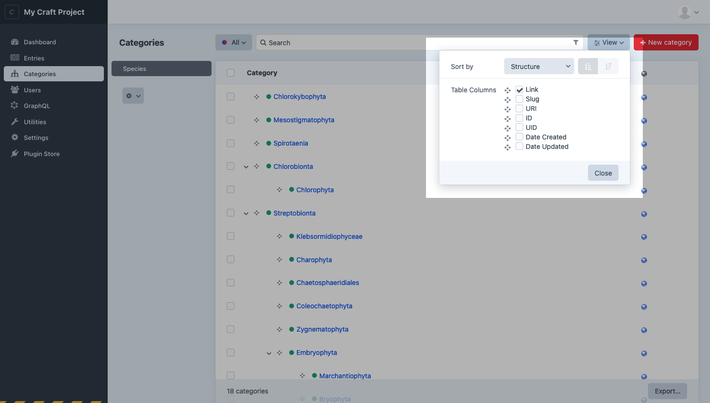

# Elements

An _element_ is the most basic unit of content in Craft. Elements provide elegant management, routing, and querying interfaces for users and developers.

## Types

In the control panel, you’ll encounter the eight _element types_ common to all Craft installations:

- [**Assets**](assets.md) store files that are uploaded to a volume.
- [**Categories**](categories.md) are taxonomies that resemble folder structures and can be nested.
- [**Entries**](entries.md) are records that can have drafts, revisions, and live previews. They can exist as one-offs called “Singles,” ordered by one or more attributes in “Channels,” or organized hierarchically as “Structures.”
- [**Global Sets**](globals.md) are floating bits of content that aren’t tied to any particular page or other piece of content, ideal for bits of information you might want to show on every page of your site.
- [**Matrix Blocks**](matrix-blocks.md) are powerful, repeating groupings of content that belong to other element types via a field.
- [**Tags**](tags.md) are flat taxonomies optimized for quick input and re-use.
- [**Users**](users.md) are accounts for human beings with email addresses and permissions, organized into customizable groups.
- [**Addresses**](addresses.md) are physical addresses that can be attached to users.

Choosing the appropriate element type for your content model is essential—but don’t be afraid to mix, match, and combine them. Plugins (and custom modules) can provide [custom element types](./extend/element-types.md), giving developers and authors a consistent experience to all their content.

### Common Features

Some features are available to most or all elements:

- Control panel edit interfaces, including [indexes](#indexes) and slide-outs;
- [Custom fields](./fields.md) and field layouts;
- URLs and routing;
- Localization via [sites](./sites.md);
- Sophisticated [permissions](./user-management.md#permissions) scheme;
- [Element queries](./element-queries.md) with advanced sorting and filtering capabilities;
- Bi-directional [relationships](./relations.md);
- Automatic indexing for [search](./searching.md);

Other features are specific to a type—like Assets’ tie to files, or Entries’ drafts and revisions system.

## Indexes

You’ll access most elements via an element index. Indexes allow you to browse, sort, and [search](./searching.md) for elements in a paginated table-like view.

### Sources

Indexes are broken down into _predefined_ and _custom_ **sources**. Entries, for example, always have an **All entries** source, in addition to one for each configured [section](./entries.md#sections).

Users with the **Customize sources** [permission](./user-management.md#permissions) can edit built-in sources and define new ones.

<BrowserShot url="https://my-craft-project.ddev.site/categories/species" :link="false" caption="Customizing element sources.">

</BrowserShot>

::: tip
Custom sources are stored in [Project Config](./project-config.md). The interface for conditions that involve specific elements (like an author) may appear differently than the equivalent [filter](#filters-and-columns), because the ID may not be stable between environments.
:::

### Filters and Columns

As a complement to custom sources, any user with access to an element index can temporarily filter results using the condition builder interface:

<BrowserShot url="https://my-craft-project.ddev.site/categories/species" :link="false" caption="Using the condition builder to narrow results.">

</BrowserShot>

Similarly, they can customize what columns appear in the table (and how the results are ordered) with the **View** menu:

<BrowserShot url="https://my-craft-project.ddev.site/categories/species" :link="false">

</BrowserShot>

### Structures

Entries (using the _Structure_ type) and Categories (in groups with a _Max Levels_ setting greater than `1`) support a hierarchical view mode on their indexes. 
