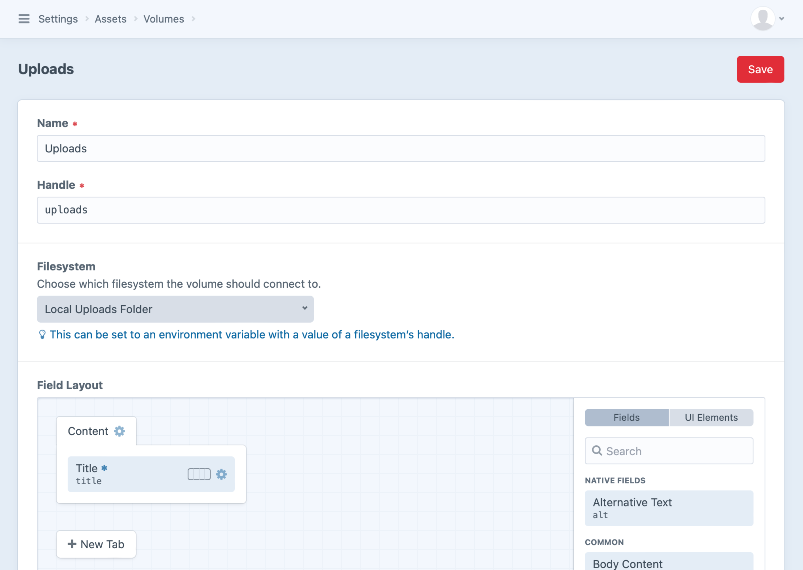

# Updating Plugins for Craft 4

While [the changelog](https://github.com/craftcms/cms/blob/4.0/CHANGELOG.md) is the most comprehensive list of changes, this guide provides high-level overview and organizes changes by category.

::: tip
If you think something is missing, please [create an issue](https://github.com/craftcms/docs/issues/new).
:::

## High Level Notes

The majority of work updating plugins for Craft 4 will be adding type declarations throughout the code. We’ve released a [Rector package](#rector) that can handle most of that work for you.

Custom volume types will need to be updated, as will anything deprecated in Craft 3 that’s removed in Craft 4.

Some events, permissions, and controller actions have changed largely in support of new features you may want to take advantage of:

- A [unified element editor](#unified-element-editor)
- The condition builder, which is integral to conditional fields, custom sources, and dynamically-controlled relations
- Inactive users, which allow user element types to be used more broadly
- More flexible volumes with [Filesystems](#filesystems) and extensible asset transforms via [Image Transforms and Transformers](#image-transforms-and-transformers)

### Plugin Store Considerations

It’s best to update any existing plugin for Craft 4 rather than creating a new one with its own handle. A separate plugin complicates the developer experience, licensing, and migration path.

We anticipate most developers will choose to release a new major version of their plugin that requires Craft 4, though all Craft and the plugin store look at for compatibility is what’s required by `composer.json`.

You’ll need to explicitly state support for each major Craft version. Any `craftcms/cms` constraint beginning with `>=` will be treated as `^`. If your plugin supports Craft 3 and 4, for example, you’ll need to set your `craftcms/cms` constraint to `^3.0|^4.0` rather than `>=3.0`.

While it’s not required, we also recommend setting a `php` constraint to clarify expectations and carefully manage any breaking changes. A Craft 3 plugin with support for PHP 7 and PHP 8, for example, might look like this:

```json
  "require": {
    "php": "^7.2.5|^8.0"
  }
```

If the Craft 4 version adds support for (not yet released) PHP 9, it would look like this:

```json
  "require": {
    "php": "^8.0.2|^9.0"
  }
```

### Improving Code Quality

We’ve added [PHPStan](https://github.com/phpstan/phpstan) and [ECS](https://github.com/symplify/easy-coding-standard) configurations to Craft CMS, Craft Commerce, and a growing number of first-party plugins to improve our code quality and consistency.

While there’s no requirement that you use these tools, we encourage all developers to join us—with this upgrade process being a timely opportunity to integrate code quality tools into your workflow.

If you decide to use PHPStan and/or ECS, we recommend doing it in the following order:

1. Run PHPStan on your existing Craft 3 code base and apply the greatest level of fixes you’re comfortable with.
2. Run Craft’s [Rector](#rector) rules to prep a bunch of your code for Craft 4.
3. Run PHPStan again to identify issues and opportunities specifically related to Craft 4 changes.

## Rector

Craft’s [Rector](https://github.com/craftcms/rector) rules can save you time by adding required type declarations throughout your code. It’s important to do things in the right order so you can run Rector once and be on your way.

1. Start with your plugin running with Craft 3.7.35 or later. (No Craft 4 in `composer.json` yet!)
2. Run the following commands:
    ```
    composer config minimum-stability dev
    ```
    ```
    composer config prefer-stable true
    ```
    ```
    composer require craftcms/rector:dev-main --dev
    ```
    ```
    vendor/bin/rector process src --config vendor/craftcms/rector/sets/craft-cms-40.php
    ```
    Your code should have type declarations added throughout that are compatible with Craft 4; it’s normal if things are now broken in Craft 3.
3. Update your `composer.json` requirement to `"craftcms/cms": "^4.0.0-alpha"` and run `composer update`.

Most of the busywork is now done so you can continue addressing the breaking changes on the rest of this page.

You can do the same thing with your custom modules by replacing `src` above with `modules`, or the path to wherever your custom modules live.

::: tip
[PhpStorm](https://www.jetbrains.com/phpstorm/) does a great job of identifying and offering to fix type issues—consider using it if you aren’t already!
:::

## Unified Element Editor

Craft 4 [streamlines element editing machinery](https://github.com/craftcms/cms/pull/10467) to support a more rich, consistent authoring experience across all element types.

If you have a plugin or module that implements custom element types and want to take advantage of these improvements, there are a handful of [new methods to extend](#new-element-methods):

- [canView()](craft4:craft\base\ElementInterface::canView()) – Whether the given user is authorized to view the element.
- [canSave()](craft4:craft\base\ElementInterface::canSave()) – Whether the given user is authorized to save the element.
- [canDuplicate()](craft4:craft\base\ElementInterface::canDuplicate()) – Whether the given user is authorized to duplicate the element.
- [canDelete()](craft4:craft\base\ElementInterface::canDelete()) – Whether the given user is authorized to delete the element.
- [canDeleteForSite()](craft4:craft\base\ElementInterface::canDeleteForSite()) – Whether the given user is authorized to delete the element for its currently-loaded site only. (Requires that the element type supports a manual site propagation mode like entries have when their section is set to “Let each entry choose which sites it should be saved to”.)
- [canCreateDrafts()](craft4:craft\base\ElementInterface::canCreateDrafts()) – Whether the given user is authorized to create drafts for the element.
- [createAnother()](craft4:craft\base\ElementInterface::createAnother()) – Returns a new, unsaved element for “Save and add another” actions. (No need to worry about permissions here; canSave() will be in effect for it.)
- [hasRevisions()](craft4:craft\base\ElementInterface::hasRevisions()) – Whether the element type is creating revisions for itself.
- [getPostEditUrl()](craft4:craft\base\ElementInterface::getPostEditUrl()) – The URL that the browser should be redirected to after the element is saved.
- [getAdditionalButtons()](craft4:craft\base\ElementInterface::getAdditionalButtons()) – HTML for any additional buttons that should be shown beside “Save”.
- [prepareEditScreen()](craft4:craft\base\ElementInterface::prepareEditScreen()) – [Optional customization](https://github.com/craftcms/cms/discussions/10784) of the edit screen response.


::: tip
It’s best to rely on the new element authorization methods (`canView()`, `canSave()`, etc.) rather than checking permissions directly:
```php
// Good
if (Craft::$app->getUser()->checkPermission('myplugin-manageMyElements')) {
    // ...
}

// Better
if ($myElement->canSave()) {
    // ...
}
```
:::

You may need to evaluate any routes, controllers, templates, and permissions that support the editing process.

While Craft 4’s changes touch a variety of element type pieces, the good news is that you’ll most likely be able to consolidate a fair amount of code.

### Field Layouts

Element editing has become more complex. A Craft 3 entry could already be edited on its own page, in a slideout, and included UI for handling drafts. With Craft 4, entry editing is more consistent via slideout or dedicated page—and other element types can more easily offer the same experience. There are also permissions and brand new conditional fields to manage.

To help with this potential complexity, Craft 4 broadly puts more emphasis on field layouts than templates. It’s field layout logic, more than template logic, that determines what the content author interacts with.

Craft 4 has removed its own element-specific controllers and templates in favor of re-usable ones that more easily support the nuanced editing experience—along with some convenient controls and cleaned-up permissions. All element types, including those added by third parties, can take advantage of these improvements.

Any element type providing control panel editing UI may need to update it.

#### Field Inputs

If your element type already supported custom field layouts and behaved well with slideout UI in Craft 3, you may only need to update a few renamed [events](#events) and [permissions](#user-permissions).

If your element type relies on [getEditorHtml()](craft3:craft\base\ElementInterface::getEditorHtml()), however, whether it’s because it has legacy UI or does its own thing entirely, you’ll need to migrate those pieces elsewhere since that method has been removed. Craft 3.7’s [getSidebarHtml()](craft4:craft\base\ElementInterface::getSidebarHtml()) and [getMetadata()](craft4:craft\base\ElementInterface::getMetadata()) are still available for tailoring what’s displayed in sidebar and metadata areas, but Craft will always give priority to any custom field layout when it exists.

::: warning
Each elements type’s `defineRules()` method needs to fully cover any inputs that could be posted via native field elements, `getSidebarHtml()`, and `getMetadata()`.

This is because an additional security measure applies posted values using the element’s `setAttributes()` method, which only allows “safe” attributes (having validation rules) by default.
:::

Craft 4 introduces the concept of “native” fields, meaning ones offered or required by the element type. These are distinctly different from the custom fields added by users.

If your element type requires native fields to be available, or even _mandatory_, it’s best to include them in a field layout by implementing [getFieldLayout()]() for your element type and using [EVENT_DEFINE_NATIVE_FIELDS]()—which replaces [EVENT_DEFINE_STANDARD_FIELDS]()—to have them included.

A saved field layout can be returned from the `fields` service:

```php
public function getFieldLayout(): ?\craft\models\FieldLayout
{
    return \Craft::$app->getFields()->getLayoutByType(MyElement::class);
}
```

This example adds mandatory title and text fields that cannot be removed from `MyElement`’s field layout, even in the field layout designer:

```php
use craft\events\DefineFieldLayoutFieldsEvent;
use craft\fieldlayoutelements\TextField;
use craft\fieldlayoutelements\TitleField;
use craft\models\FieldLayout;
use yii\base\Event;
use mynamespace\elements\MyElement;

Event::on(
    FieldLayout::class,
    FieldLayout::EVENT_DEFINE_NATIVE_FIELDS,
    static function(DefineFieldLayoutFieldsEvent $event) {
        /** @var FieldLayout $fieldLayout */
        $fieldLayout = $event->sender;

        if ($fieldLayout->type === MyElement::class) {
            $event->fields[] = new TitleField([
                'label' => 'My Title',
                'mandatory' => true,
                'instructions' => 'Enter a title.',
            ]);
            $event->fields[] = new TextField([
                'label' => 'My Description'
                'attribute' => 'description',
                'mandatory' => true,
                'instructions' => 'Enter a description.',
            ]);
        }
    }
);
```

If you don’t make the field layout designer available or support custom fields at all, you can create your field layout in memory instead:

```php
public function getFieldLayout(): ?\craft\models\FieldLayout
{
    $layoutElements = [
        new TitleField([
            'label' => 'My Title',
            'mandatory' => true,
            'instructions' => 'Enter a title.',
        ]),
        new TextField([
            'label' => 'My Description',
            'attribute' => 'description',
            'mandatory' => true,
            'instructions' => 'Enter a description.',
        ])
    ];

    $fieldLayout = new FieldLayout();

    $tab = new FieldLayoutTab();
    $tab->name = 'Content';
    $tab->setLayout($fieldLayout);
    $tab->setElements($layoutElements);

    $fieldLayout->setTabs([ $tab ]);

    return $fieldLayout;
}
```

#### Controllers

Many of Craft’s element-specific controller actions and supporting templates have been removed.

For example, `entries/edit-entry`, `categories/edit-category`, and `assets/edit-asset` each rely on the `elements/edit` action. Here’s the before-and-after for those routes, for example:

```php
// Craft 3
'assets/edit/<assetId:\d+><filename:(?:-[^\/]*)?>' => 'assets/edit-asset',
'categories/<groupHandle:{handle}>/new' => 'categories/edit-category',
'entries/<section:{handle}>/<entryId:\d+><slug:(?:-[^\/]*)?>' => 'entries/edit-entry',

// Craft 4
'assets/edit/<elementId:\d+><filename:(?:-[^\/]*)?>' => 'elements/edit',
'categories/<groupHandle:{handle}>/<elementId:\d+><slug:(?:-[^\/]*)?>' => 'elements/edit',
'entries/<section:{handle}>/<elementId:\d+><slug:(?:-[^\/]*)?>' => 'elements/edit',
```

::: tip
Categories take advantage of this unified element editing improvement with their new draft support—so the [Category](craft4:craft\elements\Category) element is a good example to investigate.
:::

See [Controller Actions](#controller-actions) for the complete list of changes, and notice how many of the newer actions are re-used across element types.

## Controller Actions

A number of controller actions have been renamed or removed, largely to support the [unified element editor](#unified-element-editor) improvement. We’ve also improved how we create and respond to action requests, and adopting these changes will lead to cleaner (and less!) code.

### Changed

| Old                                       | What to do instead
| ----------------------------------------- | ----------------------
| `assets/edit-asset`                       | `elements/edit`
| `assets/generate-thumb`                   | `assets/thumb`
| `categories/delete-category`              | `elements/delete`
| `categories/edit-category`                | `elements/edit`
| `edit/by-id`                              | `elements/edit`
| `edit/by-uid`                             | `elements/edit`
| `entries/edit-entry`                      | `elements/edit`
| `elements/get-editor-html`                | implement [getFieldLayout()](craft4:craft\base\ElementInterface::getFieldLayout())
| `elements/save-element`                   | `elements/save`
| `entries/delete-entry`                    | `elements/delete`
| `entries/delete-for-site`                 | `elements/delete-for-site`
| `entries/duplicate-entry`                 | `elements/duplicate`
| `entry-revisions/create-draft`            | `elements/create`
| `entry-revisions/delete-draft`            | `elements/delete-draft`
| `entry-revisions/publish-draft`           | `elements/apply-draft`
| `entry-revisions/revert-entry-to-version` | `elements/revert`
| `entry-revisions/save-draft`              | `elements/save-draft`
| `users/get-remaining-session-time`        | `users/session-info`

### Controller Requests & Responses

Craft 4 improves controller request and response handling to be much simpler and more uniform.

#### Action Requests

On the front end, we recommend replacing deprecated `Craft.postActionRequest()` calls with `Craft.sendActionRequest()`:

```javascript
// Craft 3
Craft.postActionRequest('my-plugin/do-something', data, function(response, textStatus) {
  if (textStatus === 'success') {
    // ...
  } else {
    // Handle non-2xx responses ...
  }
});

// Craft 4
Craft.sendActionRequest('POST', 'my-plugin/do-something', {data})
  .then((response) => {
      // ...
  })
  .catch(({response}) => {
      // Handle non-2xx responses ...
  });
```

The `sendActionRequest()` method returns a Promise with a resolved value containing the [response](https://axios-http.com/docs/res_schema). Non-`200` responses can now be handled with a `catch()` handler.

#### Controller Responses

Controller actions can return new [asSuccess()](craft4:craft\web\Controller::asSuccess()) / [asModelSuccess()](craft4:craft\web\Controller::asModelSuccess()) or [asFailure()](craft4:craft\web\Controller::asFailure()) / [asModelFailure()](craft4:craft\web\Controller::asModelFailure()) functions that automatically handle…

- checking whether the request accepts JSON and returning a JSON response accordingly
- returning relevant HTTP status codes
- returning an accompanying message in the JSON response or flash
- returning relevant model data in the JSON response or route params
- honoring a redirect provided via argument or request param

::: tip
A JSON error response will now be returned with a `400` HTTP status in Craft 4.
:::

Using these new methods, most controller action methods can be shortened:

```php
// Craft 3
public function actionSave() {
    // ...

    if (!Craft::$app->getElements()->saveElement($myElement)) {
        if ($this->request->getAcceptsJson()) {
            return $this->asJson([
                'success' => false,
                'errors' => $myElement->getErrors(),
            ]);
        }

        $this->setFailFlash(Craft::t('myPlugin', 'Couldn’t save element.'));

        Craft::$app->getUrlManager()->setRouteParams([
            'myElement' => $myElement,
        ]);

        return null;
    }

    if ($this->request->getAcceptsJson()) {
        return $this->asJson([
            'success' => true,
            'id' => $myElement->id,
            'title' => $myElement->title,
            'url' => $myElement->getUrl(),
        ]);
    }

    $this->setSuccessFlash(Craft::t('myPlugin', 'Element saved.'));
    return $this->redirectToPostedUrl($myElement);
}

// Craft 4
public function actionSave() {
    // ...

    if (!Craft::$app->getElements()->saveElement($myElement)) {
        return $this->asModelFailure(
            $myElement,
            Craft::t('myPlugin', 'Couldn’t save element.'),
            'myElement'
        );
    }

    return $this->asModelSuccess(
        $asset,
        Craft::t('app', 'Asset saved.'),
        data: [
            'id' => $myElement->id,
            'title' => $myElement->title,
            'url' => $myElement->getUrl(),
        ],
    );
}
```

[asErrorJson()](craft4:craft\web\Controller::asErrorJson()) has been deprecated in Craft 4 and will be removed in Craft 5. Use [asFailure()](craft4:craft\web\Controller::asFailure()) instead:

```php
// Craft 3
return $this->asErrorJson('Thing not found.');

// Craft 4
return $this->asFailure('Thing not found.');
```

## Elements

While the [unified element editor](#unified-element-editor) introduced some new methods, some others have been changed and removed.

### Removed

| Old                                                                                        | What to do instead
| ------------------------------------------------------------------------------------------ | ---------------------------------------------------------------------
| [Element::getFieldStatus()](craft3:craft\base\Element::getFieldStatus())                   | [Field::getStatus()](craft4:craft\base\Field::getStatus())
| [Element::getHasFreshContent()](craft3:craft\base\Element::getHasFreshContent())           | [Element::getIsFresh()](craft4:craft\base\Element::getIsFresh())
| [Element::getIsProvisionalDraft()](craft3:craft\base\Element::getIsProvisionalDraft())     | [Element::$isProvisionalDraft](https://docs.craftcms.com/api/v4/craft-base-elementtrait.html#public-properties)
| [Element::getIsUnsavedDraft()](craft3:craft\base\Element::getIsUnsavedDraft())             | [Element::getIsUnpublishedDraft()](craft4:craft\base\Element::getIsUnpublishedDraft())
| [Element::isDeletable()](craft3:craft\base\Element::isDeletable())                         | [Element::canDelete()](craft4:craft\base\Element::canDelete())
| [Element::isEditable()](craft3:craft\base\Element::isEditable())                           | [Element::canView()](craft4:craft\base\Element::canView()) and [Element::canSave()](craft4:craft\base\Element::canSave())
| [ElementInterface::getEditorHtml()](craft3:craft\base\ElementInterface::getEditorHtml())   | Element edit forms are now exclusively driven [by their field layout](#field-layouts).
| [ElementInterface::getIsDeletable()](craft3:craft\base\ElementInterface::getIsDeletable()) | [ElementInterface::canDelete()](craft4:craft\base\ElementInterface::canDelete())
| [ElementInterface::getIsEditable()](craft3:craft\base\ElementInterface::getIsEditable())   | [Element::canView()](craft4:craft\base\Element::canView()) and [Element::canSave()](craft4:craft\base\Element::canSave())
| [Element::ATTR_STATUS_CONFLICTED](craft3:craft\base\Element::ATTR_STATUS_CONFLICTED)       | Incoming draft content is favored.

## Services

### Added

- [craft\services\Addresses](craft4:craft\services\Addresses) for helping to manage new user addresses and their fields.
- [craft\services\Conditions](craft4:craft\services\Conditions) for creating the new condition builder’s conditions and condition rules.
- [craft\services\Fs](craft4:craft\services\Fs) for managing filesystems.
- [craft\services\ImageTransforms](craft4:craft\services\ImageTransforms) for managing image transforms and transformers.

### Removed

The following core services have been removed:

| Old                                                      | What to do instead
| -------------------------------------------------------- | --------------------------------
| [AssetTransforms](craft3:craft\services\AssetTransforms) | [ImageTransforms](craft4:craft\services\ImageTransforms)
| [ElementIndexes](craft3:craft\services\ElementIndexes)   | [ElementSources](craft4:craft\services\ElementSources)
| [EntryRevisions](craft3:craft\services\EntryRevisions)   | [Revisions](craft4:craft\services\Revisions)
| [SystemSettings](craft3:craft\services\SystemSettings)   | [ProjectConfig](craft4:craft\services\ProjectConfig)

## Control Panel Templates

Control panel template updates have largely been in support of the [unified element editor](#unified-element-editor) experience and a variety of UI refinements.

- All control panel templates end in `.twig` now. ([#9743](https://github.com/craftcms/cms/pull/9743))
- The `forms/selectize` control panel template now supports `addOptionFn` and `addOptionLabel` params, which can be set to add new options to the list.
- The `limitField` macro in the `_components/fieldtypes/elementfieldsettings` control panel template has been renamed to `limitFields`.
- Added the `htmx.org` JavaScript library.
- Removed the `assets/_edit` control panel template.
- Removed the `categories/_edit` control panel template.
- Removed the `entries/_edit` control panel template.
- Removed the `_layouts/element` control panel template.

### Editable Tables

If your Craft 3 plugin was using Craft’s editable table (via `editableTableField()` or `editableTable`), you may need to explicitly set `allowAdd`, `allowDelete`, and `allowReorder` to `true` for it to behave the same in Craft 4:

```twig


{# Craft 3 #}
{{ forms.editableTableField({
  label: 'My Table Field',
  name: 'myTable',
  cols: myTableCols,
  rows: myTableRows,
}) }}

{# Craft 4 #}
{{ forms.editableTableField({
  label: 'My Table Field',
  name: 'myTable',
  cols: myTableCols,
  rows: myTableRows,
  allowAdd: true,
  allowReorder: true,
  allowDelete: true,
}) }}
```

### New Form Macros

The control panel’s `_includes/forms` got a few new macros: `button`, `submitButton`, `fs`, and `fsField`.

The `button` and `submitButton` macros can each take a `spinner` option that will include markup for a loading animation you can use for AJAX requests:

```twig


{{ forms.button({
  label: 'Save a Copy',
  spinner: true,
}) }}

{# Output:
<button type="button" class="btn">
  <div class="label">Save a Copy</div>
  <div class="spinner spinner-absolute"></div>
</button>
#}

{{ forms.submitButton({
  label: 'Save',
  spinner: true,
}) }}

{# Output:
<button type="submit" class="submit btn">
  <div class="label">Save</div>
  <div class="spinner spinner-absolute"></div>
</button>
#}
```

You can then use JavaScript to toggle a `loading` class on the button element as needed:


## Events

### Changed

The [TypeManager::EVENT_DEFINE_GQL_TYPE_FIELDS](craft4:craft\gql\TypeManager::EVENT_DEFINE_GQL_TYPE_FIELDS) event is now triggered when resolving fields for a GraphQL type instead of when the type is first created.

The following events have been moved or renamed:

| Old                                                                                                                                | Renamed to
| ---------------------------------------------------------------------------------------------------------------------------------- | -------------------------------------------------------------------------------------------------------------------------------------------
| [Assets::EVENT_GET_ASSET_THUMB_URL](craft3:craft\services\Assets::EVENT_GET_ASSET_THUMB_URL)                                       | [Assets::EVENT_DEFINE_THUMB_URL](craft4:craft\services\Assets::EVENT_DEFINE_THUMB_URL)
| [Assets::EVENT_GET_ASSET_URL](craft3:craft\services\Assets::EVENT_GET_ASSET_URL)                                                   | [Assets::EVENT_DEFINE_ASSET_URL](craft4:craft\services\Assets::EVENT_DEFINE_ASSET_URL)
| [Assets::EVENT_GET_THUMB_PATH](craft3:craft\services\Assets::EVENT_GET_THUMB_PATH)                                                 | [Assets::EVENT_DEFINE_THUMB_PATH](craft4:craft\services\Assets::EVENT_DEFINE_THUMB_PATH)
| [AssetTransforms::CONFIG_TRANSFORM_KEY](craft3:craft\services\AssetTransforms::CONFIG_TRANSFORM_KEY)                               | [ProjectConfig::PATH_IMAGE_TRANSFORMS](craft4:craft\services\ProjectConfig::PATH_IMAGE_TRANSFORMS)
| [AssetTransforms::EVENT_BEFORE_SAVE_ASSET_TRANSFORM](craft3:craft\services\AssetTransforms::EVENT_BEFORE_SAVE_ASSET_TRANSFORM)     | [ImageTransforms::EVENT_BEFORE_SAVE_IMAGE_TRANSFORM](craft4:craft\services\ImageTransforms::EVENT_BEFORE_SAVE_IMAGE_TRANSFORM)
| [AssetTransforms::EVENT_AFTER_SAVE_ASSET_TRANSFORM](craft3:craft\services\AssetTransforms::EVENT_AFTER_SAVE_ASSET_TRANSFORM)       | [ImageTransforms::EVENT_AFTER_SAVE_IMAGE_TRANSFORM](craft4:craft\services\ImageTransforms::EVENT_AFTER_SAVE_IMAGE_TRANSFORM)
| [AssetTransforms::EVENT_BEFORE_DELETE_ASSET_TRANSFORM](craft3:craft\services\AssetTransforms::EVENT_BEFORE_DELETE_ASSET_TRANSFORM) | [ImageTransforms::EVENT_BEFORE_DELETE_IMAGE_TRANSFORM](craft4:craft\services\ImageTransforms::EVENT_BEFORE_DELETE_IMAGE_TRANSFORM)
| [AssetTransforms::EVENT_AFTER_DELETE_ASSET_TRANSFORM](craft3:craft\services\AssetTransforms::EVENT_AFTER_DELETE_ASSET_TRANSFORM)   | [ImageTransforms::EVENT_BEFORE_DELETE_IMAGE_TRANSFORM](craft4:craft\services\ImageTransforms::EVENT_BEFORE_DELETE_IMAGE_TRANSFORM)
| [AssetTransforms::EVENT_GENERATE_TRANSFORM](craft3:craft\services\AssetTransforms::EVENT_GENERATE_TRANSFORM)                       | [ImageTransforms::EVENT_GENERATE_TRANSFORM](craft4:craft\services\ImageTransforms::EVENT_GENERATE_TRANSFORM)
| [AssetTransforms::EVENT_BEFORE_APPLY_TRANSFORM_DELETE](craft3:craft\services\AssetTransforms::EVENT_BEFORE_APPLY_TRANSFORM_DELETE) | [ImageTransforms::EVENT_BEFORE_APPLY_TRANSFORM_DELETE](craft4:craft\services\ImageTransforms::EVENT_BEFORE_APPLY_TRANSFORM_DELETE)
| [AssetTransforms::EVENT_BEFORE_DELETE_TRANSFORMS](craft3:craft\services\AssetTransforms::EVENT_BEFORE_DELETE_TRANSFORMS)           | [ImageTransforms::EVENT_BEFORE_INVALIDATE_ASSET_TRANSFORMS](craft4:craft\services\ImageTransforms::EVENT_BEFORE_INVALIDATE_ASSET_TRANSFORMS)
| [ElementIndexes::EVENT_DEFINE_SOURCE_TABLE_ATTRIBUTES](craft3:craft\services\ElementIndexes::EVENT_DEFINE_SOURCE_TABLE_ATTRIBUTES) | [ElementSources::EVENT_DEFINE_SOURCE_TABLE_ATTRIBUTES](craft4:craft\services\ElementSources::EVENT_DEFINE_SOURCE_TABLE_ATTRIBUTES)
| [ElementIndexes::EVENT_DEFINE_SOURCE_SORT_OPTIONS](craft3:craft\services\ElementIndexes::EVENT_DEFINE_SOURCE_SORT_OPTIONS)         | [ElementSources::EVENT_DEFINE_SOURCE_SORT_OPTIONS](craft4:craft\services\ElementSources::EVENT_DEFINE_SOURCE_SORT_OPTIONS)

### Deprecated

| Old                                                                                                        | What to do instead
| ---------------------------------------------------------------------------------------------------------- | ------------------------------------------------------
| [FieldLayout::EVENT_DEFINE_STANDARD_FIELDS](craft3:craft\models\FieldLayout::EVENT_DEFINE_STANDARD_FIELDS) | [FieldLayout::EVENT_DEFINE_NATIVE_FIELDS](craft4:craft\models\FieldLayout::EVENT_DEFINE_NATIVE_FIELDS)

### Removed

| Old                                                                                                                                | What to do instead
| ---------------------------------------------------------------------------------------------------------------------------------- | -------------------------------------------------
| [AssetTransforms::EVENT_AFTER_DELETE_TRANSFORMS](craft3:craft\services\AssetTransforms::EVENT_AFTER_DELETE_TRANSFORMS)             | Transforms are now invalidated, but no event is triggered _after_ that happens.
| [Element::EVENT_DEFINE_IS_DELETABLE](craft3:craft\base\Element::EVENT_DEFINE_IS_DELETABLE)                                         | [Element::EVENT_AUTHORIZE_DELETE](craft4:craft\base\Element::EVENT_AUTHORIZE_DELETE)
| [Element::EVENT_DEFINE_IS_EDITABLE](craft3:craft\base\Element::EVENT_DEFINE_IS_EDITABLE)                                           | [Element::EVENT_AUTHORIZE_VIEW](craft4:craft\base\Element::EVENT_AUTHORIZE_VIEW) and [Element::EVENT_AUTHORIZE_SAVE](craft4:craft\base\Element::EVENT_AUTHORIZE_SAVE)
| [Drafts::EVENT_AFTER_MERGE_SOURCE_CHANGES](craft3:craft\services\Drafts::EVENT_AFTER_MERGE_SOURCE_CHANGES)                         | [Elements::EVENT_AFTER_MERGE_CANONICAL_CHANGES](craft4:craft\services\Elements::EVENT_AFTER_MERGE_CANONICAL_CHANGES)
| [Drafts::EVENT_AFTER_PUBLISH_DRAFT](craft3:craft\services\Drafts::EVENT_AFTER_PUBLISH_DRAFT)                                       |
| [Drafts::EVENT_BEFORE_MERGE_SOURCE_CHANGES](craft3:craft\services\Drafts::EVENT_BEFORE_MERGE_SOURCE_CHANGES)                       | [Elements::EVENT_BEFORE_MERGE_CANONICAL_CHANGES](craft4:craft\services\Elements::EVENT_BEFORE_MERGE_CANONICAL_CHANGES)
| [Drafts::EVENT_BEFORE_PUBLISH_DRAFT](craft3:craft\services\Drafts::EVENT_BEFORE_PUBLISH_DRAFT)                                     |
| [Gql::EVENT_REGISTER_GQL_PERMISSIONS](craft3:craft\services\Gql::EVENT_REGISTER_GQL_PERMISSIONS)                                   | [Gql::EVENT_REGISTER_GQL_SCHEMA_COMPONENTS](craft4:craft\services\Gql::EVENT_REGISTER_GQL_SCHEMA_COMPONENTS)
| [TemplateCaches::EVENT_AFTER_DELETE_CACHES](craft3:craft\services\TemplateCaches::EVENT_AFTER_DELETE_CACHES)                       | Template caches have been invalidated since Craft 3.5.
| [TemplateCaches::EVENT_BEFORE_DELETE_CACHES](craft3:craft\services\TemplateCaches::EVENT_BEFORE_DELETE_CACHES)                     | Template caches have been invalidated since Craft 3.5.
| [Volumes::EVENT_REGISTER_VOLUME_TYPES)](craft3:craft\services\Volumes::EVENT_REGISTER_VOLUME_TYPES)                                | [Fs::EVENT_REGISTER_FILESYSTEM_TYPES](craft4:craft\services\Fs::EVENT_REGISTER_FILESYSTEM_TYPES)
| [CraftVariable::EVENT_DEFINE_COMPONENTS](craft3:craft\web\twig\variables\CraftVariable::EVENT_DEFINE_COMPONENTS)                   | [CraftVariable::EVENT_INIT](craft4:craft\web\twig\variables\CraftVariable::EVENT_INIT)
| [EntryRevisions::EVENT_BEFORE_SAVE_DRAFT](craft3:craft\services\EntryRevisions::EVENT_BEFORE_SAVE_DRAFT)                           |
| [EntryRevisions::EVENT_AFTER_SAVE_DRAFT](craft3:craft\services\EntryRevisions::EVENT_AFTER_SAVE_DRAFT)                             |
| [EntryRevisions::EVENT_BEFORE_PUBLISH_DRAFT](craft3:craft\services\EntryRevisions::EVENT_BEFORE_PUBLISH_DRAFT)                     |
| [EntryRevisions::EVENT_AFTER_PUBLISH_DRAFT](craft3:craft\services\EntryRevisions::EVENT_AFTER_PUBLISH_DRAFT)                       |
| [EntryRevisions::EVENT_BEFORE_DELETE_DRAFT](craft3:craft\services\EntryRevisions::EVENT_BEFORE_DELETE_DRAFT)                       |
| [EntryRevisions::EVENT_AFTER_DELETE_DRAFT](craft3:craft\services\EntryRevisions::EVENT_AFTER_DELETE_DRAFT)                         |
| [EntryRevisions::EVENT_BEFORE_REVERT_ENTRY_TO_VERSION](craft3:craft\services\EntryRevisions::EVENT_BEFORE_REVERT_ENTRY_TO_VERSION) | [Revisions::EVENT_BEFORE_REVERT_TO_REVISION](craft4:craft\services\Revisions::EVENT_BEFORE_REVERT_TO_REVISION)
| [EntryRevisions::EVENT_AFTER_REVERT_ENTRY_TO_VERSION](craft3:craft\services\EntryRevisions::EVENT_AFTER_REVERT_ENTRY_TO_VERSION)   | [Revisions::EVENT_AFTER_REVERT_TO_REVISION](craft4:craft\services\Revisions::EVENT_AFTER_REVERT_TO_REVISION)

## Filesystems

In Craft 4, volumes have been simplified to represent a place where uploaded files can go. Each volume is represented by a single [craft\models\Volume](craft4:craft\models\Volume) class. File operations have been decoupled into a new concept called “Filesystems” ([#10367](https://github.com/craftcms/cms/pull/10367)).



The volume’s former `type` has gone away, replaced instead by whatever filesystem it designates via [Volume::getFs()](craft4:\craft\models\Volume::getFs()).


A Craft install can have however many filesystems it needs, where each volume designates a single filesystem handle. Since that setting can be an environment variable, it becomes trivial to swap filesystems in different environments.

Former volume types will need to be implemented as filesystem types, and most calls directly to a volume’s I/O operations will need to be made on the volume’s filesystem:

```php
// Craft 3
$myVolumeHandle = $volume->handle;
$volume->createDirectory('subfolder');

// Craft 4
$myVolumeHandle = $volume->handle;
$volume->getFs()->createDirectory('subfolder');
```

Each volume has an additional transform filesystem which defaults to the filesystem used for that volume. This makes it possible for volumes without public URLs to designate another filesystem solely for image transforms—accessible via the volume’s [Volume::getTransformFs()](craft4:craft\models\Volume::getTransformFs()) method.

### Migrating Asset Volumes to Filesystems

If you need to migrate an asset volume type to a filesystem type, you can find migrated filesystems using the old volume type and provide a reference to the new filesystem class (`MyFs` here):

```php
<?php

use mynamespace\migrations;

use mynamespace\fs\MyFs;
use Craft;
use craft\db\Migration;
use craft\services\ProjectConfig;

class mXXXXXX_XXXXXX_update_fs_configs extends Migration
{
    public function safeUp(): bool
    {
        $projectConfig = Craft::$app->getProjectConfig();

        // Don’t make the same changes twice
        $schemaVersion = $projectConfig->get('plugins.pluginHandle.schemaVersion', true);
        if (version_compare($schemaVersion, '2.0', '>=')) {
            return true;
        }

        $fsConfigs = $projectConfig->get(ProjectConfig::PATH_FS) ?? [];
        foreach ($fsConfigs as $uid => $config) {
            if ($config['type'] === 'my\old\Volume') {
                $config['type'] = MyFs::class;
                $projectConfig->set(sprintf('%s.%s', ProjectConfig::PATH_FS, $uid), $config);
            }
        }

        return true;
    }

    public function safeDown(): bool
    {
        echo "mXXXXXX_XXXXXX_update_fs_configs cannot be reverted.\n";
        return false;
    }
}
```

## Image Transforms and Transformers

Asset Transforms are now Image Transforms, which utilize the newly-added concept of “Image Transformers”. Existing image transform functionality and index management has been rolled into a default [ImageTransformer](craft4:craft\imagetransforms\ImageTransformer).

Third parties can register new image transformers via the [EVENT_REGISTER_IMAGE_TRANSFORMERS](craft4:craft\services\ImageTransforms::EVENT_REGISTER_IMAGE_TRANSFORMERS) event.

## Symfony Mailer

Craft 4 uses [Symfony Mailer](https://symfony.com/doc/current/mailer.html) to send email.

This shouldn’t require any changes to composing and sending messages, but any transport adapter’s `defineTransport()` method must now return either a transporter that implements [Symfony\Component\Mailer\Transport\TransportInterface](https://github.com/symfony/mailer/blob/6.0/Transport/TransportInterface.php), or an array that defines one.

## User Permissions

### Registering Permissions

Registering permissions has changed slightly in Craft 4: the [RegisterUserPermissionsEvent](craft4:craft\events\RegisterUserPermissionsEvent)’s `permissions` array now requires individual items with `heading` and `permissions` keys:

```php
use yii\base\Event;
use craft\events\RegisterUserPermissionsEvent;
use craft\services\UserPermissions;

// Craft 3
Event::on(
    UserPermissions::class,
    UserPermissions::EVENT_REGISTER_PERMISSIONS,
    function(RegisterUserPermissionsEvent $event) {
        $event->permissions['My Heading'] = $permissions;
    }
);

// Craft 4
Event::on(
    UserPermissions::class,
    UserPermissions::EVENT_REGISTER_PERMISSIONS,
    function(RegisterUserPermissionsEvent $event) {
        $event->permissions[] = [
            'heading' => 'My Heading',
            'permissions' => $permissions,
        ];
    }
);
```

### Changed Permissions

A number of user permissions have been renamed in Craft 4:

| Old                                   | New
| ------------------------------------- | -------------------------
| `createFoldersInVolume:<uid>`         | `createFolders:<uid>`
| `deleteFilesAndFoldersInVolume:<uid>` | `deleteAssets:<uid>`
| `deletePeerFilesInVolume:<uid>`       | `deletePeerAssets:<uid>`
| `editEntries:<uid>`                   | `viewEntries:<uid>`
| `editImagesInVolume:<uid>`            | `editImages:<uid>`
| `editPeerEntries:<uid>`               | `viewPeerEntries:<uid>`
| `editPeerFilesInVolume:<uid>`         | `savePeerAssets:<uid>`
| `editPeerImagesInVolume:<uid>`        | `editPeerImages:<uid>`
| `publishEntries:<uid>`                | `saveEntries:<uid>`<br>No longer differentiates between enabled and disabled entries. Users with `viewEntries:<uid>` permissions can still create drafts.
| `publishPeerEntries:<uid>`            | `savePeerEntries:<uid>`<br>No longer differentiates between enabled and disabled entries. Users with `viewPeerEntries:<uid>` permissions can still create drafts.
| `replaceFilesInVolume:<uid>`          | `replaceFiles:<uid>`
| `replacePeerFilesInVolume:<uid>`      | `replacePeerFiles:<uid>`
| `saveAssetInVolume:<uid>`             | `saveAssets:<uid>`
| `viewPeerFilesInVolume:<uid>`         | `viewPeerAssets:<uid>`
| `viewVolume:<uid>`                    | `viewAssets:<uid>`

Some user permissions have been split into more granular alternatives:

| Old                          | Split Into
| ---------------------------- | -------------
| `editCategories:<uid>`       | `viewCategories:<uid>`<br>`saveCategories:<uid>`<br>`deleteCategories:<uid>`<br>`viewPeerCategoryDrafts:<uid>`<br>`savePeerCategoryDrafts:<uid>`<br>`deletePeerCategoryDrafts:<uid>`
| `editPeerEntryDrafts:<uid>`  | `viewPeerEntryDrafts:<uid>`<br>`savePeerEntryDrafts:<uid>`

## Declaring DateTime Attributes

The [dateTimeAttributes()](craft4:\craft\base\Model::datetimeAttributes()) method, used to designate a model’s attributes having [DateTime](https://www.php.net/manual/en/class.datetime.php) values for easier handling and storage, has been deprecated.

Craft uses DateTime type declarations instead.

A model in Craft 3 might have declared its own `$dateViewed` attribute like this:

```php
<?php

class MyModel extends \yii\base\Model
{
    public $dateViewed;
    
    // ...

    public function datetimeAttributes(): array
    {
        $attributes = parent::datetimeAttributes();
        $attributes[] = 'dateViewed';
        return $attributes;
    }

    // ...
}
```

In Craft 4, *all* that’s needed is the `DateTime` type declaration:

```php
<?php

class MyModel extends \yii\base\Model
{
    public ?DateTime $dateViewed;
    
    // ...
}
```

::: tip
Thanks to Craft 4’s [Typecast](craft4:craft\helpers\Typecast) helper, all arrays, floats, booleans, and strings are normalized correctly in addition to DateTime values.
:::
