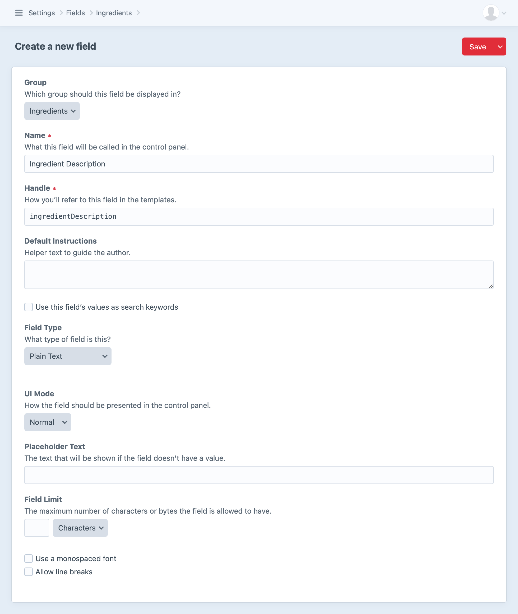
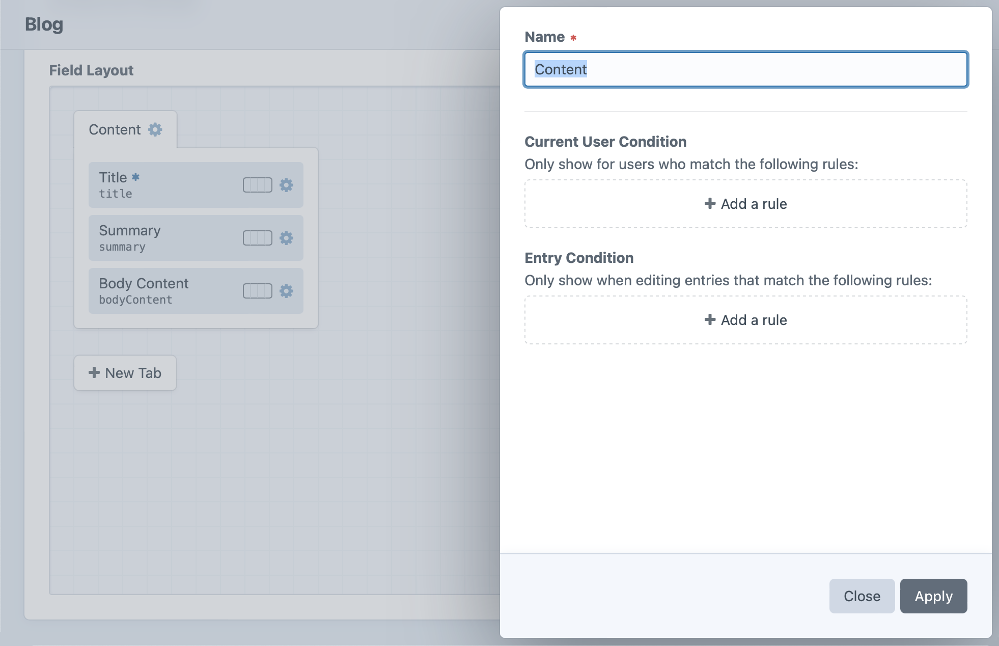
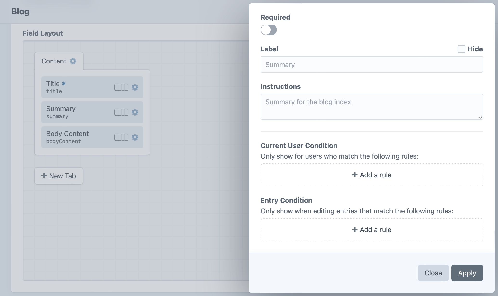

# Custom Fields

All of the content on your site will get entered into fields.

Fields are defined globally from **Settings** → **Fields**. They are organized into Field Groups for convenience, but Field Groups have very little relevance anywhere else in the system.

All fields share a few common settings:

- **Group** – The field group that the field should be shown in
- **Name** – How the field will be referenced throughout the control panel
- **Handle** – How the field will be referenced from your templates
- **Instructions** – Instruction text to guide the authors
- **Field Type** – What type of field it is

<BrowserShot url="https://my-project.tld/admin/settings/fields/new" :link="false" :max-height="500">

</BrowserShot>

## Field Types

Choosing a field type determines what the field’s input UI is going to look like, what type of data it can store, and how you’ll be able to interact with that data from your templates.

Craft comes with the following built-in field types:

- [Assets](assets-fields.md)
- [Categories](categories-fields.md)
- [Checkboxes](checkboxes-fields.md)
- [Color](color-fields.md)
- [Date](date-time-fields.md)
- [Dropdown](dropdown-fields.md)
- [Email](email-fields.md)
- [Entries](entries-fields.md)
- [Lightswitch](lightswitch-fields.md)
- [Matrix](matrix-fields.md)
- [Multi-select](multi-select-fields.md)
- [Number](number-fields.md)
- [Plain Text](plain-text-fields.md)
- [Radio Buttons](radio-buttons-fields.md)
- [Table](table-fields.md)
- [Tags](tags-fields.md)
- [Time](time-fields.md)
- [URL](url-fields.md)
- [Users](users-fields.md)

## Translation Methods

If you’re running a multi-site Craft installation, most of your fields will have a “Translation Method” setting (depending on their type).

Fields can have the following translation method:

- **Not translatable** – The field will have the same value across all sites.
- **Translate for each site** – The field can have a different value for each site.
- **Translate for each site group** – The field can have a different value for each site group.
- **Translate for each language** – The field can have a different value for each unique language associated with your sites.
- **Custom…** – The field can have different values based on a custom differentiator.

If you choose “Custom…”, a “Translation Key Format” setting will appear below, where you can define a template that will help Craft which sites to copy the field value over to. When a new field value is saved, Craft will render this template for all sites, and the field value will be copied to all sites where the translation key matches the original site’s.

For example, if a field’s translation key format were `{site.handle[0:2]}`, then new field values would be copied over to any other sites where the first two characters of the site handle matches the first two characters of the original site’s handle.

If the translation key format returns an empty string (`''`), the field will not indicate that it’s available for translation. A key format of `{section.handle == 'blog' ? site.handle : ''}`, for example, would display its field as translatable per site from _only_ the `blog` section—otherwise it would not be available for translation in any other context.

## Field Layouts

Once you’ve created your fields, you can display them in your edit forms by adding them to “field layouts”.

Everything in Craft that has content associated with it will provide a field layout for selecting fields:

- [Entries](entries.md) use the field layout defined by their entry type in **Settings** → **Sections** → **Edit Entry Types** → [entry type name] → **Field Layout**.
- [Global sets](globals.md) each get their own field layout, defined in **Settings** → **Globals** → [global set name] → **Field Layout**.
- [Assets](assets.md) use the field layout defined by their asset volume in **Settings** → **Assets** → [asset volume name] → **Field Layout**.
- [Categories](categories.md) use the field layout defined by their category group in **Settings** → **Categories** → [category group name] → **Field Layout**.
- [Tags](tags.md) use the field layout defined by their tag group in **Settings** → **Tags** → [tag group name] → **Field Layout**.
- [Users](users.md) all share a single field layout defined in **Settings** → **Users** → **Fields**.

The field layout editor works the same way regardless of which content type you’re looking at:

### Tabs

Every layout starts with a “Content” tab at the top. You can click the tab’s gear icon (<icon kind="settings" />) and choose **Settings** to rename it, and use the **+ New Tab** button to add more tabs to your layout. Drag and drop those tabs into whatever order you prefer, where the first will be displayed for the content editor by default.

::: tip
If the field layout has only one tab, its fields will be displayed in the editor without the tab itself—so its name will not be displayed until more tabs are added.
:::

A tab’s settings include its name and optional conditions that determine when it should be displayed:

- **Name** – the label displayed for the tab when it’s visible in the editor.
- **Current User Condition** – optional rules for determining which users should see the tab in the editor. (When the tab is not displayed, its fields are hidden regardless of their individual conditions.)
- **Entry Condition** – optional rules, based on the entry, that determine when the tab and its fields should be displayed in the editor.

### Fields

Add however many fields you’d like to each tab, dragging them into your desired order. (Most layouts include a **Title** field by default.) Any available fields and UI elements will be available off to the side, where you can drag them from the sidebar into your field layout. You can move fields back to the sidebar and out of your field layout—unless they’re mandatory fields _required_ to be in the layout—but take care not to remove any fields already being used for important content.

By default, each field will be displayed at the full width (100%) of its tab. You can use the field width control, however, to designate a column size. This can be 25%, 50%, 75% or the default 100% width. You can use this to have fields appear side by side as long as the content editor’s browser window is wide enough. (Otherwise, the fields may still be shown at full width.)

Click the gear icon (<icon kind="settings" />) next to a field to open a slideout with its settings:

The field’s settings let you control if and how it’s displayed:

- **Required** – when switched on, does not allow the field to be left empty.
- **Label** – override for the label already given to that field.
- **Instructions** – override for the instructions already given to that field.
- **Current User Condition** – optional rules for determining which users should see the field in the editor.
- **Entry Condition** – optional rules, based on the entry, that determine when the field should be displayed in the editor.

A field that’s required will have an asterisk (<icon kind="asterisk" />) beside the field’s name.

### Field Conditions

Any fields that have condition rules on them are displayed with a caution strip:

