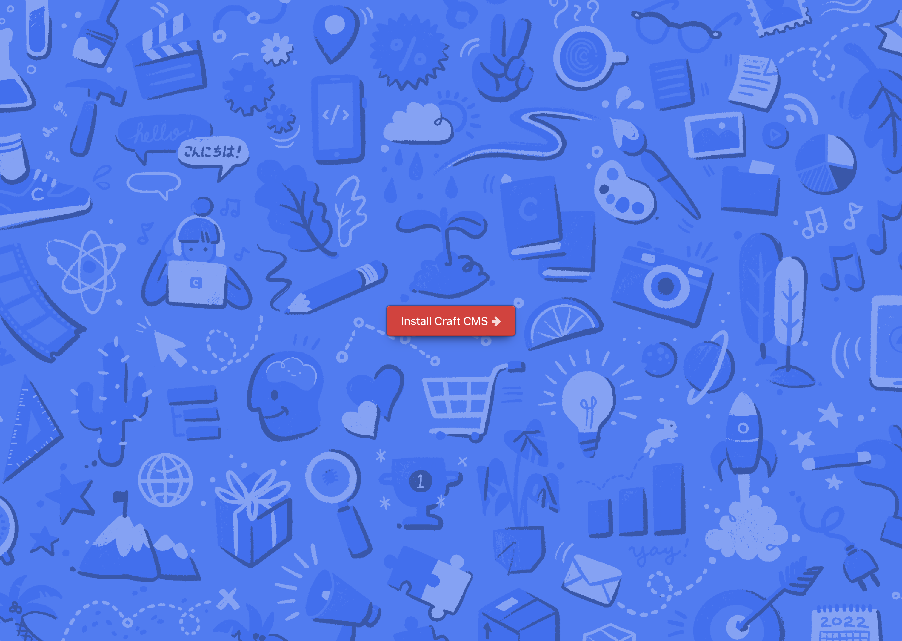
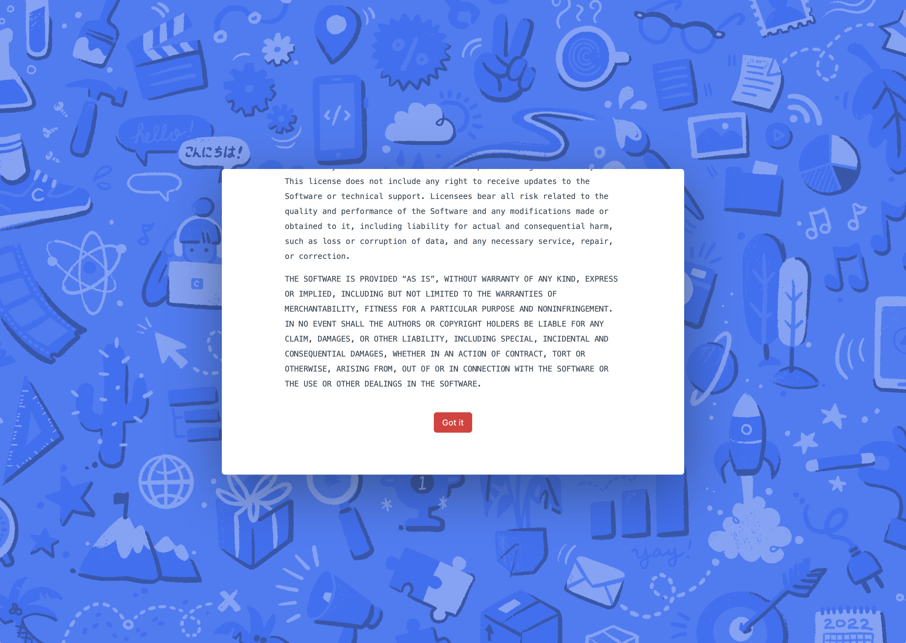
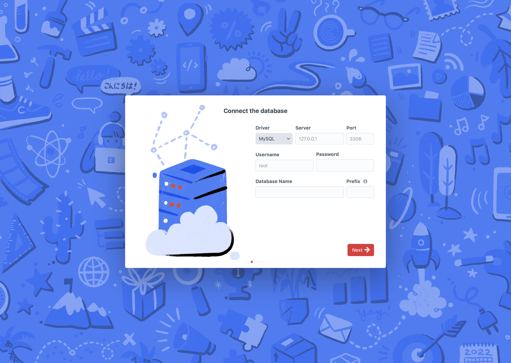
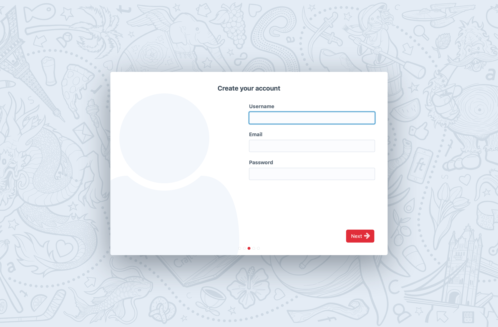
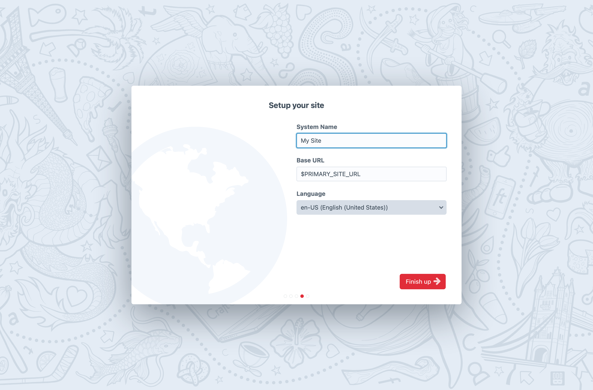
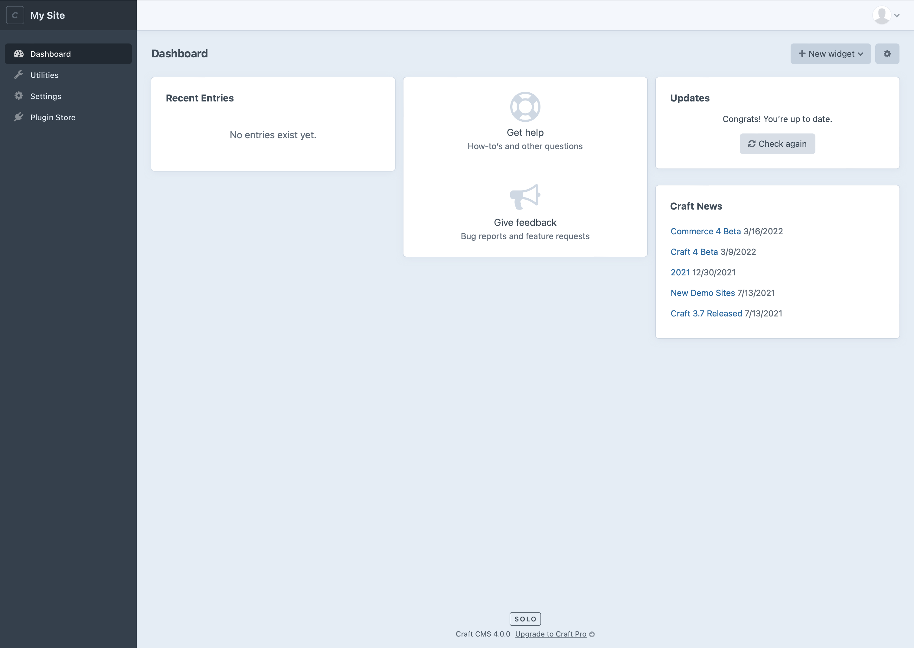

# Installation

The prevalence of modern, mature PHP development tools and infrastructure makes Craft easy to install, run, and [upgrade](./upgrade.md).

For the purposes of outlining the installation and [setup](#setup) processes, these instructions will focus solely on [DDEV](https://ddev.readthedocs.io/en/stable/). The only prerequisite is a basic understanding of Unix-style command line interfaces.

::: tip
Getting bogged down? That’s OK! The [Tutorial](../getting-started-tutorial/README.md) is a comprehensive guide geared toward first-time Craft users—but it’s a great resource for anyone who wants to get set up with a fast, reliable local development environment.
:::

Downloading or installing Craft by any means binds you to its [license](https://craftcms.com/license).

## Quick-Start

[DDEV](https://ddev.readthedocs.io/en/stable/) simplifies the creation and management of an entire Craft development environment—without touching any other software on your host machine.

[Install DDEV](https://ddev.readthedocs.io/en/latest/users/install/ddev-installation/), then run these commands:

```bash
# Create a project directory and move into it:
mkdir my-craft-project
cd my-craft-project/

# Create DDEV configuration files:
ddev config --project-type=craftcms

# Initialize the project from our starter repo:
ddev composer create -y --no-scripts --no-install craftcms/craft

# Boot up the development environment:
ddev start

# Install Composer packages:
ddev composer update
```

At this point, you have a complete Craft codebase and a running development environment. You can continue with [setup](#setup) via the CLI, or in a [browser](#gui):

::: code
```bash CLI
# Run interactive setup:
ddev craft install
```
```bash GUI
# Open a browser to the install wizard:
ddev launch admin/install
```
:::

Continue reading for a complete list of…

::: tip
The additional flags passed to `create-project` (or [`ddev composer create`](https://ddev.readthedocs.io/en/latest/users/basics/developer-tools/#composer) in this case) defer some automated steps until the DDEV container is running and it has a chance to inject default configuration values into the `.env` file.
:::

## Setup

Craft has a built-in setup wizard that streamlines configuration of your [database connection](#database) and the creation of your first [user account](#your-first-account).

The setup wizard is started automatically, when using `composer create-project`. If you need to start setup manually, visit the project in your [browser](#gui) or run:

```bash
php craft setup
```

Craft will walk you through the following setup steps:

- Establishing a [Database Connection](#database);
- Creating your first [User](#your-first-user);
- Setting a [Site](#site) name and base URL;

::: tip
For each option, you can accept the default (presented inside `[square brackets]`)—or provide your own value—then press <kbd>Enter</kbd> to confirm. If at any stage Craft is unable to move forward, it will present an error and prompt for new input. You can exit setup by pressing <kbd>Control + C</kbd>.
:::

At this point, Craft runs the installation “migration” which is responsible for creating the required database tables/schema and writing out (or applying) [project config](./project-config.md) data.

#### GUI

First-time Craft users may find that the graphical installation wizard provides a friendlier way of troubleshooting initial configuration and connectivity issues. You’ll also get immediate feedback as to whether or not Craft is accessible via HTTP on your local machine!

Accessing the installation GUI depends largely on your local development environment—but whatever hostname the site lives at can be appended with `/admin/install`:

```
http://localhost:8080/admin/install
https://my-craft-project.ddev.site/admin/install
```

### Database

The following values tell Craft how to connect to your database server. Each tool and platform will be different! Refer to the setup instructions for your development environment if you get stuck.

- **Driver:** One of `mysql` (MySQL or MariaDB) or `pgsql` (Postgres).
- **Hostname:** The hostname or IP address of the database server.
- **Port:** The port the database server is listening for connections on.
- **User:** Username that Craft will use to connect.
- **Password:** Password for the database user.
- **Name:** Name of the database to use, accessible to the provided user.
- **Table prefix:** _Optional._ Leave blank unless you anticipate running multiple Craft installs off of a single database.

These values will be added to your `.env` file automatically, and can be tweaked or supplemented with [other database options](./config/db.md), if necessary.

### Your First User

Craft will help set up an [admin user](./user-management.md#admin-accounts) so you can log in to the [control panel](./control-panel.md) as soon as installation completes.

- **Username:** 
- **Email:** 
- **Password:** Type and confirm the user’s password.

::: danger
Set a strong password **now**, especially if you intend to seed a staging or production site with your development database.
:::

### Site Settings

The last step in setup is to choose some system and default [site](./sites.md) settings:

- **System Name**: Choose a name for the site. (This is also applied as the “system name” (visible throughout the control panel), and the “from” name when sending emails. These can be changed individually, later.)
- **Base URL**: How will you access the site in your browser?
- **Language**: What will be the primary language for the site?

## Existing Projects

Should you need to work on an existing Craft project, the process may be even simpler.

All Craft projects include a `composer.json` file, which determines 

::: warning
If you do **not** see `composer.json` and `composer.lock` files in an existing project, you may have an incomplete copy of the codebase. Without these files, it will be difficult to determine what versions
:::

## Customization

This guide is based on the [official starter project](https://github.com/craftcms/craft), which includes only the scaffolding and configuration required to run Craft. Customization may be necessary to meet the needs of your development or hosting environment.

### Community Starter Projects

The official starter project is kept deliberately lean to focus on Craft-specific concepts. We understand that some developers and teams will want to try out Craft with their other favorite tools—and share what they’ve learned with the community!

Any other starter project can be used in place of the default one by substituting its package name for `craftcms/craft` when running `composer create-project craftcms/craft`. Keep in mind that there may be some differences in installation processes

### From Scratch

While we recommend using the official starter project, there are only a couple of things you need to know to start completely from scratch. Composer will remain a requirement, however:

```bash
mkdir my-custom-project
cd my-custom-project
composer init
```

Skip or accept defaults for all the prompts, except for these:

- **Would you like to define your dependencies (require) interactively?** &rarr; `y` for “Yes”
- **Search for a package:** &rarr; `craftcms/cms` (allow Composer to find the latest version)
Press <kbd>Enter</kbd> when prompted a second time to exit dependency declaration)
- **Do you trust `yiisoft/yii2-composer` to execute code and wish to enable it now?** &rarr; `y` for “Yes”
- **Do you trust `craftcms/plugin-installer` to execute code and wish to enable it now?** &rarr; `y` for “Yes”

You will be left with a fresh `vendor/` directory and a `composer.json` file that looks something like this:

```json
{
    "name": "me/my-custom-project",
    "require": {
        "craftcms/cms": "^4.3"
    },
    "authors": [
        {
            "name": "My Name",
            "email": "email@domain.com"
        }
    ],
    "config": {
        "allow-plugins": {
            "yiisoft/yii2-composer": true,
            "craftcms/plugin-installer": true
        }
    }
}
```

Comparing this to the [starter kit](https://github.com/craftcms/craft/blob/main/composer.json.default), you’ll notice it’s pretty similar.

#### Bootstrapping Craft

Now that Craft’s source files are installed, you’ll need to create entry scripts for web and console requests.

```treeview{4-6,9}
my-custom-project/
├── vendor/
│   └── ...
├── web/
│   ├── .htaccess
│   └── index.php
├── composer.json
├── composer.lock
└── craft
```

Create a `web/` directory, and two files inside it:

::: code
```php index.php
<?php

require dirname(__DIR__) . '/bootstrap.php';

/** @var craft\web\Application $app */
$app = require CRAFT_VENDOR_PATH . '/craftcms/cms/bootstrap/web.php';
$app->run();
```
```apache .htaccess
# Only required for Apache servers!
<IfModule mod_rewrite.c>
    RewriteEngine On

    # Send would-be 404 requests to Craft
    RewriteCond %{REQUEST_FILENAME} !-f
    RewriteCond %{REQUEST_FILENAME} !-d
    RewriteCond %{REQUEST_URI} !^/(favicon\.ico|apple-touch-icon.*\.png)$ [NC]
    RewriteRule (.+) index.php?p=$1 [QSA,L]
</IfModule>
```
:::

Note that `index.php` contains a reference to a “shared bootstrap” file. We’ll create that in a moment.

Now, at the root level of your project, create a `craft` file (no extension), taking care to include the special “[shebang](https://en.wikipedia.org/wiki/Shebang_(Unix))” line:

```bash
#!/usr/bin/env php
<?php

require __DIR__ . '/bootstrap.php';

/** @var craft\console\Application $app */
$app = require CRAFT_VENDOR_PATH . '/craftcms/cms/bootstrap/console.php';
$exitCode = $app->run();
exit($exitCode);
```

This, too, refers to the same `bootstrap.php` file, which also goes in the project’s root:

```php
<?php

// Two constants inform much of Craft’s ability to find resources in your project:
define('CRAFT_BASE_PATH', __DIR__);
define('CRAFT_VENDOR_PATH', CRAFT_BASE_PATH . '/vendor');

// Load Composer's autoloader
require_once CRAFT_VENDOR_PATH . '/autoload.php';
```

As a means of DRYing up the entry scripts, this is where the starter project loads [environment variables](#environment-variable-support)—and where we recommend performing some low-level [configuration via constants](./config/README.md#php-constants).

#### Environment Variable Support

The official starter project automatically supports environment variables defined in a `.env` file, through the [`vlucas/phpdotenv`](https://github.com/vlucas/phpdotenv) package.

It’s up to you how to manage secrets! If your development and production environments have built-in tools for this (or you choose to configure Craft in such a way that it )

::: warning
If at this point, you are inclined to implement `.env` support, take another look at the starter project.
:::

#### Ignoring Files

The minimum `.gitignore` file should looks something like this:

```ignore
/.env
/vendor
```

[Configuration](./config/README.md) makes it possible to keep secrets out of your `config/` directory, so it can be usually be tracked safely; `license.key` and plugin license keys can stay with your project, as they will be bound to your Craft ID once purchased; `.env.example` (if present) is good to keep around to let other developers know what configuration is required to make your project work;

::: warning
**Never** version-control files that contain sensitive information. If `.env` or another sensitive file makes it into your repo, keys should be rotated immediately.
:::

## Hosting

We maintain a [list of Craft-friendly providers](https://craftcms.com/hosting) for projects of varying scale. Craft’s own footprint is relatively light, but it’s important to choose a platform that matches your traffic, storage, and redundancy needs.

### Special Considerations

There are three main 

## Deployment

https://craftcms.com/knowledge-base/deployment-best-practices

---

See the [Directory Structure](directory-structure.md) page to learn what these folders and files are for and how you can customize them.

::: tip
If you’re on macOS, be careful not to lose the hidden files in there (`.env`, `.env.example`, `.gitignore`, and `web/.htaccess`). You can press <kbd>Command</kbd>+<kbd>Shift</kbd>+<kbd>.</kbd> to toggle hidden file visibility in Finder.
:::

::: tip
The `web/` folder represents your site’s web root, and it can be renamed to whatever you want (`www/`, `public/`, `public_html/`, etc.).
:::

::: tip
See [Moving Craft’s Files Below the Web Root](https://craftcms.com/knowledge-base/moving-craft-files) if your hosting setup does not allow Craft’s files to exist outside the web root.
:::


## Step 2: Set the File Permissions

## Step 3: Set a Security Key

::: tip
If you used Composer to download Craft, you can probably safely skip this step.
:::

Each Craft project should have a unique security key, which is shared between each of the environments that the project is installed on.

You can generate and assign the key [manually](#set-the-key-manually), or have Craft do it for you with a [terminal command](#set-the-key-from-your-terminal).

### Set the Key Manually

First generate a cryptographically secure key, ideally using a password generator like [1Password](https://1password.com/password-generator/). (There’s no length limit.)

Then open up your `.env` file (you may need to use an app like [Transmit](https://panic.com/transmit/) to do this if you’re running macOS), and find this line:

    CRAFT_SECURITY_KEY=""

Paste your security key inside the quotes and save the file.

### Set the Key from Your Terminal

In your terminal, go to your project’s root directory and run the following command:

```bash
php craft setup/security-key
```

## Step 4: Create a Database

Next up, you need to create a database for your Craft project. Craft 4 supports both MySQL 5.7.8+ and PostgreSQL PostgreSQL 10+.

If you’re given a choice, we recommend the following database settings in most cases:

- **MySQL**

  - Default Character Set: `utf8`
  - Default Collation: `utf8_unicode_ci`

- **PostgreSQL**
  - Character Set: `UTF8`

## Step 5: Set up the Web Server

Create a new web server to host your Craft project. Its document root (or “web root”) should point to your `web/` directory (or whatever you’ve renamed it to).

You’ll also need to update your system’s `hosts` file so requests to your chosen hostname (e.g. `my-project.tld`) should be routed locally.

- **macOS/Linux/Unix**: `/etc/hosts`
- **Windows**: `\Windows\System32\drivers\etc\hosts`

::: tip
Some local development tools such as [DDEV](https://ddev.com/) will update your `hosts` file automatically for you.
:::

You can test whether you set everything up correctly by pointing your web browser to `https://<Hostname>/index.php?p=admin/install` (substituting `<Hostname>` with your web server’s hostname). If Craft’s Setup Wizard is shown, the hostname is correctly resolving to your Craft installation.

::: tip
We recommend using the `.test` TLD for local development, and specifically **not** `.local` on macOS since [conflicts with Bonjour can lead to performance issues](https://help.rm.com/technicalarticle.asp?cref=tec3015691).
:::

## Step 6: Run the Setup Wizard

Finally, it’s time to run Craft’s Setup Wizard from either your [terminal](#terminal-setup) or your [web browser](#web-browser-setup).

::: tip
If you used `composer create-project` earlier and chose to continue setup there, you can head straight to `https://my-project.tld/admin`.
:::

### Terminal Setup

In your terminal, go to your project’s root directory and run the following command to kick off the Setup Wizard:

```bash
php craft setup
```

The command will ask a few questions about your database connection and kick off Craft’s installer. Once it’s done, you should be able to access your new Craft site from your web browser.

### Web Browser Setup

In your web browser, go to `https://my-project.tld/index.php?p=admin/install` (substituting `my-project.tld` with your web server’s hostname). If you’ve done everything right so far, you should be greeted by Craft’s Setup Wizard:

<BrowserShot url="https://my-project.tld/admin/install" :link="false">

</BrowserShot>

The first step of the installer is to accept the [license agreement](https://craftcms.com/license). Scroll down through the agreement (reading it all, of course) and press **Got it** to accept:

<BrowserShot url="https://my-project.tld/admin/install" :link="false">

</BrowserShot>

The second step is to enter your database connection information:

::: tip
If the Setup Wizard skips this step, it’s because Craft is already able to connect to your database.
:::

<BrowserShot url="https://my-project.tld/admin/install" :link="false">

</BrowserShot>

The third step is to create an admin account. Don’t be one of _those people_—be sure to pick a strong password:

<BrowserShot url="https://my-project.tld/admin/install" :link="false">

</BrowserShot>

The final step is to define your System Name, Base URL, and Language:

<BrowserShot url="https://my-project.tld/admin/install" :link="false">

</BrowserShot>

Press **Finish up** to complete the setup process. A few seconds later, you should have a working Craft install!

If it was successful, Craft will redirect your browser to the control panel:

<BrowserShot url="https://my-project.tld/admin/dashboard" :link="false">

</BrowserShot>

Congratulations, you’ve installed Craft!

Now build something incredible.

## Troubleshooting

See the [Troubleshooting a Failed Craft Installation](https://craftcms.com/knowledge-base/troubleshooting-failed-installation) Knowledge Base article for a number of common installation hang-ups.

### Permissions

PHP needs to be able to write the following files and folders:

- `.env`
- `composer.json`
- `composer.lock`
- `config/license.key`
- `config/project/*`
- `storage/*`
- `vendor/*`
- `web/cpresources/*`

The exact permissions you should be setting depends on the relationship between the system user that runs PHP (like `www-data`) and whoever owns the folders and files.

- If they’re the same user, use `744`.
- If they’re different users in the same group, use `774`.

Except in exceedingly rare cases on WSL platforms, `777` permissions should never be used.

::: warning HEY IIS FANS
Make sure your site’s AppPool account has write permissions to these folders and files.
:::
