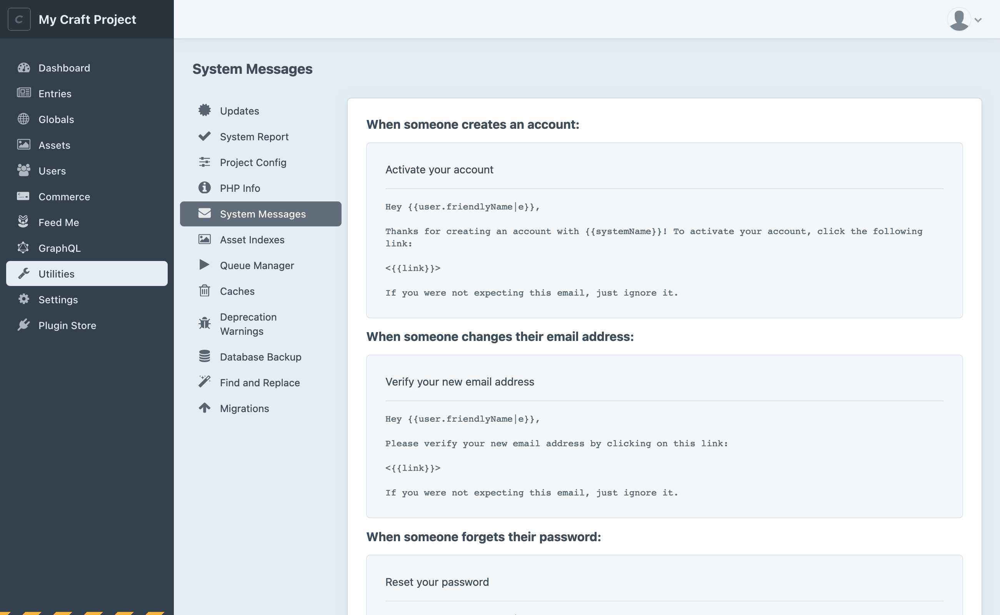
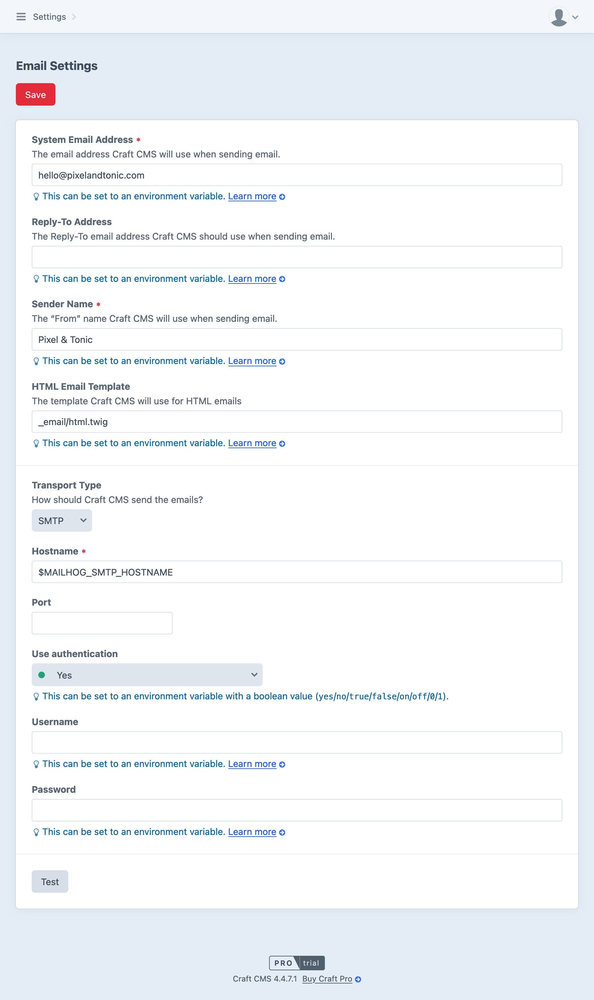

# Email

Craft sends email in response to some user actions, like account activation, email verification, password resets, and testing [email settings](#settings). All Craft editions are capable of sending emails, but [system messages](#system-messages) are only customizable in **Pro**.

Plugins may send email under other circumstances, either by registering a global [system message](#system-messages), or using [their own management tools](#other-messages).

## System Messages <badge type="edition" vertical="middle" text="Pro" title="Craft Pro only" />

You can view and edit the built-in (and plugin-provided) email messages by navigating to **Utilities** &rarr; **System Messages**.

<BrowserShot
    url="https://my-craft-project.ddev.site/admin/utilities/system-messages"
    :link="false"
    caption="Viewing system messages in the utilities section of the control panel. Customizing system messages is limited to Craft Pro.">

</BrowserShot>

Click on any message to open a modal and edit its subject and body.

::: tip
Running a multi-site installation? You can customize system messages on a per-site basis using the site selection menu in the upper-right corner of the message modal.
:::

### Twig

The body of each system message is evaluated as a Twig template, then parsed as [Markdown](https://daringfireball.net/projects/markdown/). Subject lines may also include Twig.

<See path="./dev/twig-primer.md" description="Get to know Twig, Craft’s template engine." />

The default templates include some basic output tags that take advantage of the [variables](#variables) Craft provides:

```twig
Hey {{user.friendlyName|e}},

Thanks for creating an account with {{systemName}}! To activate your account, click the following link:

<{{link}}>

If you were not expecting this email, just ignore it.
```

#### Variables

Each system message (and subject line) is provided some special, context-specific variables, in addition to those available in normal Twig environments.

All Messages
: These variables are available across all system messages:
: - `emailKey`: Handle or “key” of the message being sent—usually a `snake_case` version of its name, below.
: - `fromEmail`: Email address being used in the message’s `From:` header.
: - `replyToEmail`: Email address being used in the message’s `ReplyTo:` header. Same as `fromEmail`, unless it was explicitly set in [settings](#settings), or was overridden prior to sending.
: - `fromName`: Display name that was used to build the `From:` header. Reflects the **Sender Name** in [settings](#settings), unless it was overridden prior to sending.
: - `language`: Language that the current message was defined for. This may agree with the site in use when the message was triggered, or the user’s preferred language.

Account Activation
: - `user`: The Craft [user](users.md) element a message is being sent to.
: - `link`: A tokenized activation URL.

Email Verification
: - `user`: The Craft [user](users.md) element a message is being sent to.
: - `link`: A tokenized verification URL.

Password Reset
: - `user`: The Craft [user](users.md) element a message is being sent to.
: - `link`: A tokenized password reset URL.

::: warning
When outputting user-provided values (like a username, email, or [address](addresses.md)), always use the [escape](https://twig.symfony.com/doc/3.x/filters/escape.html) filter. You can see the shorter version (`|e`) in use in the template, above.
:::

Keep in mind that users may have different amounts of profile data populated when they register or reset their password. Include default or alternate text when the desired text may not be available:

```twig
{# Output a comma before the user’s name, or jump right to a punctuation mark: #}
Hello{{ user.fullName is not empty ? ", #{user.fullName}" : null }}!
```

#### URLs

You may output element URLs just as you would in a front-end template. However, if you are linking to an arbitrary path, use the appropriate URL helper function, in Twig:

```twig
{# Forces a site URL: #}
{{ siteUrl('dashboard') }}

{# Forces a control panel URL: #}
{{ cpUrl('myaccount')}}
```

Using the agnostic `url()` function may generate incorrect URLs that reflect how an email was triggered rather than the kind of access the recipient has. For example, a user requesting a password reset link from the front-end will get the proper site URL, but the same email sent in response to an administrator’s action would be prefixed with the <config4:cpTrigger>.

#### Language

In addition to having site-specific messages, emails sent to a Craft user can use the [`t` filter](dev/filters.md#translate-or-t) to localize strings based on their preferred language. Read more about [static translations](sites.md#static-message-translations) in the **Sites** documentation.

::: tip
Plugins may register messages that are not sent to Craft users—in these cases (where we don’t know the recipient’s desired language), the current site’s language will be used.
:::

#### Image Transforms

Craft generates transforms for images used within emails prior to sending them. This ensures that no [ambiguous URLs](repo:craftcms/cms/issues/7267) are included in an email, which could later point to an incorrect transform.

## Other Messages

Plugins may create and send email messages outside of [system messages](#system-messages). For example, [Commerce](/commerce/4.x/README.md) provides a [user-configurable suite of messages](/commerce/4.x/emails.md) and status-based triggers, rather than defining messages in the global space. The mailer will use the **System Email**

::: tip
If you are unsure where an email is sent from (or how to edit it), check the system messages utility, then consult the documentation for any installed plugins.
:::

## Settings

Craft uses a single configuration for its [mailer component](craft4:craft\mail\Mailer), on the assumption that all email should flow through a single [transport](#transport-adapters).

<BrowserShot
    url="https://my-craft-project.ddev.site/admin/settings/email"
    :link="false"
    :maxHeight="800"
    id="mail-settings"
    :poi="{
        systemAddress: [28, 14],
        replyToAddress: [28, 22],
        htmlTemplate: [28, 38.5],
        transportAdapter: [20, 52],
    }"
    caption="Email settings screen in the control panel.">

</BrowserShot>

After making changes to your configuration, click **Test** at the bottom of the screen. Craft will attempt to send a message with the new settings; if you see a confirmation, apply the settings by clicking **Save**. Mail settings are stored in [project config](project-config.md).

::: warning
Craft only knows as much about delivery as the current [transport](#transport-adapters) can provide. For example, an adapter that calls a third-party HTTP API considers a send “successful” if the request completed nominally; therefore, a test may appear successful at first blush, but be undeliverable for an unrelated reason.
:::

### System Address <Poi target="mail-settings" id="systemAddress" label="1" />

All email will appear to be sent “from” this address. You may also set a **Reply-To Address** <Poi target="mail-settings" id="replyToAddress" label="2" /> if the system address is not a real or monitored inbox.

::: tip
Some plugins provide an option to override this address for messages that they send.
:::

### HTML Template <Poi target="mail-settings" id="htmlTemplate" label="3" />

If you wish to customize your emails’ structure or appearance, consider creating a template in your `templates/` directory and selecting it, here.

This template is handled a bit differently than the normal Twig “layout” scheme—the body of the email is [processed](#twig) first, then passed to the template as a `body` variable:

```twig{18}
<!DOCTYPE html>
<html lang="en">
  <head>
    <style>
      /* Custom styles! */
    </style>
  </head>
  <body>
    <div class="email-wrapper">
      <div class="email-header">
        
      </div>
      <div class="email-body">
        {{ body }}
      </div>
      <div class="email-footer">
        ©{{ now.format('Y') }}, <a href="{{ siteUrl }}">{{ siteName }}</a>
      </div>
    </div>
  </body>
</html>
```

Otherwise, this is a regular Twig environment, so all the filters, functions, global variables, tags, and tests are available to you—including element queries!

### Transport Adapters <Poi target="mail-settings" id="transportAdapter" label="4" />

Three adapters are provided with Craft, with more installable from the [Plugin Store](plugin:categories/mailer-adapters?craft4). You can switch adapters at any time—each adapter exposes a [Transport](https://symfony.com/doc/current/mailer.html#using-a-3rd-party-transport) class that conforms to a consistent interface, allowing Craft and plugins to send email without worrying about the underlying implementation or service.

::: tip
For the most reliable delivery, consider using one of the third-party transactional email service integrations, like [Amazon SES](plugin:amazon-ses?craft4), [Mailgun](plugin:mailgun?craft4), [Postmark](plugin:postmark?craft4), or [Sendgrid](plugin:sendgrid?craft4). These adapters all communicate with an API over HTTP instead of SMTP, and ultimately use their own, trusted origin to send email. In some situations, this is essential, as some <abbr title="Internet Service Provider">ISP</abbr>s and network maintainers will throttle or completely block outbound SMTP traffic.

These services often require non-invasive adjustments to your DNS records for proof-of-ownership and security.
:::

#### Gmail

Sends via an existing Google Gmail account. You must [enable IMAP access](https://support.google.com/mail/answer/7126229) in order to access a Gmail account over SMTP.

::: danger
This adapter requires credentials for your Google account. If it is your only option, consider using an account that would not pose a security risk to you or your clients, should the password be compromised.

_As of May, 2022, Google has phased out most support for “[less-secure apps](https://support.google.com/accounts/answer/6010255),” in favor of [App Passwords](https://support.google.com/accounts/answer/185833)._
:::

#### SMTP

A generic adapter for any SMTP connection. You must specify an SMTP host, but which remaining fields are required is dependent upon the server.

Some third-party platforms offer SMTP integrations paths, and do not require a custom adapter! DDEV, for instance, gives you a [Mailhog](https://ddev.readthedocs.io/en/latest/users/usage/developer-tools/#email-capture-and-review-mailhog) instance for capturing and reviewing outbound email. When starting a project, DDEV will write two variables into your `.env` file:

```bash
MAILHOG_SMTP_HOSTNAME="127.0.0.1"
MAILHOG_SMTP_PORT="1025"
```

You can use these in the adapter configuration by [prefixing them with a dollar sign](config/README.md#control-panel-settings) (`$`).

::: tip
The default port for SMTP has traditionally been `25`, but some networks completely block this traffic. Your SMTP server may support communication on an alternate port—usually `587`.
:::

#### Sendmail

`sendmail` is a unix command-line tool for sending email. Unless a host has properly configured and documented their installation, `sendmail` tends to be extremely unreliable. As a spam prevention measure, most email providers will outright reject messages coming from unknown IP addresses.

This adapter only requires a “command,” and defaults to `/usr/sbin/sendmail -bs`.

### Development + Testing

In development environments, you can ensure all outbound email is sent to a single address with the <config4:testToEmailAddress> setting.

Alternatively, the entire [mailer component](config/app.md#mailer) can be replaced via application config, should you want to use an entirely different [transport](#transport-adapters) for local development.
