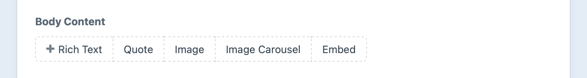
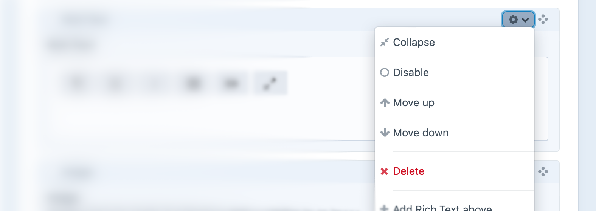

# Matrix Fields

Matrix fields allow you to create multiple blocks of content within a single field.

## Settings

Matrix fields have the following settings:

- **Configuration** – This is where you configure which block types should be available to your Matrix field, and which sub-fields each of those block types should have.
- **Min Blocks** – The _minimum_ number of blocks that can be created within the field. (Default is no lower limit.)
- **Max Blocks** – The _maximum_ number of blocks that can be created within the field. (Default is no upper limit.)

## The Field

On a fresh entry, Matrix fields will just show a group of buttons – one for each of the Block Types you created in the field’s settings:



When you click on one of those buttons, a new block will be created. The Block Type’s name will be shown in the block’s title bar, and each of the Block Type’s fields will be present within the body of the block:


You can add as many blocks to your Matrix field as you’d like—or at least as many as the field’s Min Blocks and Max Blocks settings allow.

Each block has a settings menu that reveals additional things you can do with the block:



If multiple blocks are selected, the Collapse/Expand, Disable/Enable, and Delete options will apply to each of those selected.

You can collapse Matrix blocks by choosing the **Collapse** menu option or by double-clicking on a block’s title bar. When a block is collapsed, its title bar will show a preview of its content so you can still identify which block it is.

Blocks can also be reordered by dragging the “Move” icon (<icon kind="move" />) at the end of the block’s title bar. If multiple blocks are selected, all the selected blocks will be going along for the ride.

You can quickly select _all_ blocks by selecting one and pressing <kbd>Ctrl</kbd>/<kbd>⌘</kbd> + <kbd>A</kbd>, or selecting a range of blocks starting with the first and then <kbd>Shift</kbd>-clicking the last.

## Development

### Querying Elements with Matrix Fields

When [querying for elements](element-queries.md) that have a Matrix field, you can filter the results based on the Matrix field data using a query param named after your field’s handle.

Possible values include:

| Value                   | Fetches elements…                                                         |
| ----------------------- | ------------------------------------------------------------------------- |
| `':empty:'`             | that don’t have any Matrix blocks.                                        |
| `':notempty:'`          | that have at least one Matrix block.                                      |
| `100`                   | that have a Matrix block with an ID of 100.                               |
| `[100, 200]`            | that have Matrix blocks with IDs of 100 or 200.                           |
| a [MatrixBlock](craft4:craft\elements\MatrixBlock) object | that have the Matrix block.             |
| an array of [MatrixBlock](craft4:craft\elements\MatrixBlock) objects | that have the Matrix blocks. |

::: code
```twig
{# Fetch entries with a Matrix block #}

```
```php
// Fetch entries with a Matrix block
$entries = \craft\elements\Entry::find()
    ->myFieldHandle(':notempty:')
    ->all();
```
:::

::: code
```twig
{# Fetch entries with Matrix block ID 100 or 200 #}

```
```php
// Fetch entries with a Matrix block
$entries = \craft\elements\Entry::find()
    ->myFieldHandle([100, 200])
    ->all();
```
:::

### Working with Matrix Field Data

If you have an element with a Matrix field in your template, you can access its blocks using your Matrix field’s handle:

::: code
```twig

```
```php
$query = $entry->myFieldHandle;
```
:::

That will give you a [Matrix block query](matrix-blocks.md#querying-matrix-blocks), prepped to output all the enabled blocks for the given field.

To loop through all the blocks, call [all()](<craft4:craft\db\Query::all()>) and loop over the results:

::: code
```twig


  <ul>
    
      {# ... #}
    
  </ul>

```
```php
$blocks = $entry->myFieldHandle->all();
if (count($blocks)) {
    foreach ($blocks as $block) {
        // ...
    }
}
```
:::

All the code you put within the for-loop will be repeated for each Matrix block in the field. The current block will get set to that `block` variable we’ve defined, and it will be a <craft4:craft\elements\MatrixBlock> model.

Here’s an example of what the template might look like for a Matrix field with four block types (Heading, Text, Image, and Quote). We can determine the current block type’s handle by checking `block.type` (<craft4:craft\elements\MatrixBlock::getType()>).

```twig

  
    <h3>{{ block.heading }}</h3>
  
    {{ block.text|markdown }}
  
    
    
        
    
  
    <blockquote>
      <p>{{ block.quote }}</p>
      <cite>– {{ block.cite }}</cite>
    </blockquote>
  

```

::: tip
This code can be simplified using the [switch](dev/tags.md#switch) tag.
:::

If you only want the first block, call [one()](<craft4:craft\db\Query::one()>) instead of `all()`, and make sure it returned something:

::: code
```twig


  {# ... #}

```
```php
$block = $entry->myFieldHandle->one();
if ($block) {
    // ...
}
```
:::

If you only want to know the total number of blocks, call [count()](<craft4:craft\db\Query::count()>).

::: code
```twig

<p>Total blocks: <strong>{{ total }}</strong></p>
```
```php
$total = $entry->myFieldHandle->count();
// Total blocks: $total
```
:::

If you just need to check if blocks exist (but don’t need to fetch them), you can call [exists()](<craft4:craft\db\Query::exists()>):

::: code
```twig

  <p>There are blocks!</p>

```
```php
if ($entry->myFieldHandle->exists()) {
    // There are blocks!
}
```

Read more about [query execution methods](./element-queries.md#executing-element-queries) on the element query page.
:::

You can set [parameters](matrix-blocks.md#parameters) on the Matrix block query as well. For example, to only fetch blocks of type `text`, set the [type](matrix-blocks.md#type) param:

::: code
```twig

```
```php
$blocks = $entry->myFieldHandle
    ->type('text')
    ->all();
```
:::

::: tip
<Todo text="Extract this into a snippet." />

In Craft 3, we recommended cloning these query objects using the [`clone` keyword](https://www.php.net/manual/en/language.oop5.cloning.php) or [`clone()`](./dev/functions.md#clone) Twig function before applying params. **This is no longer required in Craft 4**, because a new copy of the query is returned each time you access the field property.
:::

#### Eager Loading

Matrix blocks can be loaded with their owners using the special [`.with()` query method](./dev/eager-loading-elements.md). Eager-loading can greatly improve performance if you need to output one or more blocks within a list of other elements—like generating summaries from the first block of content in a list of blog posts.

### Saving Matrix Fields

::: warning
Working with Matrix blocks is significantly more complex than other field types. The `form` examples that follow assume some familiarity with [how Craft routes and handles requests](./dev/controller-actions.md), as well as a willingness to adapt and extend the provided HTML to suit your needs.
:::

If you have an element form (such as an [entry form](kb:entry-form)) that needs to contain a Matrix field, you will need to submit your Matrix field’s data in a specific structure. We’re using JSON for the sake of its simple syntax, but the following examples will show you how to build a similarly-structured request with normal form elements:

```json
{
  "sortOrder": [
    321,
    654,
    "new:1"
  ],
  "blocks": {
    "321": {
      "type": "myFirstTypeHandle",
      "fields": {
        "myTextFieldHandle": "...",
        "myAssetField": [
          4,
          5,
          6
        ]
      }
    },
    "654": {
      "type": "myOtherTypeHandle",
      "fields": {
        "myNumberField": 42,
        "myDateField": {
          "date": "2023-01-01",
          "time": "00:00",
          "timezone": "America/Los_Angeles"
        }
      }
    },
    "new:1": {
      "type": "myFirstTypeHandle",
      "fields": {
        "myTextFieldHandle": "...",
        "myAssetField": []
      }
    }
  }
}
```

#### Block Order

`sortOrder` should be submitted as an array of all the block IDs you wish to persist (as well as any new block identifiers), in the order they should be saved.

If you want all existing blocks to persist in the same order they are currently in, then use this template to define your `sortOrder` array:

```twig

  
    {{ hiddenInput('fields[myFieldHandle][sortOrder][]', blockId) }}
  

```

::: tip
The `sortOrder` input elements do _not_ need to be adjacent in the DOM or as POST params—you are free to distribute and collocate them with each block’s data, if you wish.
:::

#### Block Data

All of your block data should be nested under a `blocks` key, and indexed by their IDs. Each block must submit its `type` (using the desired block type’s handle) and custom field data nested under a `fields` key.

Here’s how you can output form fields for existing blocks, for a Matrix field with two block types (`text` and `image`):

```twig

  
    {# Prefix the block's input names with `fields[myFieldHandle][blocks][<BlockID>]` #}
    
      {{ hiddenInput('type', block.type) }}

      
        
          <textarea name="fields[myTextFieldHandle]">
            {{- block.myTextFieldHandle|raw -}}
          </textarea>
        
          
          
            <ul>
              
                <li>
                  {{ image.getImg({ width: 100, height: 100 }) }}
                  {{ hiddenInput('fields[myAssetFieldHandle][]', image.id) }}
                </li>
              
            </ul>
          
      
    
  

```

::: tip
Outputting form fields for existing blocks is completely optional. As long as the block IDs are listed in the `sortOrder` array, they will persist even if they are excluded from the form data.
:::

#### New Blocks

To _add_ a block in a front-end form, you’ll need a unique, temporary identifier for it, prefixed with `new:`.  Append that “ID” to the `sortOrder` array, and use it when constructing the block’s form inputs.

For example, the first new block that is added to the form could have an “ID” of `new:1`, so its `type` input name would end up looking like this (ignoring for a moment any `namespace` tags):

```html
<input type="hidden" name="fields[myFieldHandle][new:1][type]" value="text" />
```

Then define the form inputs for any additional blocks that should be appended to the input.

```twig
{{ hiddenInput('fields[myFieldHandle][sortOrder][]', 'new:1') }}

{# Prefix the block's input names with `fields[myFieldHandle][blocks][new:1]` #}

  {{ hiddenInput('type', 'text') }}
  <textarea name="fields[myTextFieldHandle]"></textarea>

```

If you want to make the new block _optional_, you will need to give the user an opportunity to remove the inputs so they are not included in the request.

::: tip
The flexibility of Matrix fields often demands some client-side JavaScript—appending blocks of different types, generating temporary IDs, rearranging blocks and updating sort order, etc. are all difficult problems to solve with plain HTML. Craft’s UI relies on a host of control panel-specific scripts and markup—and therefore is generally not usable in the front-end.

However: as long as the data you ultimately POST to Craft conforms to the schema above, it will work! If you have a preferred view library like Vue or React, you may be better prepared than you think—your task then shifts from dealing with manipulating DOM elements to transforming your components’ state into a [`FormData` object](https://developer.mozilla.org/en-US/docs/Web/API/FormData) with the right parameter names and values.
:::

#### Validation Errors

Should you encounter [validation](./dev/controller-actions.md#models-and-validation) issues within a Matrix field, Craft will set a [flash](./dev/controller-actions.md#flashes) and add errors to the main element (under the Matrix field’s handle)—as well as on each block with problems.

In these cases, it’s important to handle the Matrix block data appropriately—the blocks will be available directly on the main element as an array, and do not need to be fetched. In fact, trying to re-load the blocks from the database would mean you are working with the last-persisted state, rather than the blocks populated from the most recent request!

Instead, we’ll try three values:

1. Attempt to use the field value as an element query (load the blocks fresh, assuming there are no pending changes hanging in-memory);
1. Accept the value, verbatim (assuming Craft has left the in-memory blocks attached, and they _don’t_ need to be queried);
1. Default to an empty array (this ensures whatever uses the `blocks` variable later on can safely assume it’s an array);

```twig

```

::: tip
The [null-coalescing operator](https://twig.symfony.com/doc/3.x/templates.html#other-operators) swallows errors that occur when attempting to access variables, properties, or methods that don’t exist.
:::

Temporary identifiers on new blocks do _not_ need to stay the same between requests (say, if you created two blocks but changed their order, then submitted and hit a validation error); you may output “new” blocks in the order Craft has provided them, re-keying those blocks:

```twig

  
  {{ hiddenInput('sortOrder[]', id) }}
  {{ hiddenInput("blocks[#{id}][type]", block.type.handle) }}
  {# ... #}

```

## See Also

- [Matrix Block Queries](matrix-blocks.md#querying-matrix-blocks)
- [Element Queries](element-queries.md)
- <craft4:craft\elements\MatrixBlock>
