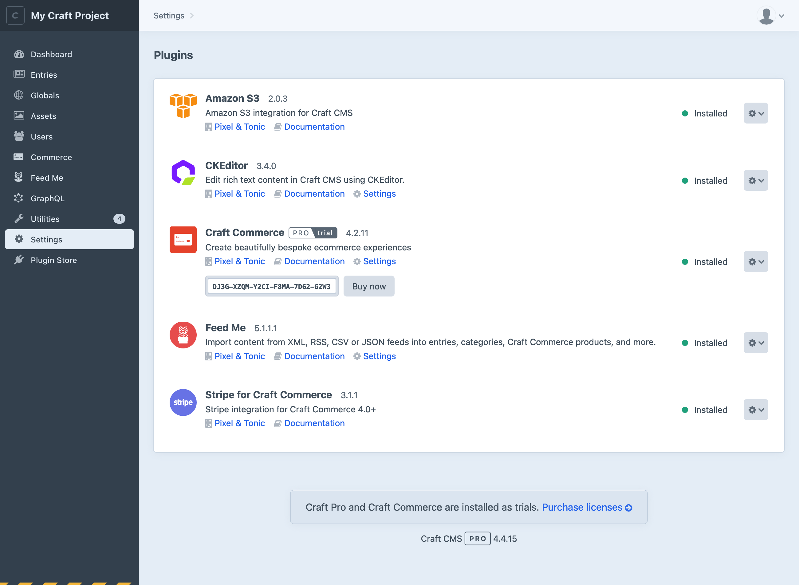
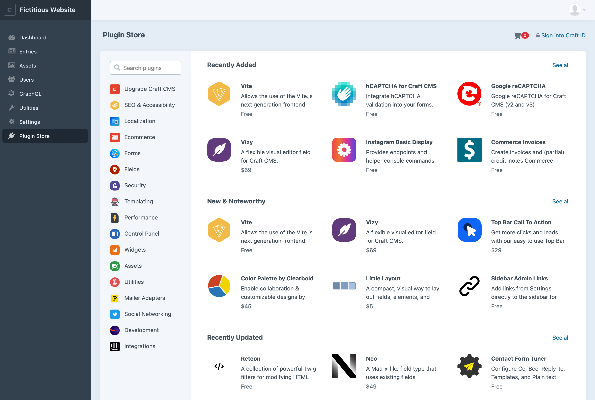
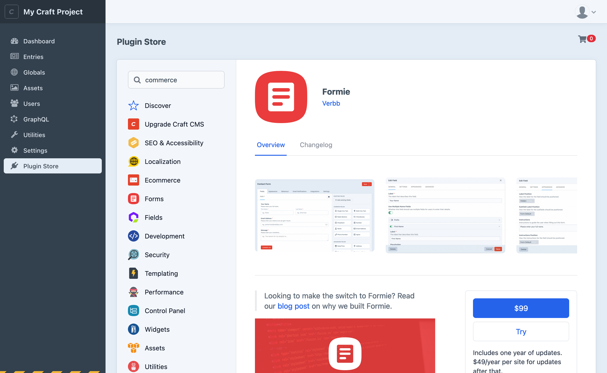

# Plugins

Plugins extend Craft’s core functionality. They can introduce new dashboard widgets, field types, control panel sections, Twig features, workflow actions, third-party integrations, and more.

<BrowserShot
  url="https://my-craft-project.ddev.site/admin/settings/plugins"
  caption="Viewing available and installed plugins via the Craft control panel.">

</BrowserShot>

### What’s a Plugin?

A plugin is a software package that supplements or alters Craft’s internal functionality. Under the hood, plugins are a superset of [Yii modules](guide:modules), an opinionated collection of models, controllers, services, and other system components. This gives Craft plugins a strong design foundation, in turn providing a reliable and consistent experience for developers and users.

Every plugin is a Composer package, meaning they must be “required” by a project’s `composer.json` file before being [installed](#installing-a-plugin). Only plugins required by a project will appear in the screen above—to find _new_ plugins, visit the [Plugin Store](#the-plugin-store)!

::: tip
If you want to build your own plugin, check out [Extending Craft](extend/README.md).
:::

## The Plugin Store

Craft’s [control panel](./control-panel.md) features a [Plugin Store](https://plugins.craftcms.com) where you can discover hundreds of free and commercial plugins, install them with a single click, and purchase licenses.

::: tip
If Craft is configured to [disallow admin changes](config4:allowAdminChanges) in the current environment, you won’t be able to install plugins. We recommend using a [local development environment](installation.md) to install and test plugins, then [deploy](deployment.md) them (and any associated [project config](project-config.md) changes) to your live site.
:::

To access the Plugin Store from the control panel, click **Plugin Store** from the global navigation menu. From there, you can discover new plugins via categories and curated lists.

<BrowserShot
  url="https://my-craft-project.ddev.site/admin/plugin-store"
  caption="The Plugin Store, viewed from the Craft control panel.">

</BrowserShot>

Choose any plugin to learn more about its features, pricing, documentation, version history, and see screenshots of it in action.

<BrowserShot
  url="https://my-craft-project.ddev.site/admin/plugin-store"
  caption="Viewing the Formie plugin from the Craft control panel’s built-in Plugin Store.">

</BrowserShot>

The Plugin Store will only show plugins that are compatible with the version of Craft you are viewing it from. If you would like to view plugins for _any_ Craft version, visit [plugins.craftcms.com](https://plugins.craftcms.com).

## Installing a Plugin

Any compatible plugin can be installed by visiting its page in the control panel’s Plugin Store and clicking one of the **Try** or **Install** buttons in the sidebar.

### Via the Plugin Store

Free plugins can be installed by choosing **Install** from the plugin’s detail page. You’ll be taken to the plugin installer page, which will keep you updated with Craft’s status as it works through the installation.

Plugins that require a paid license can be _trialed_ by choosing **Try** from the plugin’s detail page—this button appears in place of the **Install** button for free plugins.

When you install a paid plugin, you will immediately be issued a license key—but you are not required to pay while evaluating plugins in a development environment.

### Via the Composer

You may also install plugins with [Composer](https://getcomposer.org), by copying and pasting the commands from the **Installation Instructions** toolbox on its page in the Plugin Store. The command is actually two steps (but combined into one for convenience):

1. Require the plugin’s package, and allow dependencies to be updated (`-w`):

    ```bash
    composer require craftcms/commerce -w
    ```

2. Use [Craft’s CLI](console-commands.md#plugin-install) to install the plugin by its **handle**, and run any migrations:

    ```bash
    php craft plugin/install commerce
    ```

    (A plugin’s **handle** is provided in the installation command, and appears as the last segment in its Plugin Store URL.)

## Uninstalling a Plugin

To uninstall a plugin, follow these steps:

1. Navigate to **Settings** &rarr; **Plugins** in the control panel;
1. Click the settings icon <Icon kind="settings" /> for the plugin you wish to remove;
1. Select **Uninstall** from the dropdown menu;

To completely scrub a plugin from your project, you must also remove the Composer dependency:

```bash
composer remove craftcms/commerce
```

::: danger
Do not remove a plugin package with Composer _before_ uninstalling it from the control panel or with Craft’s CLI. Many plugins include special migrations that perform essential database cleanup, and that is only possible if the source code remains at the time it is uninstalled.

This may require a multi-step deployment to ensure plugins are safely removed:

1. Uninstall the plugin from the control panel or via the CLI;
1. Commit and deploy the resulting project config changes;
1. Remove the underlying package from `composer.json`;
1. Commit and deploy your updated `composer.lock`;
:::

You can also uninstall a plugin with Craft’s CLI, using its handle:

```bash
php craft plugin/uninstall commerce
```

Keep in mind that using the CLI to uninstall a plugin does not remove the Composer dependency! You must still follow the directions above to fully remove the plugin package.

## Disabling a Plugin

Plugins may be temporarily _disabled_ from the control panel or CLI:

```bash
php craft plugin/disable commerce
```

A disabled plugin is still _installed_ (its configuration, database tables, and source code remain in place), but its code is not loaded, and to the rest of the system it appears as though it is _not_ installed. Disabling a plugin that has a control panel section will cause it to disappear—but it will remain in the **Settings** &rarr; **Plugins** section so it can be re-enabled.

## Plugin Licensing

Plugins are licensed separately from Craft, but track which Craft license they are associated with.

### Buying Plugins

If you’ve tried a commercial plugin and are ready to purchase a license, you have a few options.

::: tip
This is a perfect time to set up an [organization](kb:craft-console-organizations) in Craft Console. Organizations simplify the process of approving license purchases and organizing keys.
:::

#### Reminders <Since ver="4.4.15" feature="Rich license reminders" />

At the bottom of every page in the [control panel](control-panel.md), Craft provides a summary of the installed software, and will alert you if there are any unpaid licenses. This is _not_ an indication that you are in violation of licensing terms, or owe money—it’s just our way of letting you know what currently-active plugins you _will_ need to pay for when your site launches.


Click **Purchase licenses** to add the required licenses to your cart on Craft Console. You may also copy the URL and send it to a coworker or client—it contains all the information we need to properly connect the license keys with your installation!

::: tip
If you see a red banner at the _top_ of the control panel, you may be running versions of plugins that a previously-paid license does not cover—say, as a result of Composer updating a package beyond what its license allows.

[This article](kb:how-craft-licenses-and-renewals-work) has more info about how we determine what versions of Craft (or plugins) a license covers.
:::

#### Plugin Store

From the control panel Plugin Store, choose the cart icon <Icon kind="cart" /> in the header area. Your unpaid plugin licenses will be listed in the cart’s **Active Trials** section. Choose **Add to cart** to add the plugin to your cart and proceed with checkout.

Once you’ve completed the checkout process, your plugin installation will automatically become licensed.

::: tip
If you purchase a plugin license separately from a Craft install or need to update a license key, visit **Settings** → **Plugins** in the relevant site’s control panel. From that listing, you can enter a new key or [variable](config/README.md#control-panel-settings) for any commercial plugin.


:::

### Managing Plugin Licenses

You can manage all your plugin licenses from [Craft Console](https://console.craftcms.com/) account, by navigating to **Licenses** → **Plugins** within your personal account, or any [organization](kb:craft-console-organizations) you are a member of.

If you don’t have a Craft Console account yet, create one by visiting [console.craftcms.com/register](https://console.craftcms.com/register).

#### Claiming Licenses

When you register for Craft Console, we will automatically attach licenses purchased prior to the introduction of Craft ID (Craft Console’s predecessor) that match the email address you use.

If you can’t find a plugin license, visit **Licenses** → **Claim License**. You can enter its license key manually, or if you know the email address that was used for purchase, you can enter it in the **Claim licenses by email address** section. After verifying ownership of the email address, any unclaimed licenses associated with that email address will be added to your account.

### Safeguarding Plugin License Keys

By default, your plugin license key will be stored in the database and the [project config](project-config.md). If you wish, you may move that license key to a [PHP constant or environment variable](config/README.md#control-panel-settings) and set the key using the `$MY_PLUGIN_KEY` syntax.

Similarly, you can set Craft’s license key via the special `CRAFT_LICENSE_KEY` environment variable.

License keys are not sensitive in and of themselves. As long as a key is associated with a Craft Console account, it cannot be used by another Craft installation or claimed by another Console account. Therefore, it is perfectly acceptable to track Craft (`license.key`) and plugin keys (project config) in version control.

### Transferring Plugin Licenses

To authorize transfer of a plugin license to someone else’s Craft Console account, log into your Craft Console account, choose the license under **Licenses** → **Plugins**, and choose the **Release License** to release it from your account. Another person will then be able to claim the license for themselves from the **Licenses** → **Claim License** page of their Craft Console account.

::: tip
You may also transfer a license directly to an organization you are a member of.
:::

### Commercial Plugin Licensing

The Plugin Store requires that all commercial plugins follow Craft’s licensing model. This ensures licensing is safe and predictable for customers, while supporting a sustainable business model for plugin developers.

- They are free to try in development environments, but require payment to be used in production environments;
- Commercial licenses are a one-time fee per Craft installation, which comes with access to updates for one year after purchase;
- Additional updates can be available with an annual update fee;
- Licenses can be returned for a full refund within 30 days of purchase, no questions asked;

Additionally, all plugins in the Plugin Store must use either the [MIT License](https://opensource.org/licenses/MIT) or the [Craft License](https://craftcms.github.io/license/). Generally, free plugins will use the MIT License, and commercial plugins will use the Craft license.

## Plugin Support

Developer support is a specific service we include with Craft Pro licenses, but we do not require plugin developers to provide the same level of support for their plugins—free _or_ commercial. You will need to check with each developer to learn about their support policies, so you and your clients know what to expect.

::: tip
Sometimes, issues with plugins can be caused by temporary or permanent issues with external services. While we understand that this can be extremely frustrating, a plugin’s developer may have no control over the availability or reliability of those services.
:::

If you feel that a plugin vendor isn’t providing a reasonable level of support for a commercial plugin license, please let us know by emailing <support@craftcms.com> with the name of the plugin, a description of your original issue, and a summary of any attempts to resolve directly with the developer.
