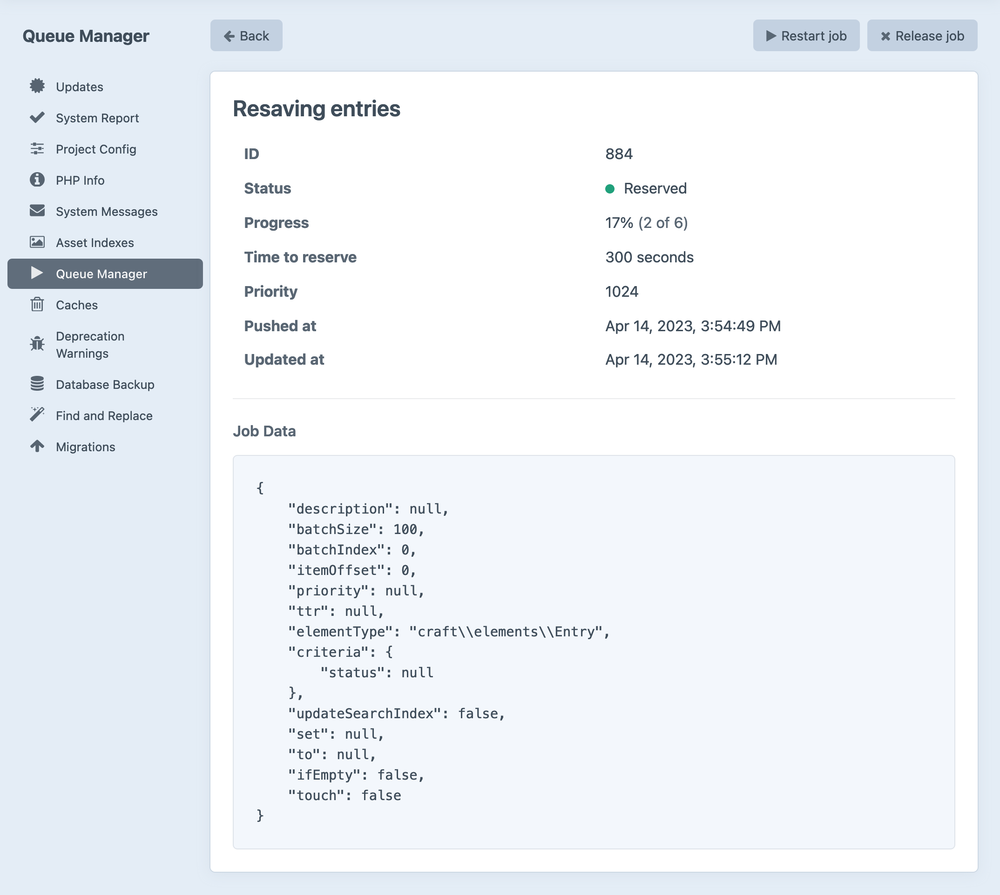

# Queue

The **queue** is Craft’s way of delegating certain long-running tasks to an asynchronous background process.

In most cases, these tasks are either too time-consuming, resource-intensive, or error-prone to handle during a normal HTTP request-response cycle, without significant impacts on responsiveness and user experience in the [control panel](control-panel.md) or front-end.

Here are a few of the things Craft uses the queue for:

- Updating search indexes;
- Resaving elements in bulk;
- Generating image transforms;
- Propagating elements between sites;
- Executing a **Find and Replace** operation across all site content (started via Utilities);

Users with the **Queue Manager** [permission](user-management.md#permissions) can view information about the queue from the [Utilities](control-panel.md#utilities) section of the control panel. The status of any currently-running job (or the last failed job) will also be displayed at the bottom of the main navigation.

## Jobs

Each message in the queue is called a **job**. Jobs have a type (corresponding to the kind of work that will happen when it is executed) and often include additional data that helps define their scope—sometimes to a specific element (like when updating the [search](searching.md) index) or a set of elements (like when resaving entries after a section’s settings have changed).

Jobs will enter and clear the queue naturally, as you use Craft. In the unlikely event a job fails, it will remain visible in the Queue Manager until it is retried or released. You can view more information about a failed job by clicking its description in the table.

<BrowserShot
    url="https://my-craft-project.ddev.site/admin/utilities/queue-manager/884"
    :link="false"
    caption="Viewing a job in the queue manager utility.">

</BrowserShot>

::: tip
Plugins can take advantage of the queue by providing custom [job types](extend/queue-jobs.md)!

[Commerce](../commerce/4.x/README.md), for example, uses the queue to send order emails so that a customer’s checkout experience is not disrupted by esoteric mailer errors.
:::

### Statuses

New jobs enter the queue in a **waiting** state. Once a runner picks up the job, it will be marked as **reserved** and Craft will attempt to execute it. Depending on the type of job, it may be allowed a certain number of “attempts” (temporary failures) or an overall “TTR” (time to reserve). If a job exhausts its attempts or runs out of time, it will be marked as **failed**.

Failed jobs can be retried from the control panel, or with the [CLI](console-commands.md#queue-release). While additional _attempts_ are made automatically after a failure, _retries_ must be triggered manually.

In addition to a status, jobs also have **description** and a **progress** value, both of which may be updated throughout its life. Jobs that handle large datasets typically report progress after each item processed (like when resaving elements), or are sliced into smaller batches.

## Queue Runners

By default, the queue is run automatically over [HTTP](#http). For more control, you can use Craft’s CLI via [CRON](#cron)—or even as a [daemonized service](#daemon).

::: tip
Advanced configuration of the queue (including alternate [drivers](repo:yiisoft/yii2-queue/tree/master/docs/guide#queue-drivers) and proxies) is possible via [application config](config/app.md#queue).
:::

### HTTP

At the end of every site request, Craft checks whether the queue contains waiting jobs. If it does, a JavaScript snippet is injected into the page, triggering a second request from the client that kicks off a non-blocking background process. This is skipped for [Ajax requests](dev/controller-actions.md#ajax), and responses that produced something other than HTML.

::: tip
This behavior is enabled by default, but can be turned off by setting <config4:runQueueAutomatically> to `false`. If you elect to disable the automatic queue runner, you must configure an alternative.
:::

For control panel requests, the JavaScript bundle included on every page performs a similar request—this is also how Craft is able to display the queue’s status in the sidebar!

### CLI

All Craft features will work as expected with the default queue configuration.

::: warning
The following options are configured outside of Craft, and are only recommended for users with some unix systems administration experience. Check with your host to see if they offer native tools for managing services and CRON tasks.
:::

Projects that rely on the queue for time-sensitive or critical features (like sending [order status emails](../commerce/4.x/emails.md) in Commerce) can take advantage of Craft’s [CLI](console-commands.md#queue) for more flexibility over when and where the queue is run:

```bash
php craft queue/run
```

Let’s look at some examples of how this can be used in different scenarios.

#### CRON

The `queue/run` action is suitable for manual or scheduled invocation. For example, if you wanted to process the queue every five minutes, you might add this to your system’s `crontab`:

```
*/5 * * * * /usr/bin/env php /var/www/craft queue/run
```

::: tip
Note that we’re using an absolute path to the Craft installation. CRON’s “working directory” will likely be different than your user’s home directory or your web root!
:::

If your site frequently generates many “expensive” tasks (like transforming images or resaving entries) or tasks that communicate with other web services, make sure your CRON intervals don’t end up overlapping. Just like web requests, running many concurrent jobs in different processes can cause them all to slow down—but even if intervals _do_ overlap, Craft will never execute reserved jobs in more than one place.

#### Daemon

A “daemonized” queue runner can be registered with most unix-based systems so that the queue operates like other system services—MySQL or Redis, for example. Configuration will depend on the service manager your platform uses (likely `systemd` or `supervisor`), but should follow a similar structure, and will ultimately use the long-running `queue/listen` command:

```bash
php craft queue/listen --verbose
```

Whereas `queue/run` runs only until the queue is empty, `queue/listen` continually polls the database for new jobs, exiting only when terminated.

The `--verbose` flag tells Craft to write some basic information about the queue’s state to `stdout`. Running this from the command line (locally, or via SSH on a remote server) will output a message when the worker successfully initializes, and a message each time a job starts and finishes.

Let’s look at some configuration, in practice. The following examples are adapted from the underlying [Yii queue component](repo:yiisoft/yii2-queue/blob/master/docs/guide/worker.md) documentation:

::: code
``` systemd
# /etc/systemd/system/craft-queue-worker@.service
# Note the @ in the filename above!

[Unit]
Description=Craft CMS Queue %i
After=network.target
After=mysql.service
Requires=mysql.service
# (...or postgresql.service!)

[Service]
# User + Group should agree with HTTP processes:
User=www-data
Group=www-data
ExecStart=/usr/bin/php /var/www/craft queue/listen --verbose=1 --color=0
# Only restart after unexpected failures:
Restart=on-failure
# Extend time between restart attempts after a failure:
RestartSec=120

[Install]
WantedBy=multi-user.target
```
``` supervisor
; /etc/supervisor/conf.d/craft-queue-worker.conf

[program:craft-queue-worker]
; Use the process number in its name (required when using `numprocs`):
process_name=%(program_name)s_%(process_num)02d
numprocs=4
command=/usr/bin/php /var/www/craft queue/listen --verbose=1 --color=0
; User + Group should agree with HTTP processes:
user=www-data
group=www-data
```
:::

::: warning
Long-running processes must be restarted to pick up code and schema changes after a deployment or migration!

To register your newly created service, the process manager itself may need to be restarted, or specifically told to look for new configuration.
:::

Your process manager also has commands for interacting with the service:

::: code
```bash systemd
# Install hooks to run a single worker on boot:
sudo systemctl enable craft-queue-worker

# Start a worker:
sudo systemctl start craft-queue-worker

# Get the worker’s status:
sudo systemctl status craft-queue-worker

# Stop a worker:
sudo systemctl stop craft-queue-worker
```
```bash supervisor
# Enter the supervisor command line utility:
sudo supervisorctl

# Tell supervisord there is a new configuration available:
sudo supervisorctl reread

# Apply new configuration changes and restart affected services:
sudo supervisorctl update
```
:::

::: tip
While `supervisor` stores the number of processes spawned for a given service as part of its configuration, `systemd` requires you to declare those instances when using the `systemctl` command:

```bash
# Install four instances of a service:
sudo systemctl enable craft-queue-worker@{1..4}

# Start those instances:
sudo systemctl start craft-queue-worker@{1..4}

# Get the status for any matching instances:
sudo systemctl status "craft-queue-worker@*"

# Restart any matching instances:
sudo systemctl restart "craft-queue-worker@*"
```

This is possible due to the `@` symbol at the end of our service unit file’s name. Note that the bash “range” syntax (`{1..4}`) is _not_ surrounded by quotes, but the “glob” patterns (`*`) _are_. This is critical for the system to be able to expand and map the commands to the appropriate service instances(s).
:::

These setup instructions ensure your service is started whenever the host machine is rebooted, but it’s important to check your work! If your host allows, consider manually rebooting your machine and verifying that the queue is active.

::: warning
When configuring and testing a daemonized queue runner, disable <config4:runQueueAutomatically>. Leaving this on may give the false impression that the queue is working as intended, despite it actually being run over HTTP.
:::

#### Workers

Some <abbr title="Platform-as-a-Service">PaaS</abbr> solutions like Heroku and Digital Ocean support dedicated background services. These workers are typically built from the same base “image,” but rather than running an HTTP server (or being connected to the public internet at all), they execute a provided command—just like the [daemonized](#daemon) runner, above.

This paradigm can be bizarre at first, but it’s similar in many ways to load-balancing—in order to work, shared resources (like the database, cache, and asset storage) must be accessible from each web server and worker. Craft will automatically divide jobs among multiple workers, so applications that make heavy use of the queue (say, to process user-uploaded images) can be scaled appropriately, independent of the front-end.

#### Performance Considerations

Running the queue on the same machine that serves HTTP requests can (in extreme cases) cause bottlenecks. The CLI does not abide by the same [resource](config4:phpMaxMemoryLimit) or [time](https://www.php.net/manual/en/info.configuration.php#ini.max-execution-time) limits as web requests, meaning it can degrade or interrupt service for much longer.

To ensure web requests are prioritized, the unix program `nice` can help the kernel schedule workloads on your server’s CPU(s). Replace the queue command in your [daemon](#daemon) with this:

```bash
/usr/bin/nice -n 10 /usr/bin/php /var/www/craft queue/listen --verbose=1 --color=0
```

Here, `-n 10` just signals that the process should be a _lower_ priority than the default (`0`). Negative values (_increased_ priority) are not allowed, and `19` is the lowest valid priority. `nice` can also be used in a CRON task, by swapping the `queue/listen` action for `queue/run` as in previous examples.

::: danger
Do not run the queue as root!
:::

## Local Development

If you’ve turned off <config4:runQueueAutomatically> for your live infrastructure, the queue will also be disabled in your local environment. You can [override](config/README.md#environment-overrides) the general config setting by declaring `CRAFT_RUN_QUEUE_AUTOMATICALLY=true` in your `.env`, or use the [CLI](#cli) as you would in a [daemon](#daemon):

::: code
```bash DDEV
ddev craft queue/listen --verbose
```
```bash Other
php craft queue/listen --verbose
```
:::

## Troubleshooting

See the knowledge base article on [Resolving Failed Queue Jobs](kb:resolving-failed-queue-jobs) for a list of common queue problems.
