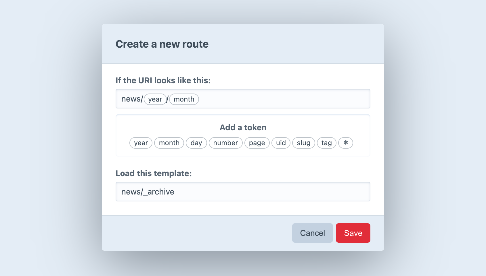

# Routing

Routing is the process by which Craft directs incoming requests to specific content or functionality.

Understanding Craft’s high-level approach to routing can help you troubleshoot template loading, plugin action URLs, dynamic routes, and unexpected 404 errors. While this list is an abstraction, it represents the order of Craft’s internal checks:

0. **Should Craft handle this request in the first place?**

    It’s important to keep in mind that Craft doesn’t get involved for *every* request that touches your server—just those that go through your `index.php`.

    The `.htaccess` file that [comes with Craft](https://github.com/craftcms/craft/blob/master/web/.htaccess) will silently send all requests that don’t match a directory or file on your web server via `index.php`. But if you point your browser directly at a file that *does* exist (such as an image, CSS, or JavaScript file), your web server will serve that file directly without loading Craft.

1. **Is it an action request?**

    [Action requests](./dev/controller-actions.md) either have a URL that begins with `actions/` (or whatever your <config4:actionTrigger> config setting is set to), or an `action` parameter in the POST body or query string. Every request Craft handles is ultimately routed to a controller action, but explicit action requests take precedence and guarantee that essential features are always accessible. If you look at your browser’s _Network_ tab while using the control panel, you’ll see a lot of action requests.

2. **Is it an element request?**

    If the URI matches an element’s URI, Craft lets the element decide how to route the request. For example, if an [entry](entries.md)’s URI is requested, Craft will render the template specified in its section’s settings, automatically injecting an `entry` variable.

    Whenever an element is saved, its URI is rendered and stored in the `elements_sites` database table.

    ::: tip
    Modules and plugins can re-map an element’s route to a different controller using the [EVENT_SET_ROUTE](craft4:craft\base\Element::EVENT_SET_ROUTE) event.
    :::

3. **Does the URI match a route or URI rule?**

    If the URI matches any [dynamic routes](#dynamic-routes) or [URI rules](#advanced-routing-with-url-rules), the template or controller action specified by it will get loaded.

4. **Does the URI match a template?**

    Craft will check if the URI is a valid [template path](dev/README.md#template-paths). If it is, Craft will render the matched template.

    ::: tip
    If any of the URI segments begin with an underscore (e.g. `blog/_archive/index`), Craft will skip this step.
    :::

5. **404**

    If none of the above criteria are met, Craft will throw a [NotFoundHttpException](yii2:yii\web\NotFoundHttpException).

::: warning
If an exception is thrown at any point during a request, Craft will display an error page instead of the expected content.

If [Dev Mode](config4:devMode) is enabled, an error report for the exception will be shown. Otherwise, an error will be returned using either your [custom error template](#error-templates) or Craft’s own default.
:::

## Dynamic Routes

In some cases, you may want a URL to load a template, but its location in your `templates/` folder doesn’t agree with the URI (therefore bypassing step #4), or the URI itself is dynamic.

A good example of this is a yearly archive page, where you want a year to be one of the segments in the URL (e.g. `blog/archive/2018`). Creating a static route or template for every year would be impractical—instead, you can define a single route with placeholders for dynamic values:



### Creating Routes

To create a new Route, go to **Settings** → **Routes** and choose **New Route**. A modal window will appear where you can define the route settings:

- What should the URI look like?
- Which template should get loaded?

The first setting can contain “tokens”, which represent a range of possible matches, rather than a specific string. (The `year` token, for example, represents four consecutive digits.) When you click on a token, Craft inserts it into the URI setting wherever the cursor is.

If you want to match URIs that look like `blog/archive/2018`, type `blog/archive/` into the URI field and choose the `year` token.

::: tip
Route URIs should _not_ begin with a slash (`/`).
:::

After defining your URI pattern and entering a template path, press **Save**. The modal will close, revealing your new route on the page.

When you point your browser to `https://my-project.tld/blog/archive/2018`, it will match your new route, and Craft will load the specified template with value of the `year` token automatically available in a variable called `year`:

```twig
{# Fetch posts in the specified `year`: #}



  <article>
    <h2>{{ post.title }}</h2>
    {{ post.description | md }}
    <a href="{{ post.url }}">{{ 'Read More' | t }}</a>
  </article>

```

::: tip
Routes automatically support [pagination](./dev/tags.md#paginate), so this one route covers other URIs like `/blog/archive/2018/page/2` (assuming your <config4:pageTrigger> was `page/`). If you wanted to break the archive into smaller logical chunks, you could use additional [tokens](#available-tokens) to collect results by month—or even by day!
:::

### Available Tokens

The following tokens are available to the URI setting:

- `*` – Any string of characters, except for a forward slash (`/`)
- `day` – Day of a month (`1`-`31` or `01`-`31`)
- `month` – Numeric representation of a month (1-12 or 01-12)
- `number` – Any positive integer
- `page` – Any positive integer
- `uid` – A v4 compatible UUID (universally unique ID)
- `slug` – Any string of characters, except for a forward slash (`/`)
- `tag` – Any string of characters, except for a forward slash (`/`)
- `year` – Four consecutive digits

::: tip
If you define a route using a wildcard token (`*`) in the control panel, it will automatically be available as a named parameter called `any`.


The template for `my-project.tld/foo/some-slug` could then use `{{ any }}`:

```twig
It seems you’re looking for `{{ any }}`.
{# output: It seems you’re looking for `some-slug`. #}
```
:::

## Advanced Routing with URL Rules

In addition to routes defined via the control panel, you can define [URL rules](guide:runtime-routing#url-rules) in `config/routes.php`.

```php
return [
  // Route blog/archive/YYYY to a controller action
  'blog/archive/<year:\d{4}>' => 'controller/action/path',

  // Route blog/archive/YYYY to a template
  'blog/archive/<year:\d{4}>' => ['template' => 'blog/_archive'],
];
```

If your Craft installation has multiple sites, you can create site-specific URL rules by placing them in a sub-array, and set the key to the site’s handle. Craft will take care of determining the site’s base URL via this handle, so you don't need to declare it as part of the route.

```php
return [
  'siteHandle' => [
    'blog/archive/<year:\d{4}>' => 'controller/action/path',
  ],
];
```

A subset of the [tokens](#available-tokens) above can be used within the regular expression portion of your [named parameters](guide:runtime-routing#named-parameters):

- `{handle}` – matches a field handle, volume handle, etc.
- `{slug}` – matches an entry slug, category slug, etc.
- `{uid}` – matches a v4 UUID.

```php
return [
  // Be aware that URIs matching an existing element route will be picked up by step #2, above!
  'blog/<entrySlug:{slug}>' => 'controller/action/path',
];
```

### Accessing Named Parameters in your Templates

URL rules that route to a template (`['template' => 'my/template/path']`) will pass any named parameters to the template as variables—just like CP-defined routes. For example, this rule…

```php
'blog/archive/<year:\d{4}>' => ['template' => 'blog/_archive'],
```

…will load `blog/_archive.twig` with a `year` variable set to `2022` when requesting `https://my-project.tld/blog/archive/2022`.

```twig
<h1>Blog Entries from {{ year }}</h1>
```

### Accessing Named Parameters in your Controllers

Named route parameters are automatically passed to matching [controller](./extend/controllers.md) action arguments.

For example, this URL rule…

```php
'comment/<postId:\d+>' => 'my-module/blog/comment',
```

…would match the numeric ID in the route to the `$id` argument of this custom controller action:

```php
namespace modules\controllers;

use craft\elements\Entry;
use craft\web\Controller;

class BlogController extends Controller
{
  /**
   * Create a comment for the specified blog post ID.
   * 
   * @param int $postId Blog Post ID defined by route parameters.
   */
  public function actionComment(int $postId)
  {
    $this->requirePostRequest();

    // Use the ID to look up the entry...
    $entry = Entry::find()
      ->section('posts')
      ->id($postId)
      ->one();

    // ...and grab the comment content from the request:
    $comment = Craft::$app->getRequest()->getBodyParam('comment');

    // ...
  }
}
```

This rule only serves as an alias to the controller action, which will always be directly accessible via an [action request](./dev/controller-actions.md)—in this case by using the [`actionInput()`](./dev/functions.md#actioninput) function:

```twig
<form method="post">
  {{ csrfInput() }}
  {{ actionInput('my-module/blog/comment') }}
  {{ hiddenInput('postId', entry.id) }}

  <textarea name="comment"></textarea>

  <button>Post Comment</button>
</form>
```

## Error Templates

You can provide your own error templates for Craft to use when returning errors on the front end.

When an error is encountered, Craft will look for a template in your `templates/` directory, in the following order:

1. A template matching the error’s status code, like `404.twig`.
2. For a 503 error, a template named `offline.twig`.
3. A template named `error.twig`.

::: tip
You can tell Craft to look for the error template in a nested template directory, using the <config4:errorTemplatePrefix> config setting.
:::

If Craft finds a matching error template, it will render it with the following variables:

- `message` – error message
- `code` – exception code
- `file` – file that threw the exception
- `line` – line in which the exception occurred
- `statusCode` – error’s HTTP status code

::: tip
Custom error templates are only used when [Dev Mode](config4:devMode) is **disabled**. When it’s enabled, an exception view will be rendered instead.
:::
