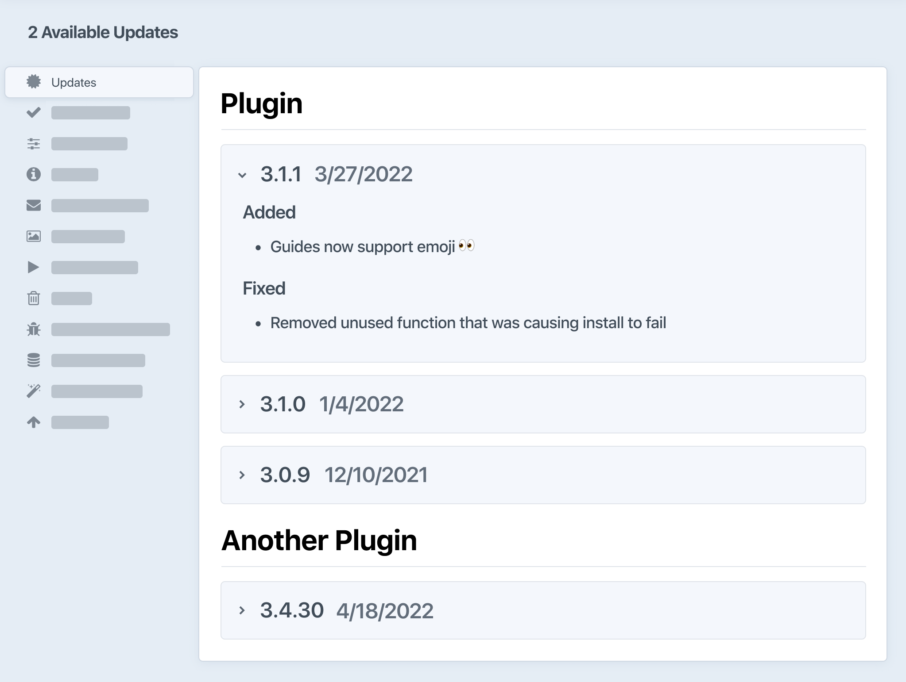

# Running Updates

Craft has a smart system based on [Composer](https://getcomposer.org) that helps you keep your site and plugins up-to-date.

## Using the Control Panel

When an update is available, users with the permission to update Craft will see a badge in the [control panel](./control-panel.md) next to **Utilities** in the global navigation:


Click **Utilities** → **Updates**. (You can also get to this view directly from the **Updates** widget that’s installed by default in the control panel dashboard.)

This section displays updates for Craft CMS and installed plugins, where each version has its own collapsible panel detailing relevant changes.



There may be an **Update** button next to each item and an **Update All** at the top of the screen, depending on your the <config4:allowUpdates> and <config4:allowAdminChanges> settings for your current environment. You can use those to initiate updates directly from the control panel.

::: tip
Craft’s [changelog](repo:craftcms/cms/blob/main/CHANGELOG.md) will warn you of any critical changes at the top of the release notes. While there aren’t usually any warnings, it’s always a good idea to check the changelog and [any upgrade guides](#upgrade-guides) before updating.
:::

After Craft successfully installs updates, it will run any new migrations.

## Updating from the Terminal

### Craft CLI

The [`update` console command](console-commands.md#update) can be used to update Craft and plugins.

To see available updates, go to your Craft project in your terminal and run this command:

```bash
php craft update
```


To update everything all at once, run this command:

```bash
php craft update all
```

To apply a specific update, replace `all` with `craft` (to update Craft itself) or a plugin’s handle:

```bash
php craft update commerce
```


You can pass multiple handles in at once:

```bash
php craft update commerce element-api
```

Craft will install the latest available version(s), unless you append `:<version>` to the handle:

```bash
php craft update element-api:2.7.0
```

After an update is performed from the CLI, Craft will apply any relevant migrations.

### Composer

`craft update` is mostly a wrapper around Composer—but you can use Composer directly for more control over the update process.

The main behavioral difference is that `craft update` will always set _specific_ Craft and plugin versions (like `4.3.6` or `1.2.3`), whereas Composer allows you to use [version _constraints_](https://getcomposer.org/doc/articles/versions.md)  (like `^4.3.0` or `^1.0.0`) to define dependencies.

When using version constraints, `composer.lock` will still make sure you get a stable set of packages from `composer install`. To update all your packages to the most recent versions allowed by their constraints, run `composer update`. Update a _single_ package by specifying it in the command: `composer update craftcms/craft`.

::: tip
If you have used the Craft CLI in the past, `composer update` may do nothing!

Open `composer.json`, and look at the packages under the `require` key—if you see exact version numbers, Composer will never update those packages.
:::

Keep in mind that manually altering constraints _can_ lead to an irreconcilable set of packages—Composer will let you know about this before updating the lockfile. Generally speaking, the “major-version” constraints set automatically when using `composer require` should continue to work, while protecting your project from breaking changes in dependencies.

## Workflow

Every time you [deploy](./deployment.md) your project, you should run `composer install` and `craft up` to bring that environment’s database into agreement with your packages and their expected schema version.

The same applies when working with teammates! Any time you pull new code into a project, running `composer install` will guarantee you are working with the same set of packages as your collaborators. If you’re one for automation, you can even have Craft apply migrations and [project config](./project-config.md) at the same time by adding a special hook to the `scripts` key in `composer.json`:

```json{9}
{
    "require": {
        "craftcms/cms": "^4.0.0",
        "vlucas/phpdotenv": "^5.4.0"
        // ...
    },
    // ...
    "scripts": {
        "post-install-cmd": "@php craft install/check && php craft up --interactive=0 || exit 0"
    }
}
```

This tells Composer that _after_ it has successfully installed packages from a lockfile (typically the result of running `composer install`), it should check if Craft is installed (`@php craft install/check`) and if so, run `craft up` non-interactively to apply migrations and project config. `|| exit 0` ensures that the command exits nominally, so as not to disrupt other processes that expect `composer install` to succeed.

## Licensing

When you buy a Craft Pro or plugin license, you are entitled to use that version in perpetuity—or any version that you update to, during the year of included updates. To get the most out of your Craft licenses, run updates frequently!

## Upgrade Guides

Sometimes, there are significant changes to be aware of—even in minor versions. In these (rare) cases, we publish a guide in the [Knowledge Base](kb:development), and list it here.

The most common changes that fits this criteria are deprecated features. Notices will be accompanied by instructions for updating your code to work with the new APIs. Any features that are subsequently removed in a major release will also be noted in the new version’s upgrade guide.

Deprecation warnings will affect plugin developers more frequently than regular users—but it’s still a good idea to keep your eye on the **Deprecation Warnings** utility.
