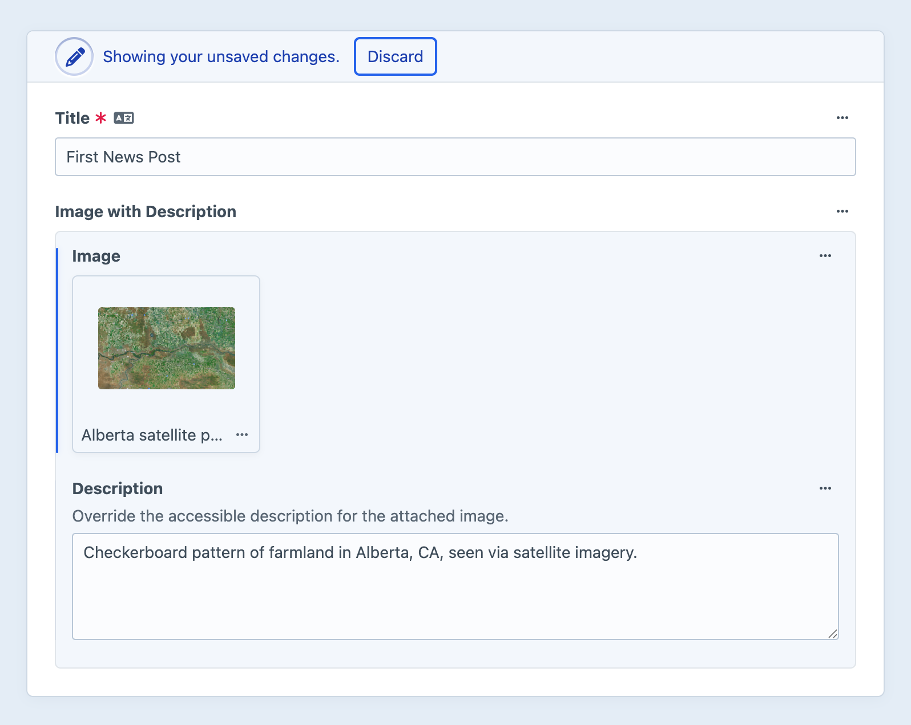
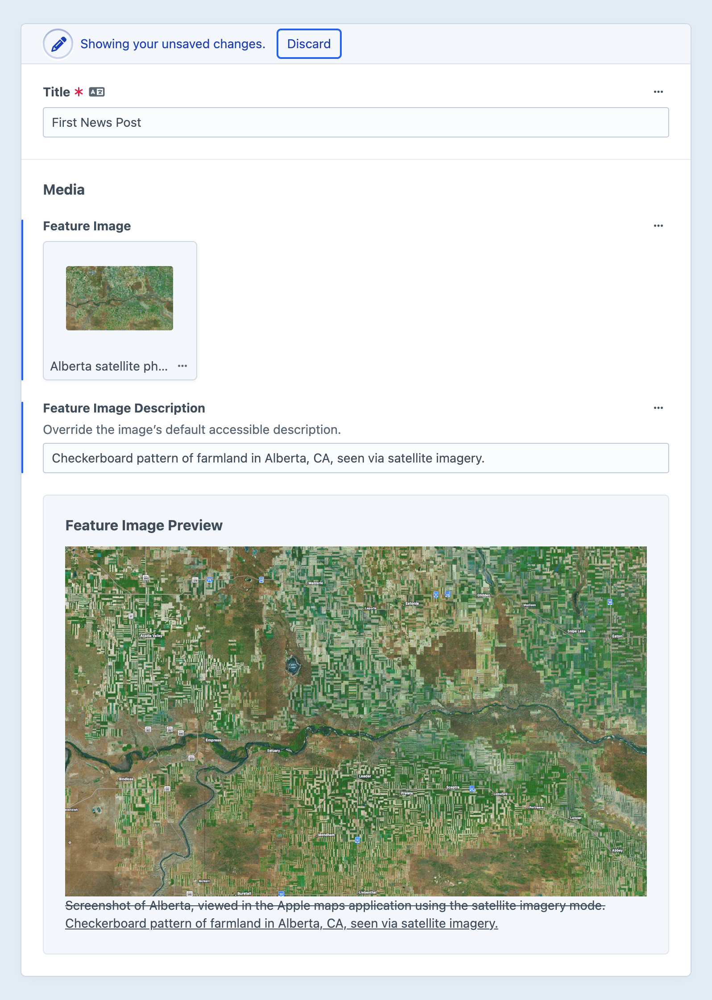

# Accessibility

Websites and applications are used by people (and machines!) with a wide variety of capabilities.
Craft gives you a powerful suite of tools to help make your projects <Term slug="accessibility" label="accessible" /> to everyone.

<!-- more -->

Let’s begin by looking at some key authoring features.

## Control panel

Craft’s [control panel](../system/control-panel.md#accessibility) is [designed and built to be accessible](https://craftcms.com/accessibility), out-of-the-box.
In addition to built-in interfaces, the content tools you configure for authors are backed by components that we [regularly audit](https://craftcms.com/accessibility/reports) for conformance.

### Image editor

The built-in image editor features a number of keyboard-accessible adjustments. <Since ver="5.9.0" feature="A keyboard-accessible image editor" />

From the right sidebar on an [asset](../reference/element-types/assets.md)’s edit screen, find the **Edit image** button.
A modal will open, with tabs for [**Rotate**](#rotation) and [**Crop**](#cropping).

::: tip
If you can’t find the **Edit image** button, the asset may not be transformable on the current system.
This may be due to the file type (i.e. `PDF`), or your [image driver](../requirements.md).
:::

#### Rotation

Images can be rotated 90&deg; clockwise (**Rotate Right**) or counter-clockwise (**Rotate Left**), flipped vertically and horizontally, or “straightened” in increments of 1&deg; using the **Rotate** slider.

Use the **Focal Point** button to add a position control to the image.
You can nudge the focal point horizontally or vertically; the value is stored as a proportional coordinate pair, with decimal values between `0` and `1`.
The focal point is used to keep subjects within a transformed image—for example, vertical head-shots attached to staff profiles 

::: tip
Some asset filesystem types ([AWS S3](plugin:aws-s3), in particular) can automatically detect subjects and populate the **Focal Point** attributes.
Combined with [transforms](image-transforms.md), this can help keep subjects in-frame, when assets are used in multiple contexts.
:::

## Media

When marked up appropriately, text the web is inherently accessible.
The same cannot be said for visual media like images, video, and icons; without explicit descriptions or context clues, unsighted users may miss essential content.

### Alternative text

Every asset in Craft has (at minimum) a **Title**, which is generated from its filename on upload.
You can supplement this with the [native **Alternative Text** field](../reference/element-types/assets.md#alt-text) by visiting <Journey path="Settings, Assets, Volumes, *Volume Name" /> and dragging it into the field layout.

Craft uses this field’s value when rendering asset thumbnails in the control panel, and when outputting an image in a Twig template:

::: code
```twig Twig
{{ myAsset.getImg() }}
```
```html Result

```
:::

For more control, you can construct `img` tags yourself.
The `alt` attribute can come from anywhere, or be defined via a series of fallbacks:

```twig

{{ tag('img', {
  class: 'article-thumbnail',
  src: thumb.getUrl(),
  alt: result.thumbnailDescription ?: thumb.alt,
}) }}
```

This example checks a local `thumbnailDescription` [custom field](../system/fields.md) on a `result` entry, and defaults to the `alt` text attached directly to the asset.

<Block label="Decorative Images">

Keep in mind that not _every_ use of an image needs alternative text!
This might be a perfectly acceptable way to handle icons attached to [categories](../reference/element-types/categories.md) or [tags](../reference/element-types/tags.md):

```twig
{# Decorative or “presentational” icon: #}
{{ tag('img', {
  class: 'icon icon--decorative',
  src: myAsset.getUrl(),
  height: myAsset.getHeight(),
  width: myAsset.getWidth(),
  role: 'none',
  aria: {
    hidden: true,
  },
}) }}
```

</Block>

An asset’s `title` is often _not_ the correct source for descriptions—especially when a file is [uploaded directly to an assets field](../reference/field-types/assets.md):

::: code
``` File
# Screenshot:
screenshot_2025-12-31_11-59-59.png

# Photo from digital camera:
IMG_4567.jpg
```
``` Title
# Screenshot:
Screenshot 2025 12 31 11 59 59

# Photo from digital camera:
IMG 4567
```
:::

For this reason, Craft _does not_ fall back to the title in the absence of explicit alternative text.
Below, we cover [a few patterns](#alt-text-overrides) that make alternative text easier to maintain.

#### Rich Text

Inserting an image into a rich text editor may not automatically populate `alt` attributes.

- **[Redactor](plugin:redactor)** — The editor has mislabled this as the image’s **Title**. Select an inserted image and pick **Edit** to open a modal.
- **[CKEditor](plugin:ckeditor)** — Select an inserted image and pick the **Change image text alternative** button to add a description.

Both plugins also support captions, which convert the image into `<figure>` and `<figcaption>` elements.

### Video and captioning

Craft also uses the native `alt` attribute for transcripts on video and audio.
Transcripts are shown when previewing media in the control panel.

There is currently no built-in support for time-based transcripts or closed captioning (in the control panel or front-end), but you are free to implement them via custom fields:

```twig
<video id="player" src="{{ asset.getUrl() }}">

{# Assume `chapters` is a table field: #}
<ul>
  
    
    <li>
      <button data-timestamp="{{ ts }}" title="Seek to {{ ts }} seconds">
        {{ '%d:%02d' | format(ts // 60, ts % 60) }}
      </button>
      {{ chapter.description }}
    </li>
  
</ul>

<script>
  const $video = document.getElementById('player');
  const $chapters = document.querySelectorAll('[data-timestamp]');

  $chapters.forEach(function($chapter) {
    $chapter.addEventListener('click', function(e) {
      $video.currentTime = parseFloat($chapter.dataset.timestamp);
    });
  });
</script>
```

Highlighting or announcing the currently-active chapter or timestamp requires additional scripting.

### Reference tags

The [reference tag](../system/reference-tags.md) parser will call magic “getter” methods, so you can get a complete `` element using a syntax like this:

```
{asset:1234:img}
```

### Markdown

Craft’s Markdown parser supports [image tags](https://daringfireball.net/projects/markdown/syntax#img):

```md

```

You may include a hard-coded URL, or use a [reference tag](#reference-tags) to ensure it remains up-to-date.

## Recipes

### `alt` text overrides

An image may need different descriptions based on its usage.
For example, if you were working with an artist collective, you may have a library of members’ work, with practical or evergreen descriptions… but when an author recycles one of those images for a news post, that description may be confusing.

You have two options for applying local description overrides:

1. **Add a plain text field to the same field layout as your assets field.**  
    When an author populates this field, use that text instead of the asset’s `alt` attribute:

    ```twig
    
    

    {{ tag('img', {
      src: image.getUrl(),
      alt: description,
    }) }}
    ```

1. **Componentize descriptions with a content block.**
    If you wish to implement the same logic on a number of pages, it may make sense to encapsulate it in a [content block field](../reference/field-types/content-block.md):

    

    The content block field can then be accessed as `entry.imageWithDescription`, and the “override” logic is standardized wherever you include it (rather than via novel field handles in each situation):

    ::: code
    ```twig entry.twig
    {# Include this anywhere that uses the `imageWithDescription` content block field: #}
    {{ include('_partials/a11y-image', {
      ctx: entry.imageWithDescription,
    }) }}
    ```
    ```twig a11y-image.twig
    
    {% set description = ctx.description ?: image.alt }}

    {{ tag('img', {
      src: image.getUrl(),
      alt: description,
    }) }}
    ```
    :::

    In this example, `ally-image.twig` doesn’t know (or care) where it was included from—everything it needs to resolve a proper description is available in the passed `ctx` variable, via consistent field handles.

    ::: warning
    Content block fields are single-instance, meaning they can only appear in a field layout _once_.
    However, they _can_ be given new handles, be used in any number of field layouts, and be repeated inside nested entries Matrix field.
    :::

### Accessible previews

You can show authors a final representation of an image (with the resolved alt text) using a **Template** UI [field layout element](../system/fields.md#ui-elements):



The template might look something like this:

```twig


    
    
    

    <div class="pane">
        <h2>Feature Image Preview</h2>
        

        
            {# Use `del` and `ins` when both are present: #}
            
                <del>{{ image.alt }}</del>
                <ins>{{ element.featureImageDescription }}</ins>
            
                <p>{{ element.featureImageDescription }}</p>
            
        
            {# Just surface the original text: #}
            <p>{{ image.alt }}</p>
        
          {# Uh oh! #}
          <p class="error">No accessible description is available for this image. Please add one to this article (using the **Feature Image Description** field, above), or set a default one on the image itself.</p>
        
    </div>

```

This is essentially a more verbose implementation of the fallback logic discussed in the [alternative text section](#alternative-text).

::: tip
You can do the same thing within the content block-based override!
:::

### Jump links and labels

Many accessibility attributes (like `aria-describedby` and `aria-controls`) require absolute, unique identifiers.
Suppose you allow authors to create tabbed “tour” interfaces, within a page builder—
tab names may collide if they are based on content (`tab.label | handle`) or a sequence (`tab-#{loop.index0}`).

For content with `id`s or `uid`s, you may have enough to reliably connect pieces of an interface.
Everything else (like rows in a [table field](../reference/field-types/table.md)) will require generating temporary identifiers:

```twig


{# Loop over once to output tabs: #}

  {# Create a temporary ID and add it to the map: #}
  
  

  <button
    id="{{ id }}-tab"
    role="tab"
    aria-controls="{{ id }}">
    {{ tab.label }}
  </button>


{# ... #}

{# Loop over the decorated `tabMap` to output the controlled elements: #}

  <div id="{{ id }}" role="tabpanel" aria-labelledby="{{ id }}-tab">
    {# ... #}
  </div>

```

This will create identifiers that look something like `pane-63570161`.
Note that we’re creating a two-way binding between the `tab` and `tabpanel`:

- The `tab` has an `aria-controls` attribute containing the raw identifier, and an `id` attribute with the identifier and a suffix.
- The `tabpanel` has an `id` attribute containing the raw identifier and an `aria-labelledby` attribute, with the identifier and a `-tab` suffix.

## Testing and auditing

The best time to start auditing your front-end for accessibility is during development.

As you build out your templates, tools like Deque’s [Axe DevTools for Web](https://www.deque.com/axe/devtools/web-accessibility) can flag concrete violations and help you prioritize remediation.

To monitor the accessibility of content and quickly identify issues that crop up after launch, consider using a tool like [Accessible Web](https://accessibleweb.com/)’s [automated scanning tool](https://accessibleweb.com/ramp-web-accessibility-tools/accessibility-monitoring/).
