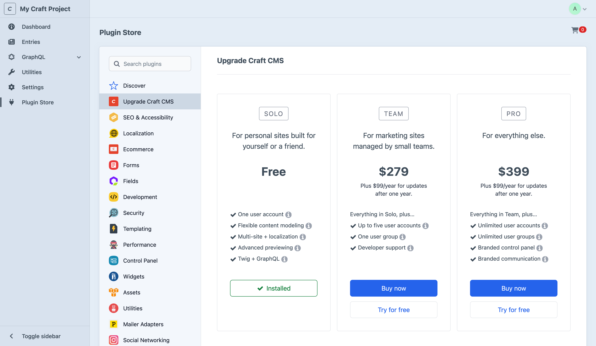

---
related:
  - uri: https://craftcms.com/pricing
    label: Craft Pricing
  - uri: https://craftcms.com/knowledge-base/licensing-editions
    label: Licensing & Editions in the Knowledge Base
  - uri: https://craftcms.com/knowledge-base/how-craft-license-enforcement-works
    label: License Enforcement
  - uri: https://craftcms.com/knowledge-base/how-craft-licenses-and-renewals-work
    label: How Renewals Work
  - uri: https://craftcms.com/knowledge-base/how-to-trial-craft-cms-and-plugin-editions
    label: Trialing Craft and Plugins
---

# Licensing & Editions

Every Craft project starts with a free **Solo** license, which is valid for public and private use, indefinitely.

Additional features like user management are available by [upgrading](#upgrading) to a paid **Team** or **Pro** license. The current Craft edition and version are displayed at the bottom of every control panel screen.

Throughout the documentation, edition-specific features are called out with <Badge type="edition" text="Team" vertical="middle" /> and <Badge type="edition" text="Pro" vertical="middle" /> badges. If you don’t see a badge on a page or section, it describes features available to all Craft editions.

<See url="https://craftcms.com/pricing" label="Features & Pricing" description="Read more about pricing for Craft editions and services." />

## Upgrading

To try out a paid Craft edition, visit the **Plugin Store** in the [control panel](system/control-panel.md#plugin-store), and click **Upgrade Craft CMS** in the sidebar:

<BrowserShot url="https://my-project.ddev.site/admin/plugin-store" :link="false" caption="">

</BrowserShot>

Selecting an edition will update [project config](system/project-config.md) and replace the **Try** button with a green **Installed as a trial** message.

## Plugins

Some plugins have editions, as well! The [Plugin Store](https://plugins.craftcms.com/) displays editions in the sidebar, each having a **Try** button. Check the **Editions** tab for more information from the developer.

## Trials

You are allowed to test paid Craft and plugin editions on private domains for as long as you need. However, deploying an unlicensed edition of Craft to a [public domain](kb:how-craft-license-enforcement-works#public-domains) will cause the control panel to display licensing issues to all [administrators](system/user-management.md#admin-accounts).

<See url="https://craftcms.com/knowledge-base/how-to-trial-craft-cms-and-plugin-editions" label="Craft CMS & Plugin Trials" description="Learn how to test and license paid Craft and plugin editions." />
