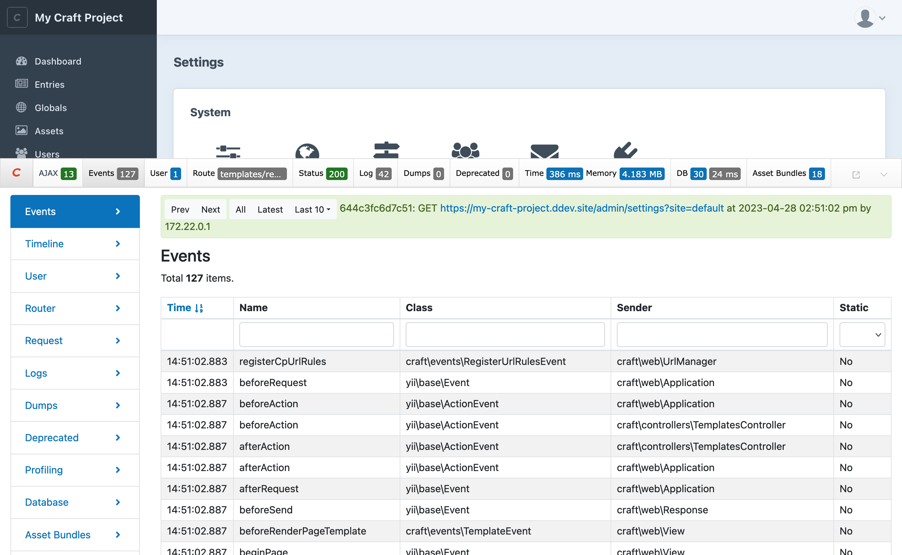

# Events

Craft has all kinds of events you can use to customize how core features work, or connect built-in processes to new functionality. Events are a [Yii concept](guide:concept-events), and are used extensively throughout its architecture. In cases where Yii components are extended for internal use (like <craft5:craft\base\Model>), Craft provides additional events to expose a greater customization surface for developers.

::: tip
See [Using Events in a Custom Module](kb:custom-module-events) for an end-to-end tutorial on wiring up your first event handler in a module.
:::

This page covers customizing Craft’s native behavior by registering event handlers in your plugin, and how to implement [your own events](#custom-events) that other developers can take advantage of.

## Anatomy of an Event

We use “event” to describe the **name** and **sender** that uniquely identify it, as well as the actual <yii2:yii\base\Event> instance that is emitted.

### Sender

The class that emits an event is considered its **sender**. The sender is always available via the `sender` property of an event object, and inherits from <yii2:yii\base\Component>. Events are emitted by calling a component’s `trigger()` method, which automatically sets up the event-sender relationship. You can see an example of this in the [custom events](#custom-events) section.

### Name

Combined with the sender, an event’s **name** identifies what a given handler is listening for. Event names are unique among those on the same class. Typically, you will access event names via constants on the sender class (like <craft5:craft\services\Dashboard::EVENT_REGISTER_WIDGET_TYPES>), instead of using the underlying string (`registerWidgetTypes`). Using event constants also allows your IDE to give you suggestions for events, and provide feedback when referencing a non-existent one—they’re also part of our formal deprecation process, receiving docblock tags and [upgrade](updating-plugins.md#events) instructions.

### Event Object

Events are emitted as a <yii2:yii\base\Event> instance, or a subclass thereof. Craft has a number of specific event classes (in the `craft\events\` namespace) that act as specialized containers for data that a handler might be interested in.

### Handled

Each time an event is emitted, a new [event object](#event-object) is created. That object is passed as an argument to each registered handler, until a handler sets the `handled` property to `true`—subsequent handlers are then skipped.

::: warning
Plugins should generally avoid flagging events `handled` unless they expect to have exclusive control over another event property. Craft events that use the `EVENT_SET_*`, `EVENT_DEFINE_*`, or `EVENT_REGISTER_*` naming convention are good examples of this—situations where a handler might need to authoritatively replace an event’s value to guarantee some behavior of the extension.
:::

#### Cancelable Events

Craft extends the “handled” concept via <craft5:craft\events\CancelableEvent>. In addition to `handled`, handlers can set the event’s `isValid` property to `false` to signal that the sender should halt further processing. If you want to prevent other handlers from overriding your `isValid` setting, also set `handled` to `true`.

::: tip
The `isValid` property is not necessarily related to model validation. A handful of Yii events use an `isValid` property to mean a variety of things, but Craft standardizes the behavior via [CancelableEvent](craft5:craft\events\CancelableEvent), using it exclusively as a means to halt a built-in procedure (say, to prevent a user from being activated).

Preventing something from happening in this way is _not_ equivalent to throwing an exception or attempting to end the request from a handler. If an event is cancelable, Craft expects to be able to react to its cancellation—including, potentially, releasing locks or rolling back database transactions.
:::

## Discovering Events

Every event emitted by an application is logged and can be reviewed with the Yii debug toolbar.

<BrowserShot
    url="https://my-craft-project.ddev.site/admin/settings"
    :link="false"
    caption="List of events emitted by Craft and Yii, in the debug toolbar.">

</BrowserShot>

But what about all the events that _weren’t_ emitted during a given request? Craft and Yii use the same convention for events: every event name is defined exactly one time, as a class constant starting with `EVENT_`.

### Code Diving

The best way to discover an event is to get familiar with a known procedure by stepping through it with a tool like [xdebug](README.md#xdebug) and looking for event constants within or adjacent to the logical flow, or on classes that logic is part of. Alternatively, setting a breakpoint on the low-level <yii2:yii\base\Event::trigger()> or <yii2:yii\base\Component::trigger()> methods will allow you to inspect _every_ event emitted during a request—and view the current call’s trace.

::: tip
A fresh Craft install can easily emit 100 or more events per request, so using your IDE’s _conditional breakpoint_ may be necessary to cut down on noise!
:::

Directly searching the Craft source is a great way to learn about Craft-specific events—but it will miss a host of events emitted by Yii, as well as those that are inherited from parent classes. The [event browser](#event-code-generator) and generator below enumerates _all_ of those events, even if they’re technically defined by a parent.

### Inherited Events

Events provided by Craft (those defined on classes in the `craft\*` namespace) represent just the tip of the iceberg. Many classes inherit events from their parents, including classes defined by Yii—let’s use <craft5:craft\elements\Entry> as an example:

1. Only two events exist directly on the `Entry` class:
  - [`EVENT_DEFINE_ENTRY_TYPES`](craft5:craft\elements\Entry::EVENT_DEFINE_ENTRY_TYPES)
  - [`EVENT_DEFINE_PARENT_SELECTION_CRITERIA`](craft5:craft\elements\Entry::EVENT_DEFINE_PARENT_SELECTION_CRITERIA)
2. Its parent class, <craft5:craft\base\Element> defines 38 more:
  - [`EVENT_REGISTER_SOURCES`](craft5:craft\base\Element::EVENT_REGISTER_SOURCES)
  - [`EVENT_REGISTER_FIELD_LAYOUTS`](craft5:craft\base\Element::EVENT_REGISTER_FIELD_LAYOUTS)
  - …
3. `Element` extends <craft5:craft\base\Component>, which doesn’t contribute any—but its parent class <craft5:craft\base\Model> defines five more:
  - [`EVENT_INIT`](craft5:craft\base\Model::EVENT_INIT)
  - [`EVENT_DEFINE_BEHAVIORS`](craft5:craft\base\Model::EVENT_DEFINE_BEHAVIORS)
  - …
4. From here, we jump into <yii2:yii\base\Model>, which defines two more:
  - [`EVENT_BEFORE_VALIDATE`](yii2:yii\base\Model::EVENT_BEFORE_VALIDATE)
  - [`EVENT_AFTER_VALIDATE`](yii2:yii\base\Model::EVENT_AFTER_VALIDATE)
5. The final two classes in the chain of inheritance (<yii2:yii\base\Component> and <yii2:yii\base\BaseObject>) don’t implement any events, themselves.

This one class contains many more events (47, at the time of writing) than is immediately evident. This also represents only the events that would designate an _entry_ as its [sender](#sender)—entries (and elements or models) are passed to a variety of other services, which emit their own events. Another 33 events are emitted by <craft5:craft\services\Elements>, alone!

## Handling Events

Events can be attached with different scopes, depending on your needs.

### Class-Level Events

In this mode, a handler is registered for _all_ occurrences of an event on a class. Class-level handlers are attached using the static <yii2:yii\base\Event::on()>:

```php
use Craft;
use yii\base\Event;
use craft\services\Users;
use craft\events\UserEvent;

Event::on(
    Users::class,
    Users::EVENT_AFTER_ACTIVATE_USER,
    function(UserEvent $e) {
        $message = Craft::$app->getMailer()
            ->composeFromKey('custom.welcome')
            ->setTo($e->user);

        // ...

        $message->send();
    }
);
```

Let’s look at the required arguments:

1. The fully-qualified class name that we expect to emit an event.
2. The event name we want to register the handler for. This should _always_ be a class constant).
3. The [handler](#handler-signature).

Class-level events are almost always attached from a plugin’s `init()` method—but be aware that Craft’s bootstrapping process may trigger some events before handlers can be registered! We advise developers defer as much of their public plugins’ initialization as possible by wrapping it in a call to <craft5:craft\base\ApplicationTrait::onInit()>—this gives other extensions an opportunity to register handlers prior to them actually being triggered.

### Instance-Level Events

If you’re only concerned about events emitted by a _single_ instance of a class, handlers can be directly attached to any subclass of <yii2:yii\base\Component> (effectively every service and model in Craft, including Craft itself).

This example attaches a handler via the singleton <yii2:yii\base\Application> instance that is available as `Craft::$app`:

```php
use Craft;
use yii\base\Application;

Craft::$app->on(
    Application::EVENT_AFTER_REQUEST,
    function(Event $e) {
        // ...
    }
);
```

In a different scenario, we may want to attach a handler on any object that passes through some method in our extension:

```php
namespace mynamespace\myplugin\services;

use craft\base\Element;
use craft\events\ModelEvent;
use yii\base\Component;

class TrackChanges extends Component
{
    public function watch(Element $element): void
    {
        $element->on(
            Element::EVENT_AFTER_SAVE,
            function(ModelEvent $e) {
                $originalAttributes = $e->data->originalAttributes;

                // Perform some comparison of new/old attributes...
            },
            [
                'originalAttributes' => $element->getAttributes(),
            ],
        );
    }
}
```

::: warning
This is a much less common pattern for dealing with built-in components, and will usually involve an initial [class-level](#class-level-events) event handler to discover objects as they’re created, anyway.

In most cases, it’s best to set a class-level listener and check in your handler whether the event (or its sender) is relevant. If you know every instance of a class will require an event, you can also attach them via [behaviors](behaviors.md#events).
:::

This listener makes use of the fourth `$data` argument, which allows you to capture data as part of the handler. This is available on the event object when the handler is invoked, under a `data` property. Be mindful of the volume of data you’re capturing at this stage, as it may prevent PHP from freeing memory.

### Handler Signature

Handlers must be a valid [callable](https://www.php.net/manual/en/language.types.callable.php), and should accept a single argument that matches the expected event type. Our examples so far have used either the generic <yii2:yii\base\Event>, or a type hint of <craft5:craft\events\UserEvent>.

In addition to closures, As of PHP 8.1, you may also use the native callable syntax. Our previous “welcome email” example would end up looking something like this:

```php
Event::on(
    Users::class,
    Users::EVENT_AFTER_ACTIVATE_USER,
    [MyService::class, 'handleUserActivation']
);
```

#### Return Values

Return values from handlers are ignored—instead, Craft expects that the handler modifies properties on the event object (or its sender). You may explicitly declare a `void` return type on handlers as a means to identify misuse within your own plugin, but the signature is not enforced.

### Cloning Handlers

Instance-level event handlers are _not_ copied to new instances when using PHP’s `clone()`. If you want to guarantee that your handlers survive this process, create a [behavior](behaviors.md#events) and attach that—behaviors _do_ get copied thanks to <craft5:craft\base\CloneFixTrait>, and any event handlers declared by <yii2:yii\base\Behavior::events()> are re-installed.

Instead of maintaining a behavior for a single handler, you can use the built-in <craft5:craft\behaviors\EventBehavior> <Since ver="4.5.0" feature="EventBehavior proxy for cloned objects" /> as a proxy for registering handlers:

```php
use craft\behaviors\EventBehavior;
use craft\elements\db\ElementQuery;
use craft\elements\Entry;
use craft\events\CancelableEvent;

$query = Entry::find();

$query->attachBehavior('myBehavior', new EventBehavior([
    ElementQuery::EVENT_AFTER_PREPARE => function(CancelableEvent $event, ElementQuery $query) {
        // ...
    },
], true));
```

The second argument to the `EventBehavior` constructor tells the behavior to mimic <craft5:craft\base\Event::once()> and will only invoke your handler once. All handlers are treated the same way, but you may mix one-time and continuous handlers by attaching multiple `EventBehavior` instances.

## Event Code Generator

Select an event for more detail and a code snippet.

<event-browser source="craft-4" />

## Common Event Flows

### Adding Validation Rules

Models in Craft (including [elements](element-types.md)) implement [validation rules](guide:tutorial-core-validators) via a `defineRules()` method. When any model is validated, its `rules()` method is called, which in turn calls `defineRules()`, then emits a <craft5:craft\events\DefineRulesEvent> with those rules set on a `rules` property.

A handler that registers additional rules would look something like this:

```php
use yii\base\Event;
use craft\elements\User;
use craft\events\DefineRulesEvent;

Event::on(
    User::class,
    User::EVENT_DEFINE_RULES,
    function(DefineRulesEvent $e) {
        // Enforce password minimum length:
        $e->rules[] = [['newPassword'], 'string', 'min' => 16];
    }
);
```

Note that the handler is pushing a new rule onto the event’s `rules` property, rather than [returning a value](#return-values).

::: tip
You can add validation rules to custom fields in the same handler:

```php
// Reject a value if it looks like spam:
$e->rules[] = [
    ['field:myCustomFieldHandle'],
    'match',
    'pattern' => '/extended warranty/i',
    'not' => true,
];
```

Building your own [field type](field-types.md)? It should provide validation rules via `getElementValidationRules()`.
:::

This process is the same for any class that extends <craft5:craft\base\Model>—the `EVENT_DEFINE_RULES` event is available on any subclass!

### Saving Entries

While every element in Craft has a common set of events your custom code can subscribe to, the entry-saving workflow is one of the most common and complex.

::: tip
See [Handling Entry Saves](kb:handling-entry-saves) for more on entry-specific concepts.
:::

Generally, entries progress through the following order of operations:

1. Pre-flight checks that trigger `EVENT_BEFORE_SAVE`.
2. Validation that triggers `EVENT_BEFORE_VALIDATE` and `EVENT_AFTER_VALIDATE`.
3. Saving for the initial site that triggers `EVENT_AFTER_SAVE`.
4. Propagating non-translatable changes to the entry’s other sites, which repeats steps 1-3 for each site before triggering `EVENT_AFTER_PROPAGATE`.

This process is actually a bit more abstract than this, because it covers _all_ element types. The events above live on the <craft5:craft\base\Element> class, but are inherited by other element types, meaning you can listen to only the subset of element lifecycle events you care about.

#### Bulk Operations

Craft 5 encapsulates operations that affect one or more elements in a special event, <craft5:craft\services\Elements::EVENT_AFTER_BULK_OP>. In cases where you need to act on the final result of a save that may involve multiple elements, consider using this in conjunction with the new element query method <craft5:craft\elements\db\ElementQuery::inBulkOp()>:

```php
use craft\elements\Entry;
use craft\events\BulkOpEvent;
use craft\services\Elements;
use yii\base\Event;

Event::on(Elements::class, Elements::EVENT_AFTER_BULK_OP, function(BulkOpEvent $event) {
    // Fetch all the entries that were affected
    $entries = Entry::find()
        ->inBulkOp($event->key)
        ->status(null)
        ->all();
    // ...
});
```

If your plugin performs many sequential element saves, you can explicitly start and end a bulk operation via the elements service:

```php
$key = Craft::$app->getElements()->beginBulkOp();

// ... save or delete elements ...

Craft::$app->getElements()->endBulkOp($key);
```

The `$key` will be attached to the emitted <craft5:craft\events\BulkOpEvent> so that other code can get a list of elements involved! After the operation is complete (and any handlers have been called), the key will be cleaned up. It is your responsibility to save element IDs elsewhere if you need to do asynchronous processing on elements that were part of a bulk operation!

### Adding and Modifying Search Keywords

If you’d like to extend system components to add your own searchable custom attributes, you can hook into the [`EVENT_REGISTER_SEARCHABLE_ATTRIBUTES`](craft5:craft\base\Element::EVENT_REGISTER_SEARCHABLE_ATTRIBUTES) event.

Here, we’re making the `myCustomAttribute` property searchable for Commerce orders:

```php
use craft\base\Element;
use craft\commerce\elements\Order;
use craft\events\RegisterElementSearchableAttributesEvent;
use yii\base\Event;

Event::on(
    Order::class,
    Element::EVENT_REGISTER_SEARCHABLE_ATTRIBUTES,
    function(RegisterElementSearchableAttributesEvent $event) {
        $event->attributes[] = 'billingCountry';
        // ...
    }
);
```

A “searchable attribute” doesn’t need to correspond to a real property, so long as you later handle the <craft5:craft\base\Element::EVENT_DEFINE_KEYWORDS> event:

```php

use craft\base\Element;
use craft\commerce\elements\Order;
use craft\events\DefineAttributeKeywordsEvent;
use yii\base\Event;

Event::on(
    Order::class,
    Element::EVENT_DEFINE_KEYWORDS,
    function(DefineAttributeKeywordsEvent $event) {
        if ($event->attribute !== 'billingCountry') {
            return;
        }

        $billingAddress = $event->sender->getBillingAddress();
        $country = Craft::$app->getAddresses()
            ->getCountryRepository()
            ->get($billingAddress->countryCode);

        $event->keywords = $country->name;
    }
);
```

The same process can be repeated for each searchable attribute you wish to define—or it can all be packaged into a [behavior](behaviors.md#events)!

## Custom Events

Events are only necessary (or practical) for your extension if you expect other developers to want to customize or react to its behavior. Private plugins and modules generally do not need to emit events, as you (the author) already have complete control over its internal logic!

### The “Evented” Mindset

As you design your extension, it may still be worthwhile to consider some of the patterns that events fit into. Let’s use a newsletter sign-up plugin as an example. Our plugin will need…

- …a **controller** to receive input from a front-end form;
- …a **model** to hold the contact’s details;
- …a **service** to communicate with a third-party API;

Where do events fit in this process? Craft will automatically emit events before our controller action is run, when an instance of our model is created, before and after our model is validated, after a response is sent… and potentially dozens more places in the normal request-response lifecycle.

Our “API” service is still a bit of a black box, though. Let’s give developers access to our request and response objects by creating a pair of events; one emitted just before our request to the API (with a reference to the contact being subscribed), and another emitted when we’re confident a contact has been subscribed (with references to the contact and the raw response data from the API).

::: code
```php Event (Before)
namespace mynamespace\newsletter\events;

use craft\events\CancelableEvent;
use mynamespace\newsletter\models\Contact;

class SubscribeEvent extends CancelableEvent
{
    public Contact $contact;
}
```
```php Event (After)
namespace mynamespace\newsletter\events;

use mynamespace\newsletter\models\Contact;
use yii\base\Event;

class ApiResponseEvent extends Event
{
    public Contact $contact;
    public array $response;
}
```
```php{14,19,35-44,63-66} Service
namespace mynamespace\newsletter\services;

use craft\helpers\Json as JsonHelper;
use mynamespace\newsletter\events\ApiResponseEvent;
use mynamespace\newsletter\events\SubscribeEvent;
use mynamespace\newsletter\models\Contact;
use yii\base\Component;

class MailingList extends Component
{
    /**
     * @var string Event emitted before a contact is added to the mailing list.
     */
    public const EVENT_BEFORE_SUBSCRIBE = 'beforeSubscribe';

    /**
     * @var string Event emitted after a contact has been added to the mailing list.
     */
    public const EVENT_AFTER_SUBSCRIBE = 'afterSubscribe';

    /**
     * Subscribes a contact to the mailing list.
     *
     * @param Contact $contact
     * @return bool
     */
    public function subscribe(Contact $contact): bool
    {
        // Create an HTTP client:
        $client = Craft::createGuzzleClient([
            'base_uri' => 'https://api.mycrm.com/',
        ]);

        // We’re ready! Emit an event:
        $subscribeEvent = new SubscribeEvent([
            'contact' => $contact,
        ]);

        $this->trigger(self::EVENT_BEFORE_SUBSCRIBE, $subscribeEvent);

        // Check if a handler canceled it:
        if (!$subscribeEvent->isValid) {
            return false;
        }

        // Ok, we’re good to go!
        $response = $client->post('org/1234/lists/5678', [
            'form_params' => [
                'name' => $contact->name,
                'email' => $contact->email,
            ],
        ]);

        // Did we upset the API?
        if ($response->getStatusCode() !== 200) {
            return false;
        }

        // Unpack the response:
        $data = JsonHelper::decode($response->getBody()->getContents());

        // Give plugins a chance to react to this, regardless of success state:
        $this->trigger(self::EVENT_AFTER_SUBSCRIBE, new ApiResponseEvent([
            'contact' => $contact,
            'response' => $response,
        ]));

        // Make sure it actually contained the expected “success” flag:
        if ($data['success'] !== true) {
            return false;
        }

        return true;
    }
}
```

The event classes are relatively sparse—they only need to declare properties for the data we wish to send along with them. Note that we are extending <craft5:craft\events\CancelableEvent> for the “before” event!

On the other hand, the service contains a bit of noisy boilerplate for the HTTP request, which isn’t essential to understand. The highlighted lines show where event code has been injected, and how we’re handling any side-effects. 

::: warning
As a product of the [sender](#sender) always being available to an event handler, handlers can pretty easily create infinite loops or call methods that would otherwise interfere with your plugin’s functionality.
:::
