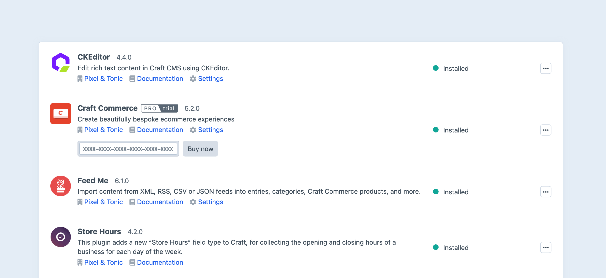

# How to Build a Plugin

Plugins are typically designed and built as public packages, distributable via the first-party [Plugin Store](plugin-store.md). You can also create [private plugins](#private-plugins) in lieu of a [module](module-guide.md) when the full suite of features are desirable (i.e. control panel navigation, settings, and project config) but the added functionality is still project-specific.

At a technical level, plugins are a type of [Yii module](guide:structure-modules) that are registered with Craft and initialized alongside the application, giving them an opportunity to supplement, change, or observe what the application does.

## Preparation

Your first task is to decide on a few characteristics that will dictate how your plugin is [scaffolded](#scaffolding):

Package name
:   Used to name your Composer package for the plugin. (See Composer’s [documentation][package name] for details.) We recommend prefixing the second segment (after the `/`) with `craft-`, to help identify that this is a Craft plugin. For example, `pixelandtonic/craft-recipes`.

Namespace
:   The root namespace that your plugin’s classes will live in. (See the [PSR-4] autoloading specification for details.) Note that this should _not_ begin with `craft\`; use something that identifies you, the developer or vendor.

Plugin handle
:   Something that uniquely identifies your plugin within the Craft ecosystem. (Plugin handles must begin with a letter and contain only lowercase letters, numbers, and dashes. They should be `kebab-cased`.)

Plugin name
:   What your plugin will be called within the control panel. This should be a clear and consistent identifier throughout its design and digital presence (if you choose to distribute it). Consider the longevity of your name, and how it fits with these guidelines:

    - **Don’t** reference the Craft version in your plugin’s name, folder, or repository URL. It’ll require more work and licensing considerations if you update it for another major Craft release.\
    Example: `craft-foo`, not `craft3-foo`.
    - **Do** add `craft-` as a prefix in your GitHub repository name. This helps differentiate any Craft plugins from other projects.\
    Example: `craft-foo`, not `foo-plugin`.
    - **Do** keep your Composer package name reasonably concise. Developers will see (and type) the package name when installing the plugin.\
    Example: `composer require acme/craft-thinginator`, not `composer require acme/craft-super-advanced-thinginator-by-acme`.

    ::: warning
    Your plugin’s name _must not_ begin with “Craft”, or include an [edition](plugin-editions.md)-sounding word like “Lite”, “Plus”, or “Pro”.
    :::

### Private Plugins

A plugin can be made “private” by prefixing its handle with an underscore (like `_my-private-plugin`). Private plugins have all the same features as regular plugins, but are excluded from license verification (and are ineligible for listing on the [Plugin Store](plugin-store.md)); you can even publish a private plugin to GitHub or Packagist and share it between multiple projects, taking advantage of features like [migration tracks](migrations.md).

Private plugins can be scaffolded with the [Generator](generator.md).

## Scaffolding

::: tip
If this is your first time setting up a plugin, consider using the [Generator](generator.md)—it will prompt you for all of the required information, and leave you with a nicely-organized workspace.

<p><Generator component="plugin" /></p>
:::

To create a plugin, create a new directory for it somewhere on your computer. A common approach is to store them in a `~/dev/` folder alongside your Craft projects:

```treeview
~/dev/
├── my-project/
│   └── ...
└── my-plugin/
    ├── CHANGELOG.md
    ├── LICENSE.md
    ├── README.md
    ├── composer.json
    └── src/
        └── Plugin.php
```

The name of your plugin directory doesn’t matter. Just choose something that is easy to identify.

## composer.json

Create a `composer.json` file at the root of your plugin directory, and use this template as a starting point:

```json
{
  "name": "package/name",
  "description": "Your plugin’s package description",
  "type": "craft-plugin",
  "keywords": ["some", "keywords", "here"],
  "license": "MIT",
  "authors": [
    {
      "name": "Developer Name",
      "homepage": "https://developer-website.tld"
    }
  ],
  "support": {
    "email": "email@developer-website.tld",
    "issues": "https://github.com/developer/repo/issues?state=open",
    "source": "https://github.com/developer/repo",
    "docs": "https://github.com/developer/repo/blob/master/README.md"
  },
  "require": {
    "craftcms/cms": "^5.3.0"
  },
  "autoload": {
    "psr-4": {
      "namespace\\prefix\\": "src/"
    }
  },
  "extra": {
    "name": "Plugin Name",
    "handle": "my-plugin-handle"
  }
}
```

Replace:

- `package/name` with your package name.
- `Developer Name` with your name, or the organization name that the plugin should be attributed to.
- `https://developer-website.tld` with the URL to the website the developer name should link to in the control panel.
- `email@developer-website.tld` with your support email.
- `developer/repo` with the actual GitHub account and repository names where the plugin will live.
- `master` with the actual primary branch name of your GitHub repository.
- `namespace\\prefix\\` with your namespace prefix. (Use double-backslashes because this is JSON, and note this must end with `\\`.)
- `Plugin Name` with your plugin name.
- `my-plugin-handle` with your plugin handle.
- `MIT` with `proprietary` if you plan to use [Craft License](https://craftcms.github.io/license/) (see [Choose a License](plugin-store.md#choose-a-license) on the “Publishing to the Plugin Store” page).

In addition to `name` and `handle` (which are both required), there are a few other things you can include in that `extra` object:

- `class` – The [Plugin class](#the-plugin-class) name. If not set, the installer will look for a `Plugin.php` file at each of the `autoload` path roots.
- `description` – The plugin description. If not set, the main `description` property will be used.
- `developer` – The developer name. If not set, the first author’s `name` will be used (via the `authors` property).
- `developerUrl` – The developer URL. If not set, the `homepage` property will be used, or the first author’s `homepage` (via the `authors` property).
- `developerEmail` – The support email. If not set, the `support.email` property will be used.
- `documentationUrl` – The plugin’s documentation URL. If not set, the `support.docs` property will be used.

::: warning
If you’re updating a Craft 2 plugin, make sure to remove the `composer/installers` dependency if it has one.
:::

## The Plugin Class

The `src/Plugin.php` file is your plugin’s entry point for the system. It will get instantiated at the beginning of every request. Its `init()` method is the best place to register event listeners, and any other steps it needs to take to initialize itself.

Use this template as a starting point for your `Plugin.php` file:

```php
namespace mynamespace;

class Plugin extends \craft\base\Plugin
{
    public function init()
    {
        parent::init();

        // Custom initialization code goes here...
    }
}
```

### Initialization

Most initialization logic belongs in your plugin’s `init()` method. However, there are some situations in which parts of the application aren’t ready yet (like another plugin)—in particular, creating [element queries](../development/element-queries.md) or causing the [Twig environment](../development/twig.md) to be loaded prematurely can result in race conditions and incomplete initialization.

In these cases, it’s best to register a callback via <craft5:craft\base\ApplicationTrait::onInit()>, from your plugin’s `init()` method:

```php
namespace mynamespace;

use Craft;

class Plugin extends \craft\base\Plugin
{
    public function init(): void
    {
        // ...

        // Defer some setup tasks until Craft is fully initialized:
        Craft::$app->onInit(function() {
            // ...
        });
    }

    // ...
}
```

::: tip
If Craft has already fully initialized, your callback will be invoked immediately.
:::

Conversely, there are cases in which attaching [event listeners](events.md) in `onInit()` may be _too late_—by the time your callback is invoked, those events may have already happened.

## Loading your plugin into a Craft project

To get Craft to see your plugin, you will need to install it as a Composer dependency of your Craft project. There are multiple ways to do that:

### Path Repository

During development, the easiest way to work on your plugin is with a [path repository][path], which will tell Composer to symlink your plugin into the `vendor/` folder right alongside other dependencies.

To set it up, open your Craft project’s `composer.json` file and make the following changes:

- Set [minimum-stability](https://getcomposer.org/doc/04-schema.md#minimum-stability) to `"dev"`
- Set [prefer-stable](https://getcomposer.org/doc/04-schema.md#prefer-stable) to `true`
- Add a new [path repository](https://getcomposer.org/doc/05-repositories.md#path) record, pointed at your plugin’s root directory.

```json
{
  "minimum-stability": "dev",
  "prefer-stable": true,
  "repositories": [
    {
      "type": "path",
      "url": "../my-plugin"
    }
  ]
}
```

::: tip
Set the `url` value to the absolute or relative path to your plugin’s source directory. (The `../my-plugin` example value assumes that the plugin lives in a folder alongside the project’s folder.)
:::

In your terminal, go to your Craft project and tell Composer to require your plugin. (Use the same package name you gave your plugin in its `composer.json` file.)

```bash
# go to the project directory
cd /path/to/my-project

# require the plugin package
composer require package/name
```

Composer’s installation log should indicate that the package was installed via a symlink:

```
  - Installing package/name (X.Y.Z): Symlinking from ../my-plugin
```

::: warning
One caveat of `path` Composer repositories is that Composer may ignore `path`-based dependencies when you run `composer update`. So any time you change anything in `composer.json`, such as your plugin’s dependency requirements or its plugin information, you might need to completely remove and re-require your plugin in your project for those changes to take effect.

```bash
# go to the project directory
cd /path/to/my-project

# remove the plugin package
composer remove package/name

# re-require the plugin package
composer require package/name
```

:::

### Packagist

If you’re ready to publicly release your plugin, register it as a new Composer package on [Packagist](https://packagist.org/). Then you can install it like any other package, by just passing its package name to Composer’s `require` command.

```bash
# go to the project directory
cd /path/to/my-project

# require the plugin package
composer require package/name
```

## Plugin Icons

Plugins can provide an icon, which will be visible on the **Settings** → **Plugins** page.

<BrowserShot url="https://my-project.tld/admin/settings/plugins" :link="false" caption="The Settings → Plugins page in Craft’s control panel.">

</BrowserShot>


Plugin icons must be square SVG files, saved as `icon.svg` at the root of your plugin’s source directory (e.g `src/`).

If your plugin has a [control panel section](cp-section.md), you can also give its global nav item a custom icon by saving an `icon-mask.svg` file in the root of your plugin’s source directory. Note that this icon cannot contain strokes, and will always be displayed in a solid color (respecting alpha transparency).

[yii modules]: https://www.yiiframework.com/doc/guide/2.0/en/structure-modules
[models]: https://www.yiiframework.com/doc/guide/2.0/en/structure-models
[active record classes]: https://www.yiiframework.com/doc/guide/2.0/en/db-active-record
[controllers]: https://www.yiiframework.com/doc/guide/2.0/en/structure-controllers
[application components]: https://www.yiiframework.com/doc/guide/2.0/en/structure-application-components
[package name]: https://getcomposer.org/doc/04-schema.md#name
[two hardest things]: https://twitter.com/codinghorror/status/506010907021828096
[psr-4]: https://www.php-fig.org/psr/psr-4/
[yii alias]: https://www.yiiframework.com/doc/guide/2.0/en/concept-aliases
[component configs]: https://www.yiiframework.com/doc/guide/2.0/en/structure-application-components
[path]: https://getcomposer.org/doc/05-repositories.md#path
