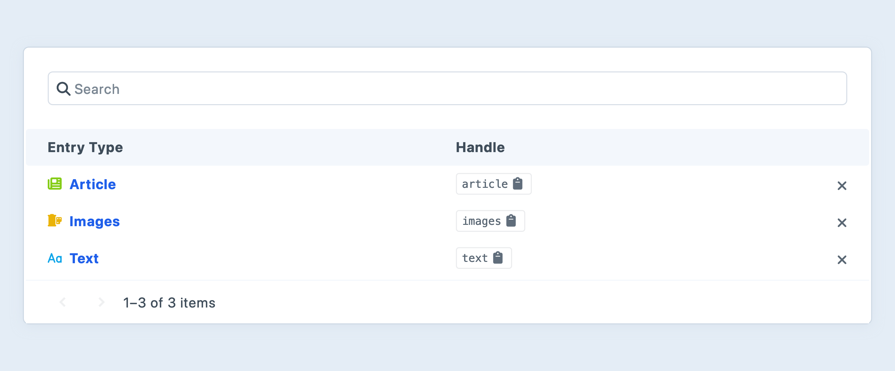

---
related:
  - uri: https://github.com/craftcms/rector
    label: Rector Library
  - uri: https://github.com/craftcms/phpstan
    label: PHPStan Configuration
sidebarDepth: 2
---

# Updating Plugins for Craft 5

Craft 5 brings some of the most significant author- and developer-experience improvements _ever_—and in a way that is minimally disruptive to plugins.

The [changelog](https://github.com/craftcms/cms/blob/5.x/CHANGELOG.md) is the most comprehensive and up-to-date list of added, changed, deprecated, and removed APIs. This guide focuses on high-level changes, organized by the features they impact.

::: tip
Report issues with the upgrade guide in our [`craftcms/docs` repository](https://github.com/craftcms/docs/issues/new), and issues with the upgrade itself in the [`craftcms/cms` repository](https://github.com/craftcms/cms/issues/new?labels=bug%2Ccraft5&projects=&template=BUG-REPORT-V5.yml&title=%5B5.x%5D%3A+).
:::

## Overview

Be sure and fully review this page (and the [changelog](https://github.com/craftcms/cms/blob/5.x/CHANGELOG.md)) before getting started, taking note of features that are apt to impact your plugin.

## Process

Updating a plugin for Craft 5 starts with a fully-updated Craft 4 installation. See our guide on [loading your plugin into a Craft project](plugin-guide.md#loading-your-plugin-into-a-craft-project) to get an existing plugin up-and-running.

Once your environment is set up, this is what the process will look like:

1. Run [PHPStan](#phpstan) to address any outstanding issues with the latest version of your plugin, in Craft 4.
1. Make the recommended changes, commit the results, and tag a new release on the _current_ version.
1. Run the Craft 5 [Rector ruleset](#rector) on your plugin.
1. Update the `craftcms/cms` requirement in the root Craft project _and_ in your plugin’s `composer.json` to `^5.0.0`, then run `composer update`.
1. Run `php craft up` to perform the Craft upgrade.

At this point, your project _should_ be functional again! Go ahead and kick the tires—then come back here and review changes that may impact your plugin. If the project is still failing to bootstrap, it is likely due to incompatible API changes that Rector couldn’t address on its own.

::: tip
The next few sections cover these steps (and some other procedural concerns). Skip down to [new features](#new-features) if you’re ready to dig in.
:::

### PHPStan

We use [PHPStan](https://github.com/phpstan/phpstan) on Craft CMS, Craft Commerce, and most of our first-party plugins to continually audit code quality and consistency.

While there’s no _requirement_ that you use PHPStan, we encourage all developers to join us—with the upgrade process being a perfect opportunity to integrate code quality tools into your workflow.

Follow the instructions in our [PHPStan package](https://github.com/craftcms/phpstan) to add it as a development dependency of your plugin. You should end up with a `phpstan.neon` config file in your _plugin_ repository’s root; then go back to the Craft project root, and run:

```bash
vendor/bin/phpstan -c path/to/plugin/phpstan.neon
```

::: tip
Large plugins may benefit from the `--memory-limit 1G` flag.
:::

### Rector

Our [Rector](https://github.com/craftcms/rector) rule set for Craft 5 automates most signature changes, deprecations, and other one-for-one replacements in your codebase. With your plugin running in Craft 4, follow these steps:

1. Install Rector:

    Rule-sets are not “versioned” in the traditional sense; instead, each major version is kept in a separate file. As such, its use depends on a couple of Composer settings:

    ```
    composer config minimum-stability dev
    composer config prefer-stable true
    ```

    Require the package, using the `dev-main` version constraint. The `main` branch will be cloned, and subsequent `composer update` commands will pull any changes.

    ```
    composer require craftcms/rector:dev-main --dev
    ```

1. Run the Craft 5 ruleset:

    ```
    vendor/bin/rector process my-local-plugin/src --config vendor/craftcms/rector/sets/craft-cms-50.php
    ```

    ::: warning
    Rector may make your plugin incompatible with Craft 4, which can prevent the system from initializing. This is fine! It’s safe to continue upgrading the project.
    :::

### Versioning

Craft 5 is the first major release that may not require breaking changes for all plugins. This means that plugins that don’t immediately take advantage of new features or APIs (and aren’t affected by any currently-deprecated APIs) can tag a compatibility-only “point” release.

If you are uncertain whether your plugin will use new features, we recommend tagging a new major version, and back-porting any features and bugfixes.

We anticipate most developers will choose to release a new major version of their plugin that requires Craft 5. However, Craft and the Plugin Store only look at what is required by `composer.json` to determine major-version compatibility.

Either way, you must explicitly declare support for each major Craft version. If a single version of your plugin supports both Craft 4 _and_ 5, you’ll need to use an “or” constraint for your `craftcms/cms` requirement, like `^4.0|^5.0`. Any `craftcms/cms` constraint beginning with `>=` will be treated as `^`.

::: warning
Keep in mind that all versions of PHP 7 are [end-of-life](https://www.php.net/supported-versions.php). Your plugin does _not_ need to support PHP 7 in order to be compatible with Craft 4.
:::

### Custom Modules

The upgrade process for custom modules is very similar, except that you aren’t responsible for versioning.

[Rector](#rector) and [PHPStan](#phpstan) can be installed as a direct dependency of your project, and run against the entire `modules/` directory (or wherever your custom modules live), or one module at a time.

Commit changes to your module at the same time as the rest of the Craft 5 upgrade. We recommend tracking these changes in a separate branch.

---

## New Features

Let’s start by looking at a few completely new concepts in Craft 5. There are lots of new features associated with existing functionality (like [elements](#elements) and [fields](#field-types)), which we’ll get to in a moment.

### Authentication

Multi-factor authentication is now available for control panel users. Craft ships with two `craft\auth\methods\AuthMethodInterface` implementations:

- `craft\auth\methods\RecoveryCodes`: Generates, stores, and invalidates a series of 10 one-time-use codes.
- `craft\auth\methods\TOTP`: Sets up and and validates time-based, one-time-use passwords.

Both methods extend `craft\auth\methods\BaseAuthMethod`. Registered auth methods are always instantiated in the context of a single user:

```php
use craft\events\RegisterComponentTypesEvent;
use craft\services\Auth;
use yii\base\Event;

Event::on(
    Auth::class,
    Auth::EVENT_REGISTER_METHODS,
    function(RegisterComponentTypesEvent $e) {
        $e->types[] = EmailVerification::class;
    },
);
```

Custom authorization methods are responsible for storing their own data and associating it with users—return `true` from `isActive()` once the user has completed any required setup so Craft knows to enforce it during login.

If your `verify()` method returns `true`, the user will move on to their next configured auth method—but it’s your responsibility to call `craft\services\Auth::verify()` from a controller, passing in any context required to satisfy the method.

::: tip
See `AuthMethodInterface::getAuthFormHtml()` for complete info on procedural requirements!
:::

### Bulk Operations

Whenever Craft saves an element, it starts tracking a _bulk save operation_. This allows plugins to act on the final state in a save that _may_ involve multiple elements. If you rely on element save events, consider switching to bulk ops

<See path="events.md" hash="bulk-operations" label="Bulk Saving" description="Learn how to respond to multi-element saves." />

### Enums

PHP 8.1 introduced support for [enumeration classes](https://www.php.net/manual/en/language.types.enumerations.php), so we’ve taken the opportunity to extract some constants. See the `craft\enums` namespace for examples.

::: tip
You may define your plugin’s editions this way, but the base plugin class must still return the available edition handles via a static `editions()` method.
:::

### Database Character Sets

Craft now creates database tables using the `uft8mb4` character set (and `utf8mb4_0900_ai_ci` or `utf8mb4_unicode_ci` collation, on MySQL) by default. Developers are asked during the [upgrade process](../upgrade.md#database-character-set-and-collation) to convert existing tables with inconsistent encoding, so it will generally be safe to save emoji and other multibyte characters directly to the database.

Calls to `craft\helpers\StringHelper::emojiToShortcodes($string)` and `craft\helpers\StringHelper::shortcodesToEmoji($string)` are no longer strictly necessary; if you are supporting Craft 4 and 5, consider calling `craft\db\Connection::getSupportsMb4()` to check whether you should pack and unpack strings on their way to and from the database.

### Composer

A copy of `composer.phar` is included in `craftcms/cms`, so the `composer/composer` package has been dropped as a dependency.

Craft’s internal Composer service remains unchanged. Plugins and other low-level extensions that use the Composer PHP API _directly_ must `require` it. This change does _not_ impact how your plugin is installed by an end-user!

---

## Changes

Craft 5 has a completely new content storage engine, and _a ton_ of new tools for creating rich content authoring experiences. Plugins that provide element types or field types may require some additional attention.

### Elements

#### Content Migration

If your plugin provides a custom element type, you must include a migration that extends `craft\base\BaseContentRefactorMigration`. In this migration, you are responsible for telling Craft what existing field data (or content table columns) is relevant to a given element. For each field layout that your element type uses, call `$this->updateElements()` with a list of element IDs or a query prepared to fetch the relevant IDs.

For example, if your elements use a single field layout, your migration would contain only this:

```php
$this->updateElements(
    (new Query())->from('{{%widgets}}'),
    Craft::$app->getFields()->getLayoutByType(Widget::class),
);
```

Craft will take care of applying the appropriate `SELECT` to your query. If your element’s custom table uses something other than `id` as its primary key (and `elements` table foreign key), you should pass a list of IDs instead of a query.

When multiple field layouts are represented among your elements (as is the case with Commerce’s product type configuration), you must call `$this->updateElements()` for *each* of them:

```php
foreach (MyPlugin::getInstance()->getWidgetTypes()->getAllWidgetTypes() as $type) {
    $this->updateElements(
        (new Query())
            ->from('{{%widgets}}')
            ->where(['typeId' => $type->id]),
        $type->getFieldLayout(),
    );
}
```

#### Extra Content Tables

Element types that used a custom content table (like our own Matrix implementation did) should remove their `getContentTable()` and `getFieldColumnPrefix()` methods, and remove the `$contentTable` property from their associated `ElementQuery` subclass.

The `hasContent()` method is no longer used, as there is no `content` table to conditionally join—“content” is always loaded from the `elements_sites` table along with the essential element record data.

::: tip
You should still maintain and `JOIN` any tables that contain your element type’s native properties!
:::

#### Chips & Cards

Elements’ default representation in the control panel (and *only* representation, prior to 5.0) is now known as a “chip.” We’ve added a second display mode called “cards” that support some additional features.

- `craft\helpers\Cp::elementHtml()` has been deprecated, and should be replaced with `craft\helpers\Cp::elementChipHtml($element, $config)`. Configuration of a chip is handled via a single `$config` array, the keys of which correspond to the legacy arguments’ names.
- When generating a chip for an input, you must pass the full `name` attribute, including (or omitting) the `[]` suffix for single or multiple element inputs.
- Chips no longer display a “remove” button. Use `craft\base\Element::EVENT_DEFINE_ACTION_MENU_ITEMS` to add items to the new “action menu.”
- To modify output of an element chip rendered by an element type you don’t control, listen for the `craft\helpers\Cp::EVENT_DEFINE_ELEMENT_CHIP_HTML` event, or modify individual attributes’ output via `craft\base\Element::EVENT_DEFINE_ATTRIBUTE_HTML`.
- Use the new `elementChip()` Twig function to render a chip in your control panel templates.

Both chips and cards support *thumbnails*.

- Implement the static `hasThumbs()` method on your element and return `true` to support chip and card thumbnails.
- The existing `getThumbHtml()` method is responsible for returning a custom or fixed thumbnail; you are free to omit this and allow thumbnails to be specified by users in your element type’s field layout. [Fields that implement the `ThumbableFieldInterface`](#presentation) are eligible for selection by the user.
- Previewable fields (those implementing `PreviewableFieldInterface`) may also appear in your elements’ cards.
- Use the new `elementCard()` Twig function to render a card in your control panel templates.
- The new `craft\elements\NestedElementManager` class contains logic to render lists of nested element cards.

#### Unified Element Editor

Introduced in Craft 4, the [unified element editor](/4.x/extend/updating-plugins.md#unified-element-editor) powers full-screen forms as well as slideouts. If you haven’t already, we strongly recommend adopting the unified editor for custom elements.

#### Field Layout Elements

Native attributes for users (like **Email**, **Username**, and **Full Name**) and entries (like **Authors**) are now handled with field layout elements. To provide similar flexibility for your element types, consider moving native attributes out of the sidebar.

#### Element Actions

Elements now have a dedicated “actions” menu that consolidates common functions like viewing and editing.

::: tip
Action menus are a separate concept from [element index actions](element-types.md#actions). Action menu items are only expected to operate on a single element at a time.
:::

- The schema of these action menu items must conform with the expectations of `craft\helpers\Cp::disclosureMenu()`.
- `craft\base\Element` takes care of many element-type-agnostic actions. You may return additional “safe” actions from a `safeActionMenuItems()` method, and destructive actions from a `destructiveActionMenuItems()` method. Only safe items are displayed when rendering chips.
- To add or alter actions for an element type you don’t own, listen for its `EVENT_DEFINE_ACTION_MENU_ITEMS` event. This is emitted a single time, and 
- Action menu items that rely on JavaScript should use a temporary unique ID to tie the final markup to scripts:

    ```php
    $alertId = sprintf('action-alert-title-%s', mt_rand());
    $items[] = [
        'type' => MenuItemType::Button,
        'id' => $alertId,
        'icon' => 'alert',
        'label' => Craft::t('my-plugin', 'Show {type} title', [
            'type' => static::lowerDisplayName(),
        ]),
    ];
    
    $view = Craft::$app->getView();
    $view->registerJsWithVars(fn($id, $title) => <<<JS
    $('#' + $id).on('click', () => {
      alert($title);
    });
    JS, [$alertId, $this->title]);
    ```

See `craft\enums\MenuItemType` for the allowed `type` values, and `craft\helpers\Cp::menuItem()` for information about the required properties for each. If no `type` is passed, Craft will automatically set it based on what combination of other properties are available.

#### Breadcrumbs

In addition to action menus, elements can provide custom [breadcrumbs for full-screen control panel views](#breadcrumbs-1) via the new `crumbs()` method:

```php
public function crumbs(): array
{
    $crumbs = [];
    $type = $this->getWidgetType();

    // Add root widgets source:
    $crumbs[] = [
      'label' => Craft::t('my-plugin', 'Widgets'),
      'url' => 'widgets',
    ];

    // Gather other widget types and generate a disclosure-menu-compatible list:
    $allTypes = Collection::make(Craft::$app->getEntries()->getEditableSections());
    $typeOptions = $allTypes->map(fn(WidgetType $wt) => [
        'label' => Craft::t('site', $wt->name),
        'url' => "entries/$wt->handle",
        // Is this the current type?
        'selected' => $wt->id === $type->id,
    ]);

    // Add this widget type’s source, with a switcher for other widget type indexes:
    $crumbs[] = [
        // Note that we don’t need a top-level label or URL—Craft uses the `selected` menu item!
        'menu' => [
          'label' => Craft::t('my-plugin', 'Select widget type'),
          'items' => $typeOptions,
        ],
    ];

    return $crumbs;
}
```

This example draws from our own use of breadcrumbs in entries—authors can navigate laterally to other sections from any entry’s edit screen.

::: tip
Nested elements automatically prepend their owner’s breadcrumbs.
:::

#### Nested Elements

If you’re curious how we’re using the new `craft\elements\NestedElementManager` class, check out the [Matrix field’s implementation](repo:craftcms/cms/blob/5.x/src/fields/Matrix.php), or the [CKEditor field](repo:craftcms/ckeditor)’s use of `craft\base\ElementContainerFieldInterface`.

### Field Types

Plugins that provide field types will need to make some adjustments to properly report their runtime and storage data types:

- The `hasContentColumn()` method is no longer used.
- Multi-column fields that returned an array of values from `getContentColumnType()` must rename the method to `dbType()` and make it `static`. The return value must remain unchanged.
- Single-column fields should also switch from `getContentColumnType()` to `dbType()`.
- Field types that previously returned `false` from `hasContentColumn()` must instead return `null` from the new `dbType()` method.
- Historically, `valueType()` was used to render accurate type hints in the dynamically-generated `CustomFieldBehavior`; we have renamed this method to `phpType()`, for clarity.

These changes also help support our new [field instance](../system/fields.md#multi-instance-fields) feature.

#### Multi-Instance Fields

Craft handles multi-instance fields for you, at the field layout level.

You can explicitly opt out of multi-instance support by returning `false` from a static `isMultiInstance()` method. By default, Craft treats all field types as multi-instance unless its `dbType()` method returns `null`.

#### Presentation

Field types whose content is useful in [element cards](#element-chips-cards) should implement `PreviewableFieldInterface`. In addition to determining whether the field can be displayed in element indexes, previewable fields are now eligible for inclusion in element cards when building field layouts.

::: tip
Make sure you are returning relevant markup for each context your element appears in!
:::

Similarly, implementing the `ThumbableFieldInterface` and defining a `getThumbHtml()` method makes a field eligible for use as a [chip or card](#element-chips-cards)’s thumbnail.

#### In-line Editing

Making a field [editable in-line](../system/elements.md#in-line-editing) (in an element index) involves implementing `InlineEditableFieldInterface`, which itself extends `PreviewableFieldInterface`. Not all field types are good candidates for in-line editing—particularly those with complex interfaces, multiple inputs, or that manage long values.

Craft’s `craft\base\Field` class provides baseline support for in-line editing to all subclasses, by recycling the normal `inputHtml()` output.

#### Field Icons

Choose one of the [built-in FontAwesome icons](https://fontawesome.com/search) to represent your field type by implementing the `icon()` method and returning a valid icon handle. These icons are used in the field type selection menu, and in field layout designers.

### Project Config

Changes to Project Config are now safe to make within migrations, even when `allowAdminChanges` is `false`.

When running `php craft up`, Project Config changes originating from migrations are no longer written back out to YAML if there are other pending changes. Our assumption here is that the equivalent changes were already flushed to the YAML files in a different environment, and will be considered unchanged when Craft goes to apply them.

::: tip
This means it is no longer necessary (or advisable) to compare your plugin’s current and incoming schema versions!
:::

### Entrification

Matrix blocks are now entries! The [entrification](https://craftcms.com/blog/entrification) process will conclude in Craft 6, so we recommend plugins begin offering a clean migration path for any features they provide exclusively to categories and tags.

- If your plugin uses references to categories or tags, consider making the selectable targets *entries*. When Craft entrifies category and tag groups, the element IDs stay the same (even preserving foreign keys in the database)—so in many cases, this is only a matter of changing the element type of the selection UI and updating any validation rules on your models.
- Changes to the sidebar or `meta` region of the element edit screen are often better suited as [field layout elements](#field-layout-elements). You can mark field layout elements as `mandatory` so that they will be included in field layouts even if the developer has not explicitly added them.
- Plugins that reference Matrix block “types” should be updated to operate on entry types, instead.

### Controllers

Actions that call `$this->requirePostRequest()` will now throw a `yii\web\MethodNotAllowedHttpException` with an HTTP status code of 405 if a method other than `POST` is used.

Controllers can define action menus for any control panel screen they return, by calling `CpScreenResponseBehavior::actionMenuItems()`. `CpScreenResponseBehavior::contextMenuHtml()` and `CpScreenResponseBehavior::contextMenuTemplate()` are no longer used.

#### Modals

To complement our abstraction of control panel “screens” via `craft\web\CpScreenResponseBehavior`, Craft 5 adds `craft\web\CpModalResponseBehavior` for views that target more compact modals. Modals have a similar API as screens, but with reduced scope.

Send a modal response using `$this->asCpModal()`:

```php
return $this->asCpModal()
    ->action('my-plugin/emails/send')
    ->contentTemplate('my-plugin/emails/transactional-body', $params)
    ->submitButtonLabel(Craft::t('my-plugin', 'Send'));
```

### Services

- After globalizing entry types, remaining Section-related functionality from `craft\services\Sections` has moved to `craft\services\Entries`.

### Control Panel Templates

Craft now prefers `.twig` over `.html` when loading templates rendered in the control panel. Check your plugin for templates with the same names (aside from the extension) and ensure the correct one is being rendered. This behavior is not customizable by plugins or by the project’s developer.

#### Breadcrumbs

We saw an example of how the new breadcrumbs system works, in the context of elements—but breadcrumbs are supported on any control panel screen.

In a controller, you can set and add breadcrumbs after building a response with the `asCpScreen()` method:

```php
return $this->asCpScreen()
    ->title(Craft::t('my-plugin', 'Edit {type}', ['type' => $type->name]))
    // ...
    ->crumbs([
        [
            'menu' => [
                'label' => Craft::t('my-plugin', 'Select settings screen'),
                'items' => [
                    [
                        'label' => Craft::t('my-plugin', 'Widget Types'),
                        'url' => 'settings/acme/widget-types',
                        'selected' => true,
                    ],
                    [
                        'label' => Craft::t('my-plugin', 'Security Clearances'),
                        'url' => 'settings/acme/security',
                    ],
                    [
                        'label' => Craft::t('my-plugin', 'Project Statuses'),
                        'url' => 'settings/acme/statuses',
                    ],
                ],
            ],
        ],
        [
            'menu' => [
              'label' => Craft::t('my-plugin', 'ACME Lab Settings'),
              'url' => 'settings/acme',
            ],
        ]
    ]);
```

The supported “schema” for crumbs is available on `craft\web\CpScreenResponseBehavior::crumbs()`. 

::: warning
Breadcrumbs are _not_ rendered for slideouts or modals. If you need an action or link to be available to slideouts as well, consider using `CpScreenResponseBehavior::actionMenuItems()`.
:::

#### Non-Element Tables

`Craft.VueAdminTable` has received some significant updates. Instead of passing data directly to the component via Twig, you can set a `tableDataEndpoint` to fetch the data over Ajax:

```js{14}
new Craft.VueAdminTable({
  buttons: [
    {
      label: Craft.t('my-plugins', 'New Project Status'),
      href: Craft.getCpUrl('settings/acme/statuses/new'),
      icon: 'plus',
    }
  ],
  columns: statusColumns,
  container: '#project-statuses-vue-admin-table',
  emptyMessage: Craft.t('my-plugin', 'No statuses exist yet.'),
  padded: true,
  perPage: 10,
  tableDataEndpoint: Craft.getActionUrl('acme/project-statuses'),
  search: true,
  searchPlaceholder: Craft.t('my-plugin', 'Search statuses')
});
```

Your JSON response should include two keys: `pagination` and `data`. Each item in the `data` array must have keys that correspond to the `columns` declared when setting up the `VueAdminTable` instance:

```php
use craft\helpers\AdminTable;

return $this->asSuccess(data: [
    'pagination' => AdminTable::paginationLinks($page, $total, $limit),
    'data' => [],
]);
```

Column labels and content are largely up to you, but there are a couple of handy features that make tables feel consistent. In the constructor above, `statusColumns` would look something like this:

```js
const statusColumns = [
  { name: '__slot:title', title: Craft.t('my-plugin', 'Status Label'), sortField: 'name' },
  { name: 'description', title: Craft.t('my-plugin', 'Description') },
  // ...
];
```

`__slot:title` is a special designation for the first column, which combines multiple row attributes into a familiar link-with-status-pip representation of the record. Sending `title`, `url`, `icon`, `iconColor`, and `status` keys for each row will construct visually rich previews, a la the entry types screen:



A `sortField` key in a column should correspond with a property that your controller understands; the component automatically appends `page`, `sort`, `per_page`, and `search` params, allowing the back-end to authoritatively sort, paginate, and filter results.

::: tip
“Search” for non-element records is not natively supported, so it’s up to you to decide how to honor a search phrase, in the database.

[Client-side searching](https://github.com/craftcms/cms/pull/14126) is also supported.
:::

### Events

#### Utilities

The `craft\services\Utilities::EVENT_REGISTER_UTILITY_TYPES` constant has been renamed `EVENT_REGISTER_UTILITIES` to agree with our other uses of “component types.” Plugins that register utilities will need to listen for this new event name.

#### Element Indexes

The event constant for customizing element table attribute output has been renamed from `craft\base\Element::EVENT_SET_TABLE_ATTRIBUTE_HTML` to `EVENT_DEFINE_ATTRIBUTE_HTML`. This same event is also emitted when rendering attributes included on [element cards](#chips-cards).

#### Condition Builder

The `craft\base\conditions\BaseCondition::EVENT_REGISTER_CONDITION_RULE_TYPES` constant has been renamed to `EVENT_REGISTER_CONDITION_RULES` to agree with our other users of “component types.”

#### Mailer

The event for registering mail transport adapters has been renamed from `craft\helpers\MailerHelper::EVENT_REGISTER_MAILER_TRANSPORT_TYPES` to `EVENT_REGISTER_MAILER_TRANSPORTS`.

#### Users

The user-specific `craft\controllers\UsersController::EVENT_REGISTER_USER_ACTIONS` has been removed. Use the generic `craft\base\Element::EVENT_DEFINE_ACTION_MENU_ITEMS`, instead. See [element actions](#element-actions) above, for more information.

### Filesystems

[Asset volumes can now share filesystems](../reference/element-types/assets.md#filesystems), so long as their base paths don’t overlap. If you have any logic that assumes volumes and filesystems are mapped one-to-one, it will need to be updated to account for the possibility that multiple volumes may point to a single filesystem.

You can always get the filesystem for a volume via `craft\models\Volume::getFs()`.

## Removed

### Matrix Blocks

Matrix blocks are now [nested entries](#nested-elements). As such, most of the supporting functionality has been removed or consolidated into either `craft\base\Element` or `craft\elements\Entry`. Familiar methods like `getOwner()` are defined by `craft\base\NestedElementInterface`, while `getType()` calls are naturally handled by the new entry elements.

If you are using `craft\models\MatrixBlockType` in any type signatures, it should _probably_ be replaced by `craft\models\EntryType`. The APIs for these two models are not entirely compatible, so be aware that down-stream changes are likely necessary.

### Field Groups

By adding support for [multi-instance fields](#multi-instance-fields) and [searchable admin tables](#non-element-tables), the need for field groups is diminished. Relevant methods on the `Fields` service (as well as field group events, the database table, and any foreign keys that pointed to it) have been removed.
