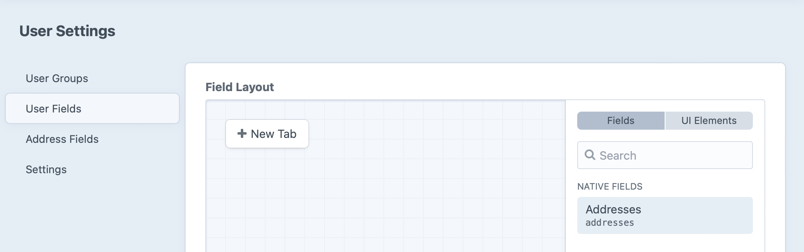
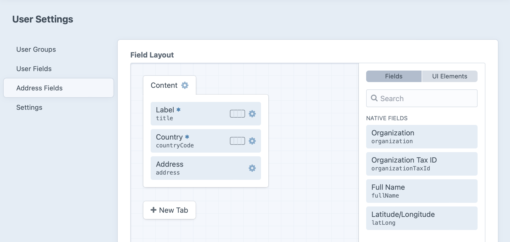

---
related:
  - uri: /commerce/4.x/addresses.md
    label: Using addresses in Craft Commerce
  - uri: ../controllers/controller-actions.md # Temporary!
    label: Controller actions reference
containsGeneratedContent: yes
---

# Addresses

Addresses are a type of [element](../../system/elements.md) you’ll most commonly encounter in conjunction with [Users](./users.md). [Querying addresses](#querying-addresses) and working with their [field data](#fields-and-formatting) is nearly identical to the experience working with any other element type.

For sites supporting [public registration](../../system/user-management.md#public-registration) (like a storefront built on [Craft Commerce](/commerce/4.x/)) users can manage their own [address book](#managing-addresses).

::: tip
Plugins are also able to use addresses to store their own location data.
:::

## Setup <badge text="Pro" type="edition" vertical="middle">Pro</badge>

The address management interface can be added to the User field layout by navigating to  **Settings** → **Users** -> **User Fields**.



Create a “Contact Information” tab and drag the **Addresses** field layout element into it to make the interface available on every user detail page.

::: tip
Clicking the <icon kind="settings" /> settings icon on the address field layout element opens additional settings for the address management UI, including tools for [displaying it conditionally](../../system/fields.md#field-layouts).
:::

Take a look at any User’s edit screen to get familiar with the interface:


Back in **User Settings**, the **Address Fields** editor lets you manage the fields that are part of each address. **Label**, **Country**, and **Address** are included by default, with several other native fields available:



### Native and Custom Fields

The address field layout has additional native (but optional) fields for a handful of useful attributes. Addresses—just like other element types—support custom fields for anything else you might need to store.

For compatibility and localization, core address components (aside from the Country Code) can’t be separated from one another in the field layout.

### Config Options

You may set a default country for new addresses via the <config4:defaultCountryCode> setting.

## Querying Addresses

You can fetch addresses in your templates or PHP code using an [AddressQuery](craft4:craft\elements\db\AddressQuery).

::: code
```twig
{# Create a new address query #}

```
```php
// Create a new address query
$myAddressQuery = \craft\elements\Address::find();
```
:::

::: tip
Addresses are just elements, so everything you know about [Element Queries](../../development/element-queries.md) applies here!
:::

### Example

Let’s output a list of the logged-in user’s addresses:

1. Create an address query with `craft.addresses()`.
2. Restrict the query to addresses owned by the current User, with the [`owner`](#owner) parameter.
3. Fetch the addresses with `.all()`.
4. Loop through the addresses using a [`` tag](https://twig.symfony.com/doc/3.x/tags/for.html).
5. Output preformatted address details with the [`|address`](../twig/filters.md#address) filter.

```twig
{% requireLogin #}




  <address>{{ addr|address }}</address>

```

We’ll expand on this example in the [Managing Addresses](#managing-addresses) section.

::: warning
Protect your users’ personal information by carefully auditing queries and displaying addresses only on pages that [require login](../twig/tags.md#requirelogin).
:::

### Parameters

Address queries support the following parameters:

<!-- This section of the page is dynamically generated! Changes to the file below may be overwritten by automated tools. -->
!!!include(docs/.artifacts/cms/5.x/addresses.md)!!!

## Address Repository

The [commerceguys/addressing](https://github.com/commerceguys/addressing) library powers planet-friendly address handling and formatting, and its exhaustive repository of global address information is available to all Craft projects. If you need a list of countries, states, or provinces, for example, you can fetch them via Craft’s [Addresses](craft4:craft\services\Addresses) service, from Twig templates or PHP:

::: code
```twig

```
```php
$countries = Craft::$app->getAddresses()->getCountryRepository()->getAll();
```
:::

This returns an array of [Country](https://github.com/commerceguys/addressing/blob/master/src/Country/Country.php) objects, indexed by their two-letter code. You might use this to populate a drop-down menu:

```twig
<select name="myCountry">
  
    <option value="{{ code }}">{{ country.name }}</option>
  
</select>

{# Output:
<select name="myCountry">
  <option value="AF">Afghanistan</option>
  <option value="AX">Åland Islands</option>
  ...
</select>
#}
```

Similarly, a repository of subdivisions are available, hierarchically—with up to three levels, depending on how a given country is organized: _Administrative Area_ → _Locality_ → _Dependent Locality_.

Expanding upon our previous example, we could output a nicely organized list of “administrative areas,” like this:

```twig



<select name="administrativeArea">
  
    

    <optgroup label="{{ country.name }}">
      
        <option value="{{ a.code }}">{{ a.name }}</option>
      
    </optgroup>
  
</select>
```

Either repository’s `getList()` method is a shortcut that returns only key-value pairs, suitable for our examples—it also accepts an array of “parent” groups (beginning with country code) to narrow the subdivisions.

You may supplement the subdivision data provided by the [upstream repository](https://github.com/commerceguys/addressing) by listening to the <craft4:craft\services\Addresses::EVENT_DEFINE_ADDRESS_SUBDIVISIONS> event in a plugin or module. Similarly, deeper customization of the required [fields](#fields-and-formatting) (and those fields’ [labels](#attribute-labels)) may require modifying the defaults via the [EVENT_DEFINE_USED_SUBDIVISION_FIELDS](craft4:craft\services\Addresses::EVENT_DEFINE_USED_SUBDIVISION_FIELDS) or [EVENT_DEFINE_FIELD_LABEL](craft4:craft\services\Addresses::EVENT_DEFINE_FIELD_LABEL) events.

::: tip
Check out the [addressing docs](https://github.com/commerceguys/addressing#data-model) for more details and examples of what’s possible—including translation of place names, postal codes, timezones, and [formatting](#fields-and-formatting)!
:::

## Fields and Formatting

### Field Handles

Individual fields—native and custom—are accessed via their handles, like any other element:

```twig
<ul>
  <li>Name: {{ myAddress.title }}</li>
  <li>Postal Code: {{ myAddress.postalCode }}</li>
  <li>Custom Label Color: {{ myAddress.myCustomColorFieldHandle }}</li>
</ul>
```

### Attribute Labels

The addressing library’s abstracted _Administrative Area_ → _Locality_ → _Dependent Locality_ terminology probably isn’t what you are accustomed to calling those address components in your part of the world—and it’s even less likely you’d want to show those terms to site visitors.

You can use any address element’s `attributeLabel()` method to get human-friendly labels for a given locale. Assuming we’re working with a U.S. address…

```twig
{{ myAddress.attributeLabel('administrativeArea') }} {# State #}
{{ myAddress.attributeLabel('locality') }} {# City #}
{{ myAddress.attributeLabel('dependentLocality') }} {# Suburb #}
{{ myAddress.attributeLabel('postalCode') }} {# Zip Code #}
```

Labels use the address’s current `countryCode` value for localization.

### `|address` Formatter

You can use the [`|address`](../twig/filters.md#address) filter to output a formatted address with basic HTML:

```twig
{{ myAddress|address }}
{# Output:
  <p translate="no">
    <span class="address-line1">1234 Balboa Towers Circle</span><br>
    <span class="locality">Los Angeles</span>, <span class="administrative-area">CA</span> <span class="postal-code">92662</span><br>
    <span class="country">United States</span>
  </p>
#}
```

The default formatter includes the following options:

- **locale** – defaults to `'en'`
- **html** – defaults to `true`; disable with `false` to maintain line breaks but omit HTML tags
- **html_tag** – defaults to `p`
- **html_attributes** – is an array that defaults to `['translate' => 'no']`

```twig
{# Swap enclosing paragraph tag for a `div`: #}
{{ myAddress|address({ html_tag: 'div' }) }}
{# Output:
  <div translate="no">
    <span class="address-line1">1234 Balboa Towers Circle</span><br>
    <span class="locality">Los Angeles</span>, <span class="administrative-area">CA</span> <span class="postal-code">92662</span><br>
    <span class="country">United States</span>
  </div>
#}

{# Turn the entire address into a Google Maps link: #}
{{ myAddress|address({
  html_tag: 'a',
  html_attributes: {
    href: url('https://maps.google.com/maps/search/', {
      query_place_id: address.myCustomPlaceIdField,
    }),
  },
}) }}
{# Output:
  <a href="https://maps.google.com/maps/search/?query_place_id=...">
    <span class="address-line1">1234 Balboa Towers Circle</span><br>
    <span class="locality">Los Angeles</span>, <span class="administrative-area">CA</span> <span class="postal-code">92662</span><br>
    <span class="country">United States</span>
  </a>
#}

{# Omit all HTML tags: #}
{{ myAddress|address({ html: false }) }}
{# Output:
  1234 Balboa Towers Circle
  Los Angeles, CA 92662
  United States
#}

{# Force output in the Ukrainian (`uk`) locale: #}
{{ myAddress|address({ html: false, locale: 'uk' }) }}
{# Output:
  1234 Balboa Towers Circle
  Los Angeles, CA 92662
  Сполучені Штати
#}
```

### Customizing the Formatter

You can also pass your own formatter to the `|address` filter. The addressing library includes [PostalLabelFormatter](https://github.com/commerceguys/addressing/blob/master/src/Formatter/PostalLabelFormatter.php) to make it easier to print shipping labels. Here, we can specify that formatter and set its additional `origin_country` option:

```twig
{# Use the postal label formatter #}


{{ addr|address({ origin_country: 'GB' }, labelFormatter) }}
{# Output:
  1234 Balboa Towers Circle
  LOS ANGELES, CA 92662
  UNITED STATES
#}
```

You can also write a custom formatter that implements [FormatterInterface](https://github.com/commerceguys/addressing/blob/master/src/Formatter/FormatterInterface.php). We could extend the default formatter, for example, to add a `hide_countries` option that avoids printing the names of specified countries:

```php
<?php

namespace mynamespace;

use CommerceGuys\Addressing\AddressInterface;
use CommerceGuys\Addressing\Formatter\DefaultFormatter;
use CommerceGuys\Addressing\Locale;
use craft\helpers\Html;

class OptionalCountryFormatter extends DefaultFormatter
{
    /**
     * @inheritdoc
     */
    protected $defaultOptions = [
        'locale' => 'en',
        'html' => true,
        'html_tag' => 'p',
        'html_attributes' => ['translate' => 'no'],
        'hide_countries' => [],
    ];

    /**
     * @inheritdoc
     */
    public function format(AddressInterface $address, array $options = []): string
    {
        $this->validateOptions($options);
        $options = array_replace($this->defaultOptions, $options);
        $countryCode = $address->getCountryCode();
        $addressFormat = $this->addressFormatRepository->get($countryCode);

        if (!in_array($countryCode, $options['hide_countries'])) {
            if (Locale::matchCandidates($addressFormat->getLocale(), $address->getLocale())) {
                $formatString = '%country' . "\n" . $addressFormat->getLocalFormat();
            } else {
                $formatString = $addressFormat->getFormat() . "\n" . '%country';
            }
        } else {
            // If this is in our `hide_countries` list, omit the country
            $formatString = $addressFormat->getFormat();
        }

        $view = $this->buildView($address, $addressFormat, $options);
        $view = $this->renderView($view);
        $replacements = [];

        foreach ($view as $key => $element) {
            $replacements['%' . $key] = $element;
        }

        $output = strtr($formatString, $replacements);
        $output = $this->cleanupOutput($output);

        if (!empty($options['html'])) {
            $output = nl2br($output, false);

            // Add the HTML wrapper element with Craft’s HTML helper:
            $output = Html::tag($options['html_tag'], $output, $options['html_attributes']);
        }

        return $output;
    }
}
```

We can instantiate and use that just like the postal label formatter:

```twig
{# Use our custom formatter #}


{{ addr|address({ hide_countries: ['US'] }, customFormatter) }}
{# Output:
  1234 Balboa Towers Circle
  Los Angeles, CA 92662
#}
```

To replace the default formatter, add the following to your [application configuration](../config/app.md):

```php
return [
    // ...
    'components' => [
        // ...
        'addresses' => [
            'class' => \craft\services\Addresses::class,
            'formatter' => new \mynamespace\OptionalCountryFormatter(
                new \CommerceGuys\Addressing\AddressFormat\AddressFormatRepository(),
                new \CommerceGuys\Addressing\Country\CountryRepository(),
                new \CommerceGuys\Addressing\Subdivision\SubdivisionRepository()
            )
        ],
    ],
];
```

::: warning
The default formatter is used in the control panel as well as your templates, so make sure it includes all the information required for administrators to act on users’ information!
:::

## Managing Addresses

Users can add, edit, and delete their own addresses from the front-end via the `users/save-address` and `users/delete-address` [controller actions](../../development/forms.md#users-save-address).

Craft doesn’t automatically give Addresses their own URLs, though—so it’s up to you to define a [routing scheme](../../system/routing.md#advanced-routing-with-url-rules) for them via `routes.php`. We’ll cover each of these three routes in the following sections:

```php
<?php
return [
  // Listing Addresses
  'account' => ['template' => '_account/dashboard'],

  // New Addresses
  'account/addresses/new' => ['template' => '_account/edit-address'],

  // Existing Addresses
  'account/addresses/<addressUid:{uid}>' => ['template' => '_account/edit-address'],
];
```

::: tip
The next few snippets may be a bit dense—numbered comments are peppered throughout, corresponding to items in the **Guide** section just below it.
:::

#### Scaffolding

The following templates assume you have a layout functionally equivalent to the [models and validation](../../development/forms.md#models-and-validation) example.

### Listing Addresses

Let’s display the current user’s address book on their account “dashboard.”

::: code
```twig _account/dashboard.twig




{# 1. Load Addresses: #}



  <h1>Hello, {{ currentUser.fullName }}!</h1>

  
    <ul>
      
        <li>
          {{ address.title }}<br>
          {{ address|address }}<br>

          {# 2. Build an edit URL: #}
          <a href="{{ url("account/addresses/#{address.uid}") }}">Edit</a>

          {# 3. Use a form to delete Addresses: #}
          <form method="post">
            {{ csrfInput() }}
            {{ actionInput('users/delete-address') }}
            {{ hiddenInput('addressId', address.id) }}

            <button>Delete</button>
          </form>
        </li>
      {% endfor $}
    </ul>
  
    <p>You haven’t added any addresses, yet!</p>
  

  {# 4. Link to "new" route: #}
  <p><a href="{{ url('account/addresses/new') }}">New Address</a></p>

```
:::

#### Guide

1. We’re using a <craft4:craft\elements\User> convenience method to load the current user’s saved addresses, but this is equivalent to our earlier [query example](#querying-addresses).
2. These URLs will need to match the pattern defined in `routes.php`. In our case, that means we need to interpolate the Address’s UID into the path.
3. [Deleting an Address](../../development/forms.md#post-users-delete-address) requires a <badge vertical="baseline" type="verb">POST</badge> request, which—for the sake of simplicity—we’re handling with a regular HTML form.
4. The [New Address](#new-addresses) route is static—there’s nothing to interpolate or parameterize.

### New Addresses

The code for new addresses will end up being reused for [existing addresses](#existing-addresses).

::: code
```twig _account/edit-address.twig





  <h1>New Address</h1>

  {# 1. Render the form #}
  {{ include('_account/address-form', {
    address: address ?? create('craft\\elements\\Address'),
  }) }}

```
```twig _account/address-form.twig
<form method="post">
  {{ csrfInput() }}

  {# 2. Set the controller action: #}
  {{ actionInput('users/save-address') }}

  {# 3. Special cases for existing addresses: #}
  
    {{ hiddenInput('addressId', address.id) }}
  

  {# 4. Redirection: #}
  {{ redirectInput('account/addresses/{uid}') }}

  {# 5. Address Fields: #}

  <label for="title">Title</label>
  <input
    type="text"
    name="title"
    id="title"
    value="{{ address.title }}">

  <label for="addressLine1">Address Line 1</label>
  <input
    type="text"
    name="addressLine1"
    id="addressLine1"
    value="{{ address.addressLine1 }}">

  <label for="addressLine2">Address Line 2</label>
  <input
    type="text"
    name="addressLine2"
    id="addressLine2"
    value="{{ address.addressLine2 }}">

  <label for="countryCode">Country</label>
  <select name="countryCode" id="countryCode">
    
      {{ tag('option', {
        value: country.countryCode,
        selected: country.countryCode == address.countryCode,
        text: country.name,
      }) }}
    
  </select>

  {# ... #}

  <button>Save</button>
</form>
```
:::

#### Guide

1. We pass an <craft4:craft\elements\Address> to the form partial—either from an `address` variable that is available to the template after an attempted submission (say, due to validation errors), or a new one instantiated with the [`create()` function](../twig/functions.md#create).
2. Whether we’re creating a new address or editing an existing one (this partial handles both), the request should be sent to the `users/save-address` action.
3. Addresses that have been previously saved will have an `id`, so we need to send that back to apply updates to the correct Address.
4. The [`redirectInput()` function](../twig/functions.md#redirectinput) accepts an [object template](../../system/object-templates.md), which can include properties of the thing we’re working with. The template won’t be evaluated when it appears in the form—instead, Craft will render it using the address element _after_ it’s been successfully saved. In this case, we’ll be taken to the [edit screen](#existing-addresses) for the newly-saved address.
5. Which fields are output is up to you—but be aware that the selected `countryCode` may influence what additional address fields are required. If you want to capture input for [custom fields](../../system/fields.md), it should be nested under the `fields` key, as it is for entries and other element types: `<input type="text" name="fields[myCustomFieldHandle]" value="...">`

::: tip
See the [complete list of parameters](../../development/forms.md#post-users-save-address) that can be sent to the `users/save-address` action.
:::

### Existing Addresses

To edit an existing address, we’ll use the `addressUid` parameter from our route.

```twig




{# 1. Resolve the address: #}


{# 2. Make sure we got something: #}

  



  <h1>Edit Address: {{ address.title }}</h1>

  {# 3. Render form: #}
  {{ include('_account/address-form', {
    address: address,
  }) }}

```

#### Guide

1. In one statement, we’re checking for the presence of an `address` variable sent back to the template by a prior submission, and falling back to a lookup against the user’s Addresses. By calling `.owner(currentUser)`, we can be certain we’re only ever showing a user an Address they own.
2. If an Address wasn’t passed back to the template, _and_ the UID from our route didn’t match one of the current user’s addresses, we bail.
3. The Address is passed to the form partial for rendering—see the [new address example](#new-addresses) for the form’s markup.


## Validating Addresses

Addresses are validated like any other type of element, but some of the rules are dependent upon its localized format.

You can set requirements for custom fields in the Address Fields [field layout](#native-custom-fields), but additional validation of any address properties requires a [custom plugin or module](/4.x/extend/).

::: tip
Take a look at the [Using Events in a Custom Module](kb:custom-module-events) article for a dedicated primer on module setup and events.
:::

[Validation rules](guide:input-validation) are added via the `Model::EVENT_DEFINE_RULES` event:

```php
use yii\base\Event;
use craft\base\Model;
use craft\elements\Address;
use craft\events\DefineRulesEvent;

Event::on(
    Address::class,
    Model::EVENT_DEFINE_RULES,
    function(DefineRulesEvent $event) {
        $event->rules[] = [
            ['fullName'],
            'match',
            'pattern' => '/droid|bot/i',
            'message' => Craft::t('site', 'Robots are not allowed.'),
        ];
    }
);
```

Errors are available through the same `address.getErrors()` method used in other action and [model validation examples](../../development/forms.md#models-and-validation), regardless of whether they were produced by built-in rules or ones you added.
