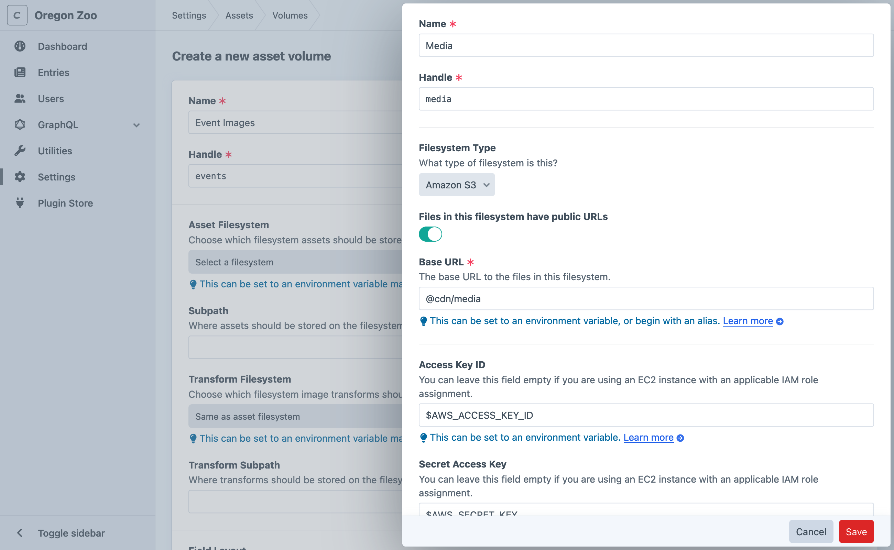
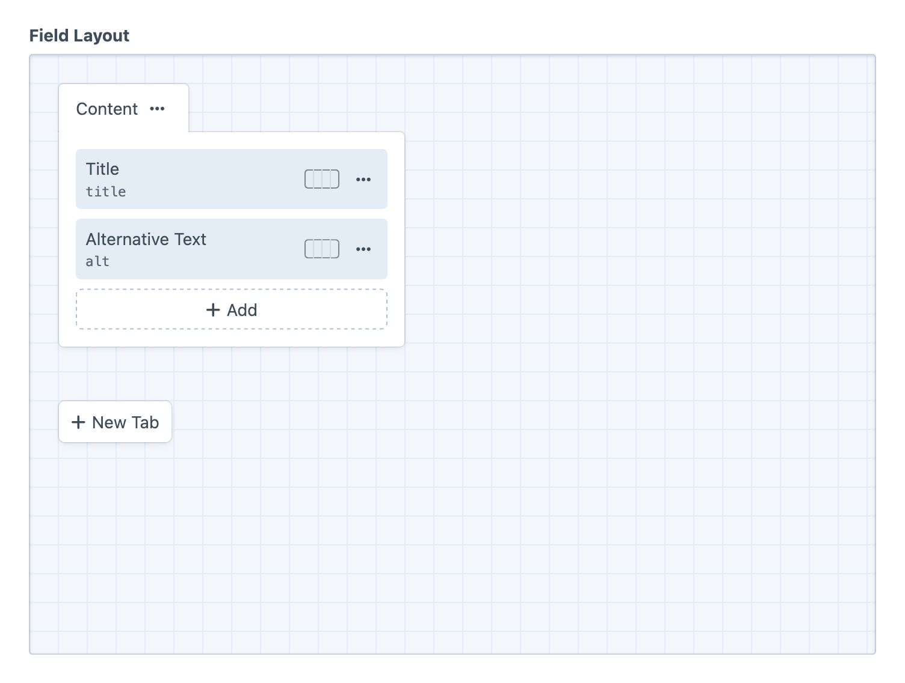

# Assets

Craft lets you manage media and document files (“assets”) just like entries and other content types. Assets can live anywhere—a directory on the web server, or a remote storage service like Amazon S3.

<!-- more -->

Assets are one of Craft’s built-in [element types](../../system/elements.md), and are represented throughout the application as instances of <craft5:craft\elements\Asset>.

## Volumes

Assets are organized into **volumes**, each of which sits on top of a [filesystem](#filesystems) and carries its own permissions and [content](#asset-custom-fields) options. Volumes are configured from **Settings** → **Assets**.

When setting up a volume, you will be asked to choose or create its underlying filesystem.

<BrowserShot
  url="https://my-craft-project.ddev.site/admin/assets/volumes/new"
  :link="false"
  caption="You can create a filesystem without leaving the volume screen.">

</BrowserShot>

Volumes can store their [transforms](#image-transforms) alongside the original images, or in a separate filesystem altogether. This is useful for private volumes or filesystems that still benefit from having previews available in the control panel.

## Filesystems

Filesystems decouple the minutiae of storing and serving actual files from asset management (organization, permissions, and content).

All filesystems support the following options:

- **Files in this filesystem have public URLs**: Whether Craft should bother to generate URLs for the assets.
- **Base URL**: The public URL to files in this filesystem.

::: tip
A filesystem’s **Base URL** can be set to an environment variable, or begin with an alias. [Read more](../../configure.md#control-panel-settings) about special configuration values.

In the screenshot above, we’re using a `@cdn` [alias](../../configure.md#aliases) so that the URL can be updated across multiple filesystems with a single change in our general config file—or even with an environment variable, if the alias gets _its_ value from one!
:::

Multiple volumes can share a single filesystem, so long as they each have a unique and non-overlapping **Base Path**. If another volume is already mounted at the top level of a filesystem, that filesystem won’t be available for selection.

### Local Filesystems

Out of the box, the only type of filesystem Craft supports is a “Local” directory, which stores files on the same server that PHP is running. Local filesystems have one additional setting:

- **Base Path**: Set the filesystem’s root directory on the server. This must be within your web root for public URLs to work, and Craft/PHP must be able to write to it.

::: tip
The **Base Path** can be set to an environment variable or begin with an alias, just like the **Base URL**.

Avoid using the `@web` alias for Local filesystems’ **Base URL** unless you’ve set it to a fixed value across all sites. Otherwise, Craft may construct asset URLs that include that subpath and not properly map to the filesystem’s root.
:::

<a id="remote-volumes"></a>

### Remote Filesystems

If you would prefer to store your assets on a remote storage service like Amazon S3, you can install a plugin that provides the appropriate filesystem adapter.

- [Amazon S3](plugin:aws-s3) (first party)
- [Google Cloud Storage](plugin:google-cloud) (first party)
- [Microsoft Azure Blob Storage](plugin:azure-blob) (first party)
- [DigitalOcean Spaces](plugin:dospaces) (Værsågod)

The settings for each type of filesystem will differ based on the provider, and may involve secrets. We recommend using [special config values](../../configure.md#control-panel-settings) to store and use these, securely.

::: tip
Discover more remote storage options in the [Assets category](https://plugins.craftcms.com/categories/assets?craft5) of the Plugin Store!
:::

## Asset Custom Fields

Each volume has its own [field layout](../../system/fields.md#field-layouts), configured on its setting screen under the **Field Layout** tab.

### `alt` Text

Asset field layouts can include the native **Alternative Text** <Poi label="1" target="assetFieldLayout" id="altText" /> field layout element:

<BrowserShot
  url="https://my-craft-project.ddev.site/admin/assets/volumes/1"
  :link="false"
  id="assetFieldLayout"
  :poi="{
    altText: [90, 32.5],
  }">

</BrowserShot>

A native `alt` attribute is provided to standardize the inclusion of assistive text on `img` elements that Craft generates—especially in the control panel. Alt text is also added when outputting an image with `asset.getImg()` in Twig. You can always render `img` elements yourself, using any [custom field](../../system/fields.md) values, attributes, or combination thereof. 

We strongly recommend adding the native attribute to your volumes’ field layouts; alt text is a critical interface for many users, and essential for anyone using assistive technology in the control panel. Well-considered image descriptions (and titles!) have the added benefit of making search and discovery of previously-uploaded images much easier. The WCAG [advises against](https://www.w3.org/TR/2015/REC-ATAG20-20150924/Overview.html#gl_b23) automatically repairing alt text with “generic or irrelevant strings,” including the name of the file (which asset titles are generated from), so Craft omits the `alt` attribute when using `asset.getImg()` if no explicit text is available.

**Alternative Text** is also displayed as a “transcript” beneath video previews, in the control panel.

::: tip
Do you have existing `alt` text stored in a different field? You can migrate it to the native attribute with the [`resave/assets` command](../cli.md#resave):

```bash
php craft resave/assets --set alt --to myAltTextField --if-empty
```
:::

## Assets Page

After creating your first volume, an **Assets** item will be added to the main control panel navigation. Clicking on it will take you to the Assets page, which shows a list of all of your volumes in the left sidebar, and the selected volume’s files and subfolders in the main content area.

In addition to the normal actions available in [element indexes](../../system/elements.md#indexes), asset indexes support:

- Uploading new files using the **Upload files** toolbar button or by dragging files from your desktop;
- Creating and organizing [folders](#managing-subfolders) within a volume;
- Transferring a file from one volume to another by dragging-and-dropping it from the element index into a folder in the sources sidebar (or using the **Move…** element action);

Special [element actions](../../system/elements.md#actions) are also available for single assets:

- Rename an existing file;
- Replace a file with a new one;
- Open the [image editor](#image-editor) (images only);
- Preview a file;
- Copy a public URL to a file;
- Copy a reference tag to a file;
- Move the selected assets to a new volume and/or folder;

### Managing Subfolders

<BrowserShot
  url="https://my-craft-project.ddev.site/admin/assets/uploads"
  :link="false"
  id="assetIndex"
  :poi="{
    breadcrumbs: [42, 21],
    folder: [57, 34],
    dragging: [46, 42],
    actions: [67, 94],
  }">

</BrowserShot>

Volumes are initialized with only a root folder, indicated by a “home” icon in the breadcrumbs. Subfolders can be created by clicking the caret <Poi label="1" target="assetIndex" id="breadcrumbs" /> next to the current folder.

The new subfolder will appear in-line <Poi label="2" target="assetIndex" id="folder" /> with the assets in the current folder. Assets and folders can be moved in a few different ways:

- Drag-and-drop <Poi label="3" target="assetIndex" id="dragging" /> one or more assets onto a folder in the table or thumbnail view _or_ onto a breadcrumb <Poi label="1" target="assetIndex" id="breadcrumbs" /> segment;
- Select assets with the checkboxes in each row, choose **Move…** from the actions <Poi label="4" target="assetIndex" id="actions" /> menu, and pick a destination folder;
- An entire folder can also be moved using the caret next to its breadcrumb;

The first method is a great way to quickly move assets into a parent directory, or back to the volume’s root folder.

::: tip
You can automatically organize assets when they are uploaded via an [assets field](../field-types/assets.md) with the **Restrict assets to a single location** setting.
:::

## Updating Asset Indexes

If any files are ever added, modified, or deleted outside of Craft (such as over FTP), you’ll need to tell Craft to update its indexes for the volume. You can do that from **Utilities** → **Asset Indexes**.

You will have the option to cache remote images. If you don’t have any remote volumes (Amazon S3, etc.), you can safely ignore it. Enabling the setting will cause the indexing process to take longer to complete, but it will improve the speed of [image transform](../../development/image-transforms.md) generation.

## Image Transforms

Craft provides a way to perform a variety of image transformations to your assets. See [Image Transforms](../../development/image-transforms.md) for more information.

## Image Editor

Craft provides a built-in Image Editor for making changes to your images. You can crop, straighten, rotate, and flip your images, as well as choose a focal point on them.

To launch the Image Editor, double-click an image (either on the Assets page or from an [Assets field](../field-types/assets.md)) and press **Edit** in the top-right of the image preview area in the HUD. Alternatively, you can select an asset on the [Assets page](#assets-page) and choose **Edit image** from the task menu (<icon kind="settings" />).

### Focal Points

Set focal points on your images so Craft knows which part of the image to prioritize when determining how to crop your images for [image transforms](../../development/image-transforms.md). Focal points take precedence over the transform’s Crop Position setting.

To set a focal point, open the Image Editor and click on the Focal Point button. A circular icon will appear in the center of your image. Drag it to wherever you want the image’s focal point to be.

To remove the focal point, click on the Focal Point button again.

Like other changes in the Image Editor, focal points won’t take effect until you’ve saved the image.

## Querying Assets

You can fetch assets in your templates or PHP code using **asset queries**.

::: code
```twig
{# Create a new asset query #}

```
```php
// Create a new asset query
$myAssetQuery = \craft\elements\Asset::find();
```
:::

Once you’ve created an asset query, you can set [parameters](#parameters) on it to narrow down the results, and then [execute it](../../development/element-queries.md#executing-element-queries) by calling `.all()`. An array of [Asset](craft5:craft\elements\Asset) objects will be returned.

<See path="../../development/element-queries.md" label="Introduction to Element Queries" description="Learn more about how element queries work." />

### Example

We can display a list of thumbnails for images in a “Photos” volume by doing the following:

1. Create an asset query with `craft.assets()`.
2. Set the [volume](#volume) and [kind](#kind) parameters on it.
3. Fetch the assets with `.all()`.
4. Loop through the assets using a [for](https://twig.symfony.com/doc/3.x/tags/for.html) tag to create the thumbnail list HTML.

```twig
{# Create an asset query with the 'volume' and 'kind' parameters #}


{# Fetch the assets #}


{# Display the thumbnail list #}
<ul>
  
    <li></li>
  
</ul>
```

::: warning
When using `asset.url` or `asset.getUrl()`, the asset’s source volume must have “Assets in this volume have public URLs” enabled and a “Base URL” setting. Otherwise, the result will always be empty.
:::

You can cache-bust asset URLs automatically by enabling the [revAssetUrls](config5:revAssetUrls) config setting, or handle them individually by using Craft’s [`url()` function](../twig/functions.md#url) to append a query parameter with the last-modified timestamp:

```twig

{#  #}
```

### Parameters

Asset queries support the following parameters:

<!-- This section of the page is dynamically generated! Changes to the file below may be overwritten by automated tools. -->
!!!include(docs/.artifacts/cms/5.x/assets.md)!!!
