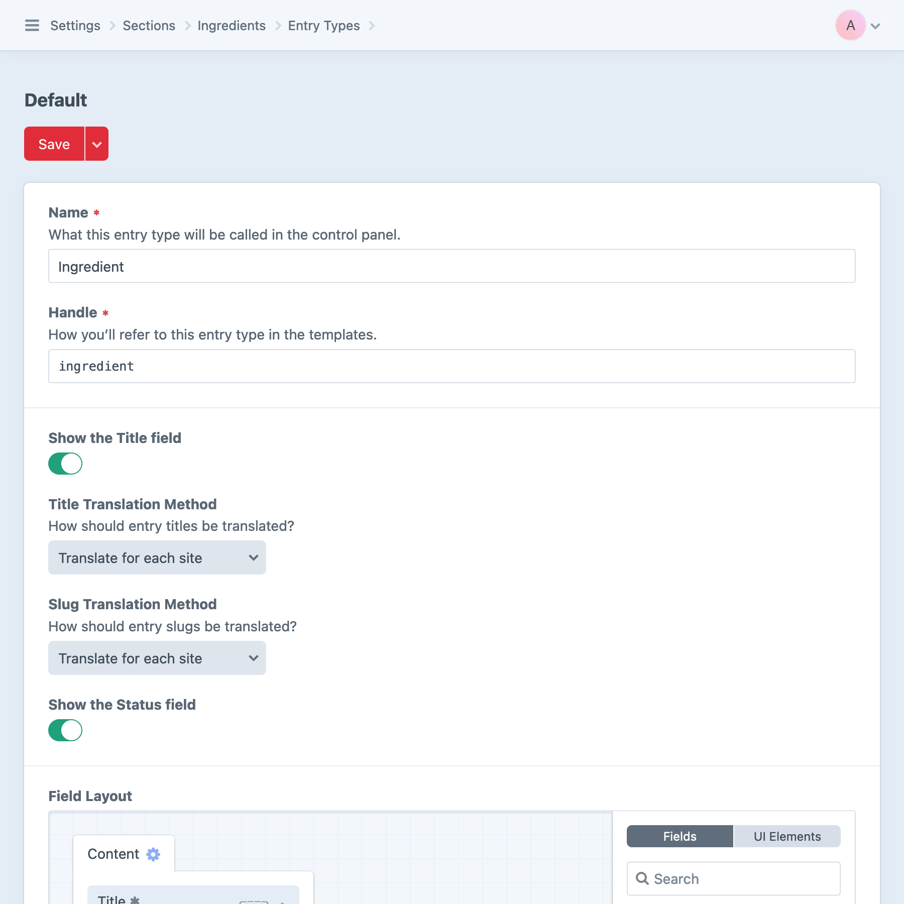
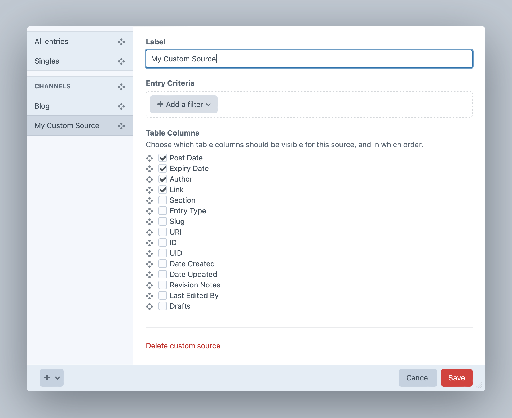

# Entries

Entries are flexible content containers that—unlike [addresses](addresses.md), [assets](assets.md), or [categories](categories.md)—have no primary or implied function. They are entirely agnostic building blocks, used to model whatever kind of content or data your project needs.

<!-- more -->

All entries support some key features like **Authors**, a **Post Date** and **Expiration Date**, **Statuses**, and content defined via  [field layouts](../../system/fields.md). Additional features and properties are determined via [entry types](#entry-types), or the [sections](#sections) and [Matrix fields](../field-types/matrix.md) they’re used in.

Authors can use the [drafts and revisions](#editing-entries) system to stage different versions of content and preview it before going live.

## Entry Types

Craft uses _entry types_ to define atomic units of content, which are then exposed to editors via [sections](#sections) and [Matrix fields](../field-types/matrix.md).

<Block label="Global Entry Types">

Entry types became a global resource in Craft 5. This means you can define a content type _once_, then use it in multiple sections, as a [nested](#nested-entries) block in a Matrix field, or some combination of the two. As a result, some settings have moved around!

Most importantly, you’ll manage entry types in the **Settings** &rarr; **Entry Types** screen—or create them on-the-fly when working on a section or Matrix field.

</Block>

<BrowserShot
  url="https://my-craft-project.ddev.site/admin/settings/sections/1/entry-types/1"
  :link="false"
  caption="Editing an entry type in the control panel.">
  
</BrowserShot>

Entry types have the following settings:

- **Name** — Used throughout the control panel as a UI label.
- **Handle** — Uniquely identifies entries of this type in [templates](../../development/templates.md) and [queries](../../development/element-queries.md).
- **Icon** and **Color** — Choose a symbol and color to subtly distinguish entries of this type throughout the control panel.
- **Show the Title field** — Entry titles can be set by the author or [dynamically defined](#dynamic-entry-titles) from other properties via an [object template](../../system/object-templates.md).
  - **Title Translation Method** — In multi-site projects, choose how titles are localized.
- **Show the Slug field** — As with titles, slugs can be manually or automatically generated.
  - **Slug Translation Method** — In multi-site projects, choose how slugs are localized.
- **Show the Status field** — Manually set each entry’s status, or allow it to be dictated by its usage.
- **Field Layout** — Add and arrange [custom fields](../../system/fields.md) to suit your content model.

### Dynamic Entry Titles

If you want your entries’ titles to be auto-generated from a template (rather than requiring authors to enter them manually), you can uncheck the **Show the Title field?** checkbox. When you do, a new **Title Format** setting will appear.

The **Title Format** is an [object template](../../system/object-templates.md) (just like the **Entry URI Format** and preview target **URL Format** we looked, above), and gets evaluated whenever entries with this type are saved.

### Translation Settings

Most localization behavior is determined by [section](#sections) and [field](../../system/fields.md) settings, but the translation of titles and slugs is governed by entry types.

The available translation methods are covered in the [custom fields documentation](../../system/fields.md#translation-methods).

## Sections

Sections organize and expose entry types for content authors. In each section you can define the following:

- Whether entries in the section have URLs;
- What the entries’ URLs should look like;
- Which template should get loaded if an entry’s URL is requested;
- What [entry types](#entry-types) are available in the section;
- How many authors can be associated with each entry;

If your project has multiple [sites](../../system/sites.md), your section can define these additional settings:

- Which sites entries in the section should target;
- Which sites entries are created in, by default;

To create a new section, go to **Settings** → **Sections** and choose **New Section**.

### Section Types

Craft has three different types of sections:

#### Singles


Singles are used for one-off pages or content objects that have unique requirements, such as…

- …a website’s homepage;
- …an _About Us_ page;
- …a _Contact Us_ page;

Unlike the other section types, singles only ever have _one_ entry associated with them, meaning their URIs can be static (like `contact-us`) rather than templatized (like `news/{slug}`).

::: tip
Singles have all the functionality of [globals](globals.md), and can even be pre-loaded into global Twig variables with the <config5:preloadSingles> config setting. As such, singles don’t have an editable **Author**, **Post Date**, or **Expiration Date**.

A single’s **Status** controls can be hidden with the **Show the Status field** setting in its selected **Entry Type**.
:::

#### Channels


Channels are used for lists or streams of similar content, such as…

- …posts on a blog;
- …articles in a knowledge base;
- …recipes;
- …reviews;

Entries in channels are intended to be queried and displayed ordered by one or more of their attributes or [custom fields](../../system/fields.md). Channels are also a simple way to maintain a flat taxonomy, standing in for [tags](tags.md) or [categories](categories.md).

#### Structures

Structures are an extension of channels that support explicit, hierarchical organization.


Unlike other section types, structure sections expose a **Structure** view option on their [element indexes](../../system/elements.md#indexes):


Types of content that might benefit from being defined as a structure include…

- …documentation;
- …a “Services” section, where the order of services matters;
- …a company organization chart with personnel and teams;
- …editable navigation menus;

Just like channels, entries in structures can be assigned [types](#entry-types). Structures offer great flexibility in presentation—in particular, the ability to collect nested content on a parent page, or alter the appearance of pages based on their hierarchical “depth” within a bundle of content.

::: tip
Structures can also make use of the **Maintain Hierarchy** setting on entries fields.
:::

Entries belonging to a structure are discrete from [nested entries](#nested-entries) in [Matrix](../field-types/matrix.md) fields. Structure entries can be freely moved around in their hierarchy (receiving new “parent” elements in the process), whereas nested entries are always owned by the element they were created within.

#### Custom Sources

Special element sources based on existing Singles, Channels, and Structures by creating _custom sources_. Each custom source lists all entries by default, but can be filtered to only those that meet the specified **Entry Criteria**.

To create a new custom source, go to **Entries** → **Customize Sources** (under the three dots in the sources sidebar), and from the bottom-left “+” menu choose **New custom source**:



::: warning
This same interface is available in the search bar of any [element index](../../system/elements.md#indexes), but the condition builder interface will differ in subtle ways, as custom sources are stored in Project Config.
:::

### Entry URI Formats

Channel and structure sections can choose whether their entries should be assigned URLs in the system by filling in the **Entry URI Format** setting. Singles have a “URI” setting, but it is typically defined statically or omitted (if it doesn’t need its own URL).

The entry URI format is an [object template](../../system/object-templates.md), which gets evaluated each time an entry in the section is saved. The result is saved as the entry’s **URI** in the system, and is used to generate URLs (i.e. via `entry.url`) and when Craft is determining how to [route](../../system/routing.md) a request.

When Craft matches a request to an entry, its section’s designated **Template** is rendered. That template is automatically provided an `entry` variable, set to the resolved <craft5:craft\elements\Entry> object, and ready to output any of its attributes or custom field data.

#### Hierarchical URIs

Structure sections may benefit from nested paths, for child entries:

```twig
{parent.uri}/{slug}
```

Suppose our structure represents geographic regions on Earth. With the above **Entry URI Format**, a top-level “continent” entry URI might be `south-america`; a nested “country” entry’s URI would then be `south-america/chile`.

Structure sections might also want to include a segment before the nested path:

```twig
{parent.uri ?? 'earth'}/{slug}
```

The above template could also be expressed with this syntax:

```twig
earth{parent.uri}/{slug}
```

With the above Entry URI Format, a top-level entry’s URI would be `earth/south-america`, with a nested entry having `earth/south-america/chile`.

::: tip
Consider these tips for creating special URIs:

- A URI that evaluates to `__home__` (and nothing more) will be available at your site’s base path;
- An empty URI means the entry does not get a route and will not have a public URL—unless you define one manually via `routes.php`;
- Any Twig statement can be used to output values in a URI template—including ones that query for other elements,  e.g. `{{ craft.entries().section('mySingle').one().slug }}/news`;
- [Aliases](../../configure.md#aliases-and-environment-variables) can be evaluated with the [`alias()` function](../twig/functions.md#alias): `{{ alias('@basePressUri') }}/news`, `{{ alias('@mySectionUri') }}`.
- The [null-coalescing operator](https://twig.symfony.com/doc/3.x/templates.html#other-operators) (`??`) can silently swallow undefined variable errors (like `parent.uri`, above);
:::

#### Nested Entry URLs

[Nested entries](#nested-entries) in Matrix fields can also be configured to have URLs—but the settings are part of the field, not a section.

A single entry type may have URLs in some contexts, and not in others!

### Preview Targets

If you’re using Craft Pro, your section can have one or more **Preview Targets**, or URLs where your entries will show up on. This makes it possible for authors to preview entries as they are writing them in the control panel, or share a private URL with colleagues to view changes prior to publishing.

Like entry URI formats, these preview target URLs are simple Twig templates that can contain entry properties and other dynamic values.

Use single curly braces to render attributes on the entry. For example if entries in your section have their own URLs, then you can create a preview target for the entry’s primary URL using the URL template, `{url}`.

Create additional preview targets for any other areas the entry might show up, such as `news`, or `archive/{postDate|date('Y')}`. If the entries show up on the homepage, you can create a preview target with a blank URL (unlike URI formats, a blank URL _is_ valid, here).


Preview target **URL Formats** support slightly different features than for **URI Formats**:

- If you want to include the entry’s ID or UID in a preview target URL, use `{canonicalId}` or `{canonicalUid}` rather than `{id}` or `{uid}`, so the source entry’s ID or UID is used rather than the [draft](#drafts)’s;
- You can use [environment variables and aliases](../../configure.md#control-panel-settings) in the preview target URL. These _do not_ get wrapped in curly braces on their own, as they are not part of the [object template](../../system/object-templates.md). Aliases may be part of a longer URI (e.g.`@headlessUrl/news/{slug}`), but environment variables can only be used on their own (e.g. `$NEWS_INDEX`);

When an author is editing an entry from a section with custom preview targets, the **View** button will be replaced with a menu that lists the **Primary entry page** (if the section has an Entry URI Format), plus the names of each preview target.


If you share a link from this menu that includes a preview token, it will expire by default after one day. You can customize this with the [defaultTokenDuration](config5:defaultTokenDuration) config setting.

The targets will also be available within **Preview**.

#### Previewing Decoupled Front Ends

If your site’s front end lives outside of Craft (e.g. as a Vue or React app), you can still support previewing drafts and revisions with **Preview** or **Share** buttons. To do that, your front end must check for the existence of a `token` query string parameter (or whatever the <config5:tokenParam> setting is). If it’s in the URL, then you will need to pass that same token in the request that loads the page content. This token will cause the API request to respond with the correct content based on what the token was created to preview.

<Block label="Nuxt Example">

Whether you are using the Element API plugin or the built-in [GraphQL](../../development/graphql.md) API, Craft automatically injects preview elements whenever they match the query being executed.

To illustrate, suppose you were building a [Nuxt](https://nuxt.com/) application, and you used the [file-based routing scheme](https://nuxt.com/docs/getting-started/routing) to render blog posts: you would create `pages/blog/[slug].vue`, then define a preview target in Craft with a similar path, like `@nuxt/blog/{slug}`.

```vue
<script setup>
const route = useRoute();

// Construct a GraphQL fragment using the route param:
const query = `{
  entry(slug: "${route.params.slug}") {
    title
    description
  }
}`;

// Fetch the incoming token:
const token = route.query.token;

// Build the URL, with `query` and `token` params:
const { data: gql } = await useFetch('https://my-project.ddev.site/api', {
  params: { query, token },
});
</script>

<template>
  <article>
    <h1>{{ gql.data.entry.title }}</h1>
    <code>{{ gql.data.entry.uid }}</code>
  </article>
</template>
```

This assumes you have defined a [GraphQL API route](../../development/graphql.md#setting-up-your-api-endpoint) of `api`, and that the previewed entry will reliably have (at least) a slug set. When the `token` param is omitted, Nuxt ignores it and the GraphQL API will respond as though it were any other request for an entry with the given slug.

</Block>

You can pass the token via either a query string parameter named after your <config5:tokenParam> config setting, or an `X-Craft-Token` header.

::: tip
For live preview, you should also consider [enabling iFrame Resizer](config5:useIframeResizer) so that Craft can maintain the page scroll position between page loads.
:::

## Nested Entries

Entries also power the [Matrix](../field-types/matrix.md) and [CKEditor](plugin:ckeditor) fields, which means your [entry types](#entry-types) can represent entire pages, or the building blocks thereof. How you implement your content model and authoring experience is entirely up to you!

Nested entries are an implementation of nested _elements_, a broader category of “owned” elements that also includes [addresses](addresses.md).

## Editing Entries

If you have at least one section, there will be an **Entries** menu item in the primary control panel navigation. Clicking on it will take you to the entry [index](../../system/elements.md#indexes). From there, you can navigate to the entry you wish to edit, or create a new one.

Depending on your section’s settings, can perform some or all of the following actions from any entry’s edit screen:

- Choose the entry type (if there is more than one to choose from);
- Edit the entry’s **Title**, **Slug**, and [custom field](../../system/fields.md) values;
- Choose the entry’s **Authors** <Badge type="edition" vertical="middle" title="Entries can only have authors in Craft Pro">Pro</Badge>;
- Choose the entry’s **Parent** (if it’s within a [Structure](#structures) section);
- Set the entry’s **Post Date** (when it will be considered published);
- Set the entry’s **Expiration Date** (optional);
- Choose whether the entry is **Enabled** or not (globally, and/or per-site);
- Save changes to the entry;
- Save a new [draft](#drafts) of the entry;
- View [revisions](#revisions) of the entry;
- Apply changes from a derivative (draft or revision);

::: tip
If you leave the **Post Date** blank, Craft will automatically set it the first time an entry is saved as enabled.
:::

### Entry Creation

As soon as you click **New entry**, Craft creates an empty entry, and redirects you to its edit screen. This gives the system a place to auto-save your edits—effectively a new entry represented only as a [draft](#drafts). Internally, this is called a “fresh” entry.

Once you add some content to a fresh entry (or explicitly choose **Save draft** from the **Create entry** menu), Craft marks the draft as having been saved, and will expose it in element indexes when using the **All** or **Draft** status options.

::: tip
Stray drafts (those that were created but never edited or explicitly saved) are automatically [garbage-collected](../../system/gc.md), respecting the <config5:purgeUnsavedDraftsDuration> setting.
:::

The entry editing lifecycle is designed to provide authors clear, actionable information about the state of their content, and to prevent unintended loss. Let’s look more closely at a few supporting features.

### Drafts

As soon as you alter a field on an entry, Craft auto-saves the changes as a _provisional draft_.


Subsequent edits are also saved to your provisional draft, and made available any time you view that entry in the control panel. Each user gets their own provisional draft, so your changes are private.

Pressing the **Save** button applies changes from a provisional draft to its _canonical_ entry, and creates a _revision_ (if its section supports revisions).

If you aren’t ready to publish your changes, you can instead press **Create a Draft** to save your work as a new _draft_. You may have as many regular drafts as you wish—and those drafts can have their own name and notes to help you track what you’re working on. The name of your current draft (if any) is shown at the top of the edit screen in the [revision](#revisions) menu.

::: warning
Your drafts may be visible to (and editable by) other users! While an auto-saved _provisional_ draft is always private, the visibility of _saved_ drafts is governed by users’ [permissions for the entry’s section](../../system/user-management.md#permissions).
:::

While Craft’s auto-saving behavior creates a provisional draft from the canonical entry, edits to an existing, explicitly-saved draft are saved directly to that draft—in other words, Craft doesn’t create drafts for another draft!

When your edits are ready to be published, press **Apply draft** to merge the changes into the canonical entry.

### Revisions

Any time you apply a draft (provisional or otherwise) to the canonical entry, Craft creates a _revision_. Revisions track which fields and attributes changed each time the canonical entry is updated, and provide a means to revert to previous versions of an entry. Drafts and revisions both have a `creator` property that stores what user initiated the update separately from the “author.”

::: tip
The revision menu only displays the ten most recent revisions. Older revisions are available via the **View all revisions &rarr;** link at the bottom of the menu.

Any time a revision is created, Craft pushes a job into the [queue](../../system/queue.md) to ensure the oldest one(s) are pruned (if there are more revisions than allowed by the <config5:maxRevisions> setting).
:::

#### Querying for Revisions

You can [find](#querying-entries) drafts and revisions of a specific entry using the [draftOf()](#draftof) and [revisionOf()](#revisionof) query params.

### Trash

All [elements](../../system/elements.md) support _soft-deletion_. When you delete an entry, its `dateDeleted` property is set to the current time, and Craft excludes it from results—unless the [`trashed` query param](#trashed) is used. Similarly, when restoring a deleted entry, its `dateDeleted` is set to `null`.

::: warning
Entries remain in the “trashed” state until they are manually hard-deleted from the control panel or their `dateDeleted` is longer ago than the <config5:softDeleteDuration> setting when [garbage collection](../../system/gc.md) runs.

**The trash should not be used to temporarily remove content from your site.** Restoring trashed entries is only intended as a means to recover inadvertently-deleted content—instead, use the global or site-specific **Enabled** settings. Entries can remain disabled indefinitely.
:::

### Activity

Craft keeps track of user activity on entries, and will push presence pips and notifications to anyone working with drafts of the same entry.

<BrowserShot
  url="https://my-craft-project.ddev.site/admin/entries/blog/247"
  :link="false"
  caption="Other users editing the same entry will appear in the page header. TJ has corrected the page title in a draft.">

</BrowserShot>

Notifications will appear in the bottom-left corner along with other flashes, and prompt you to reload the entry if it has changed since you opened it. This can play out in a couple ways:

- If another user applied a draft to the canonical entry while you were working on a provisional draft, Craft will merge all non-conflicting edits into your provisional draft. In situations where you both made changes to a field, Craft keeps your changes.
- If only the other user made a change, the page simply refreshes to show the new canonical entry content.

::: tip
Automatic merging of changes from canonical entries is nondestructive, and non-optional. Merging occurs just before an entry’s edit screen is viewed.
:::

## Querying Entries

When Craft receives a request matching an entry’s URI, it automatically makes an `entry` variable available. Everywhere else in your front-end (or PHP code), you can fetch entries using **entry queries**.

::: code
```twig
{# Create a new entry query #}

```
```php
// Create a new entry query
$myEntryQuery = \craft\elements\Entry::find();
```
:::

Once you’ve created an entry query, you can set [parameters](#parameters) on it to narrow down the results, and then [execute it](../../development/element-queries.md#executing-element-queries) by calling `.one()` or `.all()` to return a single [Entry](craft5:craft\elements\Entry) object or an array of them, respectively.

::: warning
Nested entries _may_ show up unexpectedly in some entry queries—particularly those that don’t filter by `.section()`. If you want to return only entries _without_ owners, you can use `.section('*')`. <Since ver="5.2.0" feature="Querying for non-nested entries with the special “section wildcard”" />
:::

<See path="../../development/element-queries.md" label="Introduction to Element Queries" description="Learn more about how element queries work." />

### Example

We can display the 10 most recent entries in a “Blog” section by doing the following:

1. Create an entry query with `craft.entries()`.
2. Set the [section](#section) and [limit](#limit) parameters on it.
3. Fetch the entries with `.all()`.
4. Loop through the entries using a [for](https://twig.symfony.com/doc/3.x/tags/for.html) tag to output the blog post HTML.

```twig
{# Create an entry query with the 'section' and 'limit' parameters #}


{# Fetch the entries #}


{# Display the entries #}

  <article>
    <h1><a href="{{ entry.url }}">{{ entry.title }}</a></h1>
    {{ entry.summary }}
    <a href="{{ entry.url }}">Continue reading</a>
  </article>

```

### Parameters

Entry queries support the following parameters:

<!-- This section of the page is dynamically generated! Changes to the file below may be overwritten by automated tools. -->
!!!include(docs/.artifacts/cms/5.x/entries.md)!!!
