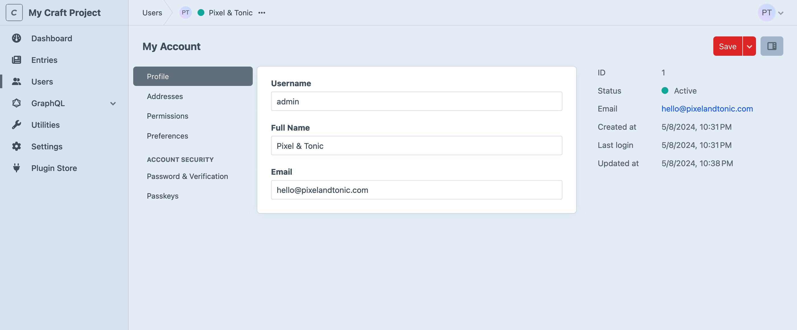

# Users

A user is a special type of element that represents a person.

<!-- more -->

Each user has an email address and username by default, as well as optional fields for a name and photo. Like other [elements](../../system/elements.md), users support custom fields by way of a [field layout](#custom-fields).

<BrowserShot url="https://my-project.ddev.site/admin/users/myaccount" :link="false" caption="Custom fields can be added to the “Profile” screen.">

</BrowserShot>

There are also **Preferences** for localization, accessibility, and debugging that may be relevant depending on how you build your site and whether you grant the user access to the control panel. Users’ capabilities are determined by which [groups](../../system/user-management.md#user-groups) they belong to, and what individual [permissions](../../system/user-management.md#permissions) they have been granted.

<See path="../../system/user-management.md" label="User Management" description="Learn more about setting up secure multi-user experiences." />

### Custom Fields

All users share a [field layout](../../system/fields.md#field-layouts), which is managed via <Journey path="Settings, Users, User Profile Fields" />. Custom fields are added to the **Profile** tab of each user’s management screen, alongside native **Username**, **Email**, **Full Name**, and **Photo** fields.

Fields and tabs in the user field layout can be given [conditions](../../system/fields.md#conditions) to provide special functionality based on their user group or other criteria.

::: tip
Relate users to other elements with the [users field](../field-types/users.md).
:::

### Photos

Once you’ve configured an [asset volume](assets.md#volumes), you can designate it as your **User Photo Volume** by visiting <Journey path="Settings, Users, Settings" />. User photos are uploaded directly to their profiles, and cannot be picked from existing assets.

The [asset element](assets.md) attached to a user is accessible via the `photo` property:

```twig{1,6}


<div class="profile">
  
    <div class="photo">
      {{ photo.getImg('thumbnail') }}
    </div>
  

  <h3>{{ user.fullName }}</h3>

  <code>{{ user.email }}</code>
</div>
```

Here, `thumbnail` is a [predefined image transform](assets.md#image-transforms).

### Addresses

Users each have an address book. [Addresses](addresses.md) can be managed on behalf of a user via the control panel, or [by the user themselves](addresses.md#managing-addresses).


Access a user’s addresses via the `addresses` property:

```twig{4}
<h2>Address Book</h2>

<ul>
  
    <li>{{ address|address }}</li>
  
</ul>
```

### Authors

[Entries](entries.md) can be assigned one or more users as their **Authors**.

```twig
<h2>{{ entry.title }}</h2>

By {{ collect(entry.authors).pluck('fullName').join(', ', ', and ') }}

{# ... #}
```

### URLs

Unlike most other element types, users do _not_ have a “URI format” setting or support slugs, and are not factored into routing.

### Affiliated Site <Since ver="5.6.0" feature="Affiliated sites for user elements" />

[Multi-site](../../system/sites.md) projects capture the site a user [registers](../../system/user-management.md#affiliated-site) from (or is assigned to by an admin). Add the **Affiliated Site** [field layout element](#custom-fields) to manage this in the control panel.

A user’s affiliated site can be accessed in a template via `user.affiliatedSite`:

```twig

  You registered via {{ currentUser.affiliatedSite.name }}.

```

## Querying Users

You can fetch users in your templates or PHP code using **user queries**.

::: code
```twig
{# Create a new user query #}

```
```php
// Create a new user query
$myUserQuery = \craft\elements\User::find();
```
:::

Once you’ve created a user query, you can set [parameters](#parameters) on it to narrow down the results, and then [execute it](../../development/element-queries.md#executing-element-queries) by calling `.all()`. An array of [User](craft5:craft\elements\User) objects will be returned.

::: tip
See [Element Queries](../../development/element-queries.md) to learn about how element queries work.
:::

### Example

We can display a list of the users in a “Members” [user group](../../system/user-management.md#user-groups) by doing the following:

1. Create a user query with `craft.users()`.
2. Set the [group](#group) parameter on it.
3. Fetch the users with `.all()`.
4. Loop through the users using a [for](https://twig.symfony.com/doc/3.x/tags/for.html) tag to create the list HTML.

```twig
{# Create a user query with the 'group' parameter #}


{# Fetch the users #}


{# Display the list #}
<ul>
  
    <li>{{ user.fullName }} (Member since {{ user.dateCreated|date }})</li>
  
</ul>
```

### Parameters

User queries support the following parameters:

<!-- This section of the page is dynamically generated! Changes to the file below may be overwritten by automated tools. -->
!!!include(docs/.artifacts/cms/5.x/users.md)!!!
