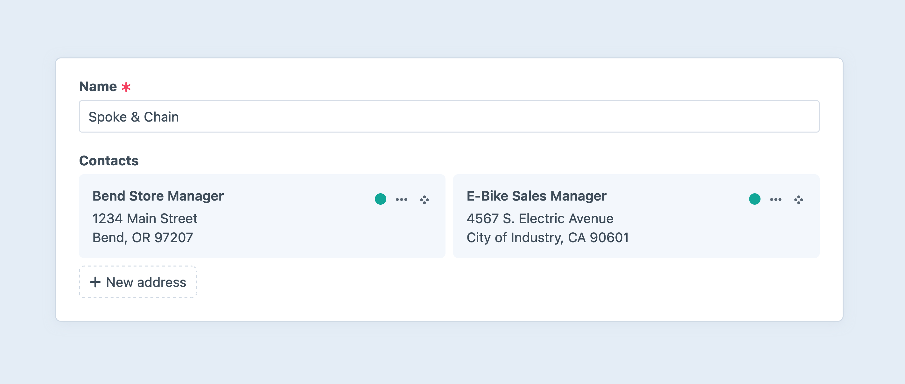

---
related:
  - uri: link.md
    label: Link fields
---

# Addresses Fields

The **Addresses** field is similar to a [Matrix](matrix.md) field, but it manages nested [address elements](../element-types/addresses.md) instead of [entries](../element-types/entries.md). When you create an address it is “owned” by the element that field is attached to. Address fields are _not_ [relational fields](../../system/relations.md#custom-fields).

::: tip
Address fields are separate from users’ [address book](../element-types/users.md#addresses), and can be added to any element type!
:::

<BrowserShot url="https://my-project.ddev.site/admin/entries/vendors/123" :link="false">

</BrowserShot>

Addresses can be [copied](../../system/elements.md#copying-elements) between fields, and to or from users’ address books. <Since ver="5.7.0" feature="Copying-and-pasting address elements" />

## Settings

Address fields can be displayed to editors as [cards](../../system/elements.md#chips-cards) or in a full [element index](../../system/elements.md#indexes).
Either way, individual addresses are always displayed as cards.

You can also use the **Min Addresses** and **Max Addresses** settings to control how many addresses must (or _can_) be added to the field for the owner to validate.

## Development

Like Matrix and [relational fields](../../system/relations.md#fields), address field data is returned as an [element query](../../development/element-queries.md) (or an [element collection](../../development/collections.md#element-collections), when [eager-loaded](../../development/eager-loading.md)).

Typically, you will access addresses attached to an element via the field’s handle, followed by a query execution method like `.all()`:

```twig


<h2>Contacts</h2>

<ul>
  
    <li>{{ address|address }}</li>
  
</ul>
```

<See path="../element-types/addresses.md" label="Addresses" description="Learn more about managing and displaying address data." />

### GraphQL

Nested address elements are available via [GraphQL](../../development/graphql.md) anywhere you have access to their owners. Address properties are retrieved piecemeal:

```graphql{7-24}
query StationsQuery {
  entries(section: "weatherBeacons") {
    title
    id
    ... on station_Entry {
      # Our addresses field:
      location {
        addressLine1
        addressLine2
        addressLine3
        administrativeArea
        dependentLocality
        countryCode
        locality
        postalCode
        sortingCode

        fullName
        firstName
        lastName
        organization
        organizationTaxId

        latitude
        longitude
      }
    }
  }
}
```

Not all properties will contain data, due to differences in international storage and formatting.
[Address formatters](../element-types/addresses.md#address-formatter) are not available via GraphQL, so you are responsible for handling variations in the returned data.

With the admin-only **Full Schema**, you may directly query for one or more addresses using the `address()` and `addresses()` queries:

```graphql
query Headquarters {
  address(id: 123) {
    addressLine1
    # ...
  }
}
```

```graphql
query MyAddresses {
  addresses(ownerId: 123) {
    addressLine1
    # ...
  }
}
```

::: tip
In public and custom schemas, addresses are only accessible via their owners.
:::
