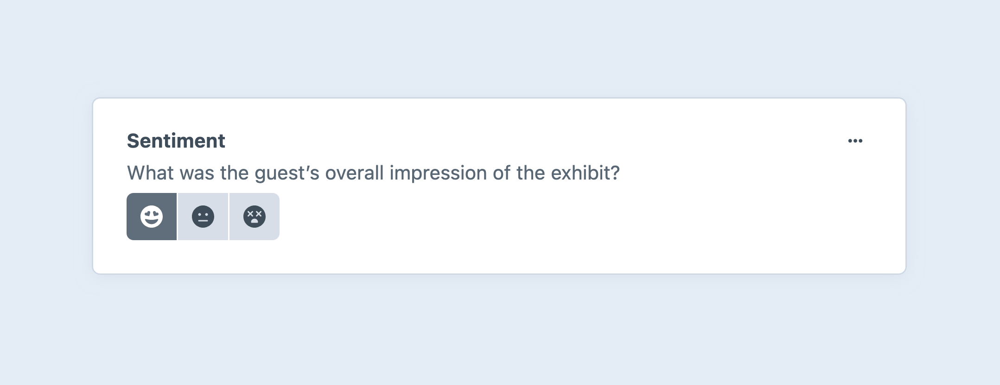
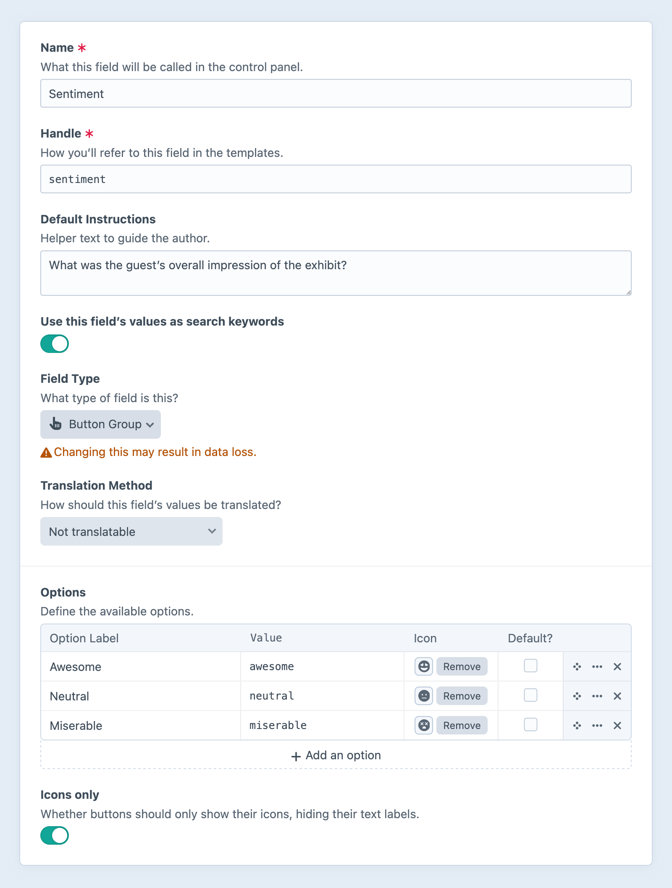

---
related:
  - uri: radio-buttons.md
    label: Radio Button fields
  - uri: dropdown.md
    label: Dropdown fields
---

# Button Group <Since ver="5.7.0" feature="The button group field" />

Button group fields provide a compact, graphical option for selecting a single value from a list.

<!-- more -->

## Settings

<BrowserShot
  url="https://my-craft-project.ddev.site/admin/settings/fields/new"
  :link="false"
  :max-height="500"
  caption="Adding a new button group field via the control panel.">

</BrowserShot>

Button group fields have the following settings:

- **Options** — Define any number of options for authors to select from, each with…
  - **Label** — A text description of the option. _Labels are hidden when using the **Icons only** setting._
  - **Value** — The value stored when a given option is selected.
  - **Icon** — Choose from the standard system icon palette.
  - **Default?** — One option can be marked as the default.
- **Icons only** — Hide labels in the UI, displaying only the selected icon for each option.

The field works best with a limited number of visually distinct options.

## Development

Button group fields share the same template and query capabilities with [dropdown fields](dropdown.md).
