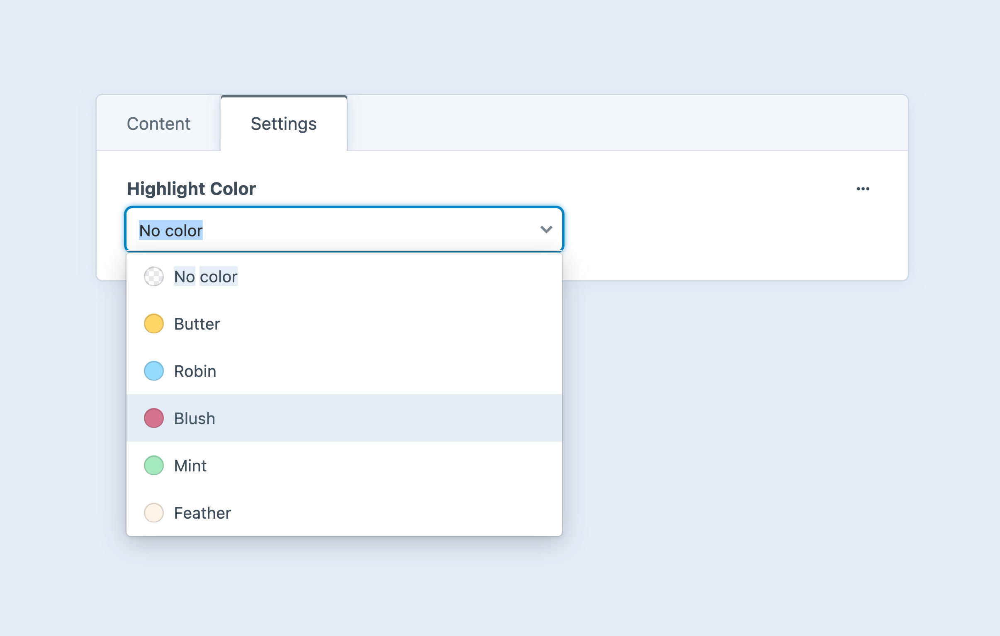
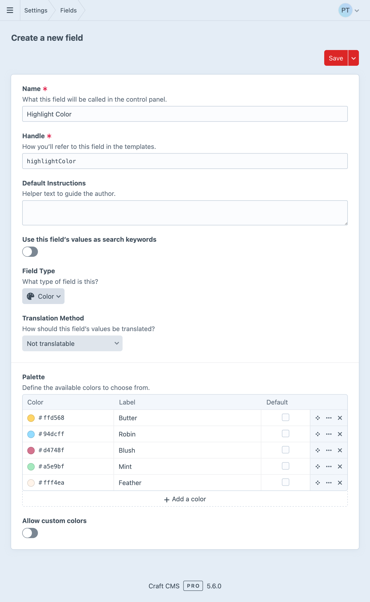

# Color Fields

Color fields provide a flexible way to store hexadecimal color values. You can define a [palette](#palette) to guide authors <Since ver="5.6.0" feature="Color field palettes" />, or use an [open-ended input](#custom-colors).

<!-- more -->



## Settings

<BrowserShot
  url="https://my-craft-project.ddev.site/admin/settings/fields/new"
  :link="false"
  :max-height="500"
  caption="Adding a new color field via the control panel.">

</BrowserShot>

### Palette

Each field contains a **Palette** of colors that authors can select from a dropdown menu.

### Custom Colors

Turn on **Allow custom colors** to display a compact input and color preview UI. When used in conjunction with a palette, an additional **Custom…** option is listed at the bottom of the dropdown menu.

::: tip
In [browsers that support `<input type="color">`](https://caniuse.com/input-color), clicking on the color preview “well” opens a native OS color picker.
:::

## Development

Accessing a color field returns a <craft5:craft\fields\data\ColorData> object, or `null` if no color was selected.

Casting a `ColorData` object to a string by outputting it directly produces a hexadecimal representation of the color:

::: code
```twig

  <style type="text/css">
    .content a {
      {# Directly outputting the value... #}
      color: {{ entry.myColorField }};
    }
    .content b {
      {# ...is equivalent to: #}
      color: {{ entry.myColorField.getHex() }};
    }
  </style>

```
```php
if ($entry->myColorField) {
    echo $entry->myColorField;
    // …is equivalent to…
    echo $entry->myColorField->getHex();
}
```
:::

`ColorData` objects have a number of methods that streamline working with color values:

::: code
```twig

  {{ entry.myColorField }}                 {# output: #e5422b #}
  {{ entry.myColorField.getHex() }}        {# output: #e5422b #}
  {{ entry.myColorField.getRgb() }}        {# output: rgb(229,66,43) #}
  {{ entry.myColorField.getHsl() }}        {# output: hsl(7,81%,90%) #}
  {{ entry.myColorField.getLuma() }}       {# output: 0.38820862745098 #}
  {{ entry.myColorField.getHue() }}        {# output: 7 #}
  {{ entry.myColorField.getLightness() }}  {# output: 90 #}
  {{ entry.myColorField.getSaturation() }} {# output: 81 #}
  {{ entry.myColorField.getRed() }}        {# output: 229 #}
  {{ entry.myColorField.getGreen() }}      {# output: 66 #}
  {{ entry.myColorField.getBlue() }}       {# output: 43 #}

```
```php
if ($entry->myColorField) {
    echo $entry->myColorField;                  // output: #e5422b
    echo $entry->myColorField->getHex();        // output: #e5422b
    echo $entry->myColorField->getRgb();        // output: rgb(229,66,43)
    echo $entry->myColorField->getHsl();        // output: hsl(7,81%,90%)
    echo $entry->myColorField->getLuma();       // output: 0.38820862745098
    echo $entry->myColorField->getHue();        // output: 7
    echo $entry->myColorField->getLightness();  // output: 90
    echo $entry->myColorField->getSaturation(); // output: 81
    echo $entry->myColorField->getRed();        // output: 229
    echo $entry->myColorField->getGreen();      // output: 66
    echo $entry->myColorField->getBlue();       // output: 43
}
```
:::

You may also access any of the color components as properties: <Since ver="5.8.0" feature="Accessing color data components as properties" />

```twig
{{ entry.myColorField.hex }}
{{ entry.myColorField.rgb }}
{# ... #}
```

::: tip
Refer to the [`ColorData`](craft5:craft\fields\data\ColorData) class reference for a complete list of methods!
:::

## Querying by Color

There are no special query features for color fields; refer to the [plain text](plain-text.md) field for a list of standard string comparison syntaxes.
