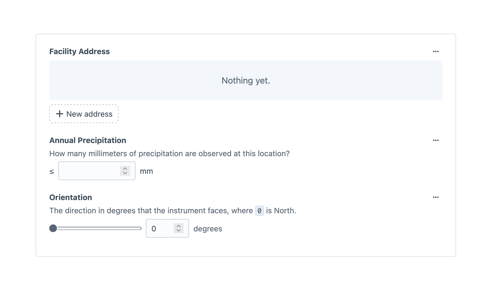
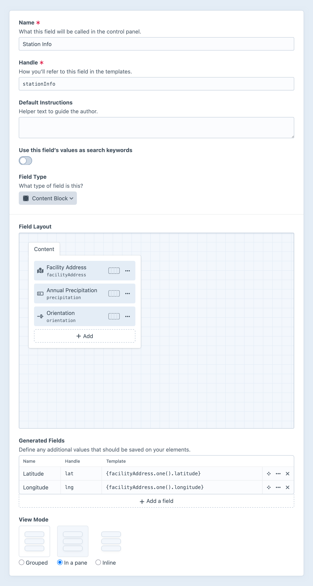

---
related:
  - uri: matrix.md
    label: Matrix fields
---

# Content Block Fields <Since ver="5.8.0" feature="The content block field" />

The content block field semantically groups existing fields into a reusable bundle, and stores content as a nested element.

<!-- more -->



## Settings

<BrowserShot
  url="https://my-craft-project.ddev.site/admin/settings/fields/new"
  :link="false"
  :max-height="500"
  caption="Adding a new content block field via the control panel.">

</BrowserShot>

Content block fields’ settings look like a combination of a field and an [entry type](../element-types/entries.md#entry-types) (or any other _field layout provider_).

### Field Layout

The primary feature is a [field layout designer](../../system/fields.md#field-layouts), in which you choose the nested fields.
This behaves just like other field layout designers, except that it is limited to a single “tab.” The **Content** label is never displayed to authors.

::: tip
Content block fields cannot be nested within other content block fields, as the nested elements are created and displayed directly in-line with the rest of the owner.
If you need an arbitrarily-deep set of nested elements, consider the [Matrix](matrix.md) field.
:::

Nested fields can be selected as columns in their owners’ [element indexes](../../system/elements.md#indexes) and [cards](../../system/elements.md#chips-cards). <Since ver="5.9.0" feature="Content block fields in their owners’ element indexes" />

### Generated Fields

Each [generated field](../../system/elements.md#generated-fields) defined in the field layout is saved on the content block element itself, _not_ its owner.

This means a generated field is still accessed via the content block field’s handle; in the examples above, that would be `entry.stationInfo.latitude` and `entry.stationInfo.longitude`.

### View Mode

You can display content block fields in one of three ways:

- **Grouped** — Nested fields are semantically grouped, and surrounded by a hairline.
- **In a pane** — Nested fields are semantically grouped, and placed within a shaded “pane.”
- **Inline** — Nested fields are indistinguishable from the surrounding element form. The content block’s label will still appear unless explicitly hidden via its field layout element settings when added to a field layout.

## Development

Content blocks are [lazily loaded](../../development/eager-loading.md#lazy-eager-loading) along with their owners.
You’ll access their content via the content block field’s handle:

```twig{8-10,16}
<h1>{{ entry.title }}</h1>

<p class="byline">
  {# Format user elements into a list... #}
  {{ collect(entry.authors).select('fullName').join(', ', ', and') }}

  {# ...and supplement with a custom byline: #}
  
    with support from {{ contributors }}
  
</p>

{# Separate photo credits: #}

  <p class="photo-credits">
    Photos by {{ entry.credits.photographer }}
  </p>

```

You do not need to test for the presence of the content block element itself—any time you have a reference to an element, the nested content block will be available, even for newly-created elements in memory.

### Querying Content Blocks

Content blocks do not expose nested fields as [element query parameters](../../development/element-queries.md#querying-with-custom-fields) on their owners.
However, nested content can be hoisted onto the owner via [generated fields](../../system/elements.md#generated-fields), which are then given corresponding query methods.

### Element Partials

If a content block represents a very specific fragment of HTML throughout your site, you can use an [element partial](../../system/elements.md#element-partials) to render it.
Create a new file with a path like this (assuming the default <config5:partialTemplatesPath> setting):

```
templates/_partials/block/{yourFieldHandle}.twig
```

Then, wherever that content block is attached to an element, you can output its template:

```twig
{# Output the owner’s title... #}
<h1>{{ entry.title }}</h1>

{# ...and render the content block: #}
{{ entry.credits.render() }}
```

Your content block is available in the template under the `block` variable, and its owner is accessible as `block.owner`. Adapting the example from above, you can create a reusable article credits component:

```twig
<p class="byline">
  {# Gather authors from the owner... #}
  {{ collect(owner.authors).select('fullName').join(', ', ', and') }}

  {# ...and supplement with fields from the content block: #}
  
    with support from {{ contributors }}
  
</p>


  <p class="photo-credits">
    Photos by {{ block.credits.photographer }}
  </p>

```

### GraphQL

Retrieving content block field data via GraphQL is as intuitive and transparent as most other scalar field values:

```gql
query WeatherStations {
    entries(
      section: "weatherStations"
    ) {
      title
      url

      ... on station_Entry {
        # Immediate nested content block:
        stationInfo {
          precipitation
          orientation

          # Second-level content block:
          coordinates {
            latitude
            longitude
          }
        }
      }
    }
  }
```

Individual content block elements are _not_ directly accessible on their own, via GraphQL.

### Saving Content Block Fields

Content block field data can be sent alongside the owner’s other fields. Like [Matrix](matrix.md), the structure of the field data is somewhat strict:

```twig

<form method="post">
  {{ csrfInput() }}
  {{ actionInput('entries/save-entry') }}
  {{ hiddenInput('entryId', station.id) }}

  {# Attributes on the owner: #}
  <input name="title" type="text" value="{{ station.title }}">

  {# Custom field on the owner: #}
  <textarea name="fields[intro]">{{ station.intro }}</textarea>

  <fieldset>
    {# Custom fields on the nested content block: #}
    <input
        name="fields[stationInfo][fields][precipitation]"
        type="number"
        value="{{ station.stationInfo.precipitation }}"
        min="0"
        required>
    <input
      name="fields[stationInfo][fields][orientation]"
      type="range"
      value="{{ station.stationInfo.orientation }}"
      min="0"
      max="360"
      step="0.01"
      required>
  </fieldset>

  <button>Save</button>
</form>
```

All [custom field form values](../../development/forms.md#custom-fields) must be nested within a `fields` key (or whatever key you specify in a separate `fieldsLocation` param).
Content blocks’ nested field values follow the same pattern.
In the example, `stationInfo` is our content block field handle, inside which the same structure exists: a `fields` key containing values indexed by _their_ field handles (`precipitation` and `orientation`).
If your content model has additional levels of nested data represented by content blocks, you can continue to build inputs’ `name` attributes using the same structure.
The next level would look something like `fields[stationInfo][fields][coordinates][fields][latitude]`.

You do not need to include any other identifying information or attributes for the content block.

## Migrating to Content Blocks

Existing projects may find it helpful to consolidate existing fields into a content block for reuse.

::: warning
Names and handles of fields _within_ a content block cannot be renamed on a per-use basis.
You may set new names and handles when adding a field to the content block’s field layout, but not when adding the content block to a field layout.
:::

The process is apt to follow these steps:

1. Create a new content block field, and add the fields you wish to group to its field layout;
1. Add the new content block field to your element’s field layout (this might be an entry type, asset volume, category group, etc.);
1. Commit the project config changes and deploy the update to your live environment;
1. Run the appropriate [`resave/*` commands](../cli.md#resave) to copy values into the new content block field:
   ```bash
   php craft resave/entries --section recipes \
       --set credits \
       --to "fn(\$element) => ['fields' => ['contributors' => \$element->contributors, 'photographer' => \$element->photographer ?? \$element->featureImage->one()->uploader->fullName ?? null]]"
   ```
1. Return to your development environment and remove the consolidated fields from those field layouts;
1. Commit the changes and deploy again;

The command above uses the special “closure” mode for the `--to` option, in which we’ve set two fields’ values.
You may elect to run individual commands for each nested field, if the command or syntax becomes unwieldy:

```bash
# Copy `contributors`:
php craft resave/entries --section recipes \
    --set credits \
    --to "fn(\$element) => ['fields' => ['contributors' => \$element->contributors]]"

# Copy `photographer` from field, falling back to the user who uploaded the cover image:
php craft resave/entries --section recipes \
    --set credits \
    --to "fn(\$element) => ['fields' => ['photographer' => \$element->photographer ?? \$element->featureImage->one()->uploader->fullName ?? null]]]"
```

Values can be copied from Matrix fields, as well. Assuming a legacy `recipeMeta` Matrix field was limited to a single block, the command would look something like this:

```bash
php craft resave/entries --section recipes \
    --set credits \
    --to "fn(\$entry) => ['fields' => ['contributors' => \$entry->recipeMeta[0]->extraNames, 'photographer' => \$entry->recipeMeta[0]->photographyCredit ?? null]]"
```

