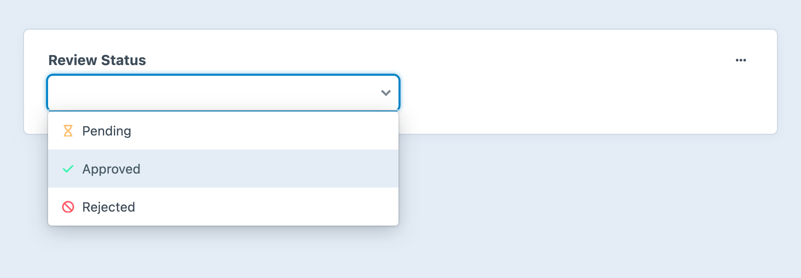
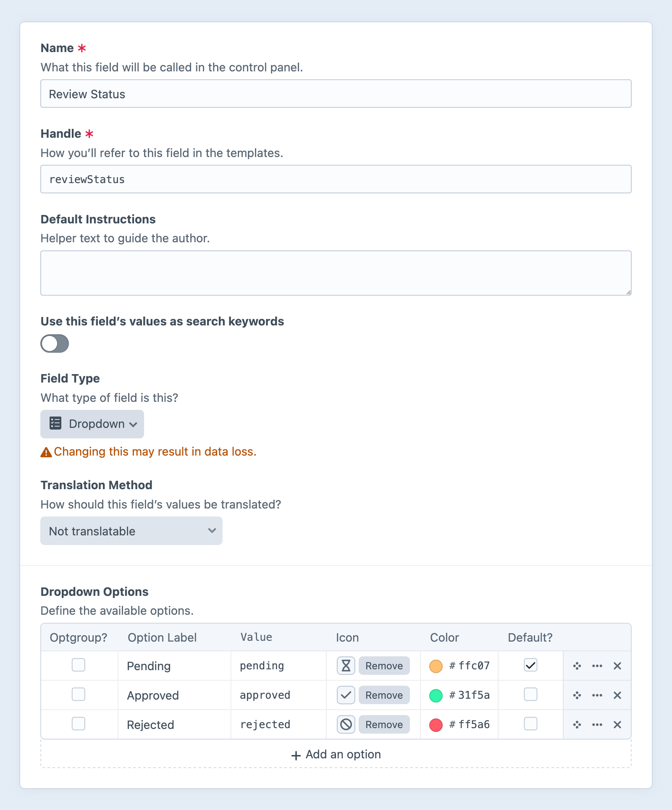

---
related:
  - uri: button-group.md
    label: Button Group fields
  - uri: radio-buttons.md
    label: Radio Button fields
---

# Dropdown Fields

Dropdown fields provide an enhanced version of the familiar `<select>` input. Optional colors and icons help authors quickly identify choices. <Since ver="5.7.0" feature="Color and icon support in dropdown fields." />

<!-- more -->



## Settings

<BrowserShot
  url="https://my-craft-project.ddev.site/admin/settings/fields/new"
  :link="false"
  :max-height="500"
  caption="Adding a new dropdown field via the control panel.">

</BrowserShot>

Dropdown fields have the following settings:

- **Dropdown Options** — Define any number of options to populate the menu.
  - **Label** — A text description of the option.
  - **Value** — The value stored when a given option is selected.
  - **Icon** (Optional) — Choose from the standard system icon palette.
  - **Color** (Optional) — A color for the icon, or, when no icon is selected, a color pip.
  - **Default?** — One option can be marked as the default.

::: tip
If you change the underlying value of an option that is used by existing entries, Craft will select the designated default option the next time one of those elements is edited.

Consider using the appropriate [`resave/*` console commands](../cli.md#resave) to migrate existing data to your new value:

```bash
php craft resave/entries --section mySection --set myDropdownField --to "={{ object.myDropdownField.value == 'oldValue' ? 'newValue' : object.myDropdownField.value }}"
```
:::

## Development

### Querying Elements with Dropdown Fields

When [querying for elements](../../development/element-queries.md) that have a Dropdown field, you can filter the results based on the Dropdown field data using a query param named after your field’s handle.

Possible values include:

| Value | Fetches elements…
| - | -
| `'foo'` | with a `foo` option selected.
| `'not foo'` | without a `foo` option selected.
| `['foo', 'bar']` | with either a `foo` or `bar` option selected.
| `['not', 'foo', 'bar']` | without either a `foo` or `bar` option selected.

::: code
```twig
{# Fetch entries with the 'foo' option selected #}

```
```php
// Fetch entries with the 'foo' option selected
$entries = \craft\elements\Entry::find()
    ->myFieldHandle('foo')
    ->all();
```
:::

### Working with Dropdown Field Data

If you have an element with a Dropdown field in your template, you can access its data using your Dropdown field’s handle:

::: code
```twig

```
```php
$value = $entry->myFieldHandle;
```
:::

That will give you a <craft5:craft\fields\data\SingleOptionFieldData> object that contains the field data.

To show the selected option, output it as a string, or output the [value](craft5:craft\fields\data\SingleOptionFieldData::$value) property:

```twig
{{ entry.myFieldHandle }} or {{ entry.myFieldHandle.value }}
```

To see if an option is selected, use the [value](craft5:craft\fields\data\SingleOptionFieldData::$value) property:

```twig

```

To show the selected option’s label, output the [label](craft5:craft\fields\data\SingleOptionFieldData::$label) property:

```twig
{{ entry.myFieldHandle.label }}
```

To loop through all of the available options, iterate over the [options](craft5:craft\fields\data\SingleOptionFieldData::getOptions()) property:

```twig

  Label:    {{ option.label }}
  Value:    {{ option }} or {{ option.value }}
  Selected: {{ option.selected ? 'Yes' : 'No' }}

```

#### Icons and Colors


### Saving Dropdown Fields

If you have an element form, such as an [entry form](kb:entry-form), that needs to contain a Dropdown field, you can use this template as a starting point:

```twig


<select name="fields[myFieldHandle]">
  
    

    <option value="{{ option.value }}"
      selected
    >
      {{ option.label }}
    </option>
  
</select>
```
