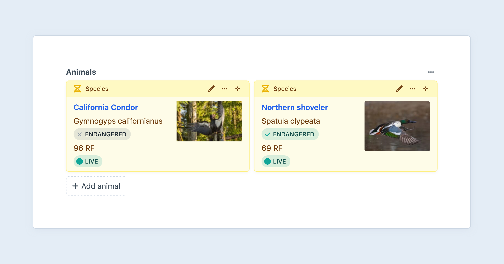
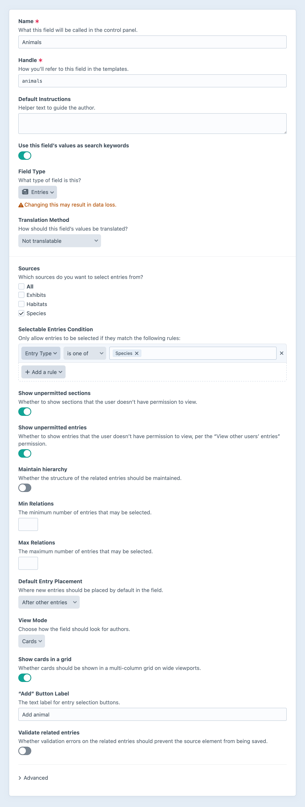

---
related:
  - uri: ../element-types/entries.md
    label: Entry Elements
  - uri: ../../system/relations.md
    label: Using Relationships
  - uri: link.md
    label: Link fields
---

# Entries Fields

Entries fields allow you to relate [entries](../element-types/entries.md) to other elements. It is one of Craft’s [relational](../../system/relations.md) custom fields.

<!-- more -->



::: tip
If you would like to manage a set of _nested_ entries within another element (as opposed to selecting from an external set), consider using the [Matrix field](matrix.md).
:::

## Settings

<BrowserShot
  url="https://my-craft-project.ddev.site/admin/settings/fields/new"
  :link="false"
  :max-height="500"
  caption="Adding a new entries field via the control panel.">

</BrowserShot>

Entries fields have the following settings:

- **Sources** — Which sections (or other entry index sources) the field should be able to relate entries from.
- **Selectable Entries Condition** — Rules that determine which entries should be available for selection.
- **Maintain Hierarchy** — When selecting from a [structure section](../element-types/entries.md#structures), should the entries’ order and hierarchy be preserved? (This option is available only when _all_ the selected **Sources** are structures.)

  When **enabled**, the following options become available:

  - **Branch Limit** — How many distinct “branches” of a structure can be selected?

  When **disabled**, these options are available:

  - **Min Relations** — The minimum number of entries that must be selected when the field is marked as “required” in a field layout. (Default is no minimum.)
  - **Max Relations** — The maximum number of entries that can be selected. (Default is no maximum.)
  - **Default Entry Placement** — Whether new selections are prepended or appended to the existing relations.
  - **View Mode** — How the related entries are displayed to authors (_List_, _Cards_, <Since ver="5.9.0" feature="The inline list and card grid view modes for relational fields">_Card grid_, or _Inline list_</Since>).
- **“Add” Button Label** — The label that should be used on the field’s selection button.

When a single source is selected, you can also configure these settings:

- **Show the search input** — Allow authors to quick-search (and create) entries, without opening an element selector modal. <Since ver="5.8.0" feature="Quick-search support for relational fields" />

### Advanced Settings

Additional settings are available under the **Advanced** toggle:

- **Allow self relations** — Whether the current entry (with this field) should be allowed to select itself as a relation.

### Multi-Site Settings

On multi-site installs, additional advanced settings will be available:

- **Translation Method** — How relationships are handled when [propagating changes to other sites](../../system/fields.md#translation-methods).
- **Relate entries from a specific site?** — Whether to only allow relations to entries from a specific site.
  - If _enabled_, a new setting will appear where you can choose which site.
  - If _disabled_, related entries will always be pulled from the current site.

- **Show the site menu** — Whether to display the site menu in entry selection modals. (This setting is hidden when relations are locked to a single site.)

<See path="../../system/fields.md" hash="translation-methods" label="Translation Methods" description="Learn about options for translating field values." />

## The Field

Entries fields list all of the currently-related entries, with a button to select new ones.

Pressing **Add an entry** will open a modal window where you can find and select additional entries. (You also press **+ New entry** from this modal to create a new entry in a slideout panel.)

### Inline Entry Editing

When you double-click a related entry, a slideout will appear where you can edit the entry’s title and custom fields.

## Development

### Querying Elements with Entries Fields

When [querying for elements](../../development/element-queries.md) that have an Entries field, you can filter the results based on the Entries field data using a query param named after your field’s handle.

Possible values include:

| Value | Fetches elements…
| - | -
| `':empty:'` | that don’t have any related entries.
| `':notempty:'` | that have at least one related entry.
| `100` | that are related to the entry with an ID of 100.
| `[100, 200]` | that are related to an entry with an ID of 100 or 200.
| `[':empty:', 100, 200]` | with no related entries, or related to an entry with an ID of 100 or 200.
| `['and', 100, 200]` | that are related to the entries with IDs of 100 and 200.
| an [Entry](craft5:craft\elements\Entry) object | that are related to the entry.
| an [EntryQuery](craft5:craft\elements\db\EntryQuery) object | that are related to any of the resulting entries.

::: code
```twig
{# Fetch artwork entries that are related to `artist` #}

```
```php
// Fetch artwork entries that are related to `$artist`
$works = \craft\elements\Entry::find()
    ->section('artwork')
    ->myFieldHandle($artist)
    ->all();
```
:::

### Working with Entries Field Data

If you have an element with an entries field in your template, you can access its related entries using your entries field’s handle:

::: code
```twig

```
```php
$query = $entry->myFieldHandle;
```
:::

That will give you an [entry query](../element-types/entries.md#querying-entries), prepped to output all of the related entries for the given field.

To loop through all the related entries, call [all()](craft5:craft\db\Query::all()) and then loop over the results:

::: code
```twig


  <ul>
    
      <li><a href="{{ rel.url }}">{{ rel.title }}</a></li>
    
  </ul>

```
```php
$relatedEntries = $entry->myFieldHandle->all();
if (count($relatedEntries)) {
    foreach ($relatedEntries as $rel) {
        // $rel->url, $rel->title
    }
}
```
:::

If you only want the first related entry, call [one()](craft5:craft\db\Query::one()) instead, and then make sure it returned something:

::: code
```twig


  <p><a href="{{ rel.url }}">{{ rel.title }}</a></p>

```
```php
$rel = $entry->myFieldHandle->one();
if ($rel) {
    // $rel->url, $rel->title
}
```
:::

If you’d like to check for related entries without fetching them, you can call [exists()](craft5:craft\db\Query::exists()):

::: code
```twig

  <p>There are related entries!</p>

```
```php
if ($entry->myFieldHandle->exists()) {
    // There are related entries!
}
```
:::

You can set [parameters](../element-types/entries.md#parameters) on the entry query as well. For example, to narrow the related entries to those in a `news` section, set the [section](../element-types/entries.md#section) param:

::: code
```twig

```
```php
$relatedEntries = $entry->myFieldHandle
    ->section('news')
    ->all();
```
:::

Each time you access an entries field from an element, a new copy of its value is returned.
This means that applying parameters _does not_ influence the original query, and you can always get the authoritative set of related entries by calling `.all()`:

```twig{12}
{# Get a list of just organization(s): #}


{# Get a list of only individual people: #}


{# Get everything, regardless of the type: #}

```

Save the returned value to an intermediate variable if you need to refer to it again:

```twig{1,5,8}




  



  {# ... #}

```

### Saving Entries Fields

If you have front-end form for saving an element, that needs to contain an entries field, you will need to submit your field value as a list of entry IDs, in the order you want them to be related.

For example, you could create a list of checkboxes for each of the possible relations:

```twig
{# Include a hidden input first so Craft knows to update the existing value
   if no checkboxes are checked. #}
{{ hiddenInput('fields[myFieldHandle]', '') }}

{# Get all of the possible entry options #}


{# Get the currently related entry IDs #}


<ul>
  
    <li>
      <label>
        {{ input(
          'checkbox',
          'fields[myFieldHandle][]',
          possibleEntry.id,
          { checked: possibleEntry.id in relatedEntryIds }
        ) }}
        {{ possibleEntry.title }}
      </label>
    </li>
  
</ul>
```

You could then make the checkbox list sortable, so users have control over the order of related entries.

## See Also

- [Entry Queries](../element-types/entries.md#querying-entries)
- <craft5:craft\elements\Entry>
- [Relations](../../system/relations.md)
