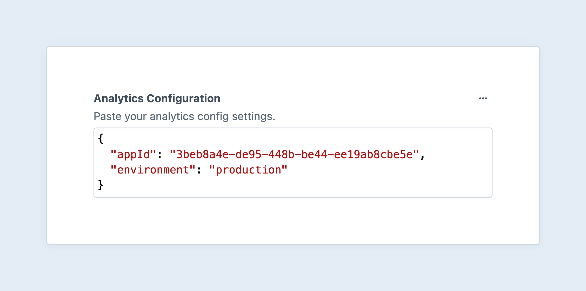
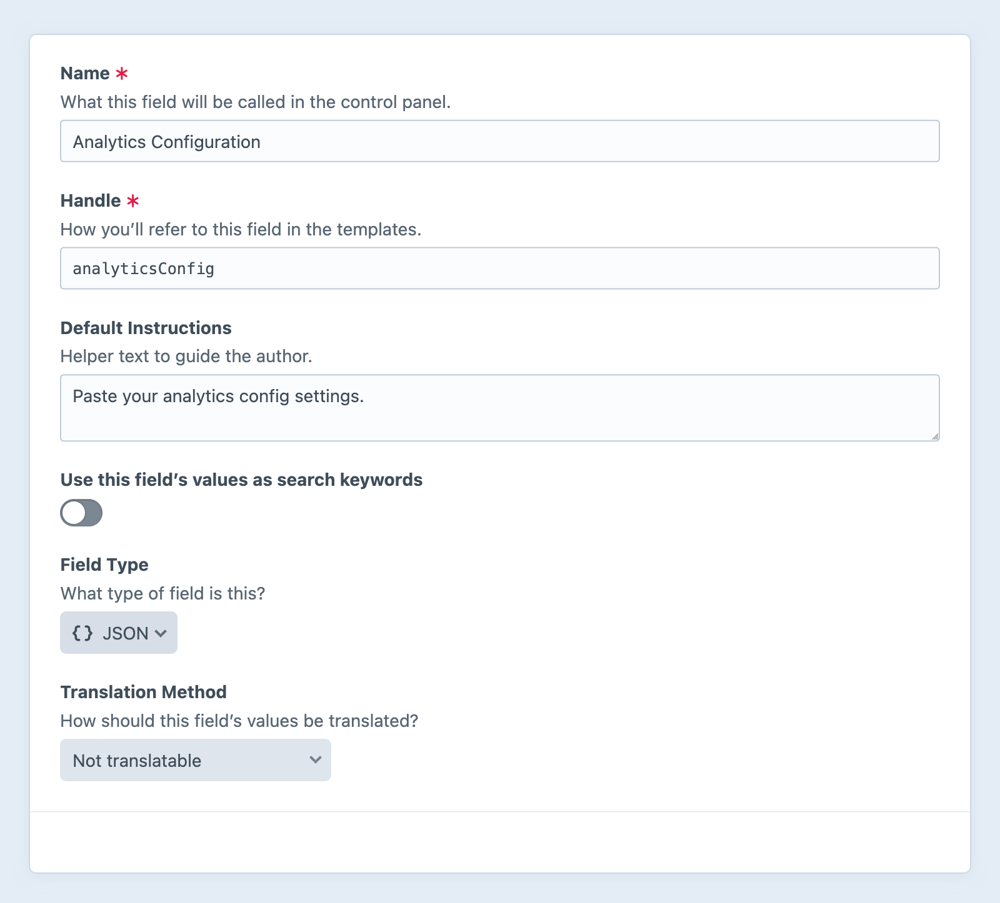

# JSON

Validate and store arbitrary JSON data in a simple [CodeMirror](https://codemirror.net/) editor. The data is automatically [deserialized](#development) for you and can be 

<!-- more -->



## Settings

<BrowserShot
  url="https://my-craft-project.ddev.site/admin/settings/fields/new"
  :link="false"
  :max-height="500"
  caption="Adding a new JSON field via the control panel.">

</BrowserShot>

JSON fields have no custom settings.

## Development

The JSON field returns an instance of <craft5:craft\fields\data\JsonData>, which has a handful of helpful features for interacting with the deserialized data.

Directly outputting the field’s value serializes it back to JSON:

::: code
```twig Template
{{ entry.myJsonField }}
```
```html Result
{"appId":"3beb8a4e-de95-448b-be44-ee19ab8cbe5e","environment":"production"}
```
:::

To pretty-print the JSON, you must explicitly call the `.getJson()` method:

::: code
```twig Template
<pre>{{ entry.myJsonField.getJson(true) }}</pre>
```
```html Result
<pre>{
  "appId": "3beb8a4e-de95-448b-be44-ee19ab8cbe5e",
  "environment": "production"
}</pre>
```
:::

::: tip
`<pre>` tags are necessary to retain formatting, in the browser. Similarly, the `<code>` tag can be used for inline values.
:::

The second argument allows you to customize the indentation:

```twig
{# Use tabs instead of the default (two spaces): #}
<pre>{{ entry.myJsonField.getJson(true, '\t') }}</pre>
```

### Data Types

The data type of the JSON’s root element can be a `boolean`, `integer`, `float`, `string`, or `array`.

```twig
<div class="json {{ data.getType() }}">{{ data }}</div>
```

The [scalar](../twig/tests.md#scalar) test makes it possible to quickly differentiate simple values from arrays and hashes:

```twig

  {# Output directly: #}
  {{ data }}

  {# This might be more complex, so we’ll print it as nicely as possible: #}
  <pre>{{ data.getJson(true) }}</pre>

```

::: tip
Note that we’re directly testing against the field’s underlying deserialized value, not the `JsonData` object that wraps it. The latter will always be non-scalar!
:::

### Nested Keys

If you know the structure of a JSON value, you can access nested keys directly from the field:

```twig
{{ entry.myJsonField.appId }}
```

The field only ensures values are valid JSON, but doesn’t enforce any kind of schema. You should always handle input cautiously, to avoid runtime errors:

```twig
{{ entry.myJsonField.appId ?? null }}
```

### Objects + Arrays

JSON “objects” and “arrays” are deserialized into PHP arrays (associative and sequential, respectively), and the `JsonData` object provides a means of iterating over them, directly:

```twig
<table>
  <thead>
    <tr>
      <th>Key</th>
      <th>Value</th>
    </tr>
  </thead>
  <tbody>
    
        <tr>
          <td>{{ key }}</td>
          <td>
            <pre>{{ val is scalar ? val : val|json_encode }}</pre>
          </td>
        </tr>
    
  </tbody>
</table>
```

Once you have traversed into a data structure, you must explicitly serialize nested objects for output—Craft doesn’t recursively wrap that data with instances of `JsonData`!

### GraphQL

JSON fields are treated like plain strings, when queried via GraphQL. Values must be deserialized in the client or app:

```js
const gql = `
query MyQuery {
  globalSet(handle: "siteOptions") {
    ... on siteOptions_GlobalSet {
      analyticsConfig
    }
  }
}
`;

fetch('/api', {
  body: gql,
  method: 'POST',
  headers: {
    'Content-Type': 'application/graphql',
    'X-Craft-Gql-Schema': '*',
  },
})
  .then(response => response.json())
  .then(json => JSON.parse(json.data.globalSet.analyticsConfig))
  .then(config => new AcmeAnalytics(config));
```
