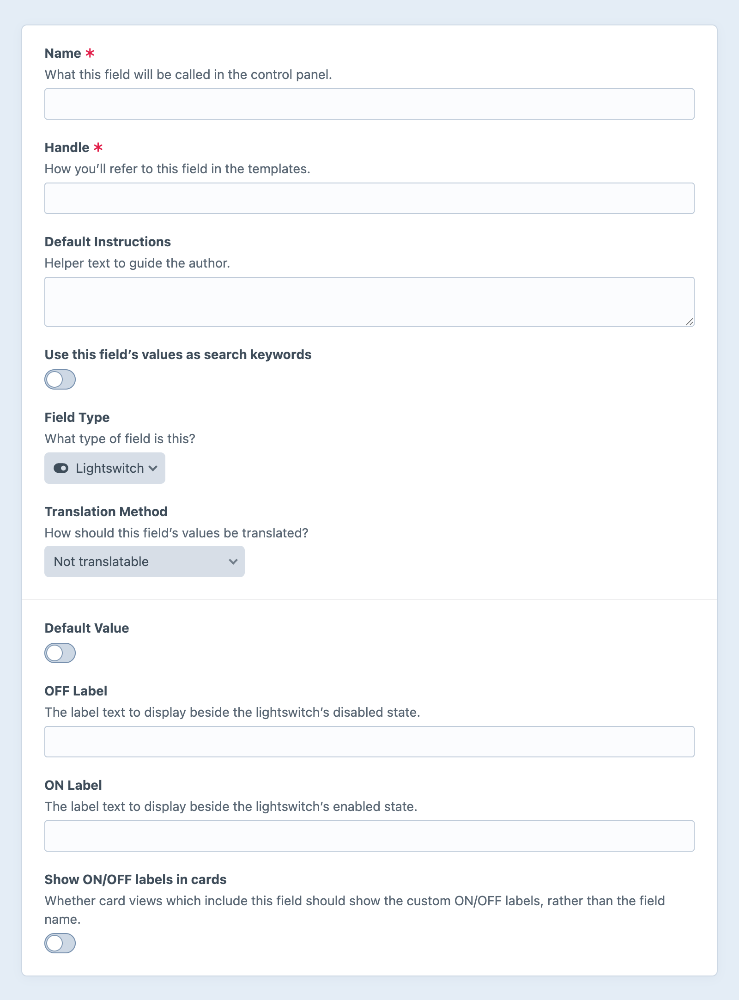

# Lightswitch Fields

Lightswitch fields give you a simple toggle input and store a boolean value.

<!-- more -->

## Settings

<BrowserShot
  url="https://my-craft-project.ddev.site/admin/settings/fields/new"
  :link="false"
  :max-height="500"
  caption="Adding a new lightswitch field via the control panel.">

</BrowserShot>

Lightswitch fields have the following settings:

Default Value
:   Choose a default value for the field.

OFF Label and ON Label
:   The text and accessibility label for the toggle’s disabled and enabled states.

Show ON/OFF labels in cards
:   When rendered on a [card](../../system/elements.md#custom-card-attributes), this determines whether the ON/OFF labels are displayed (instead of the field’s name).
    These labels can be localized for control panel users with the [`site` translation category](../../system/sites.md#static-message-translations).

## Development

### Querying Elements with Lightswitch Fields

When [querying for elements](../../development/element-queries.md) that have a lightswitch field, you can filter the results based on the lightswitch field data using a query param named after your field’s handle.

Possible values include:

| Value | Fetches elements… |
| --- | --- |
| `true` | …with the switch _on_. |
| `false` | …with the switch _off_. |

See below for more information about how [default values](#default-value-handling) work in queries.

::: code
```twig
{# Fetch entries with the lightswitch field enabled #}

```
```php
// Fetch entries with the lightswitch field enabled
$entries = \craft\elements\Entry::find()
    ->myFieldHandle(true)
    ->all();
```
:::

### Default Value Handling

Elements without a value for a lightswitch field (say, because they haven’t been saved since the field was added, or because one of the query’s relevant field layouts doesn’t include an instance of it) are treated as if they have the **Default Value**. For example, querying against a field that defaults to _off_…

```twig{3}

```

…would return all posts with an explicit `false` value, or no saved value. This can result in unpredictable behavior when some elements in a set may not have the field. Suppose we want to gather content across two sections (featured “essays” as well as implicitly high-priority “bulletins”):

```twig{2}

```

If only the `essays` section has an `isFeatured` lightswitch field, entries in the `bulletins` section are assumed to have the field’s default value (`false`), and are therefore excluded.

For more control over this behavior, you have two options: <Since ver="5.7.0" feature="Customizing null handling for lightswitch fields" />

- Pass each acceptable value, explicitly…

  ```twig{3}
  
  ```

- Pass a hash with a `strict` key…

  ```twig{3-6}
  
  ```

### Working with Lightswitch Field Data

If you have an element with a lightswitch field in your template, you can access its value using the field’s handle:

::: code
```twig

  <p>I’m on!</p>

  <p>I’m off.</p>

```
```php
if ($entry->myLightswitchField) {
    // I’m on!
} else {
    // I’m off.
}
```
:::

The field’s _on_ and _off_ labels are not intended for display to users, but you can get them via the fields service:

::: code
```twig


{{ entry.myLightswitchField ? field.onLabel : field.offLabel }}
```
```php
$field = Craft::$app->getFields()->getFieldByHandle('myLightswitchField');

echo $entry->myLightswitchField ? $field->onLabel : $field->offLabel;
```
:::

::: tip
`onLabel` and `offLabel` are the literal strings stored in project config; if you wish to localize them (as the control panel does), you must pass them through the [`site` translation category](../../system/sites.md#static-message-translations).
:::

### Saving Lightswitch Fields

In an element or [entry form](kb:entry-form) that needs to save a value to a lightswitch field, you can use this template as a starting point:

```twig
{{ hiddenInput('fields[myLightswitchField]', '') }}

{{ tag('input', {
  type: 'checkbox',
  name: 'fields[myLightswitchField]',
  value: '1',
  checked: (entry.myLightswitchField ?? false) ? true : false,
  id: 'my-checkbox-input',
}) }}

<label for="my-checkbox-input">Opt In</label>
```

Your input’s `value` can be any “truthy” looking value; Craft only stores a boolean. If you wish to capture one or more explicit values, consider using a [radio](radio-buttons.md), [checkboxes](checkboxes.md), or [multi-select](multi-select.md) field.

The `hidden` input is necessary to tell Craft in the POST request that the field’s value should be updated. If you do not send a value under a custom field handle (`fields[myLightswitchField]` in the example), Craft assumes you _do not_ wish to update it. When the checkbox is ticked, its `value` is sent (`1` in the example) in place of an empty string.
