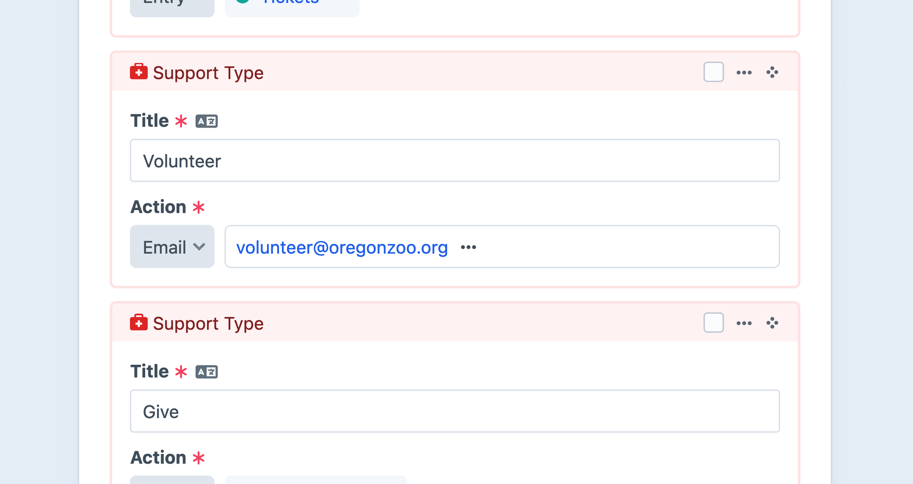
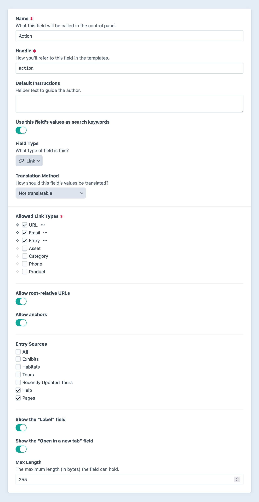

---
related:
  - uri: ../../system/fields.md
    label: Learn about content and custom fields
  - uri: ../../system/relations.md
    label: Using relationships
---

# Link Fields <Badge text="New!" />

::: tip
The link field replaced the URL field in [Craft 5.3](github:craftcms/cms/releases/5.3.0). When you update, existing fields will be automatically enhanced with the new UI. If you want to take advantage of the new features (like linking to assets, categories, and entries), check out the field’s [settings](#settings) screen.
:::

Link fields provide a flexible way to link to on- and off-site resources, including assets, categories, entries, email addresses, phone numbers, or arbitrary URLs.

<!-- more -->



A populated [link field’s value](#development) is always suitable for use as an anchor tag’s `href` attribute:

```twig
<a href="{{ entry.myLinkFieldHandle }}">{{ entry.myLinkFieldHandle.label }}</a>
```

## Settings

<BrowserShot
  url="https://my-craft-project.ddev.site/admin/settings/fields/new"
  :link="false"
  :max-height="500"
  caption="Adding a new link field via the control panel.">

</BrowserShot>

In addition to the standard field options, Link fields have the following settings:

- **Allowed Link Types** — The type of resource(s) that can be linked. Selecting more than one link type displays a dropdown menu for the author.

  - **URL** — The value must be a valid URL, beginning with `http://` or `https://`.
  - **Asset** — Select an [asset](../element-types/assets.md) element.
  - **Category** — Select a [category](../element-types/categories.md) element.
  - **Email** — The value is automatically prepended with `mailto:`.
  - **Entry** — Select an [entry](../element-types/entries.md) element.
  - **Phone** — The value is automatically prepended with `tel:`.

  ::: tip
  The list of available link types can be supplemented by plugins via the <craft5:craft\fields\Link::EVENT_REGISTER_LINK_TYPES> event.
  :::

- **Show the “Label” field** — Displays a dedicated field to override the default/generated link label.
- **Show the “Open in a new tab” field** — Whether or not authors can choose to have links open in a new tab.
- **Max Length** — The maximum number of characters the field can contain. (Defaults to `255`.)

### Type-Specific Options

When the _URL link type is enabled, two more options become available:

- **Allow root-relative URLs** — Accepts an absolute path, without a protocol or hostname (i.e. `/give`). Relative paths are still not allowed (i.e. `donate`), as they are ambiguous in most contexts.
- **Allow anchors** — Accepts values that contain only a fragment or hash-prefixed anchor, like `#my-heading`.

When enabling a link type that references elements, Craft will display a set of checkboxes that allow you to limit selection to specific [sources](../../system/elements.md#sources)—and in the case of assets, the allowable file kinds.

## The Field

Link fields have—at minimum—an input specific to the allowed type of link. If more than one link type is allowed, a dropdown menu will be shown before the field, allowing the author to switch between them and use a specialized input to define a value.

When the **Show the “Label” field** setting is enabled, an additional input allows authors to customize the textual representation of the link. This input’s `placeholder` text will reflect the automatically-determined value.

## Development

Outputting a link field in a template will return a normalized value suitable for use in an anchor tag’s `href` attribute:

```twig

  <a href="{{ entry.myLinkFieldHandle }}">Learn More</a>

```

To output a complete anchor tag, use the `link` property:

```twig
{# You can access it a property... #}
{{ entry.myLinkFieldHandle.link }}

{# ... or call the method, directly: }
{{ entry.myLinkFieldHandle.getLink() }}
```

The result is roughly equivalent to manually rendering the link like this:

```twig


<a href="{{ link.value }}" target="{{ link.target }}">{{ link.label }}</a>
```

The text representation of a link is determined by the presence of an explicit [label](#labels-attributes), and its [type](#types).

### `LinkData`

The link field returns a <craft5:craft\fields\data\LinkData> object. When used as a string, its value is intelligently coerced to something URL-like: for [element links](#elements), the element’s URL; for phone links, the number prefixed with `tel:`; and so on!

The following sections cover a variety of `LinkData` features.

#### Types

The valid `type` values are `asset`, `category`, `email`, `entry`, `phone`, and `url`. To handle link types separately, you can test or match against `entry.myLinkFieldHandle.type`:

```twig

  
    <span class="icon icon-phone"></span> {{ entry.myLinkFieldHandle.label }}
  
    <span class="icon icon-email"></span> {{ entry.myLinkFieldHandle.link }}
  
    {{ entry.myLinkFieldHandle.link }}

```

#### Elements

Links to assets, categories, and entries contain a reference to the selected element:

```twig
{{ entry.myLinkFieldHandle.element.render() }}
```

In this example, we’re outputting the associated [element partial](../../system/elements.md#element-partials)—but you can use the element (and its properties and fields) however you wish.

#### Labels + Attributes <Since ver="5.5.0" feature="Link labels and targets" />

Enable the **Show the “Label” field** option to allow authors to provide custom labels for links.

When a label is _not_ explicitly defined, Craft will figure out the best textual representation for the link—the selected element’s `title`, the URL (sans protocol), or the raw phone number, for example. That text—or `label`—can be retrieved via the `LinkData` model, in addition to the raw `value`:

```twig
<a href="{{ entry.myLinkFieldHandle.value }}">{{ entry.myLinkFieldHandle.label }}</a>
```

This is the default behavior when using a link’s `link` property. Craft also automatically includes the `target` attribute when rendering a link, if the **Open in a new tab** option is available (and enabled) for the field. You can access this manually via the `target` property:

```twig


{{ tag('a', {
  href: link.value,
  target: link.target,
  rel: link.target == '_blank' ? 'noopener noreferrer' : null,
}, link.label) }}

{# ...produces output like... #}

<a href="https://custom-url.com/page" target="_blank" rel="noopener noreferrer">custom-url.com</a>
```

When the **Open in a new tab** option is _off_, the `target` attribute is omitted.

### Relations

When using an element in a link field, Craft makes the corresponding connections in its [relations](../../system/relations.md) system. This means that you can query for elements via link fields, just like other [relational fields](../../system/relations.md#custom-fields):

```twig


{# -> Returns other entries connected to the given `post` via a specific link field. #}
```

::: warning
It is not currently possible to [eager-load](../../development/eager-loading.md) link field relationships, as their element type is not known until the field data is loaded.
:::
