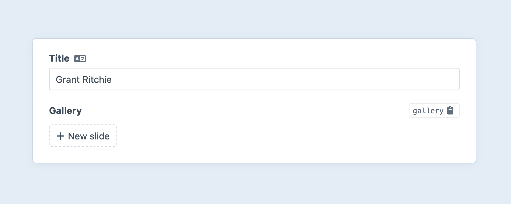
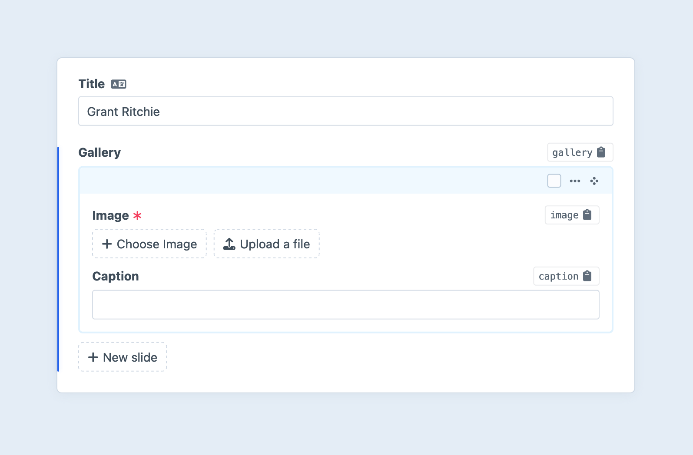

# Matrix Fields

Matrix fields allow you to manage nested [entries](../element-types/entries.md) in a fluid way. Entries created within a Matrix field are “owned” by the element that field is attached to, and can represent anything from a slide in a gallery to an entire resources section, each record having its own URL.

::: tip
During the Craft 5 upgrade process, _Matrix blocks_ were converted to _entries_. [Fields](../../system/fields.md) that were previously owned by a particular “block type” are now managed in (and assigned from) a global pool. You are now able to design [entry types](../element-types/entries.md#entry-types) that exist as standalone content objects (in a section), _or_ as nested entries (in a Matrix field)!
:::

## Settings

Matrix fields have the following settings:

#### Entry Types

Select from existing, globally-defined [entry types](../element-types/entries.md#entry-types), or create a new one on-the-fly.

#### Propagation Method

Choose how nested entries are propagated to other sites. This applies only to _new_ nested entries—changes to _existing_ nested entries are propagated on a per-field basis.

#### Site Settings <Badge text="New!" />

Nested entries can have their own URIs and templates.

::: tip
Incorporate the owner’s URI in a nested element by using `{owner.uri}` in its **URI Format** [object template](../../system/object-templates.md)!
:::

#### Min Entries

The _minimum_ number of entries that can be created within the field. (Default is no lower limit.)

#### Max Entries

The _maximum_ number of entries that can be created within the field. (Default is no upper limit.)

#### View Mode <Badge text="New!" />

Choose how the nested elements are represented within the [field UI](#the-field):

  - **As cards**: Read-only [element cards](../../system/elements.md#chips-cards) that surface nested field data.
  - **As inline-editable blocks**: Manage nested entries as though they were part of the parent form. In prior versions of Craft, this was the only display option for Matrix fields.
  - **As an element index**: A simplified [element index](../../system/elements.md#indexes) with sorting, searching, and filtering controls.

    When using the element index view mode, you can also allow authors to toggle between a card view and standard table view. Enabling the table view reveals controls for the columns that will be displayed, by default.

## The Field

The interface of a Matrix field depends on its selected [view mode](#view-mode). 

Traditionally, Matrix fields have used the **As inline-editable blocks** view mode, which makes the nested entries appear as though they are a repeating or modular region the main entry’s form. An empty Matrix field shows a single button, which will either immediately create a new nested entry (if there is only a single available entry type), or present a menu of entry types to select from:



A new entry of the chosen type will be appended to the list:



You can add as many blocks to your Matrix field as you’d like—or at least as many as the field’s **Min Blocks** and **Max Blocks** settings allow.

Each block has a menu that provides access to additional controls:


::: tip
If multiple blocks are selected, the Collapse/Expand, Disable/Enable, and Delete options will apply to each of them.

You can collapse inline Matrix blocks by choosing the **Collapse** menu option or by double-clicking on a block’s title bar. When a block is collapsed, its title bar will show a preview of its content so you can still identify which block it is.

Blocks can also be reordered by dragging the “Move” icon (<icon kind="move" />) at the end of the block’s title bar. If multiple blocks are selected, all the selected blocks will be going along for the ride.

You can quickly select _all_ blocks by selecting one and pressing <kbd>Ctrl</kbd>/<kbd>⌘</kbd> + <kbd>A</kbd>, or selecting a range of blocks starting with the first and then <kbd>Shift</kbd>-clicking the last.
:::

The **As cards** view mode provides many of the same management tools, but the entries are represented as read-only [cards](../../system/elements.md#chips--cards). Double-click any card to edit its content, or use the “Move” icon (<icon kind="move" />) to drag them into a new order.

Finally, the **As an element index** view mode behaves just like a normal element index—except it only ever shows the entries owned by that field. This mode is perfect for large data sets that may span multiple pages, need to be sorted by nested fields, or that would otherwise be unwieldy as blocks or cards.

## Nesting Matrix Fields

A Matrix field can include an entry type that has another Matrix field (or the same Matrix field) in its field layout. Those Matrix fields can use the same view mode, or different view modes, depending on how they’re composed. Take care when designing your authoring experience to avoid confusing, infinitely-recursive data structures.

## Development

### Querying Elements with Matrix Fields

When [querying for elements](../../development/element-queries.md) that have a Matrix field, you can filter the results based on the Matrix field data using a query param named after your field’s handle.

Possible values include:

| Value | Fetches elements… |
| --- | --- |
| `':empty:'` | that don’t have any Matrix blocks. |
| `':notempty:'` | that have at least one Matrix block. |

::: code
```twig
{# Fetch entries whose Matrix field `myFieldHandle` has at least one nested entry: #}

```
```php
// Fetch entries whose Matrix field `myFieldHandle` has at least one nested entry:
$entries = \craft\elements\Entry::find()
    ->myFieldHandle(':notempty:')
    ->all();
```
:::

::: tip
If you have a reference to a nested entry, you can get the owner element via `entry.owner`.
:::

### Working with Matrix Field Data

If you have an element with a Matrix field in your [template](../../development/templates.md), you can access its nested entries via the field’s handle:

```twig

```

That will give you an [Entry query](../element-types/entries.md#querying-entries), ready to load all the nested entries for a given field.

To fetch the nested elements, call one of the [query execution methods](../../development/element-queries.md#executing-element-queries), or use it in a loop:

```twig



  <ul>
    
      {# ... #}
    
  </ul>

```

All the code you put within the for-loop will be repeated for each nested entry. The current entry will get set to that `nestedEntry` variable we’ve defined, and it will be another <craft4:craft\elements\Entry> model.

Here’s an example of what the template might look like for a Matrix field that has four entry types (Heading, Text, Image, and Quote). We can handle each entry type separately by checking its `handle`:

```twig

  {# Grab the entry type’s handle for comparison: #}
  

  
    <h3>{{ nestedEntry.heading }}</h3>
  
    {{ nestedEntry.text|markdown }}
  
    

    
      {{ image.getImg('thumb') }}
    
  
    <blockquote>
      <p>{{ nestedEntry.quote }}</p>
      <cite>– {{ nestedEntry.cite }}</cite>
    </blockquote>
  
    {# Uh oh! This entry type isn’t support yet... #}
    <p>You can output something here to remind yourself to handle additional cases!</p>
  

```

::: tip
This code can be simplified using the [switch](dev/tags.md#switch) tag.
:::

#### Other Query Methods

If you only want the first nested entry, call [one()](<craft4:craft\db\Query::one()>) instead of `all()`, and make sure it returned something:

::: code
```twig


  {# ... #}

```
```php
$firstNestedEntry = $entry->myFieldHandle->one();
if ($firstNestedEntry) {
    // ...
}
```
:::

If you only want to know the total number of blocks, call [count()](<craft4:craft\db\Query::count()>).

::: code
```twig

<p>Total nested entries: <strong>{{ total }}</strong></p>
```
```php
$total = $entry->myFieldHandle->count();
```
:::

If you just need to check if there are nested entries added to a field (but don’t need to actually load them), call [exists()](<craft4:craft\db\Query::exists()>):

::: code
```twig

  <p>Here be nested content!</p>

```
```php
if ($entry->myFieldHandle->exists()) {
    // There’s at least one nested entry!
}
```

Read more about [query execution methods](./element-queries.md#executing-element-queries) on the element query page.
:::

You can set [parameters](matrix-blocks.md#parameters) on the query, as well. For example, to only fetch nested entries that use a specific entry type, set the [type](../element-types/entries.md#type) param:

::: code
```twig

```
```php
$nestedTextEntries = $entry->myFieldHandle
    ->type('text')
    ->all();
```
:::

#### Eager Loading

Nested entries can be [eager-loaded](../../development/eager-loading.md) with their owners using the special `.with()` query method. Eager-loading can greatly improve performance if you need to output one or more blocks within a list of other elements—like generating summaries from the first block of content in a list of blog posts.

The new `.eagerly()` method simplifies this in situations where you need to output or act on nested entry information within a query for their owners. Take this list of recipes, for example:

```twig



  <article>
    <h2>{{ recipe.title }}</h2>

    {{ recipe.summary|md }}

    <div>
      {{ recipe.estimatedTotalTime }}
      —
      {{ recipe.steps.eagerly().count() }} Step(s)
      —
      {{ recipe.difficulty }}
    </div>
  </article>

```

### Saving Matrix Fields

::: danger
This section has not been adapted for Craft 5. Working with Matrix field data has changed dramatically.
:::

::: warning
Working with nested entries is significantly more complex than other field types. The `form` examples that follow assume some familiarity with [how Craft routes and handles requests](../controller-actions/README.md), as well as a willingness to adapt and extend the provided HTML to suit your needs.
:::

If you have an element form (such as an [entry form](kb:entry-form)) that needs to manage content within a Matrix field, you will need to submit your Matrix field’s data in a specific structure. We’re using JSON for the sake of its simple syntax, but the following examples will show you how to build a similarly-structured request with normal form elements:

```json
{
  "sortOrder": [
    321,
    654,
    "new:1"
  ],
  "blocks": {
    "321": {
      "type": "myFirstTypeHandle",
      "fields": {
        "myTextFieldHandle": "...",
        "myAssetField": [
          4,
          5,
          6
        ]
      }
    },
    "654": {
      "type": "myOtherTypeHandle",
      "fields": {
        "myNumberField": 42,
        "myDateField": {
          "date": "2023-01-01",
          "time": "00:00",
          "timezone": "America/Los_Angeles"
        }
      }
    },
    "new:1": {
      "type": "myFirstTypeHandle",
      "fields": {
        "myTextFieldHandle": "...",
        "myAssetField": []
      }
    }
  }
}
```

#### Entry Order

`sortOrder` should be submitted as an array of all the entry IDs you wish to persist (as well as any new entry identifiers), in the order they should be saved.

If you want all existing entries to persist in the same order they are currently in, then use this template to define your `sortOrder` array:

```twig

  
    {{ hiddenInput('fields[myFieldHandle][sortOrder][]', nestedEntryId) }}
  

```

::: tip
The `sortOrder` input elements do _not_ need to be adjacent in the DOM or as POST params—you are free to distribute and collocate them with each block’s data, if you wish.
:::

#### Entry Data

All of your entry data should be nested under a `entries` key, and indexed by their IDs. Each block must submit its `type` (using the desired block type’s handle) and custom field data nested under a `fields` key.

Here’s how you can output form fields for existing blocks, for a Matrix field with two block types (`text` and `image`):

```twig

  
    {# Prefix the block's input names with `fields[myFieldHandle][blocks][<BlockID>]` #}
    
      {{ hiddenInput('type', block.type) }}

      
        
          <textarea name="fields[myTextFieldHandle]">
            {{- block.myTextFieldHandle|raw -}}
          </textarea>
        
          
          
            <ul>
              
                <li>
                  {{ image.getImg({ width: 100, height: 100 }) }}
                  {{ hiddenInput('fields[myAssetFieldHandle][]', image.id) }}
                </li>
              
            </ul>
          
      
    
  

```

::: tip
Outputting form fields for existing blocks is completely optional. As long as the block IDs are listed in the `sortOrder` array, they will persist even if they are excluded from the form data.
:::

#### New Blocks

To _add_ a block in a front-end form, you’ll need a unique, temporary identifier for it, prefixed with `new:`.  Append that “ID” to the `sortOrder` array, and use it when constructing the block’s form inputs.

For example, the first new block that is added to the form could have an “ID” of `new:1`, so its `type` input name would end up looking like this (ignoring for a moment any `namespace` tags):

```html
<input type="hidden" name="fields[myFieldHandle][new:1][type]" value="text" />
```

Then define the form inputs for any additional blocks that should be appended to the input.

```twig
{{ hiddenInput('fields[myFieldHandle][sortOrder][]', 'new:1') }}

{# Prefix the block's input names with `fields[myFieldHandle][blocks][new:1]` #}

  {{ hiddenInput('type', 'text') }}
  <textarea name="fields[myTextFieldHandle]"></textarea>

```

If you want to make the new block _optional_, you will need to give the user an opportunity to remove the inputs so they are not included in the request.

::: tip
The flexibility of Matrix fields often demands some client-side JavaScript—appending blocks of different types, generating temporary IDs, rearranging blocks and updating sort order, etc. are all difficult problems to solve with plain HTML. Craft’s UI relies on a host of control panel-specific scripts and markup—and therefore is generally not usable in the front-end.

However: as long as the data you ultimately POST to Craft conforms to the schema above, it will work! If you have a preferred view library like Vue or React, you may be better prepared than you think—your task then shifts from dealing with manipulating DOM elements to transforming your components’ state into a [`FormData` object](https://developer.mozilla.org/en-US/docs/Web/API/FormData) with the right parameter names and values.
:::

#### Validation Errors

Should you encounter [validation](../controller-actions/README.md#models-and-validation) issues within a Matrix field, Craft will set a [flash](../controller-actions/README.md#flashes) and add errors to the main element (under the Matrix field’s handle)—as well as on each block with problems.

In these cases, it’s important to handle the Matrix block data appropriately—the blocks will be available directly on the main element as an array, and do not need to be fetched. In fact, trying to re-load the blocks from the database would mean you are working with the last-persisted state, rather than the blocks populated from the most recent request!

Instead, we’ll try three values:

1. Attempt to use the field value as an element query (load the blocks fresh, assuming there are no pending changes hanging in-memory);
1. Accept the value, verbatim (assuming Craft has left the in-memory blocks attached, and they _don’t_ need to be queried);
1. Default to an empty array (this ensures whatever uses the `blocks` variable later on can safely assume it’s an array);

```twig

```

::: tip
The [null-coalescing operator](https://twig.symfony.com/doc/3.x/templates.html#other-operators) swallows errors that occur when attempting to access variables, properties, or methods that don’t exist.
:::

Temporary identifiers on new blocks do _not_ need to stay the same between requests (say, if you created two blocks but changed their order, then submitted and hit a validation error); you may output “new” blocks in the order Craft has provided them, re-keying those blocks:

```twig

  
  {{ hiddenInput('sortOrder[]', id) }}
  {{ hiddenInput("blocks[#{id}][type]", block.type.handle) }}
  {# ... #}

```

## See Also

- [Matrix Block Queries](matrix-blocks.md#querying-matrix-blocks)
- [Element Queries](element-queries.md)
- <craft4:craft\elements\MatrixBlock>
