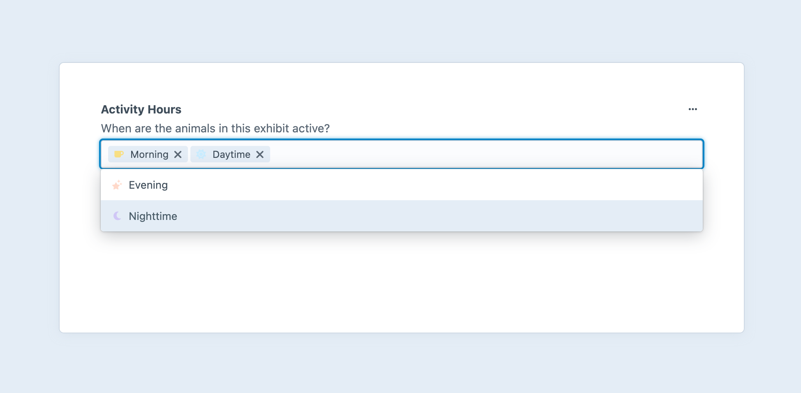
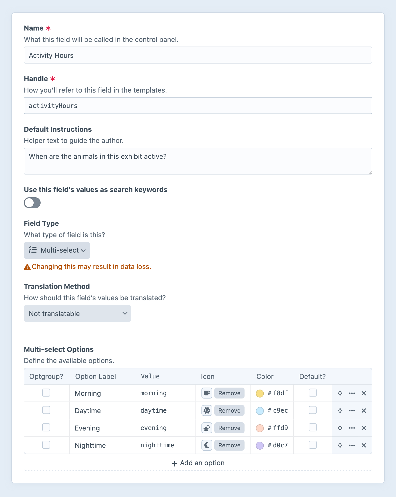

---
related:
  - uri: checkboxes.md
    label: Checkboxes fields
  - uri: radio-buttons.md
    label: Radio buttons fields
---

# Multi-select Fields

Multi-select fields give you an input where multiple items may be selected.

<!-- more -->



## Settings

<BrowserShot
  url="https://my-craft-project.ddev.site/admin/settings/fields/new"
  :link="false"
  :max-height="500"
  caption="Adding a new multi-select field via the control panel.">

</BrowserShot>

Multi-select fields have the following settings:

- **Multi-select Options** – Define any number of options to populate the menu.
  - **Optgroup?** — Converts this option into a non-selectable “heading” to group other options.
  - **Label** — A text description of the option, displayed to the author.
  - **Value** — The value stored when a given option is selected.
  - **Icon** (Optional) — Choose from the standard system icon palette.
  - **Color** (Optional) — A color for the icon, or, when no icon is selected, a color pip.
  - **Default?** — One option can be marked as the default.

## Development

The order in which options are selected is _not_ preserved.
If the order of selections is important, consider using one of the [relational](README.md#references) fields.

### Working with Multi-select Field Data

If you have an element with a multi-select field in your template, you can access its data using your multi-select field’s handle:

::: code
```twig

```
```php
$value = $entry->myFieldHandle;
```
:::

That will give you a <craft5:craft\fields\data\MultiOptionsFieldData> object that contains the selected options’ labels and values. You can use this like an array:

::: code
```twig

  Label: {{ option.label }}
  Value: {{ option }} or {{ option.value }}

```
```php
foreach ($entry->myFieldHandle as $option) {
    // Label: $option->label
    // Value: (string)$option or $option->value
}
```
:::

To loop through _all_ the available options, iterate over the [options](craft5:craft\fields\data\MultiOptionsFieldData::getOptions()) property:

::: code
```twig

  Label:    {{ option.label }}
  Value:    {{ option }} or {{ option.value }}
  Selected: {{ option.selected ? 'Yes' : 'No' }}

```
```php
foreach ($entry->myFieldHandle->options as $option) {
    // Label:    $option->label
    // Value:    (string)$option or $option->value
    // Selected: $option->selected
}
```
:::

To see if any options are selected, use the [length](https://twig.symfony.com/doc/3.x/filters/length.html) filter (or PHP’s `count()` function):

::: code
```twig

  {# At least one option was selected! #}

```
```php
if (count($entry->myFieldHandle)) {
    // At least one option was selected!
}
```
:::

To see if a particular option is selected, use [contains()](craft5:craft\fields\data\MultiOptionsFieldData::contains()):

::: code
```twig

  {# `foo` is among the selected options! #}

```
```php
if ($entry->myFieldHandle->contains('foo')) {
    // `foo` is among the selected options!
}
```
:::

### Querying Elements with Multi-select Fields

When [querying for elements](../../development/element-queries.md) that have a Multi-select field, you can filter the results based on the multi-select field data using a query param named after your field’s handle.

Possible values include:

| Value | Fetches elements…
| - | -
| `'foo'` | with a `foo` option selected.
| `'not foo'` | without a `foo` option selected.
| `['foo', 'bar']` | with `foo` or `bar` options selected.
| `['and', 'foo', 'bar']` | with `foo` and `bar` options selected.

::: code
```twig
{# Fetch entries with the 'foo' option selected #}

```
```php
// Fetch entries with the 'foo' option selected
$entries = \craft\elements\Entry::find()
    ->myFieldHandle('foo')
    ->all();
```
:::

### Saving Multi-select Fields

If you have a front-end element form (such as an [entry form](kb:entry-form)) that incorporates multi-select field data, you can use this template as a starting point:

```twig
{# Fetch the global field definition: #}


{# Include a hidden input first so Craft knows to update the
   existing value, if no options are selected + submitted. #}
{{ hiddenInput('fields[myFieldHandle]', '') }}

<select multiple name="fields[myFieldHandle][]">
  
    

    {{ tag('option', {
      value: option.value,
      text: option.label,
      selected: selected,
    }) }}
  
</select>
```
