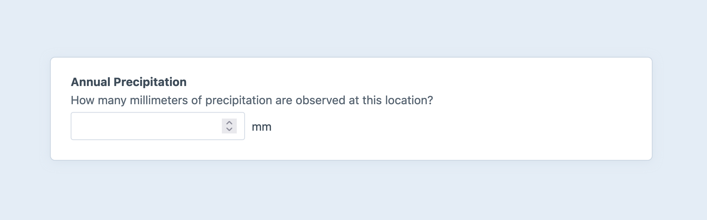
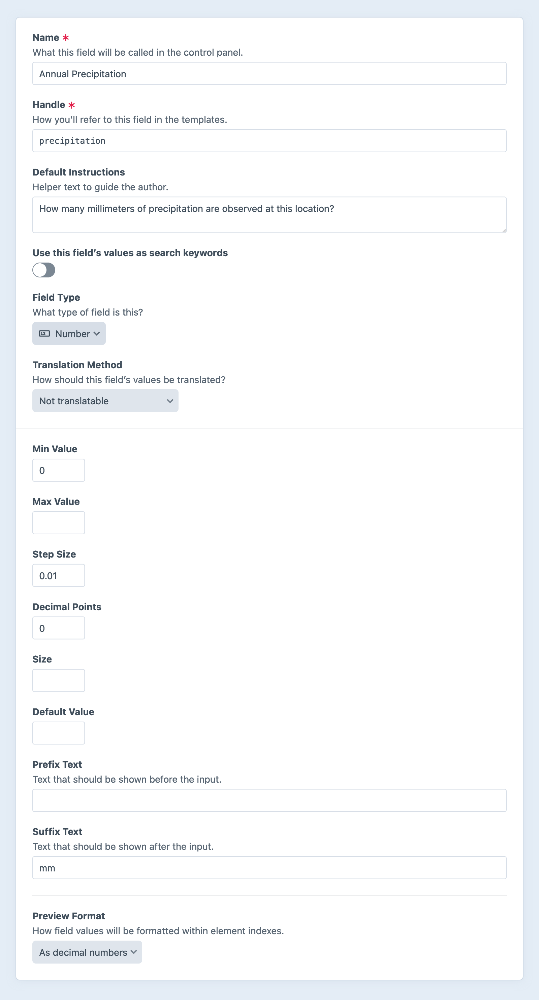

# Number Fields

Number fields give you a [number input](https://developer.mozilla.org/en-US/docs/Web/HTML/Element/input/number) that accepts a numeric value with specific bounds and granularity.

<!-- more -->



## Settings

<BrowserShot
  url="https://my-craft-project.ddev.site/admin/settings/fields/new"
  :link="false"
  :max-height="500"
  caption="Adding a new number field via the control panel.">
  
</BrowserShot>

Number fields have the following settings:

- **Min Value** — The lowest number that may be entered in the field
- **Max Value** — The highest number that may be entered in the field.
- **Step Size** — The permitted granularity, mapped to the [`step`](https://developer.mozilla.org/en-US/docs/Web/HTML/Element/input/number#step) attribute of the resulting input.
- **Decimal Points** — The maximum number of decimal points that may be entered in the field.
- **Size** — The input’s [`size` attribute](https://developer.mozilla.org/en-US/docs/Web/HTML/Element/input#size).
- **Default Value** — The default value that should be applied for new elements.
- **Prefix Text** — Text that should be displayed before the input.
- **Suffix Text** — Text that should be displayed after the input.
- **Preview Format** — How field values will be formatted within element indexes.

## Development

### Querying Elements with Number Fields

When [querying for elements](../../development/element-queries.md) that have a Number field, you can filter the results based on the Number field data using a query param named after your field’s handle.

Possible values include:

| Value | Fetches elements…
| - | -
| `100` | with a value of 100.
| `'>= 100'` | with a value of at least 100.
| `['and', '>= 100', '<= 1000']` | with a value between 100 and 1,000.

::: code
```twig
{# Fetch entries with a Number field set to at least 100 #}

```
```php
// Fetch entries with a Number field set to at least 100
$entries = \craft\elements\Entry::find()
    ->myFieldHandle('>= 100')
    ->all();
```
:::

### Working with Number Field Data

If you have an element with a number field in your template, you can access its value using using the field’s handle:

::: code
```twig

```
```php
$value = $entry->myFieldHandle;
```
:::

That will give you the number value for the field, or `null` if there is no value.

To format the number with proper thousands separators (e.g. `,`), use the [number](../twig/filters.md#number) filter:

::: code
```twig
{{ entry.myFieldHandle|number }}
```
```php
\Craft::$app->getFormatter()->asDecimal($entry->myFieldHandle);
```
:::

If the number will always be an integer, pass `decimals=0` to format the number without any decimals.

::: code
```twig
{{ entry.myFieldHandle|number(decimals=0) }}
```
```php
\Craft::$app->getFormatter()->asDecimal($entry->myFieldHandle, 0);
```
:::


### Saving Number Fields

If you have an element form, such as an [entry form](kb:entry-form), that needs to contain a number field, you can use this template as a starting point:

```twig
{# Load the base field definition: #}


{# Resolve a current or default value: #}


{# Build the input: #}
<input
  type="number"
  name="fields[myFieldHandle]"
  min="{{ field.min }}"
  max="{{ field.max }}"
  step="{{ field.step }}"
  value="{{ value }}">
```
