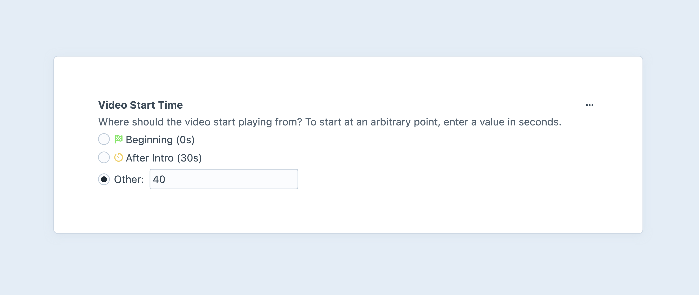
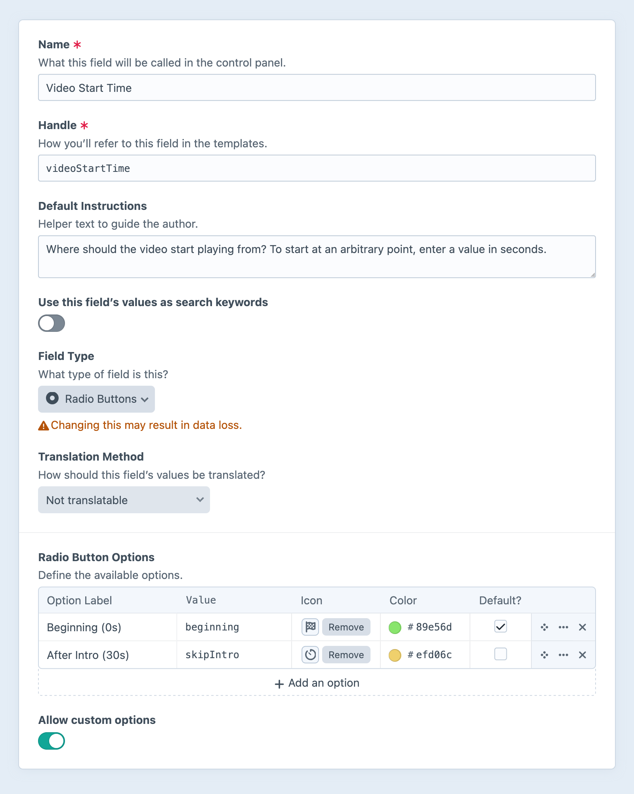

---
related:
  - uri: dropdown.md
    label: Dropdown fields
---

# Radio Buttons Fields

Radio buttons fields give you a group of [radio](https://developer.mozilla.org/en-US/docs/Web/HTML/Element/input/radio) inputs, and allow the author to select a single value (or provide a custom one, when allowed).

<!-- more -->



## Settings

<BrowserShot
  url="https://my-craft-project.ddev.site/admin/settings/fields/new"
  :link="false"
  :max-height="500"
  caption="Adding a new radio buttons field via the control panel.">

</BrowserShot>

In addition to the standard field options, radio buttons fields have the following settings:

- **Radio Button Options** — Define any number of options to populate the menu.
  - **Label** — A text description of the option, displayed to the author.
  - **Value** — The value stored when a given option is selected.
  - **Icon** (Optional) — Choose from the standard system icon palette.
  - **Color** (Optional) — A color for the icon, or, when no icon is selected, a color pip.
  - **Default?** — One option can be marked as the default.
- **Allow custom options** — Whether authors can define an “other” option, on-the-fly.

## Development

### Working with Radio Buttons Field Data

If you have an element with a radio buttons field in a template, you can access its data using the field’s handle:

::: code
```twig

```
```php
$value = $entry->myRadioFieldHandle;
```
:::

That will give you a <craft5:craft\fields\data\SingleOptionFieldData> object that contains information about the selected value and available options.

Outputting the object casts it to a string, which is equivalent to directly accessing its [value](craft5:craft\fields\data\SingleOptionFieldData::$value) property:

::: code
```twig
{{ entry.myRadioFieldHandle }} or {{ entry.myRadioFieldHandle.value }}
```
```php
$entry->myRadioFieldHandle; // -> craft\fields\data\SingleOptionFieldData
$entry->myRadioFieldHandle->value; // -> string
```
:::

To check if _any_ option is selected, you must test the [value](craft5:craft\fields\data\SingleOptionFieldData::$value) property, explicitly:

::: code
```twig

  {# Yep, a value was selected! #}

```
```php
if ($entry->myRadioFieldHandle->value) {
  // Yep, a value was selected!
}
```
:::

To show the selected option’s _label_, use the [label](craft5:craft\fields\data\SingleOptionFieldData::$label) property:

::: code
```twig
{{ entry.myRadioFieldHandle.label }}
{# "The selected option’s user-facing label!" #}
```
```php
$entry->myRadioFieldHandle->label; // -> "The selected option’s user-facing label!"
```
:::

::: warning
If the author provided a custom value, no label will be available.
:::

To loop through all the available options, iterate over the [options](craft5:craft\fields\data\SingleOptionFieldData::getOptions()) property. The selected option’s `selected` property will be `true`.

::: code
```twig

  Label: {{ option.label }}
  Value: <code>{{ option.value }}</code>
  Selected: {{ option.selected ? 'Yes' : 'No' }}

```
```php
foreach ($entry->myRadioFieldHandle->options as $option) {
    $option->label;
    $option->value;
    $option->selected ? 'Yes' : 'No';
}
```
:::

If the author provides a “custom” value, no `option` will be marked as `selected`.

### Querying Elements with Radio Buttons Fields

When [querying for elements](element-queries.md) that have a radio buttons field, you can filter the results using a query param named after your field’s handle. Possible values include:

| Value | Fetches elements…
| - | -
| `'foo'` | with the `foo` option selected (or a custom value of `foo`).
| `'not foo'` | without the `foo` option selected (or a custom value of `foo`).
| `['foo', 'bar']` | with either the `foo` or `bar` options selected (or a custom value of `foo`).
| `['not', 'foo', 'bar']` | without either the `foo` or `bar` options selected (or a custom value of `foo`).

::: code
```twig
{# Fetch entries with the 'foo' option selected #}

```
```php
// Fetch entries with the 'foo' option selected
$entries = \craft\elements\Entry::find()
    ->myRadioFieldHandle('foo')
    ->all();
```
:::

### Saving Radio Buttons Fields

If you have a front-end element form (such as an [entry form](kb:entry-form)) that incorporates radio button field data, you can use this fragment as a starting point:

```twig
{# Fetch the global field definition: #}




<ul>
  {# Iterate over the defined options: #}
  
    

    <li>
      <label>
        {{ input('radio', 'fields[myRadioFieldHandle]', option.value, {
          checked: selected,
        }) }}
        {{ option.label }}
      </label>
    </li>
  

  {# Optional — Provide a text input for a custom value: #}
  <li>
    <label>
      {{ input('radio', 'fields[myRadioFieldHandle]', '', {
        id: 'myRadioFieldHandleOther',
        checked: hasCustomValue,
      }) }}
      Other:
      {{ input('text', 'fields[myRadioFieldHandle]', hasCustomValue ? currentValue : null, {
        disabled: not hasCustomValue,
        id: 'myRadioFieldHandleCustom',
      }) }}
    </label>
  </li>
</ul>
```

Unfortunately, browsers will always send the _last_ input value among those with the same `name`. This means we need to selectively disable the text input:

```twig
<script>
  // Connect to the form element with an ID:
  const $form = document.getElementById('form');

  // 
  const $other = document.getElementById('myRadioFieldHandleOther');
  const $custom = document.getElementById('myRadioFieldHandleCustom');

  $form.addEventListener('change', function(e) {
    $custom.disabled = !$other.checked;
  });
</script>
```

The first snippet handles initializing the pair of inputs in the correct state; JavaScript takes over and watches for changes to the form, and synchronizes them in the client.
