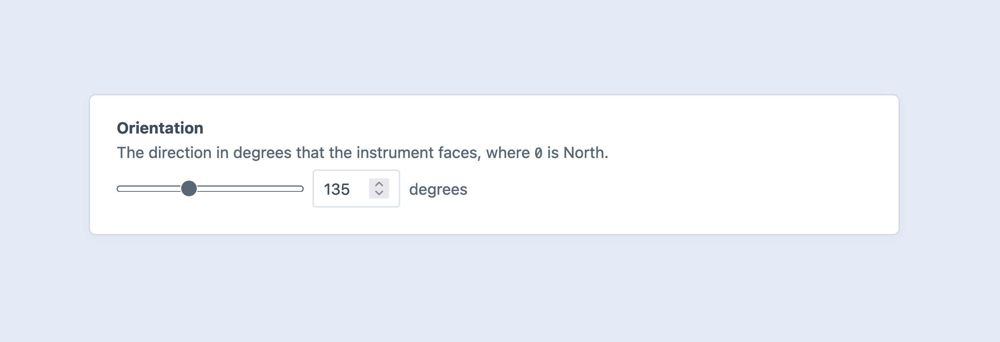
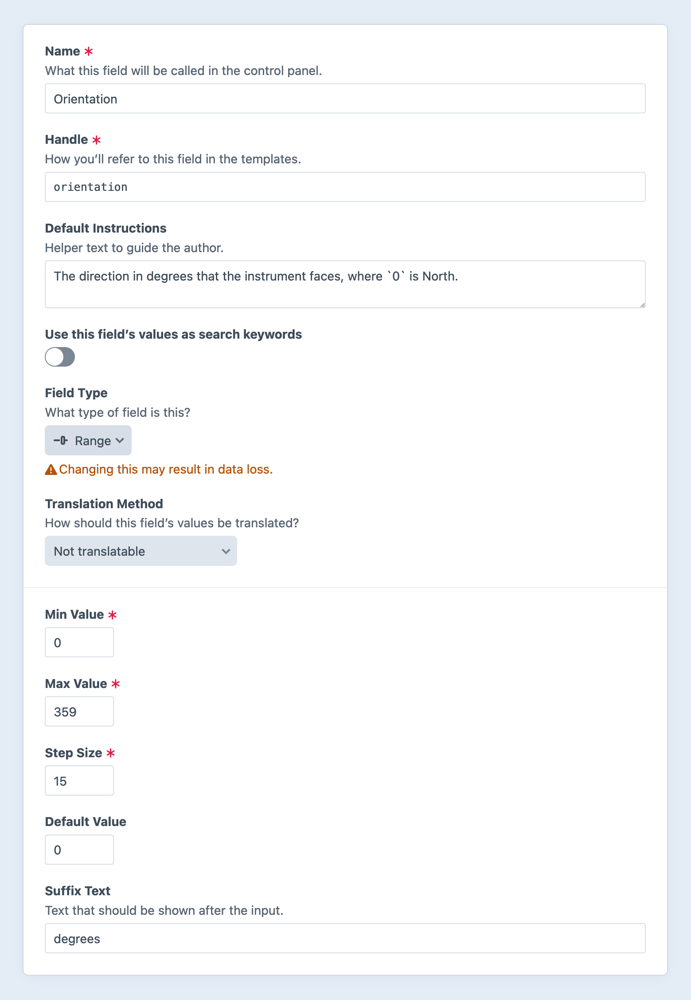

---
related:
  - uri: number.md
    label: Number fields
---

# Range Fields

Range fields give you a [range input](https://developer.mozilla.org/en-US/docs/Web/HTML/Element/input/range) that allows authors to set a number using a visual slider or a number input.

<!-- more -->

## Settings

<BrowserShot
  url="https://my-craft-project.ddev.site/admin/settings/fields/new"
  :link="false"
  :max-height="500"
  caption="Adding a new range field via the control panel.">
  
</BrowserShot>

Range fields have the following settings:

- **Min Value** — The _lowest_ number that may be accessed using the slider or entered manually.
- **Max Value** — The _highest_ number that may be accessed using the slider or entered manually.
- **Step Size** — The permitted granularity, mapped to the [`step`](https://developer.mozilla.org/en-US/docs/Web/HTML/Element/input/number#step) attribute of the resulting `range` and `number` inputs.
- **Default Value** — An initial value for the input, on new elements.
- **Suffix Text** — A string to include after the number input.

## Development

Working with range field values is identical to [number fields](number.md).
