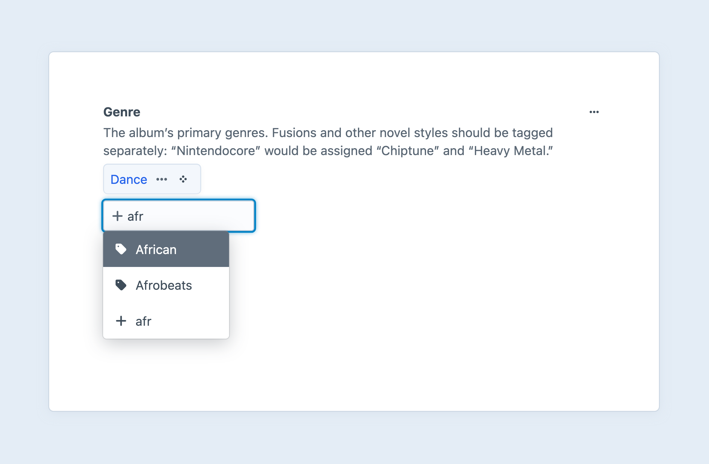
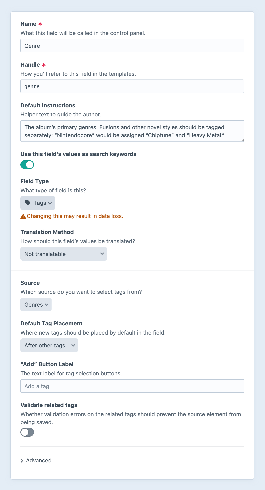

# Tags Fields

Tags fields allow you relate [tags](../element-types/tags.md) to other elements. It is one of Craft’s [relational](../../system/relations.md) custom fields.

<!-- more -->



## Settings

<BrowserShot
  url="https://my-craft-project.ddev.site/admin/settings/fields/new"
  :link="false"
  :max-height="500"
  caption="Adding a new tags field via the control panel.">

</BrowserShot>

Tags fields have the following settings:

- **Source** — Which tag group the field should be able to relate tags from. Only one source is allowed, because Craft needs to know which group to create new tags in.
- **Default Tag Placement** — Whether new selections are prepended or appended to the existing relations.
- **“Add” Button Label** — The label that should be used on the field’s search input.
- **Validate related tags** — Whether or not validation errors on the related tags will be bubbled up.

### Advanced Settings

Additional settings are available under the **Advanced** toggle:

- **Allow self-relations** — If this field is added to a tag group field layout, should the author be allowed to select the tag they are editing as a relationship to itself?

### Multi-Site Settings

On multi-site installs, the following settings will also be available:

- **Translation Method** — How relationships are handled when [propagating changes to other sites](../../system/fields.md#translation-methods).
- **Relate tags from a specific site?** — Whether to only allow relations to tags from a specific site.
  - If _enabled_, a new setting will appear where you can choose which site.
  - If _disabled_, related tags will always be pulled from the current site.

- **Show the site menu** — Whether to display the site menu in tag selection modals. (This setting is hidden when relations are locked to a single site.)

<See path="../../system/fields.md" hash="translation-methods" label="Translation Methods" description="Learn about options for translating field values." />

## The Field

Tags fields list all the currently-related tags with a text input to add new ones.

As you type into the text input, the Tags field will search through the existing tags that belong to the field’s tag group (per its Source setting), and suggest tags in a menu below the text input. If an exact match is not found, the first option in the menu will create a new tag named after the input value.

::: tip
By default you won’t be able to create multiple tags that are too similar in name. You can change that behavior by enabling the <config5:allowSimilarTags> config setting.
:::

### Inline Tag Editing

When you double-click on a related tag, a [slideout](../../system/control-panel.md#slideouts) will appear where you can edit the tag’s title and any custom fields added to its group’s field layout.

## Development

### Querying Elements with Tags Fields

When [querying for elements](../../development/element-queries.md) that have a Tags field, you can filter the results based on the Tags field data using a query param named after your field’s handle.

Possible values include:

| Value | Fetches elements…
| - | -
| `':empty:'` | that don’t have any related tags.
| `':notempty:'` | that have at least one related tag.
| `100` | that are related to the tag with an ID of 100.
| `[100, 200]` | that are related to a tag with an ID of 100 or 200.
| `[':empty:', 100, 200]` | with no related tags, or related to a tag with an ID of 100 or 200.
| `['and', 100, 200]` | that are related to the tags with IDs of 100 and 200.
| an [Tag](craft5:craft\elements\Tag) object | that are related to the tag.
| an [TagQuery](craft5:craft\elements\db\TagQuery) object | that are related to any of the resulting tags.

::: code
```twig
{# Fetch entries with a related tag #}

```
```php
// Fetch entries with a related tag
$entries = \craft\elements\Entry::find()
    ->myFieldHandle(':notempty:')
    ->all();
```
:::

### Working with Tags Field Data

If you have an element with a Tags field in your template, you can access its related tags using your Tags field’s handle:

::: code
```twig

```
```php
$query = $entry->myFieldHandle;
```
:::

That will give you a [tag query](../element-types/tags.md#querying-tags), prepped to output all the related tags for the given field.

To loop through all the related tags, call [all()](craft5:craft\db\Query::all()) and then loop over the results:

::: code
```twig


  <ul>
    
      <li><a href="{{ url('tags/'~rel.slug) }}">{{ rel.title }}</a></li>
    
  </ul>

```
```php
$relatedTags = $entry->myFieldHandle->all();
if (count($relatedTags)) {
    foreach ($relatedTags as $rel) {
        // \craft\helpers\UrlHelper::url('tags/' . $rel->slug)
        // $rel->title
    }
}

```
:::

If you only want the first related tag, call [one()](craft5:craft\db\Query::one()) and make sure it returned something:

::: code
```twig


  <p><a href="{{ url('tags/'~rel.slug) }}">{{ rel.title }}</a></p>

```
```php
$rel = $entry->myFieldHandle->one();
if ($rel) {
    // \craft\helpers\UrlHelper::url('tags' . $rel->slug)
    // $rel->title
}
```
:::

If you need to check for any related tags without fetching them, you can call [exists()](craft5:craft\db\Query::exists()):

::: code
```twig

  <p>There are related tags!</p>

```
```php
if ($entry->myFieldHandle->exists()) {
    // There are related tags!
}
```
:::

You can set [parameters](../element-types/tags.md#parameters) on the tag query as well.

::: code
```twig

```
```php
$relatedTags = $entry->myFieldHandle
    ->group('blogEntryTags')
    ->all();
```
:::

::: tip
<Todo notes="Extract this into a snippet." />

In Craft 3, we recommended cloning these query objects using the [`clone` keyword](https://www.php.net/manual/en/language.oop5.cloning.php) or [`clone()`](../twig/functions.md#clone) Twig function before applying params. **This is no longer required in Craft 4**, because a new copy of the query is returned each time you access the field property.
:::

### Saving Tags Fields

If you have an element form, such as an [entry form](kb:entry-form), that needs to contain a Tags field, you will need to submit your field value as a list of tag IDs, in the order you want them to be related.

For example, you could create a list of checkboxes for each of the possible relations:

```twig
{# Include a hidden input first so Craft knows to update the existing value
   if no checkboxes are checked. #}
{{ hiddenInput('fields[myFieldHandle]', '') }}

{# Get all of the possible tag options #}


{# Get the currently related tag IDs #}


<ul>
  
    <li>
      <label>
        {{ input(
          'checkbox',
          'fields[myFieldHandle][]',
          possibleTag.id,
          { checked: possibleTag.id in relatedTagIds }
        ) }}
        {{ possibleTag.title }}
      </label>
    </li>
  
</ul>
```

You could then make the checkbox list sortable, so users have control over the order of related tags.

## See Also

- [Tag Queries](../element-types/tags.md#querying-tags)
- <craft5:craft\elements\Tag>
- [Relations](../../system/relations.md)
