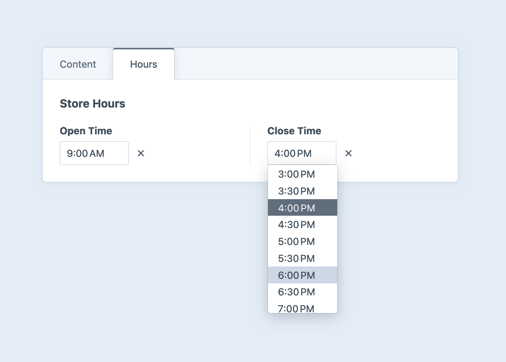

# Time Fields

Time fields provide a time picker input without a date component. When you [access a time field’s value](#development), Craft hydrates the stored “time” value (a string with the format `H:i`, in the system’s timezone) into a native PHP `DateTime` object.

<!-- more -->



## Settings

When creating a time field, you can customize the minute increment and optionally set minimum and maximum times that are allowed.

::: warning
Changing the system’s timezone can cause previously-saved time field values to become inaccurate!
:::

## Development

### Querying Elements with Time Fields

When [querying for elements](../../development/element-queries.md) that have a time field, you can filter the results based on the time field data using a query param named after your field’s handle.

Possible values include:

| Value | Fetches elements…
| - | -
| `':empty:'` | …that don’t have a selected time.
| `':notempty:'` | …that have a selected time.
| `'>= 09:00'` | …that have a time selected on or after 9:00AM.
| `'< 09:00'` | …that have a time selected before 9:00AM.
| `['and', '>= 09:00', '< 17:00']` | …that have a time selected between 9:00AM and 5:00PM.
| `['or', '< 09:00', '> 17:00']` | …that have a time selected before 9:00AM or after 5:00PM.

::: code
```twig
{# Fetch entries with with a selected time before 9:00AM #}

```
```php
// Fetch entries with with a selected time before 9:00 AM
$entries = \craft\elements\Entry::find()
    ->myFieldHandle('< 09:00')
    ->all();
```
:::

::: warning
All query parameters must use 24-hour timestamps. Time field values are compared as strings (not database-native dates or times).
:::

### Working with Time Field Data

If you have an element with a time field in your template, you can access its value by its handle:

::: code
```twig

```
```php
$time = $entry->myTimeFieldHandle;
```
:::

That will give you a [DateTime](http://php.net/manual/en/class.datetime.php) object that represents the selected time with the date implicitly set to “today” (or `null` if no time was selected).

If it’s set, you can output a formatted time based on its value using the [time](../twig/filters.md#time) filter.

::: code
```twig

  Selected time: {{ entry.myFieldHandle|time('short') }}

```
```php
if ($entry->myFieldHandle) {
    $selectedTime = \Craft::$app->getFormatter()->asTime(
        $entry->myFieldHandle, 
        'short'
    );
}
```
:::

You can compare a time field’s value with any other `DateTime` instance:

```twig

  Come on in!

  Sorry, we’re closed!

```

### Saving Time Fields

If you have an element form, such as an [entry form](kb:entry-form), that needs to contain a Time field, you can create a `time` input.

```twig


<input type="time" name="fields[myTimeField]" value="{{ currentValue }}">
```

#### Customizing the Timezone

By default, Craft will assume the date is sent in the system timezone. You can use a different timezone by changing the input name to `fields[myTimeField][time]` and adding a hidden input named `fields[myTimeField][timezone]`, set to a [valid PHP timezone](http://php.net/manual/en/timezones.php):

```twig{5}
{# Set a specific timezone #}




<input type="time" name="fields[myTimeField][time]" value="{{ currentValue }}">
{{ hiddenInput('fields[myTimeField][timezone]', tz) }}
```

Note that we are converting the field’s current value into the specified timezone before rendering it into the `input`.

You can also let users decide which timezone the time value should be posted in:

```twig


<input type="time" name="fields[myTimeField][time]" value="{{ currentValue }}">

<select name="fields[myTimeField][timezone]">
  <option value="UTC" selected>UTC</option>
  <option value="America/Los_Angeles">Pacific Time</option>
  <!-- ... -->
</select>
```

In this example, we always display the time in UTC and reset the time zone menu to match. If you would prefer to use the system timezone as the default, you can omit `timezone='UTC'` from the [`date()` filter](../twig/filters.md#date), and determine the timezone menu’s initially-selected option using `craft.app.timezone`:

```twig


<select name="fields[myTimeField][timezone]">
  
    <option value="{{ tz.value }}" {{ craft.app.timezone == tz.value ? 'selected' : null }}>{{ tz.label }}</option>
  
</select>
```

::: tip
While applicable mostly to generating HTML in the [control panel](../../system/control-panel.md), Craft provides access to a list of all timezones supported by the system:

```twig


<select name="fields[myTimeField][timezone]">
  
    <option value="{{ tz.value }}" {{ craft.app.timezone == tz.value ? 'selected' : null }}>{{ tz.data.hint }}</option>
  
</select>
```

Human-friendly descriptions are provided in each timezone’s `data.hint` property.
:::
