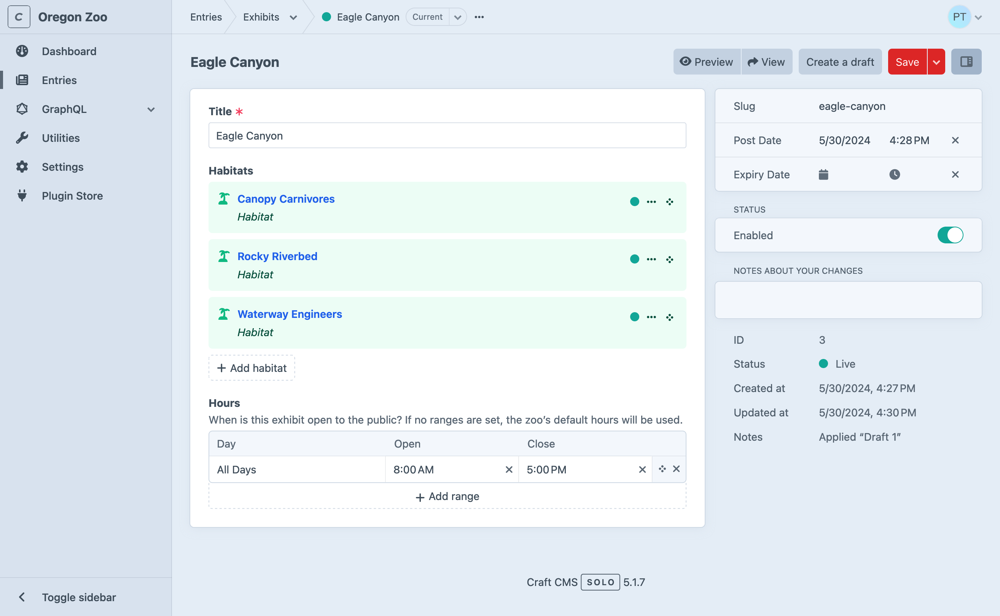
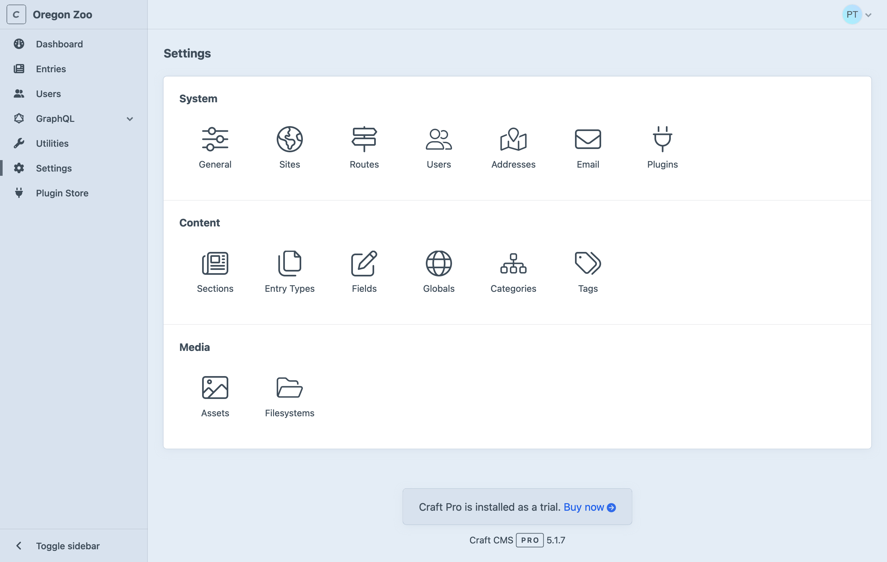
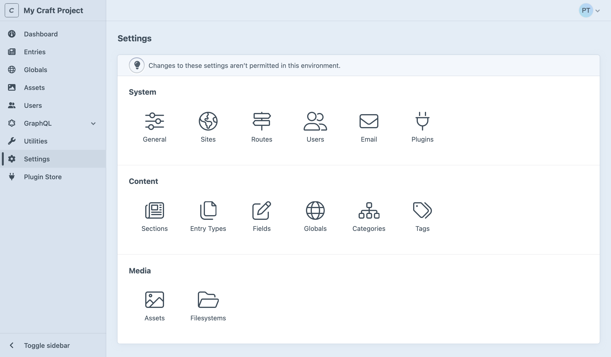
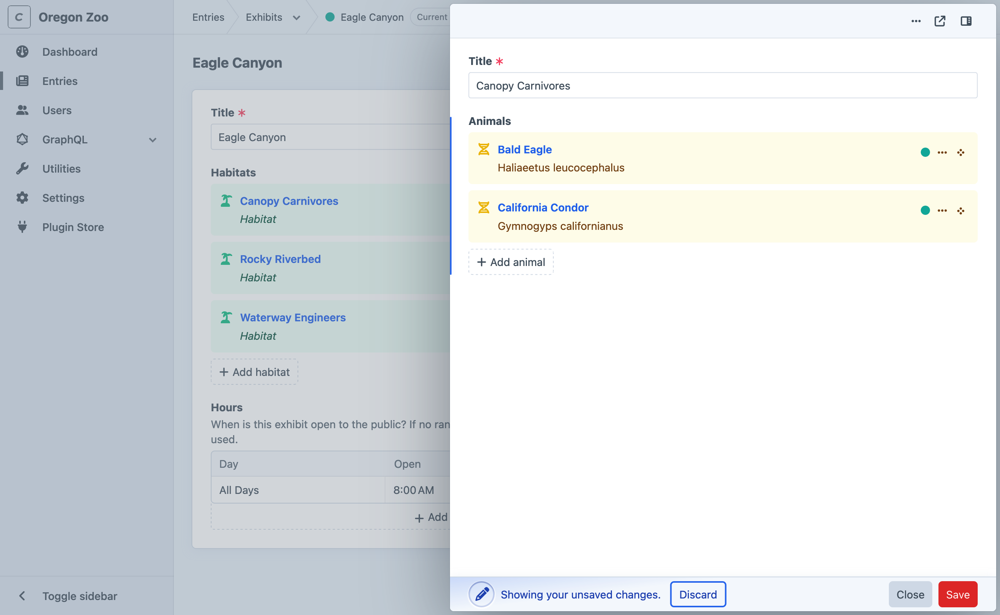
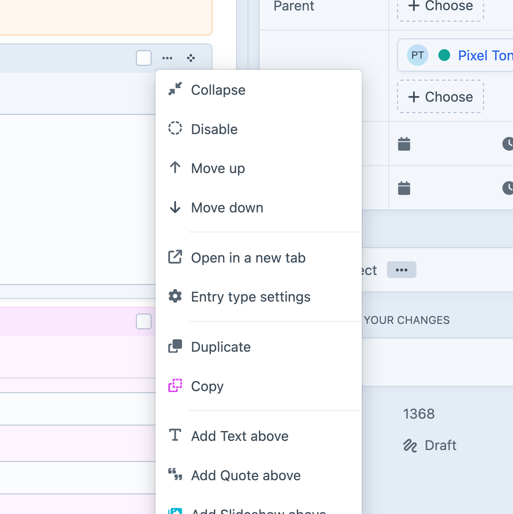
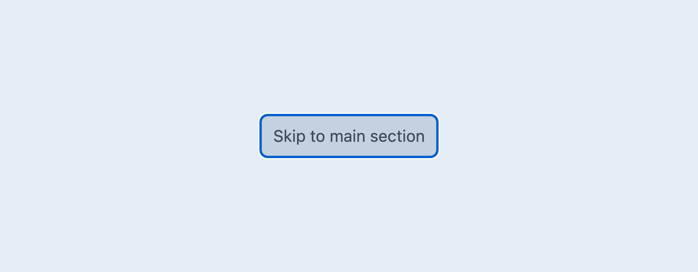
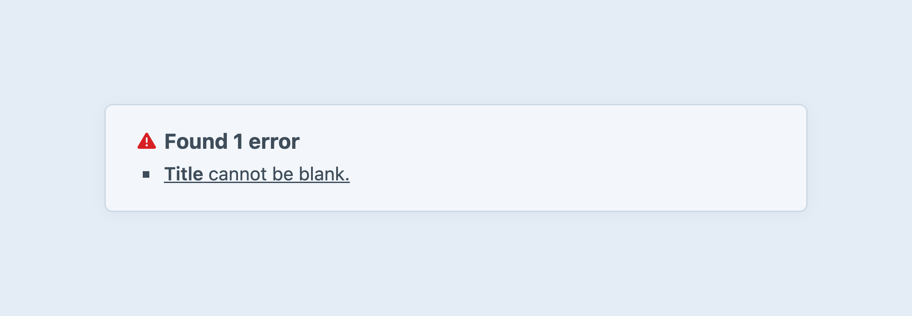
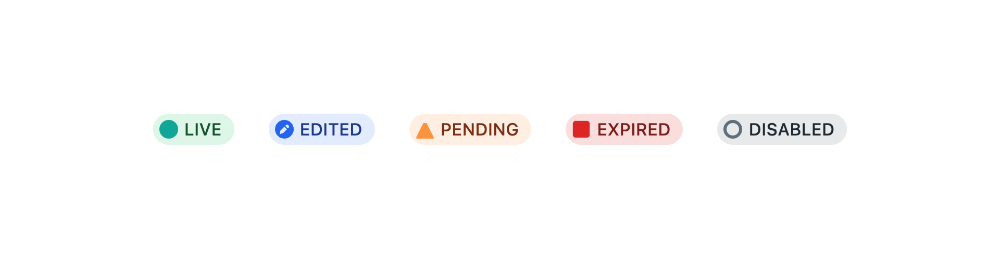

# Control Panel

The control panel is one of Craft’s greatest strengths. Developers and content authors appreciate its smart design and powerful feature set:

- Locate and edit content quickly and confidently;
- Design a schema that makes sense for your site or application;
- Customize views into deep and complex data;
- Invite users and work collaboratively;
- Find, install, and configure first- and third-party plugins;

We are working to make these features available to _everyone_ as part of our established [accessibility remediation process](https://craftcms.com/accessibility/accessibility-conformance-report).

<BrowserShot url="https://my-craft-project.ddev.site/admin" :link="false" caption="The Craft control panel viewed in a fresh installation.">

</BrowserShot>

::: tip
If this is your first time using Craft, it might feel a little bit empty—don’t worry, that’s by design! Craft doesn’t impose a content model on your site, so you won’t see any default features like posts or pages—instead, you’re given tools to create the features you do need from agnostic [element types](./elements.md) and other [settings](#settings).
:::

## Tour

The appearance and organization of the control panel can differ based on what types of content you’ve set up, your permissions, user preferences, and the environment—but the general structure will always be the same.

Craft also has multiple [editions](../editions.md), some of which give you access to additional control panel features.

<BrowserShot
    url="https://my-craft-project.ddev.site/admin/entries/exhibits/38"
    id="tour"
    :poi="{
        navigation: [13, 10],
        globalHeader: [60, 3],
        header: [40, 11],
        content: [55, 40],
        details: [79, 21],
    }"
    :link="false"
    caption="An entry edit screen in the control panel.">

</BrowserShot>

Let’s take a quick spin around a typical control panel screen.

Global sidebar <Poi label="1" target="tour" id="navigation" />
:   Contains the system name and icon, followed by the _primary navigation_.
    Each of the control panel’s [main sections](#main-sections) is linked, when configured (and your user has the related [permission](user-management.md#permissions)).
    Pick the **Toggle sidebar** button to collapse it and make more room for the page content.

    Some items in the primary navigation contain nested links.
    Those lists are automatically expanded based on the current screen’s URI, or when you pick the **Open subnavigation** toggle.

Global header <Poi label="2" target="tour" id="globalHeader" />
:   Contains _breadcrumbs_ (when working with nested content or settings), actions for the current screen, and the user menu.

Main container
:   The page’s main region typically contains editable content or settings, as well as secondary navigation and a sidebar.
    - A _header_ <Poi label="3" target="tour" id="header" /> displays the page’s title and actions for the current screen.
        - On element edit screens, a _recent activity_ region holds information about any other users that may be viewing or editing that element.
    - _Secondary navigation_ contains links to adjacent pages (like other [utilities](#utilities), element [sources](elements.md#sources), or related settings). Like the global menu menu’s content tends to be stable between the linked pages, but it may not be present when viewing more deeply-nested resources.
    - The _content_ <Poi label="4" target="tour" id="content" /> area’s structure and substance can vary dramatically between areas of the control panel.
        - _Tabs_ may split the screen’s content or settings into logical groups (not pictured). The selected tab is appended to the current URL as a hash.
        - When present, the nested _sidebar_ <Poi label="5" target="tour" id="details" /> is a mix of editable and read-only metadata.

You will see these same page components crop up in other screens—and even in [slideouts](#slideouts)!

::: tip
The control panel includes [skip links](#skip-links) to a number of landmarks present in the current screen.
Use the **Disable autofocus** [accessibility preference](#user-preferences) to prevent search inputs or other UI from being focused when navigating.
:::

### Main Sections

You may not see (or need) all these sections in your _main navigation_. They’ll appear only when Craft determines that they’ll be useful to the logged-in user—for example, _Categories_ is hidden until you’ve configured at least one [Category Group](../reference/element-types/categories.md#category-groups).

Section | Description
------- | -----------
[Dashboard](#dashboard) | Customizable landing page.
[Assets](../reference/element-types/assets.md) | Create and edit asset elements.
[Entries](../reference/element-types/entries.md) | Create and edit entry elements.
[Categories](../reference/element-types/categories.md) | Create and edit category elements.
[Globals](../reference/element-types/globals.md) | Edit content in global sets.
[Users](../reference/element-types/users.md) | <Badge type="edition" vertical="middle" title="Available in Craft Team">Team</Badge><Badge type="edition" vertical="middle" title="Available in Craft Pro">Pro</Badge> View and moderate users.
[GraphQL](../development/graphql.md) | Configure GraphQL schemas, create tokens, and access the built-in playground.
[Utilities](#utilities) | Get system info and perform a variety of upkeep actions.
[Settings](#settings) | Configure Craft’s system settings and content model.
[Plugin Store](#plugin-store) | Browse, install, and purchase Craft and plugin licenses from the official Plugin Store.
…and more! | Some plugins provide their own control panel screens; others may only have a pane in the [Settings](#settings) section.

### Announcements

Keep an eye on the _global header_ for a <Icon kind="gift" /> gift icon—Craft and any installed plugins may send notifications about new features to all control panel users, when updates are applied.

### Dashboard

After logging in, control panel users are directed to their **dashboard**. Each user manages their own dashboard, which is comprised of _widgets_. Craft comes with a few widgets:

- **Support:** Get official support from the Craft team.
- **Feed:** Scrape an external RSS feed.
- **Drafts:** Viewing your unpublished entry drafts.
- **New Users:** Visualize new registrations.
- **Quick Post:** Provide a simplified [entry](../reference/element-types/entries.md) form for publishing new content with one click.
- **Recent Entries:** Display a list of recently-posted entries from one or more sections.
- **Updates:** Keep tabs on Craft and plugin updates.

Widgets can be rearranged, resized, and customized based on the user’s needs, and will be available to them wherever they log in.

::: tip
Plugins can [register their own widgets](../extend/widget-types.md)!
:::

### Utilities

Utilities expose bundles of miscellaneous functionality to users with the correct permissions.

All Craft installations will include these utilities:

- **Updates:** View Craft and plugin updates, and apply them (when <config5:allowAdminChanges> is on).
- **System Report:** Get information about the Craft installation and server.
- **Project Config:** View the state of [Project Config](project-config.md).
- **PHP Info:** Additional information about your server’s PHP installation.
- **System Messages:** Customize email messages that are sent by the system.
- **Asset Indexes:** Rebuild an [asset](../reference/element-types/assets.md) volume from its underlying storage medium.
- **Queue Manager:** Audit running and queued background jobs.
- **Caches:** Flush caches for various parts of the Craft application.
- **Deprecation Warnings:** View or clear deprecation warnings generated by templates and plugins.
- **Database Backup:** Capture and download a backup of Craft’s primary database.
- **Find and Replace:** Search for (and replace) a string across all element content.
- **Migrations:** View (and apply) pending migrations, or view a history of all previously-run content migrations.

Plugins can [register utilities](../extend/utilities.md), and Craft will give each one a corresponding permission.

::: danger
Access to utilities should be granted only to trusted users, especially the innocuous _System Messages_ pane. Messages can include arbitrary Twig code, which effectively gives the author access to the entire Craft API—including the ability to modify their own permissions.

Keep in mind that any user marked as an “Admin” implicitly has access to _all_ utilities.
:::

#### Disabling Utilities

You can disable a utility for all users with the [`disabledUtilities` config setting](config5:disabledUtilities).
Refer to each [utility class](repo:craftcms/cms/tree/5.x/src/utilities)’s `id()` method for their handles (including those provided by plugins), or inspect its URL in the control panel—the handle is the last segment (i.e. `system-messages` in `/admin/utilities/system-messages`).

### Settings

The **Settings** screen is where you’ll configure the system and design your content model. Settings complement [configuration](../configure.md) are typically stored in [Project Config](project-config.md) so that you can easily deploy them to other environments.

::: tip
Don’t see **Settings** in the main navigation? Make sure you have admin privileges, and that <config5:allowAdminChanges> is enabled. In Craft 5.6 and later, administrators always have access to settings in [read-only mode](#read-only-mode).

We recommend that this is enabled [only in development environments](../deploy.md#admin-changes).
:::

<BrowserShot
    url="https://my-craft-project.ddev.site/admin/settings"
    :link="false"
    caption="The settings screen in Craft Pro. Some tiles may only be available in paid editions of Craft."
    id="settings"
    :poi="{
        system: [80, 24],
        content: [80, 46],
        media: [80, 68],
    }">

</BrowserShot>

#### System <Poi label="1" target="settings" id="system" />

System settings govern low-level Craft behaviors that often influence how other content and media features are used.

Group | Description
----- | -----------
**General** | Turn your site on or off, set a timezone, and configure the login page and site icons.
**Sites** | Define [Sites and Site Groups](sites.md) to organize and localize your content.
**Routes** | Manage [dynamic routes](routing.md#dynamic-routes).
**Users** | Set [registration policies](user-management.md#public-registration), define your [permissions structure](user-management.md#permissions) with [user groups](user-management.md#user-groups), and add [custom fields](fields.md) to users.
**Addresses** | Set up the field layout used by [address](../reference/element-types/addresses.md) elements.
**Email** | Configure how Craft sends [email](mail.md).
**Plugins** | Manage available [plugins](plugins.md).

#### Content <Poi label="2" target="settings" id="content" />

Combined with [sites](sites.md), the **Content** section is where you design your schema.

Group | Description
----- | -----------
**Sections** | Manage entry [sections](../reference/element-types/entries.md#sections).
**Entry types** | Manage entry [types](../reference/element-types/entries.md#entry-types), used by sections and Matrix fields.
**Fields** | Create and organize [custom fields](fields.md) available to your elements.
**Globals** | Configure [globals](../reference/element-types/globals.md).
**Categories** | Define complex taxonomies with [category groups](../reference/element-types/categories.md#category-groups).
**Tags** | Define simple taxonomies with [tag groups](../reference/element-types/tags.md#tag-groups).

#### Media <Poi label="3" target="settings" id="media" />

Decide how you want to store and organize uploaded files.

Group | Description
----- | -----------
**Assets** | Create volumes for organizing [assets](../reference/element-types/assets.md) and attach them to filesystems, and configure [image transforms](../reference/element-types/assets.md#image-transforms).
**Filesystems** | Set up local or remote storage for an [asset volume](../reference/element-types/assets.md#filesystems).

#### Plugins

Additional tiles may appear in a fourth group, after installing [plugins](plugins.md). Plugin settings are also accessible via the <Journey path="Settings, Plugins" /> screen.

#### Read-Only Mode <Since ver="5.6.0" feature="Read-only settings screens" />

[Administrators](user-management.md#admin-accounts) can always _view_ settings. A banner appears at the top of each settings screen, and inputs and controls are simplified or disabled:

<BrowserShot
    url="https://my-craft-project.ddev.site/admin/settings"
    :link="false"
    caption="The settings screen in read-only mode">

</BrowserShot>

### Plugin Store

The control panel provides an easy way to browse the [Plugin Store](plugins.md#the-plugin-store) and try or buy plugins with one click. Plugins can only be installed when [admin changes](config5:allowAdminChanges) are allowed.

## Tips + Tricks

The control panel has some cool tricks up its sleeve.

### Slideouts

Slideouts are used in a number of situations to simplify or contextualize an editing experience.

Any time you see an [element chip or card](elements.md#chips-cards) attached to a [relational field](relations.md) (or within a [Matrix](../reference/field-types/matrix.md) field), or in an [index](elements.md#indexes), you can double-click it to summon a _slideout_.

<BrowserShot url="https://my-craft-project.ddev.site/admin/entries/habitats/1234-eagle-canyon" :link="false" caption="Slideouts can also be opened from other slideouts! In this example, double-clicking “Canopy Carnivores” opened the current one; double-clicking “Bald Eagle” would open another; and so on.">

</BrowserShot>

Slideouts also work for creating new elements on-the-fly from an [element browser](elements.md#modals-contexts).

::: tip
There is one exception, here: slideouts cannot be opened if the user doesn’t have [permission](user-management.md#permissions) to edit the element—even if they were able to select it from a relational field.
:::

While slideouts support most element edit screen features, you may find that it’s more comfortable to open it in a new window—just click the icon in the upper-right corner, or use the [action menu](#action-menus). Features you’d normally find in the sidebar have been tucked into a secondary panel for slideouts; this can be toggled with the button next to the pop-out link.

### Action Menus

Wherever you see a small button with three dots (<Icon kind="ellipses" />) on a chip, card, or page header, it opens an _action menu_. These menus are typically divided into two or more sections, with one dedicated to “destructive” actions like deletion or removal.

Each [element type](elements.md#element-types) provides its own set of actions—some of which may be dependent on the current user’s [permissions](user-management.md#permissions), or the characteristics of the individual element (like what entry type it is, which section it belongs to, or what asset filesystem it uses).

### Keyboard Shortcuts

#### Saving

Any time you are on a screen (or slideout) that represents a single editable record or form, <kbd>Command</kbd>+<kbd>S</kbd> will save it and keep you on the page. In most places the save shortcut is supported, <kbd>Command</kbd>+<kbd>Shift</kbd>+<kbd>S</kbd> will save the current record and set you up to create another.

::: tip
Always check “combo-box” menus (the fly-out arrow next to a red button) for more shortcuts!
:::

#### Group Selections

Throughout the control panel, you will find groups of checkboxes or other focusable controls in a list of items. Ticking one checkbox, then holding <kbd>Shift</kbd> and clicking a second one will tick all the intermediate ones, as well. Element indexes are a great place to try this out—but it will also work on nested entries within [Matrix](../reference/field-types/matrix.md) fields.

### Drag-and-Drop

The <Icon kind="move" /> move icon indicates that something can be dragged into a new position—like an element in a [structure](elements.md#structures) or relational field, a nested entry in a [Matrix field](../reference/field-types/matrix.md), or a [table row](../reference/field-types/table.md).

In some situations, dragging can be combined with [group selections](#group-selections)!

### Search

Craft has a powerful [search](searching.md) system that complements the [condition builder](elements.md#filters-and-columns) on every element index.

## Accessibility

The control panel is designed and built with <Term slug="accessibility" label="accessibility" /> principles in mind.
We target AA conformance with [WCAG 2.2](https://www.w3.org/TR/WCAG22/), and publish progress reports our website’s [accessibility portal](https://craftcms.com/accessibility).

In addition to built-in interfaces, the content tools you configure for authors are backed by components that we [regularly audit](https://craftcms.com/accessibility/reports) for conformance.

<See path="../development/accessibility.md" />

### Navigating the control panel

[Skip links](#skip-links) and [landmarks](#landmarks) have been incorporated throughout the control panel to make navigation via keyboard and screen reader more straightforward.

#### Skip Links

Global skip links are found at the beginning of each control panel screen.

These include:

- **Skip to main section:** Skips to the `main` container. This container includes the page header, which contains the page title and controls for the current screen.
- **Skip to left sidebar:** <Since ver="5.7.0" /> Skips to the sub-navigation container. For example:
  - On element index pages, this moves keyboard focus to the “Sources” menu.
  - On account pages, this moves keyboard focus to the “Account” navigation.
- **Skip to content:** <Since ver="5.7.0" /> Skips to the primary content pane on the page.
- **Skip to right sidebar:** <Since ver="5.7.0" /> Skips to the details container, which includes page metadata.

::: tip
The accessible names for the “left” and “right” sidebars respect your user’s language setting, and will flip when using a right-to-left script.
:::

Only links that point to a region used in the current screen are exposed in this list.
In addition to global skip links, other parts of the control panel may include local skip links.
For example, element index pages contain a **Skip to footer** link within the content region that jumps to pagination and bulk actions in the “footer” toolbar.

When saving an element, success and failure states are announced via a live region, and an error summary is added to the top of the content region:

Each of the validation messages link to the field that they apply to.
Jumping to an error may switch to a different tab in the field layout than is currently selected.

#### Landmarks

Special regions of the control panel are designated using [roles](https://developer.mozilla.org/en-US/docs/Web/Accessibility/ARIA/Reference/Roles/landmark_role). These include:

- **`main`** — This landmark contains the bulk of the page content.
- **`nav`** — Depending on the page, there may be several navigation landmarks, including:
  - **Primary navigation** — Links for the primary sections of the control panel, like **Dashboard**, **Entries**, **Settings**, and so on. Available on most screens.
  - **Breadcrumb navigation** — Links to each parent, owner, and relevant organizational component (like a section or static route). Available only when working with [structures](../reference/element-types/entries.md#structures), [nested elements](../system/elements.md#nested-elements), or settings.
  - **Secondary navigation** — Located inside the `main` landmark, the secondary navigation’s accessible name will change based on where you are in the control panel and what the links within it represent. For example, in the **My Account** screen, it is called _Account_; on the **Entries** or **Assets** element index it is called _Sources_.
- **`status`** — A live region where [flashes](../development/forms.md#flashes) and other dynamic messages are injected.

::: tip
See the [tour](#tour) section on this page for more information on each of these sections.
:::

Some screens (like the login page, errors, and post-[update](../update.md) prompts) have a single, generic content container, and don’t include labeled content or navigation regions.

### User Preferences

The control panel can be customized to match your needs by visiting <Journey path="My Account, Preferences" />.
Settings are split into three groups, and are stored on your user, so your experience will be consistent across all sessions.

::: warning
Your preferences are _not_ applied to the login screen or other off-session pages, but your developer can use the <config5:accessibilityDefaults> setting to apply defaults.
:::

Display Settings

:   These settings are concerned with the appearance of the control panel UI.

    - **Use shapes to represent statuses:** Statuses are always represented by colorized “badges,” and—in some cases—icons. Enable this setting to use shapes for otherwise indistinguishable states.
    - **Underline links:** This setting adds underlines to all links inside the control panel.

    

General Settings

:   - **Disable autofocus:** Some inputs inside the control panel use the `autofocus` attribute, so keyboard focus may move unexpectedly; these include search inputs on element index pages, and the first input on Edit screens or inside of slideouts. Enabling this setting will prevent this autofocus behavior.

Notification Settings

:   Both **Duration** and **Position** of notification “toasts” can be configured.

    - **Notification Duration**: By default, toasts are shown for _five seconds_ before disappearing. You can shorten this timer to _two seconds_, extend it to _ten seconds_, or have them remain _indefinitely_ (allowing the user to close them manually).
    - **Notification Position**: Toasts appear at the bottom-left corner of the screen, by default. This setting allows you to customize which corner of the screen they are placed.

Slideout Position

:   Slideout position can be changed to show on the left- or right-hand side of the screen.

::: tip
Notification and slideout preferences are stored in a script-agnostic way, so they will behave naturally if you switch between <abbr title="left-to-right">LTR</abbr> and <abbr title="right-to-left">RTL</abbr> languages.
:::

### Image editor

The built-in image editor features a number of keyboard-accessible adjustments. <Since ver="5.9.0" feature="A keyboard-accessible image editor" />

From the right sidebar on an [asset](../reference/element-types/assets.md)’s edit screen, find the **Edit image** button.
A modal will open, with tabs for [**Rotate**](#rotation) and [**Crop**](#cropping).

::: tip
If you can’t find the **Edit image** button, the asset may not be transformable on the current system.
This may be due to the file type (i.e. `PDF`), or your [image driver](../requirements.md).
:::

#### Rotation

Images can be rotated 90&deg; clockwise (**Rotate Right**) or counter-clockwise (**Rotate Left**), flipped vertically and horizontally, or “straightened” in increments of 1&deg; using the **Rotate** slider.

Use the **Focal Point** button to add a position control to the image.
You can nudge the focal point horizontally or vertically; the value is stored as a proportional coordinate pair, with decimal values between `0` and `1`.
The focal point is used to keep subjects within a transformed image—for example, vertical head-shots attached to staff profiles 

::: tip
Some asset filesystem types ([AWS S3](plugin:aws-s3), in particular) can automatically detect subjects and populate the **Focal Point** attributes.
Combined with [transforms](../development/image-transforms.md), this can help keep subjects in-frame, when assets are used in multiple contexts.
:::

### Alternative Text

Craft provides a native [**Alternative Text** field](../reference/element-types/assets.md#alt-text) for [assets](../reference/element-types/assets.md).
In addition to simplifying how images are output in your [front-end templates](../development/templates.md), this provides a known source for image descriptions, when their thumbnails are displayed in the control panel.

<See path="../development/accessibility.md" hash="alt-text" label="Handling alt text" description="Learn how to set up sensible alternative text authoring tools." />
