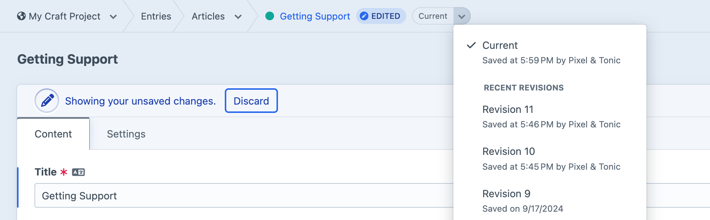

# Drafts & Revisions

Craft supports a variety of publishing workflows through sophisticated permissions and version-tracking systems.

Drafts and revisions behave similarly to collaborative source code control, like git:

- Nondestructive changes can be [drafted](#drafts) (or “forked”) from the canonical version of an element;
- The draft is kept up-to-date by periodically [merging](#merging-changes) (or “rebasing”) upstream changes;
- A changeset is later applied (or “pulled”) into the canonical element;
- [Revisions](#revisions) capture the state of an element, over time (like a “commit”);

This same process is used, no matter the scale of an edit—even the smallest typo receives its own draft, so that authors can be confident they are publishing exactly what they want.

::: tip
Most of this page describes the draft and revisions systems in the context of [entries](../reference/element-types/entries.md), but other [element types](elements.md) (including those provided by plugins) provide support for some or all of the same features! One notable exception here is [assets](../reference/element-types/assets.md), due to their relationship with files, on-disk.
:::

## Drafts

_Drafts_ are used to capture changes that shouldn’t be immediately published to your site. They also power Craft’s live preview functionality, making changes extremely reliable to visualize.

Most elements begin their life as an _unsaved draft_. When you press a **New entry** button in the control panel, Craft quietly creates element with only the essential attributes (like section and entry type IDs), then redirects to its “edit” page. This means that there is always a place for Craft to [auto-save](#auto-saving) your input.

Unsaved drafts are typically short-lived. They don’t appear in element indexes, and are largely disposable. Once a user begins making changes to an unsaved draft, Craft assumes the element should remain accessible and it becomes a regular _draft_. Using the **Create entry** action from this state immediately makes the draft [live](#statuses-visibility) (so long as it [validates](#validation)). Leaving the page or selecting **Save draft** from the fly-out menu keeps the element in an unpublished state.

::: tip
Unsaved drafts are periodically purged during [garbage collection](gc.md) based on the <config5:purgeUnsavedDraftsDuration> setting.
:::

Special [permissions](user-management.md#permissions) control whether users can see, edit, and delete one another’s drafts.

### Provisional Drafts

A _provisional draft_ holds changes to a canonical, non-draft element—typically as part of an [auto-save](#auto-saving). Provisional drafts are only accessible to the user who created them, and that user will only ever have one provisional draft per element. When viewing an element in the control panel for which your user has an existing provisional draft, the “unsaved changes” banner is displayed:


Changes in a provisional draft are applied to the canonical entry by pressing **Save**, or deleted by pressing **Discard**. You may also convert changes to a saved draft by pressing **Create draft**.

You can identify elements with provisional drafts elsewhere in the system by their **Edited** badge.

### Auto-Saving

Any time you make a change to an element on its edit screen (or in a slideout), the modified fields and attributes are stored in a _derivative_ element. The _first_ edit to a canonical element triggers the creation of a provisional draft; _subsequent_ changes are then recorded on that draft.

Drafts that have been explicitly created (using the **Create a draft** button) also use the auto-save system. As derivative elements themselves, changes are saved directly against them—in other words, drafts don’t get their _own_ provisional drafts. On a draft edit screen, the **Save** button is mostly cosmetic; your work has likely already been auto-saved!

Whenever Craft is auto-saving an element, you’ll see a spinner in its toolbar. If something prevents changes from being saved, a caution icon will appear in its place, and you will be notified when attempting to navigate away from the page or close a slideout.

### Validation

Craft uses Yii’s [validation scenarios](guide:structure-models#scenarios) to determine which attributes and fields are validated at a given stage. As drafts, elements’ custom fields are typically _not_ validated, so that authors can progressively add content with the protection of auto-saving.

Once an author goes to publish or apply a draft, Craft will only validate the entry if it would be [enabled](#statuses-visibility).

::: tip
To avoid issues when rendering drafts in live preview, [templates](../development/templates.md) should guard against missing field data. When <config5:devMode> is _off_, Craft ignores some template errors—but in doing so, it may omit sections of problematic markup, causing disruptions to the structure or layout of the final document. Here’s an example of a resilient template:

```twig
{# Attempt to load the field’s value: #}


{# Check if anything came back: #}

    <span class="topic-flag">{{ topic.title }}</span>

    {# Optional: Fallback output! #}

```
:::

### Change Tracking

Fields that have been modified in a draft are recorded in the database and marked in the editor with a status badge. These fields’ values are protected against automatic [merging](#merging-changes) of changes from the canonical element.

### Merging Changes

When a draft is viewed in the control panel, Craft merges in any changes from the canonical element, retaining the draft’s edits. A notice is displayed in the metadata column whenever this happens.

### Saved Drafts

Each user is only allowed one _provisional_ draft per canonical element, but can create any number of _saved_ drafts. If you need to stash provisional changes, press the **Create a draft** button.

Use the **Edit draft settings** item in the action menu next to the **Save* button to give your draft a name. This helps you and any collaborators identify a draft by more than its number and creator. You can also add **Notes** to most elements, in the sidebar; these are copied into the [revision](#revisions) when the draft is eventually merged.

## Nested Elements

When you create a new nested element (within a [Matrix](../reference/field-types/matrix.md) or [CKEditor](plugin:ckeditor) field), it will always be owned by a draft; one will be created if the nested entry is the first change to a canonical element.

Nested entries are only returned by [element queries](../development/element-queries.md) once their _primary owner_ becomes the canonical element.

Nested entries are sometimes *not* drafts and *not* canonical. We carefully filter them out of normal results, but swap them in so that edits are visible in the CP.

## Revisions

In the process of saving an element (or in technical terms, applying a [draft](#drafts) to a canonical element), Craft copies the canonical element into a derivative, called a _revision_. Support for revisions (and the number of revisions each element can have) depends on the element type and [configuration](config5:maxRevisions). 

Revisions ensure that edits to an element are both auditable and recoverable. An element’s revisions can be viewed via the menu in its breadcrumbs:



Selecting a revision takes you to a read-only version of the element’s edit screen, where you can **View** the previous state, or **Revert content from this revision**. If there are more than ten revisions for an element, a **View all revisions** button appears at the end of the menu, linking to a dedicated revisions browser. The “Current” revision displays the canonical element, or a provisional draft of it.

Restoring a revision copies its content (fields and attributes) into the canonical element.

::: warning
Unlike merging upstream changes into a draft, restoring a revision _does not_ take into consideration which fields and attributes were changed in that particular revision; the entire revision effectively becomes the canonical version. Changes in other drafts are not replaced, but the next time a draft is loaded, Craft will merge in any compatible non-conflicting “changes” from the canonical element.
:::

## Vocabulary

This list collects all the terms we’ve used to describe the state of an element.

Derivative
:   Opposite of _canonical_; the element was derived from another one, typically as a draft or revision.

Canonical
:   The primary element from which drafts and revisions are derived. Most [element queries](#querying) return these, by default.

Revision
:   A read-only derivative element that represents a canonical element’s prior state.

Draft
:   A special kind of derivative element whose changes can be applied to its canonical element.

Provisional Draft
:   A draft that hasn’t been explicitly saved.

Owner
:   Nested elements are always created in the context of an owner, and in most cases, a specific field. A nested element may have multiple owners; its “primary owner” can be a canonical element _or_ a draft.

## Statuses + Visibility

Several interrelated systems affect whether an element is accessible by users of your site, or by developers working with [element queries](#querying). For Craft to [route](routing.md) to an element, it must…

- …be **Enabled** globally, _and_ for the requested site;
- …be _canonical_;
- …_not_ be a draft (this sounds redundant, but unpublished drafts are technically both a draft _and_ a canonical element);
- …meet other element type-specific “status conditions” (like entries’ **Post Date** and **Expiry Date**);

Craft’s default behavior safeguards drafts and revisions from public view, and developers must explicitly expose them using [queries](#querying). Suppose you wanted to be transparent with an audience about edits to pages in a particular section:

```twig
<h1>{{ entry.title }}</h1>

{# ... #}




  <h3>History for {{ entry.title }}</h3>

  <ol>
    
      <li>{{ edit.dateUpdated|date('short') }} — {{ edit.revisionNotes }} ({{ edit.revisionCreator.fullName }})</li>
    
  </ol>

```

Unless otherwise specified, Craft returns revisions in the same sequence that is displayed in the control panel.

## Previews

[Entries](../reference/element-types/entries.md) belonging to sections can have any number of **Preview Targets**, each representing a location in the front-end where the entry might appear. Authors can use the **Preview** button when editing an entry to open the split “live preview” interface, or the **View** action to open a preview in a new window. Both show the same content, but—as the name suggests—_live_ preview refreshes any time a draft is auto-saved.

The URL of a preview includes a temporary `token` param that Craft validates before swapping in the unpublished entry. Tokenized preview URLs can be shared with anyone (even users without an account), and will reflect the state of the draft at the time it is accessed—but it will _not_ auto-refresh like a live preview does.

::: tip
The lifespan of preview tokens is determined by the <config5:previewTokenDuration> setting.
:::

## Querying

You can include drafts and revisions in [element queries](../development/element-queries.md) by using a handful of special parameters:

[`drafts()`](craft5:craft\elements\db\ElementQuery::drafts())
:   Returns only element drafts.

    ```twig
    
    ```

[`draftOf($element)`](craft5:craft\elements\db\ElementQuery::draftOf())
:   Get drafts of a specific element.

    ```twig
    
    ```

[`draftId($id)`](craft5:craft\elements\db\ElementQuery::draftId())
:   Find a specific draft by its ID. Draft IDs are distinct from element IDs!

    ```twig
    
    ```

[`draftCreator($user)`](craft5:craft\elements\db\ElementQuery::draftCreator())
:   Finds drafts by a specific user. The returned drafts may be from different canonical elements!

    ```twig
    
    ```

[`provisionalDrafts()`](craft5:craft\elements\db\ElementQuery::provisionalDrafts())
:   Returns only unsaved drafts.

    ```twig
    
    ```

[`withProvisionalDrafts()`](craft5:craft\elements\db\ElementQuery::withProvisionalDrafts())
:   Any results in the query that have provisional drafts belonging to the current user are swapped out for those drafts. This has no effect for anonymous users.

    ```twig
    

    <ul>
      
        <li>
          <strong>{{ post.title }}</strong>
          
            <em>Showing your proposed changes</em>
            <a href="{{ post.getCpEditUrl() }}">Edit</a>
          
        </li>
      
    </ul>
    ```

[`revisions()`](craft5:craft\elements\db\ElementQuery::revisions())
:   Returns only element revisions. To find revisions of a specific entry, use `.revisionOf()`.

    ```twig
    
    ```

[`revisionOf($element)`](craft5:craft\elements\db\ElementQuery::revisionOf())
:   Get revisions of a specific element.

    ```twig
    
    ```

[`revisionId($id)`](craft5:craft\elements\db\ElementQuery::revisionId())
:   Find a specific revision by its revision ID. Revision IDs are distinct from element IDs, and are typically only discovered by first querying for revisions of an element using `revisionOf()` (at which point you’ll already have the revision, anyway)!

    ```twig
    
    ```

[`revisionCreator($user)`](craft5:craft\elements\db\ElementQuery::revisionCreator())
:   Finds element revisions by a specific user. The returned revisions may be from different canonical elements!

    ```twig
    
    ```

These query methods are apt to be most useful when building [authenticated front-end areas](user-management.md#logging-in), or in templates for the control panel (like with the **Template** [field layout UI element](fields.md#field-layout-elements)).
