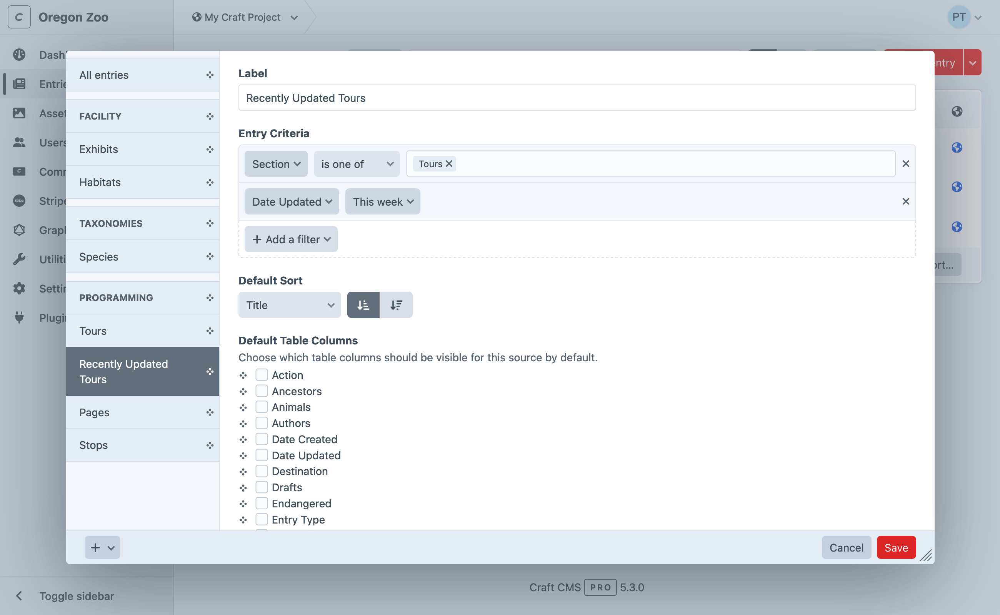
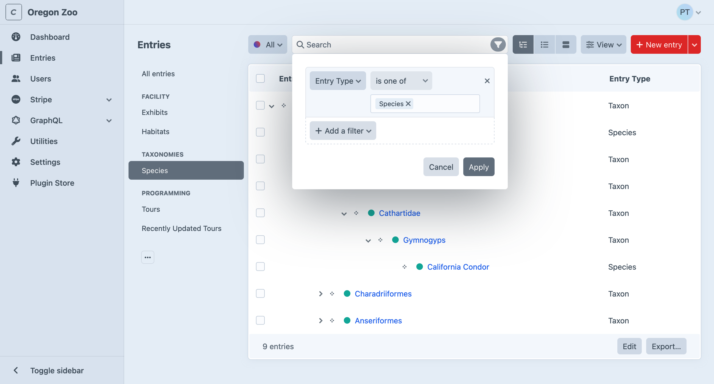
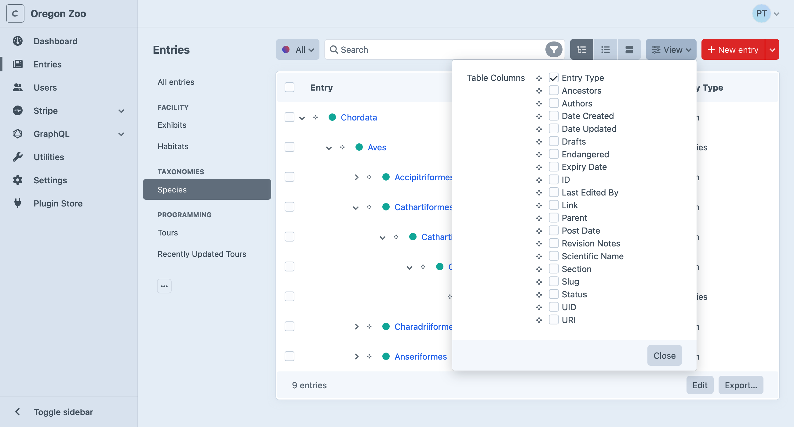

# Elements

An _element_ is the most basic unit of content in Craft. Elements provide smart management, routing, and querying interfaces for users and developers. Each [type](#element-types) of element has some unique capabilities, but they’re all built on top of a set of [common features](#common-features).

## Element Types

In the control panel, you’ll encounter the seven _element types_ common to all Craft installations:

- [**Addresses**](../reference/element-types/addresses.md) — Attach physical locations to other elements.
- [**Assets**](../reference/element-types/assets.md) — Upload files and store rich metadata.
- [**Categories**](../reference/element-types/categories.md) — Design hierarchical or ordered taxonomies.
- [**Entries**](../reference/element-types/entries.md) — Model anything with flexible and nestable content containers.
- [**Global Sets**](../reference/element-types/globals.md) — Manage universally-accessible data.
- [**Tags**](../reference/element-types/tags.md) — Grow a _folksonomy_ alongside your content.
- [**Users**](../reference/element-types/users.md) — Represent people with powerful identity and access tools.

Choosing the appropriate element type for your content model is essential—but don’t be afraid to mix, match, and combine them. Plugins (and custom modules) can provide [custom element types](../extend/element-types.md), giving developers and authors a consistent experience across all their content.

## Common Features

Some features are available to all (or most) element types:

- Control panel interfaces, including forms, [indexes](#indexes), [slide-outs](./control-panel.md#slideouts), and [chips and cards](#chips-cards);
- [Custom fields](./fields.md) and field layouts with advanced condition rules for storing content;
- Slugs, URIs, URLs, and automatic [routing](./routing.md);
- Localization via [sites](./sites.md);
- Sophisticated [permissions](./user-management.md#permissions);
- [Element queries](../development/element-queries.md) with advanced sorting and filtering capabilities;
- Bi-directional [relationships](./relations.md);
- Automatic indexing for [search](./searching.md);
- Statuses for managing visibility of content;

Other features are specific to a type—like Assets’ tie to files, or Entries’ nesting capability.

## Indexes

You’ll access most elements via their element index. Indexes allow you to browse, sort, filter, and [search](./searching.md) for elements in a paginated, table-like view.

::: tip
[Matrix fields](../reference/field-types/matrix.md) also have a compact element index **View Mode**.
:::

### Sources

Indexes are broken down into **sources**. Sources can be permanent fixtures of an element type (like the **Admin** source for [users](../reference/element-types/users.md)), dynamically added based on configuration (like those for user groups), or defined by an admin using custom _condition rules_.

Each source also controls what columns are visible in the index, and its default sorting.

<BrowserShot url="https://my-craft-project.ddev.site/categories/species" :link="false" caption="Customizing element sources.">

</BrowserShot>

::: tip
Custom sources are stored in [Project Config](./project-config.md). The interface for conditions that involve specific elements (like an author) may appear differently than the equivalent [filter](#filters-and-columns), because the ID may not be stable between environments.

Instead of an element select field, you’ll see an [autosuggest input](./project-config.md#secrets-and-the-environment).
:::

### Filters and Columns

As a complement to custom sources, any user with access to an element index can temporarily filter results using the condition builder interface:

<BrowserShot url="https://my-craft-project.ddev.site/categories/species" :link="false" caption="Using the condition builder to narrow results.">

</BrowserShot>

Similarly, they can customize what columns appear in the table (and how the results are ordered) with the **View** menu:

<BrowserShot url="https://my-craft-project.ddev.site/categories/species" :link="false">

</BrowserShot>

If every field layout that would be used by an element in a source defines the same label override for a field, that label will appear in the column’s header. When a consensus cannot be reached, the original field’s label is used. This most commonly applies when a source is limited to a single entry type, asset volume, category group, or other property that also defines field layouts.

### Structures

[Entries](../reference/element-types/entries.md) in _Structure_ sections and [Categories](../reference/element-types/categories.md) support a hierarchical view mode on their indexes. Elements in structures track their relative position among siblings, and can be easily relocated by dragging-and-dropping <Icon kind="move" /> their row in an [element index](#indexes). Reordering is still possible, even when the structure is limited to a single level.

::: tip
Use the **View** controls to switch back into structure mode on an index if you had previously sorted it by another attribute.
:::

### Actions

Each element type supports its own set of _actions_ that can be performed on one or more elements, from an index. These actions are either visible directly in the index toolbar (like _Status_), or collected under the <Icon kind="settings" /> icon in the footer (like _Delete_). Actions may be hidden or disabled when they don’t apply to the selection or [source](#sources).

### In-line Editing <Badge text="New!" />

Click **Edit** at the bottom of any element index to switch into an in-line editor. Click **Save** to update any rows that changed, or **Cancel** to return to the read-only mode.

Not all fields are editable in-line, and some may have simplified controls or interfaces. This is best used when the index’s default [columns](#filters-and-columns) include scalar values like text, numbers, and dates.

### Exporters

Craft can export sets of elements to CSV, JSON, or XML. The **Export…** button in the index footer displays all options, including any [custom exporters](../extend/element-exporter-types.md) registered by modules and plugins.

### Modals & Contexts

A streamlined version of indexes are used when adding elements to a [relational](./relations.md) field via a modal. Depending on the field’s configuration, Craft may hide sources or actions, and disable [slideouts](./control-panel.md#slideouts) (except to create a new element, in-context) and pagination (in favor of scrolling). Internally, Craft refers to these variations as “contexts,” which [plugins](../extend/element-types.md#sources) have an opportunity to modify.

### Chips & Cards <Badge text="New!" />

Throughout the control panel, you’ll encounter references to elements in a number of different contexts, like element indexes, [Matrix](../reference/field-types/matrix.md) fields, and other [relational](relations.md) fields. Element _cards_ are a new way to display nested or related elements. They share the core features of element _chips_ (like quick-actions and ordering controls), but provide an additional layer of customization via the element’s [field layout](fields.md#field-layouts).

Both chips and cards support thumbnails, but only cards allow additional custom field values to be bubbled up. The presence and order of those fields is dictated by the field layout; additional features like colorization and icons are supported by entries.

## Rendering Elements <Badge text="New!" />

Every element has a `render()` method, which you can call from a template to get an HTML representation of the object.

::: tip
This is mostly a convenience feature, not the primary means by which you are apt to output an element or its content.

The [CKEditor plugin](plugin:ckeditor) makes use of this feature to convert each nested entry from a placeholder to a rich, personalized block—while remaining exactly where the author placed it in the editor.
:::

Without any configuration, this will typically be its _title_ (if the element type uses titles), or it’s element type and ID. This default behavior is handled by the element’s magic `__toString()` method, meaning `{{ element.render() }}` and `{{ element }}` are functionally equivalent.

However, the output of `element.render()` can be customized by placing a template in your <config5:partialTemplatesPath> that follows a specific naming convention. The full path to each element’s template is comprised of:

- The element’s type or `refHandle`: Typically its lower-cased, singular name—`entry` or `address`, for instance. The `refHandle` is the same as is used for [reference tags](reference-tags.md), elsewhere in the system.
- The field layout provider’s handle: Differs based on the type of element and how its field layout is configured. For assets, it would be the volume’s handle; for entries, its entry type handle; for global sets, the set handle.

As an example, if you wanted to customize the output of an asset in a volume with the handle `images`, you would create a template with this path:

```
_partials/asset/images.twig
```

If some property of the asset (like its extension, or the user group its uploader is in) should affect its template, you can put whatever logic you need into the template and render something different:

```twig
<figure>
  {{ asset.getImg() }}

  <figcaption>
    {{ asset.title }}

    
      <a href="{{ asset.getCpEditUrl() }}">Edit</a>
    
  </figcaption>
</figure>
```

Each template is passed the element under a variable that agrees with its `refHandle`—same as would be passed to a template, when Craft matches an [element’s route](routing.md).

The `refHandle` includes `owner` and `field` properties. The `owner` property references the content that included the partial. The `field` property references the field included the partial.

```twig
<div>
  <h1>{{ entry.title }}</h1>
  <dl>
    <dt>Owner</dt>
    <dd>{{ entry.owner.title }}</dd>
    <dt>Field</dt>
    <dd>{{ entry.field.name }}</dd>
  </dl>
</div>
```

::: tip
You can also render lists of elements by calling the `render()` method on an [element query](../development/element-queries.md).
:::

### Eager-Loading

When accessing related or nested content within an element partial, use the `.eagerly()` method to [eager-load](../development/eager-loading.md#magic-eager-loading) elements for other partials that might be rendered in sequence.

```twig{2}
{# _parials/entry/post.twig #}



  {{ headerImage.getImg() }}


<h3>{{ entry.title }}</h3>

{# ... #}
```

## Properties and Methods

<Todo notes="Move to elements reference?" />

All elements share a few characteristics that make them familiar to work with in your templates. Each [element type](#element-types) will supplement these lists with their own properties and methods.

::: warning
This is not an exhaustive list! If you’re curious, consult the <craft5:craft\base\Element> and <craft5:craft\base\ElementTrait> class reference for a complete picture of what data is available inside elements and how it can be used.
:::

### Properties

Properties give you access to values, and do not accept arguments.

Property | Type | Notes
-------- | ---- | -----
`archived` | `bool|null` | Whether the element is soft-deleted, or “trashed.”
`dateCreated` | `DateTime` | Date the element was originally created.
`dateDeleted` | `DateTime|null` | Date the element was soft-deleted or `null` if not.
`dateUpdated` | `DateTime` | Date the element was last updated.
`enabled` | `bool` | Whether the element is enabled (globally).
`id` | `int` | ID of the element.
`level` | `int|null` | Depth of the element in a structure. _Structures only._
`parentId` | `int|null` | ID of the parent element. _Structures only._
`searchScore` | `int` | Score relative to other results when returned from an [element query](element-queries.md) using the [`search` param](searching.md).
`siteId` | `int` | ID of the <craft5:craft\models\Site> the element was loaded in.
`slug` | `string|null` | _Only for elements with slugs._
`title` | `string|null` | _Only for elements with titles._
`trashed` | `bool` | Whether or not the element has been soft-deleted.
`uid` | `string|null` | A UUIDv4 string that uniquely identifies this element.
`uri` | `string|null` | Rendered URI or path for the site the element was loaded in. _Only for elements with URLs._

### Methods

Methods also return values, but may accept or require arguments.

::: tip
Any method beginning with `get` can be used like a [property](#properties) by removing the prefix and down-casing the first letter. For example, `{{ entry.getLink() }}` can also be accessed as `{{ entry.link }}`
:::

Method | Notes
------ | -----
`getAncestors(dist)` | Returns up to `dist` parents of the element, or all parents when omitted. _Structures only._
`getChildren()` | Returns immediate children of the element. _Structures only._
`getCpEditUrl()` | Gets a URL to the Craft control panel.
`getDescendants(dist)` | Returns descendants of the element, down to `dist` levels below this one, or all descendants, when omitted. _Structures only._
`getHasDescendants()` | Build an HTML anchor tag with its front-end URL and title. _Elements with URLs only._
`getLink()` | Build an HTML anchor tag with its front-end URL and title. _Elements with URLs only._
`getNext(criteria)` | Load the “next” element relative to this one, given a set of criteria.
`getNextSibling()` | Load the next sibling of this element, within a structure. _Structures only._
`getEnabledForSite(siteId)` | Whether the element is enabled in the provided site, or the site it was loaded in if no ID is provided.
`getParent()` | Returns the element’s parent. _Structures only._
`getPrev(criteria)` | Load the previous element relative to this one, given a set of criteria.
`getPrevSibling()` | Load the previous sibling of this element, within a structure. _Structures only._
`getRef()` | Builds the part of a [reference tag](reference-tags.md) unique to the element.
`getSiblings()` | Load siblings within the element’s structure. _Structures only._
`getSite()` | Returns the <craft5:craft\models\Site> the element was loaded for.
`getStatus()` | Returns a plain-text representation of the element’s status, which may be synthesized from a number of other attributes.
`getUrl()` | Builds a complete front-end URL based on the element’s URI.
