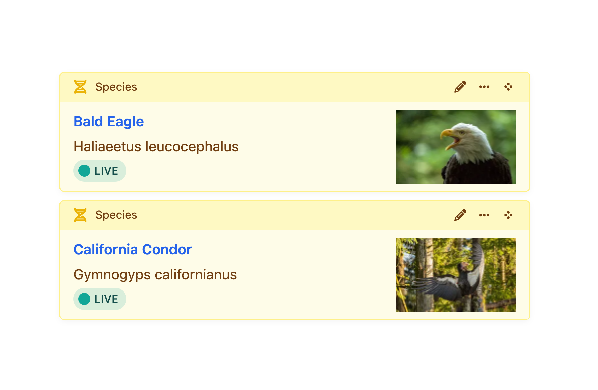

# Elements

An _element_ is the most basic unit of [content](#fields-and-content) in Craft. Elements provide smart management, routing, and querying interfaces for users and developers. Each [type](#element-types) of element has some unique capabilities, but they’re all built on top of a set of [common features](#common-features).

## Element Types

In the control panel, you’ll encounter the seven _element types_ common to all Craft installations:

- [**Addresses**](../reference/element-types/addresses.md) — Attach physical locations to other elements.
- [**Assets**](../reference/element-types/assets.md) — Upload files and store rich metadata.
- [**Categories**](../reference/element-types/categories.md) — Design hierarchical or ordered taxonomies.
- [**Entries**](../reference/element-types/entries.md) — Model anything with flexible and nestable content containers.
- [**Global Sets**](../reference/element-types/globals.md) — Manage universally-accessible data.
- [**Tags**](../reference/element-types/tags.md) — Grow a _folksonomy_ alongside your content.
- [**Users**](../reference/element-types/users.md) — Represent people with powerful identity and access tools.

Choosing the appropriate element type for your content model is essential—but don’t be afraid to mix, match, and combine them. Plugins (and custom modules) can provide [custom element types](../extend/element-types.md), giving developers and authors a consistent experience across all their content.

## Common Features

Some features are available to all (or most) element types:

- Control panel interfaces, including forms, [indexes](#indexes), [slide-outs](control-panel.md#slideouts), and [chips and cards](#chips-cards);
- [Custom fields](fields.md) and field layouts with advanced condition rules for storing [content](#fields-and-content);
- Slugs, URIs, URLs, and automatic [routing](routing.md);
- Localization via [sites](sites.md);
- [Drafts and revisions](drafts-revisions.md);
- Sophisticated [permissions](user-management.md#permissions);
- [Element queries](../development/element-queries.md) with advanced sorting and filtering capabilities;
- Bi-directional [relationships](relations.md);
- Automatic indexing for [search](searching.md);
- Statuses for managing visibility of content;

Other features are specific to a type—like Assets’ tie to files, or Entries’ nesting capability.

## Fields and Content

In a fresh installation, element types are distinguished only by a handful of native features. The identity and utility of an element is often defined by the [custom fields](fields.md) attached to it via a [field layout](fields.md#field-layouts): elements and their custom field values are collectively referred to as _content_.

Craft is adamantly agnostic about your content model, and comes with no predefined notion of what a “page” or “post” should be. Instead, it treats all your content as _data_, and provides the means to use it how you see fit—whether that’s as HTML accessible via public URLs, a private database, GraphQL for a decoupled or statically-generated front-end, or even a CSV to populate a printed document.

Content can be a great deal more than text, too! Craft has a number of built-in [field types](../reference/field-types/README.md) that provide a highly-customizable authoring and developer experience.

<See path="fields.md" />

### Generated Fields <Since ver="5.8.0" feature="Generated fields" />

[Field layout](fields.md#field-layouts) providers (the components that dictate what kind of content can be saved on an element, like [entry types](../reference/element-types/entries.md#entry-types) or [asset volumes](../reference/element-types/assets.md#volumes)) include a **Generated Fields** setting, allowing you to store additional computed values alongside native attributes and custom fields.


Each field’s **Template** is evaluated as an [object template](object-templates.md) when the element is saved, and the resulting value is exposed via its **Handle**:

```twig{3}
<article>
  <h2>{{ entry.title }}</h2>
  <address>{{ entry.byline }}</address>

  {# ... #}
</article>
```

All generated fields are stored and [queried](#querying-generated-field-values) as text. When used in a condition builder, you will only be able to use string operands (like “starts with…” or “contains…”).

::: tip
Generated fields are _not_ automatically displayed in the control panel, but they can be added to element [cards](#custom-card-attributes), or output in a [template field layout element](fields.md#ui-elements).
:::

#### Use Cases

Here are a few ideas for how to use generated fields:

Memoize Expensive Data
:   Run a complex query and “cache” the result in a succinct way.

    **Example:** Reverse-lookup of the number of entries in a category.

    ```twig
    {{ craft.entries().relatedTo({ targetElement: object, field: 'category' }).count() }}
    ```

Presentational Summaries
:   Truncate or clean up text for use on element cards.

    **Example:** Get the first text chunk from a CKEditor field, and strip the HTML.

    ```twig
    {{ object.body.firstWhere('type', 'markup')|strip_tags }}
    ```

Binary Criteria
:   State derived from nested or related records can be coalesced into a single value.

    **Example:** Tally up a customer’s lifetime order total and mark them as a “VIP” if it exceeds some amount. This template stores a `1` when it evaluates to `true`, and nothing for `false`.

    ```twig
    {{ craft.orders().customer(object).sum('totalPaid') > 1000 }}
    ```

Record-Keeping
:   Track data over some period of time.

    **Example:** Use the [`seq()` Twig function](../reference/twig/functions.md#seq) to increment a counter.

    ```twig
    {{ seq("entry-save-count:#{canonicalId}") }}
    ```

Templates that reference nonexistent values are quietly ignored, but compilation errors (like missing Twig functions or filters) will produce an error.
Avoid using generated field references inside one another—within a single save, fields are evaluated in the order they were defined, and only have access to values from the previous save.

::: warning
Field values are only refreshed when the element itself is saved, so references to _other_ elements’ content in a template may become stale.

If you need to keep generated fields fresh, use one of the [`resave/*` commands](../reference/cli.md#resave) to periodically re-render their values.
It may be more reliable and economical to continue rendering simple values in regular templates, rather than pre-generating them.
As an example, there won’t often be a benefit to storing a primary author’s registration date on an entry (`{author.dateCreated|date}`), when the dynamic value is already accessible via a single element query (`{{ entry.author.dateCreated|date }}`).
:::

#### Querying Generated Field Values

Craft provides [element query](../development/element-queries.md) methods for each of the generated fields available to the element type.
Entry queries, for example, combine generated fields from entry types’ field layouts.

Suppose we want to display a list of movie directors sorted by the total runtime of films they’ve made.
Our _Director_ entries might have a generated field like _Total Runtime_ (with a handle of `runtimeTotal`) containing this template:

```twig
{{ craft.entries().section('films').director(object).select('runtime').column()|reduce((sum, val) => sum + val, 0) }}
```

Directors can now use the generated field for sorting…

```twig

```

…and filtering:

```twig

```

Note that we are assuming runtimes are stored in minutes.
Formatted time values are not as trivial to compare, sort, or sum!

## Indexes

You’ll access most elements via their element index. Indexes allow you to browse, sort, filter, and [search](searching.md) for elements in a paginated, table-like view.

::: tip
[Matrix fields](../reference/field-types/matrix.md) also have a compact element index **View Mode**.
:::

### Sources

Indexes are broken down into **sources**. Sources can be permanent fixtures of an element type (like the **Admin** source for [users](../reference/element-types/users.md)), dynamically added based on configuration (like those for user groups), or defined by an admin using custom _condition rules_.

Each source also controls what columns are visible in the index, and its default sorting.

<BrowserShot url="https://my-craft-project.ddev.site/categories/species" :link="false" caption="Customizing element sources.">

</BrowserShot>

::: tip
Custom sources are stored in [Project Config](project-config.md). The interface for conditions that involve specific elements (like an author) may appear differently than the equivalent [filter](#filters-and-columns), because the ID may not be stable between environments.

Instead of an element select field, you’ll see an [autosuggest input](project-config.md#secrets-and-the-environment).
:::

### Filters and Columns

As a complement to [search](searching.md) and [custom sources](#sources), any user with access to an element index can temporarily filter results using the condition builder interface:

<BrowserShot url="https://my-craft-project.ddev.site/categories/species" :link="false" caption="Using the condition builder to narrow results.">

</BrowserShot>

Similarly, they can customize which columns appear in the table (and how the results are ordered) with the **View** menu:

<BrowserShot url="https://my-craft-project.ddev.site/categories/species" :link="false">

</BrowserShot>

If every field layout that would be used by an element in a source defines the same label override for a field, that label will appear in the column’s header. When a consensus cannot be reached, the original field’s label is used. This most commonly applies when a source is limited to a single entry type, asset volume, category group, or other quality that also defines field layouts.

### Structures

[Entries](../reference/element-types/entries.md) in _Structure_ sections and [Categories](../reference/element-types/categories.md) support a hierarchical view mode on their indexes. Elements in structures track their relative position among siblings, and can be easily relocated by dragging-and-dropping <Icon kind="move" /> their row in an [element index](#indexes). Reordering is still possible, even when the structure is limited to a single level.

::: tip
Use the **View** controls to switch back into structure mode on an index if you had previously sorted it by another attribute.
:::

### Actions

Each element type supports its own set of _actions_ that can be performed on one or more elements, from an index. These actions are either visible directly in the index toolbar (like _Status_), or collected under the <Icon kind="action" /> icon in the footer (like _Delete_). Actions may be hidden or disabled when they don’t apply to the selection or [source](#sources).

### In-line Editing <Badge text="New!" />

Click **Edit** at the bottom of any element index to switch into an in-line editor. Click **Save** to update any rows that changed, or **Cancel** to return to the read-only mode.

Not all fields are editable in-line, and some may have simplified controls or interfaces. This is best used when the index’s default [columns](#filters-and-columns) include scalar values like text, numbers, and dates.

### Exporters

Craft can export sets of elements to CSV, JSON, or XML. The **Export…** button in the index footer displays all options, including any [custom exporters](../extend/element-exporter-types.md) registered by modules and plugins.

### Modals & Contexts

A streamlined version of indexes are used when adding elements to a [relational](relations.md) field via a modal. Depending on the field’s configuration, Craft may hide sources or actions, and disable [slideouts](control-panel.md#slideouts) (except to create a new element, in-context) and pagination (in favor of scrolling). Internally, Craft refers to these variations as “contexts,” which [plugins](../extend/element-types.md#sources) have an opportunity to modify.

## Chips & Cards <Badge text="New!" />


Throughout the control panel, you’ll encounter references to elements in a number of different contexts, like element indexes, [Matrix](../reference/field-types/matrix.md) fields, and other [relational](relations.md) fields. Element _cards_ are a new way to display nested or related elements. They share the core features of element _chips_ (like quick-actions and ordering controls), but provide an additional layer of customization via the element’s [field layout](fields.md#field-layouts).

Both chips and cards support thumbnails, but only cards allow additional custom field values to be bubbled up. The presence and order of those fields is dictated by a combination of the field layout and customizable [card attributes](#custom-card-attributes) <Since ver="5.5.0" feature="Customizable card attributes" />; additional features like colorization and icons are supported by [entries](../reference/element-types/entries.md).



### Custom Card Attributes <Since ver="5.5.0" feature="Customizable card attributes" />

The attributes and fields displayed on element cards is ultimately determined by the interface below each [field layout designer](fields.md#field-layouts):


An element’s **Title** and **Status** are always visible, and the presence of a thumbnail is determined by the field layout itself (by selecting **Use for element thumbnails** in the field layout element’s <Icon kind="ellipses" /> action menu). Additional attributes _not_ present in the field layout can be enabled in the card customization interface; those that _are_ part of the field layout will indicate when they are enabled with an “eye” icon.

::: tip
A card’s thumbnail can come from any field that implements <craft5:craft\base\ThumbableFieldInterface> (like [assets](../reference/field-types/assets.md) or [icon](../reference/field-types/icon.md) fields), or be “inherited” from another element via a [relational field](relations.md).
:::

In addition to fields and attributes, [generated fields](#generated-fields) can also be added to element cards. <Since ver="5.8.0" feature="Generated fields" />

## Copying Elements <Since ver="5.7.0" feature="Copying elements" />

[Entries](../reference/element-types/entries.md) and [addresses](../reference/element-types/addresses.md) can by copied-and-pasted between sections and fields. Open the action menu <Icon kind="ellipses" /> on any chip, card, or inline nested entry and select **Copy <Placeholder help="A built-in or plugin-provided element type.">element type</Placeholder>**:


From an element index, you can copy multiple elements by selecting any number of rows, then pressing **Copy** from the element actions menu <Icon kind="settings" /> in the bottom toolbar.

Only one group of elements can be copied at a time—copying another element or group of elements will replace whatever was previously copied. Craft will display a notification on every control panel screen, until you press **Cancel** (or paste it somewhere else).


When pasting an element, you will see a notification confirming the element has been “duplicated” into the new context.

You can paste elements anywhere the special **Paste** button appears. The eligible targets are determined by the type of copied element—addresses are portable between user address books and custom fields; entries can only be pasted into fields and sections that support the copied element’s entry type.


The **Paste** button is displayed in the same row as the **Add** button for nested element interfaces; on an element index, it is displayed in the bottom toolbar, where the element action <Icon kind="settings" /> menu would be.

::: warning
A copied [draft](drafts-revisions.md) (provisional or otherwise) is pasted as a _canonical_ element, with the pending changes applied.
:::

## Statuses

Most element types support _statuses_. An element’s status is most often a combination of its `enabled` and `enabledForSite` attributes (which Craft stores explicitly for all elements), and any number of other attributes determined by its [type](#element-types). Statuses are represented as strings, and can be accessed via `element.status` in a template, or fed into element query’s `.status()` param as a short-hand for the combination of specific properties they represent.

- **Draft** (`draft`) — The element has a `draftId`.
- **Archived** (`archived`) — The element’s `archived` property is `true`; currently only used by [user](../reference/element-types/users.md) elements.
- **Disabled** (`disabled`) — One or both of the `enabled` and `enabledForSite` attributes are `false`.
- **Enabled** (`enabled`) — Both the `enabled` _and_ `enabledForSite` attributes are `true`.

::: tip
To query for elements without applying _any_ status constraints (including the element type’s defaults), use `query.status(null)`.
:::

An element’s status is reflected in element indexes, chips, and cards through color pips and labels.


<Block label="Provisional Drafts and Statuses">

In the illustration above, **Edited** is technically a supplemental label applied to [provisional drafts](drafts-revisions.md#provisional-drafts), and is not a status on its own—but it is often applied in combination with other statuses. Elements with this label have been “substituted” for their canonical counterparts, meaning that provisional changes (like a new title) will appear with a **Live** status.

Conversely, disabling an element in a provisional draft may make it _appear_ as **Disabled** throughout the control panel, despite its canonical element actually being **Live**. Despite this, sorting and filtering always operates on the canonical element; the derivative is substituted as the final step in the query.

</Block>

### Querying by Status

When querying for elements using the `.status()` param, you’ll need to refer to the list of global identifiers above, and to additional statuses provided by the specific element type:

```twig{3,9,15}





```

Statuses can be logically combined in a single query, as well:

```twig
{# Two explicit statuses: #}


{# One explicit status: #}


{# Negated/inverted status: #}

```

## Nested Elements <Badge text="New!" />

Craft ships with two native _nested element_ implementations, which provide unique authoring or administrative experiences:

- [**Entries**](../reference/element-types/entries.md) and the [**Matrix field**](../reference/field-types/matrix.md) — Create dynamic or repeatable content sections, or manage any kind of records that belong to a single owner.
- [**Addresses**](../reference/element-types/addresses.md) and the [**Address fields**](../reference/field-types/addresses.md) — Capture region-aware location information.

While [relationships](relations.md) are supported by every element type, only addresses and entries are eligible for nesting. Plugins may use the nested element interface to provide other functionality, like Commerce’s product and variant system.

<a name="rendering-elements"></a>

## Element Partials <Badge text="New!" />

Every element has a `render()` method, which you can call from a template to get an HTML representation of the object.

::: tip
The [CKEditor plugin](plugin:ckeditor) uses the `.render()` method to [convert each nested entry](repo:craftcms/ckeditor#rendering-nested-entries-on-the-front-end) from a placeholder to a rich, personalized block—while remaining exactly where the author placed it in the editor.

This is not the _only_ way to output your elements’ [content](#fields-and-content), though! Any time you have access to an element, you are free to use its attributes and field values, directly.
:::

Without any configuration, this will typically be the element’s _title_ (if the element type uses titles), or it’s element type and ID. This default behavior is handled by the element’s magic `__toString()` method, meaning `{{ element.render() }}` and `{{ element }}` are functionally equivalent.

However, the output of `element.render()` can be customized by placing a template in your <config5:partialTemplatesPath> that follows a specific naming convention. The full path to each element’s partial template is comprised of:

- The element’s type or `refHandle`: Typically its lower-cased, singular name—`entry` or `address`, for instance. The `refHandle` is the same as is used for [reference tags](reference-tags.md), elsewhere in the system.
- The field layout provider’s handle: Differs based on the type of element and how its field layout is configured. For assets, it would be the volume’s handle; for entries, its entry type handle; for global sets, the set handle.

As an example, if you wanted to customize the output of an asset in a volume with the handle `images`, you would create a template with this path:

```
_partials/asset/images.twig
```

For element types without a _field layout provider_ (like addresses and users)—or when a more specific template is not found—Craft falls back to just the `refHandle`. In the example above, if `_partials/assets/images.twig` doesn’t exist, `_partials/asset.twig` would also be checked. <Since ver="5.6.0" feature="Element partial template fallbacks for elements without field layout providers" />

If some property of the asset (like its extension, or the user group its uploader is in) should affect its template, you can put whatever logic you need into the template and render something different:

```twig
<figure>
  {{ asset.getImg() }}

  <figcaption>
    {{ asset.title }}

    
      <a href="{{ asset.getCpEditUrl() }}">Edit</a>
    
  </figcaption>
</figure>
```

::: tip
You can also render lists of elements by calling the `render()` method on an [element query](../development/element-queries.md) or [element collection](../development/collections.md#element-collections).
:::

[Nested entries](../reference/element-types/entries.md#nested-entries) (like those in [Matrix](../reference/field-types/matrix.md) and [CKEditor](plugin:ckeditor) fields) include information about where they live in the system, via `owner` and `field` properties:

```twig
{# _partials/entry/ingredient.twig #}
{{ entry.title }}


  {{ entry.typicalCalories }}

```

Because entries can be nested within fields on different element types (i.e. a CKEditor field on an entry or a Matrix field in a [global set](../reference/element-types/globals.md)), it’s important that your template consider discrepancies between properties on the owner. For instance, an entry that owns another entry will have a `type` property; a category that owns an entry has a `group` property. If an entry type is used both in a section _and_ as a nested entry, the `owner` and `field` properties will only be available in the latter context!

::: warning
Users and addresses don’t have field layout providers, and therefore do not support element partials.
:::

### Parameters

Each partial is passed its element under a variable that agrees with its `refHandle`—same as would be passed to a template, when Craft matches an [element’s route](routing.md).

When manually rendering an element partial (by calling `element.render()` or `.render()` on an [element collection](../development/collections.md#element-collections)), you have an opportunity to make additional variables available to the template:

```twig
{{ recipe.ingredients.render({
  portionSize: currentUser.householdSize,
}) }}
```

Keep in mind that partials can be rendered from multiple contexts, not all of which will provide these extra variables. Guard against missing parameters with the `|default()` filter or null-coalesce operator (`??`):

```twig
{# _partials/entry/ingredient.twig #}


{{ entry.title }}: {{ entry.quantity * portionSize }} {{ entry.unit }}
```

### Eager-Loading

When accessing related or nested content within an element partial, use the `.eagerly()` method to [eager-load](../development/eager-loading.md#lazy-eager-loading) elements for other partials that might be rendered in sequence.

```twig{2}
{# _parials/entry/post.twig #}



  {{ headerImage.getImg() }}


<h3>{{ entry.title }}</h3>

{# ... #}
```

## Properties and Methods

All elements share a few characteristics that make them familiar to work with in your [templates](../development/templates.md). Each [element type](#element-types) will supplement these lists with their own properties and methods.

Additionally, [custom fields](fields.md) attached to an element are automatically made available as properties corresponding to their handles—so a field called “Post Summary” with a handle of `summary` would be accessed as `entry.summary` (if it were attached to an [entry type](../reference/element-types/entries.md#entry-types)’s field layout, and its handle was not overridden).

::: warning
This is not an exhaustive list! If you’re curious, consult the <craft5:craft\base\Element> and <craft5:craft\base\ElementTrait> class reference for a complete picture of what data is available inside elements and how it can be used.
:::

### Properties

Properties give you access to values, and do not accept arguments.

Property | Type | Notes
--- | --- | ---
`archived` | `bool|null` | Whether the element is soft-deleted, or “trashed.”
`dateCreated` | `DateTime` | Date the element was originally created.
`dateDeleted` | `DateTime|null` | Date the element was soft-deleted or `null` if not.
`dateUpdated` | `DateTime` | Date the element was last updated.
`enabled` | `bool` | Whether the element is enabled (globally).
`id` | `int` | ID of the element.
`level` | `int|null` | Depth of the element in a structure. _Structures only._
`ownerId` | `int|null` | ID of the element that “owns” this element. _[Nested elements]() only._
`parentId` | `int|null` | ID of the parent element. _Structures only._
`searchScore` | `int` | Score relative to other results when returned from an [element query](../development/element-queries.md) using the [`search` param](searching.md), _and_ `.orderBy('score')`.
`siteId` | `int` | ID of the <craft5:craft\models\Site> the element was loaded in.
`slug` | `string|null` | _Only for elements with slugs._
`title` | `string|null` | _Only for elements with titles._
`trashed` | `bool` | Whether or not the element has been soft-deleted.
`uid` | `string|null` | A UUIDv4 string that uniquely identifies this element.
`uri` | `string|null` | Rendered URI or path for the site the element was loaded in. _Only for elements with URLs._

### Methods

Methods also return values, but may accept or require arguments.

::: tip
Any method beginning with `get` (and that accepts no arguments) can be used like a [property](#properties) by removing the prefix and down-casing the first letter. For example, `{{ entry.getLink() }}` can also be used as `{{ entry.link }}` in a template. This is referred to as a “getter” or “magic getter,” and works in part due to the [design of Yii](guide:concept-properties), Craft’s underlying PHP library.
:::

Method | Notes
--- | ---
`getAncestors(dist)` | Returns up to `dist` parents of the element, or all parents when omitted. _Structures only._
`getChildren()` | Returns immediate children of the element. _Structures only._
`getCpEditUrl()` | Gets a URL to the Craft control panel.
`getDescendants(dist)` | Returns descendants of the element, down to `dist` levels below this one, or all descendants, when omitted. _Structures only._
`getEnabledForSite(siteId)` | Whether the element is enabled in the provided site, or the site it was loaded in if no ID is provided.
`getHasDescendants()` | Build an HTML anchor tag with its front-end URL and title. _Elements with URLs only._
`getLink()` | Build an HTML anchor tag with its front-end URL and title. _Elements with URLs only._
`getNext(criteria)` | Load the “next” element relative to this one, given a set of criteria.
`getNextSibling()` | Load the next sibling of this element, within a structure. _Structures only._
`getOwner()` | Return the element that “owns” a [nested element](../reference/element-types/entries.md#nested-entries). _Nested elements only._
`getParent()` | Returns the element’s parent. _Structure elements only._
`getPrev(criteria)` | Load the previous element relative to this one, given a set of criteria.
`getPrevSibling()` | Load the previous sibling of this element, within a structure. _Structures only._
`getRef()` | Builds the part of a [reference tag](reference-tags.md) unique to the element.
`getSiblings()` | Load siblings within the element’s structure. _Structures only._
`getSite()` | Returns the <craft5:craft\models\Site> the element was loaded for.
`getStatus()` | Returns a plain-text representation of the element’s status, which may be synthesized from a number of other attributes.
`getUrl()` | Builds a complete front-end URL based on the element’s URI.

The full list of element properties and methods can be found in the [`craft\base\Element` class reference](craft5:craft\base\Element), or [individual element types](../reference/element-types/README.md).
