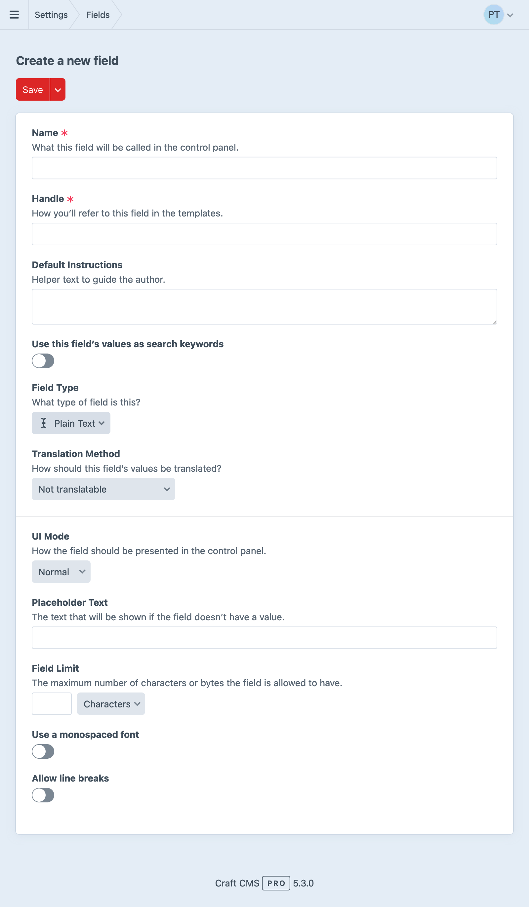
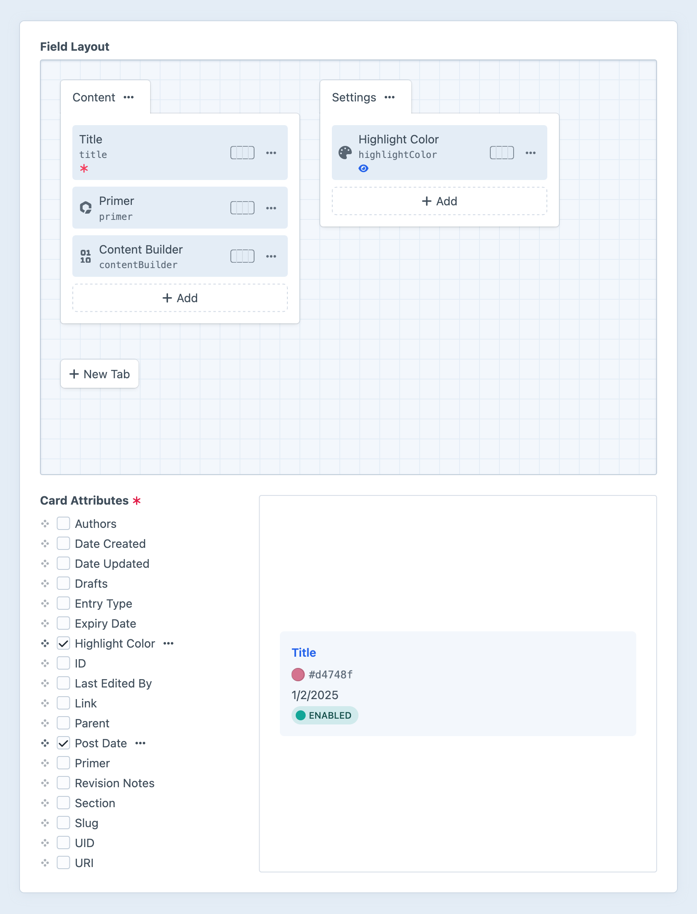
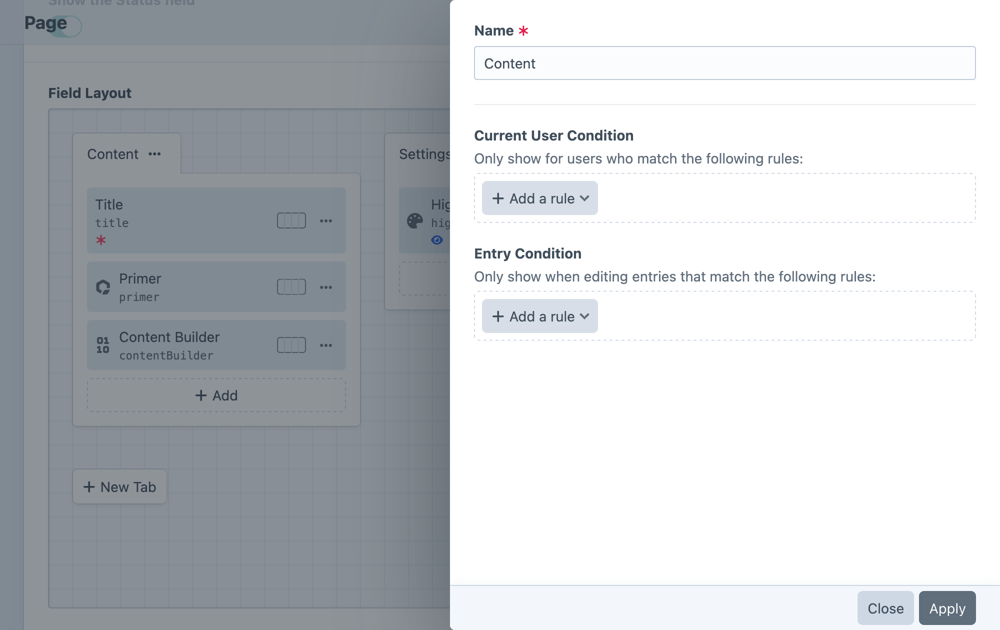
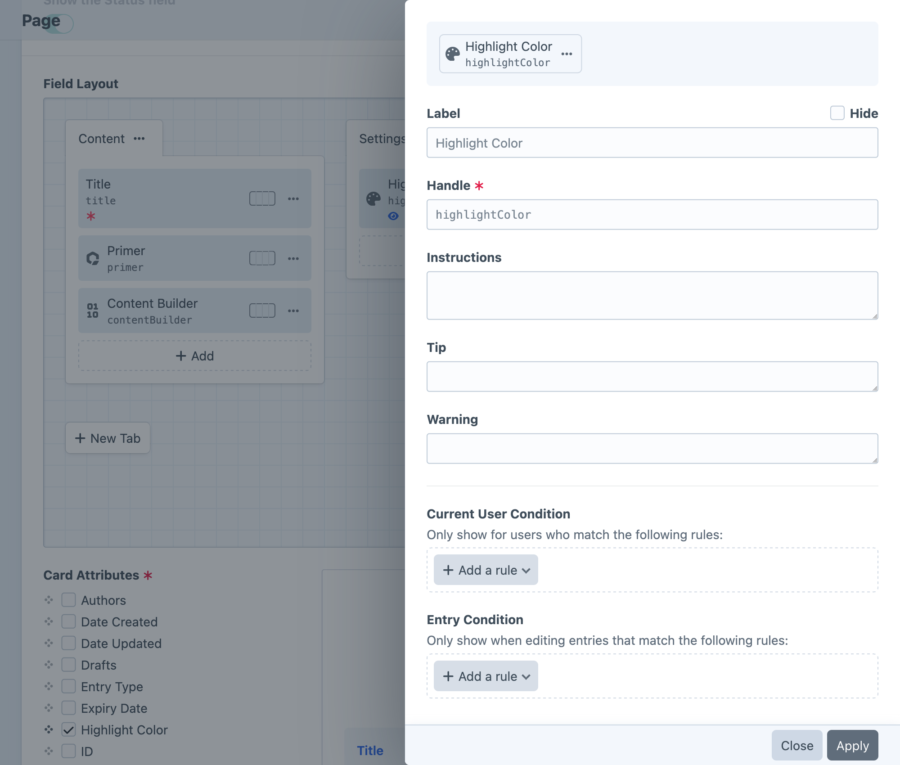
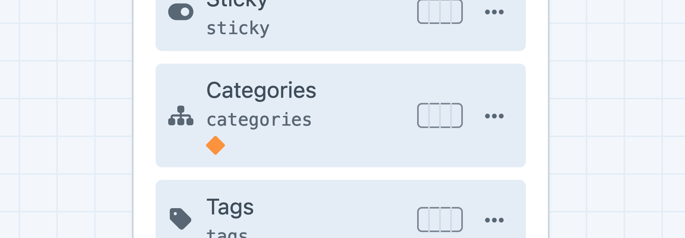
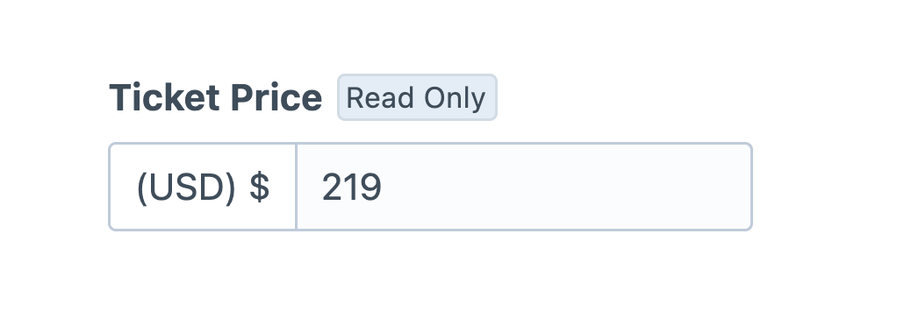
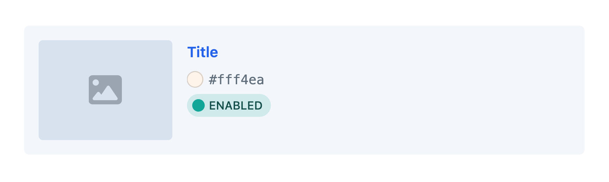

# Custom Fields

On their own, [elements](elements.md) only provide a scaffold for your content—most of the content itself will be stored in *fields*.

<!-- more -->

Fields are managed in <Journey path="Settings, Fields" />, or created on-the-fly from a [field layout](#field-layouts) designer.
Field layouts and [conditions](#conditions) determine where and when your fields should appear for content authors.

## Field Types

Choosing a field type determines what the field’s input UI is going to look like, how it stores data, how you’ll use that data in [templates](../development/templates.md), and the way you [query](../development/element-queries.md) against that data.

<See path="../reference/field-types/" />

## Field Settings

<BrowserShot
  url="https://my-project.tld/admin/settings/fields/new"
  :link="false"
  :max-height="500"
  caption="Creating a field in the Craft control panel.">

</BrowserShot>

Most field types share these core settings:

Name
:   The user-facing label for the field. This should identify the field reasonably well among other fields, and be descriptive enough for authors. _You can override this in a field layout._

Handle
:   A developer-facing identifier for the field, used to access or query by its value from code. Every field must have a unique handle. _You can override this in a field layout._

Default Instructions
:   Text displayed to authors in the field layout. Basic Markdown formatting is supported. _You can override this in a field layout._

Translation Method
:   How Craft handles the field’s value for elements that exist in multiple [sites](sites.md). See [Translation Methods](#translation-methods) below for more information.

::: tip
A field’s _name_, _instructions_, and _handle_ can be overridden when adding it to a [layout](#field-layouts).

[Multi-instance](#multi-instance-fields) fields are distinguished by those overridden names and handles; every field in a layout must have a unique handle.
:::

### Handles

Craft will auto-generate a **Handle** as you enter a **Name**, but you can adjust it however you see fit.

::: warning
Some handles are reserved so that custom fields don’t collide with native element attributes.
:::

Handles are used when accessing field data from code:

```twig
<div class="summary">
  {# Display a plain text field: #}
  <p>{{ entry.summaryShort }}</p>
</div>
```

They’re also how you [query by a field’s value](../development/element-queries.md#querying-with-custom-fields):

```twig
{# Filter by the value of a lightswitch field: #}

```

Refer to each field type’s documentation for information about what kinds of data it returns, and how to use it in your templates!

### Translation Methods

If you’re running a multi-site Craft installation, most of your fields will have a **Translation Method** setting.

Fields can have the following translation method:

- **Not translatable** – The field will have the same value across all sites.
- **Translate for each site** – The field can have a different value for each site.
- **Translate for each site group** – The field can have a different value for each site group.
- **Translate for each language** – The field can have a different value for each unique language associated with your sites.
- **Custom…** – The field can have different values based on a custom differentiator.

If you choose **Custom…**, a **Translation Key Format** setting will appear below, where you can define an [object template](object-templates.md) that determines how Craft copies the field’s value to other sites. When an element that uses the field is saved, Craft renders this template for each site the element exists in, and copies the value to any that produce the same key.

For example, if a field’s translation key format were `{site.handle[0:2]}`, then new field values would be copied over to any other sites where the first two characters of the site handle matches the first two characters of the original site’s handle. Looking at this from the opposite direction: any site that produces a _unique_ translation key for a field will have its value isolated from other sites.

If the translation key format returns an empty string (`''`), the field will not appear as translatable, and its value will not be copied to any other sites. A key format of `{section.handle == 'blog' ? site.handle : ''}`, for example, would display its field as translatable per-site from _only_ the `blog` section—in all other contexts, it would not be translatable.

::: tip
Keep in mind that fields can be attached to multiple element types. Accessing invalid properties of the current element (like `section` on an [asset](../reference/element-types/assets.md)) may cause the key to end up blank (and therefore not translated).
:::

## Field Layouts

Everything in Craft that has content associated with it will expose a configurable _field layout_, to which you can add your fields:

- **[Entries](../reference/element-types/entries.md)** use the field layout defined by their entry type in <Journey path="Settings, Entry Types, Entry Type, Field Layout" />.
- **[Global sets](../reference/element-types/globals.md)** each get their own field layout, defined in <Journey path="Settings, Globals, Global Set, Field Layout" />.
- **[Assets](../reference/element-types/assets.md)** use the field layout defined by their asset volume in <Journey path="Settings, Assets, Asset Volume, Field Layout" />.
- **[Categories](../reference/element-types/categories.md)** use the field layout defined by their category group in <Journey path="Settings, Categories, Category Group, Field Layout" />.
- **[Tags](../reference/element-types/tags.md)** use the field layout defined by their tag group in <Journey path="Settings, Tags, Tag Group, Field Layout" />.
- **[Users](../reference/element-types/users.md)** share a single field layout defined in <Journey path="Settings, Users, User Fields" />.
- **[Addresses](../reference/element-types/addresses.md)** also share a field layout, which can be found alongside **Users** in <Journey path="Settings, Users, Address Fields" />.

The field layout editor works roughly the same way, regardless of which element type you’re configuring:



::: tip
Fields and other element-specific attributes can also be added to [element cards](elements.md#chips-cards) using the [card designer](#card-designer).
:::

### Tabs

Every layout starts with a _Content_ tab. Add more tabs with the **New Tab** button, or update an existing tab by clicking its action button (<icon kind="ellipses" />) and selecting **Settings**. Drag and drop those tabs into whatever order you prefer—the first tab is selected by default when editing an entry.

::: tip
When editing an element, if its field layout has only one tab (or only one tab is visible due to applied conditions), the fields within it will be displayed _without_ the tab or tab bar. Its name will not be visible until there are at least two tabs.
:::

A tab’s settings include its name and optional conditions that determine when it will be displayed for editors:

<BrowserShot
  url="https://my-project.tld/admin/settings/entry-types/42"
  :link="false"
  caption="Updating a tab’s settings in the field layout designer.">

</BrowserShot>

- **Name** – the label displayed for the tab when it’s visible in the editor.
- **Current User Condition** – optional rules for determining which users should see the tab in the editor. (When the tab is not displayed, its fields are hidden regardless of their individual conditions.)
- **Element Condition** – optional rules (based on the current element) that determine when the tab and its fields should be displayed in the editor.

### Field Layout Elements

Add fields to any tab using the **+ Add** button, then dragging them into the desired order. Most layouts include at least a **Title** field by default—even if it’s marked as _hidden_. To remove a field, select **Remove** from its action <Icon kind="ellipses" /> menu. Some field layout elements are designated as _mandatory_ by an element type, meaning they cannot be removed from its field layout.

::: warning
Take care when removing a field from a layout: Craft stores field content using each instance’s UID. _Re-adding a field (whether or not it uses the same handle) will give it a new UID, meaning it will no longer be associated with existing content!_ By relegating these changes to a development environment, your live data is typically insulated from major loss—if you do mistakenly remove a field, you can always roll back the corresponding [project config](project-config.md) changes via git before deploying.

Moving field layout elements between tabs, however, is nondestructive.
:::

By default, each field will be displayed at the full width (100%) of its tab. Use the field width control to adjust this in increments of 25%. Fields can appear side by side as long as the content editor’s browser window is wide enough. On narrow screens, fields may be shown at full width, even if they are configured differently.

Click the action button (<icon kind="ellipses" />) next to a field and select **Instance settings** to open a slideout with its settings:

<BrowserShot
  url="https://my-project.tld/admin/settings/entry-types/42"
  :link="false"
  caption="Customizing a field instance within a field layout.">

</BrowserShot>

The field’s settings let you control how and when it’s displayed:

- **Label** – Override the field’s default label, or hide it entirely.
- **Handle** – Override the field’s handle.
- **Instructions** – Override the field’s default instructions.
- **Current User Condition** – Set rules for determining which users can see the field and change its value.
- **Element Condition** – Set rules (based on the current element) that determine when the field should be displayed in an editor.
- **Required** – When a field is marked as **Required**, the element only validate when a value is present in the field. This may have different effects on different field types.
- **Use this field’s values for element thumbnails** — For fields that can be used as thumbnails in [chips and cards](elements.md#chips-cards), this option will appear.
- **Include this field in element cards** — Any fields with this enabled will appear whenever the element is rendered as a [card](elements.md#chips-cards). Fields that are also eligible for use as a thumbnail may be displayed twice!

::: tip
Only one field can be used as an element’s thumbnail at a time.
:::

Some field layout elements’ settings are bubbled up to the layout designer as _indicators_, beside the field’s name:

- An _asterisk_ (<icon kind="asterisk" />) means the field is **Required**.
- A _diamond_ means that it has been assigned one or more user or element [condition rules](#conditions).
- A _photo_ icon means the field will be used as the thumbnail in element [chips and cards](elements.md#chips-cards).
- An _eye_ means the field will appear in element cards.
- A _pencil_ icon indicates that the field contains overridden settings.

You can also edit the original field’s configuration by selecting **Edit global field settings** from its action menu.

### Multi-Instance Fields <Badge text="New!" />

Most fields can be added to a single layout multiple times. Craft will automatically assign a new handle to fields that are used more than once in a layout. To customize a field’s handle for a given layout, click its action button (<Icon kind="ellipses" />) and select **Instance settings** slideout, then look for the **Handle** field.

Multi-instance fields behave as though they were entirely different fields, in almost every situation: templates, element queries, condition builders, search, and so on. The field layout will retain a reference to the underlying field, so any settings updated for the base field will be reflected on each instance. For example, a [plain text](../reference/field-types/plain-text.md) field named “Attribution” could be used two (or more) times in a single entry type’s field layout: once for an article “Byline,” then again as “Photo Credit.” In a template, you would use those fields exactly like any other field:

```twig{7,12}


<article>
  
    <figure>
      {{ image.getImg() }}
      <figcaption>{{ entry.photoCredit }}</figcaption>
    </figure>
  

  <h2>{{ entry.title }}</h2>
  <address rel="author">{{ entry.byline }}</address>

  {# ... #}
</article>
```

This example uses the same “Attribution” field as `photoCredit` _and_ `byline`, each storing its own content. You can target one instance of a field with [element queries](../development/element-queries.md), just as you’d expect:

```twig{4}

```

Conversely, adding one field to multiple different layouts (using the same handle—either its original handle, or by renaming each of them the same way) allows you to query across all instances. Craft quietly reconciles those field handles and builds the query appropriately:

```twig
{% set products = craft.entries()
  .section('products')
  .manufacturer('ACME%')
  .all() %}
{# -> Products made by ACME Labs and ACME Inc. across multiple product “types” with similar field layouts #}
```

This example assumes you have multiple [entry types](../reference/element-types/entries.md#entry-types) in a “Products” section, each using a centrally-defined, generic “Product Details” field—one instance of which per layout using the name “Manufacturer” and handle `manufacturer`.

### Conditions

Any fields (or [tabs](#tabs)) that have a _condition_ configured will display an orange rhombus.



Conditions determine when (and to whom) a field or tab is [displayed](#visibility-conditions) and [editable](#editability-conditions). You can create sophisticated editorial processes by exposing parts of the authoring interface only when specific criteria are met.

::: warning
Conditions are not intended as complete substitute for [permissions](user-management.md#permissions)! It’s still important to configure sensible base permissions for your editors.

However, Craft only populates fields that are visible _and_ editable to a given user, regardless of context; as a result, your [front-end forms](../development/forms.md) are automatically protected against clever manipulation of POST values.
:::

#### Visibility Conditions

Two conditions are available to determine when a field (or tab) is visible within a field layout, and whether it will be validated:

- **Current User Condition** — Evaluated against the user that is currently editing the element.
- **<Placeholder help="One of Craft’s built-in or plugin-provided element type names.">Element Type</Placeholder> Condition** — Evaluated against the element being edited. Available rules depend on the element type, its configuration (i.e. entry type or asset volume), and the field layout.

As you edit an element, the visibility of conditional fields is determined while [auto-saving](drafts-revisions.md#auto-saving). Take care when designing a field layout to avoid major visual shifts as fields are shown or hidden. Only visible fields are validated.

::: tip
Prior to Craft 5.7.0, these were the only two condition builders, and the UI did not explicitly group them into **Visibility Conditions**.
:::

#### Editability Conditions <Since ver="5.7.0" feature="Editability conditions in the field layout designer" />



User and element conditions completely hide field layout elements when their criteria are not met.
If you would prefer to make a field read-only or “static” in some situations (so that authors can still reference its value), you can move conditions into the **Editability Conditions**.

To be editable, a field must also be [visible](#visibility-conditions).

::: warning
It’s possible to short-circuit validation with editability conditions!
Fields marked as **Required** will prevent authors from applying a draft, even if they aren’t able to provide a value.
:::

### UI Elements

Switch to the **UI Elements** tab in the **New field** popover to add special field layout elements:

- **Heading** — Create a label that splits up form inputs, within a tab.
- **Tip** + **Warning** — Display a Markdown message with the corresponding urgency. Enable the **Can be dismissed?** setting to allow authors to hide a message in the current browser (using the `localStorage` API).
- **Template** — Render a Twig template from your [`templates/` directory](directory-structure.md#templates). The template will receive the element being edited under an `element` variable.
- **Horizontal Rule** — A thin divider line. Subsequent fields will start in a new row.
- **Line Break** — An invisible element that ensures the next field is rendered in a new row.
- **Markdown** — Renders a multi-line Markdown snippet. HTML is encoded prior to parsing as Markdown; if you want to add arbitrary HTML, use the **Template** UI element.

In addition to their own options (accessible via their <Icon kind="ellipses" /> action menu), most field layout UI elements share regular fields’ [condition](#conditions) settings.

### Card Designer <Since ver="5.5.0" feature="Customizable card attributes" />

Below the field layout designer, you can add previews of field and attribute data to the [card](elements.md#chips-cards) representation of that element. Note that values that appear in the card preview do not represent the content of any specific element.



#### Thumbnails

Card thumbnails are assigned using the main field layout designer. Select **Use for element thumbnails** from the action <Icon kind="ellipses" /> menu of any [relational field](relations.md) to display the first attached asset—or, when using a non-asset relational field, _that_ element’s thumbnail!

Only one field can be used as the thumbnail source at a time. Additional asset fields’ values can be displayed in the card body, as chips.

## Generated Fields

In addition to the native attributes and custom fields added to an element’s field layout, you can add any number of [**Generated Fields**](elements.md#generated-fields) that expose pre-computed values on the associated elements.
