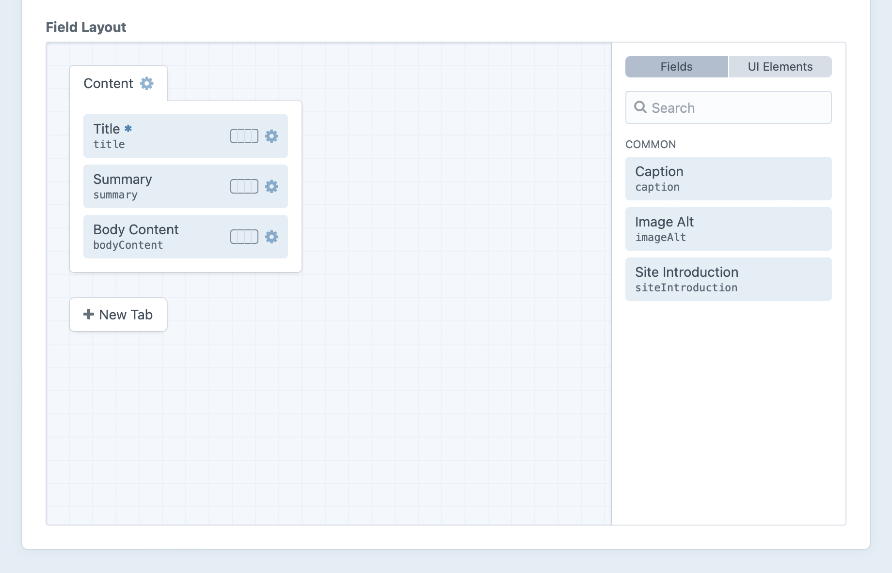
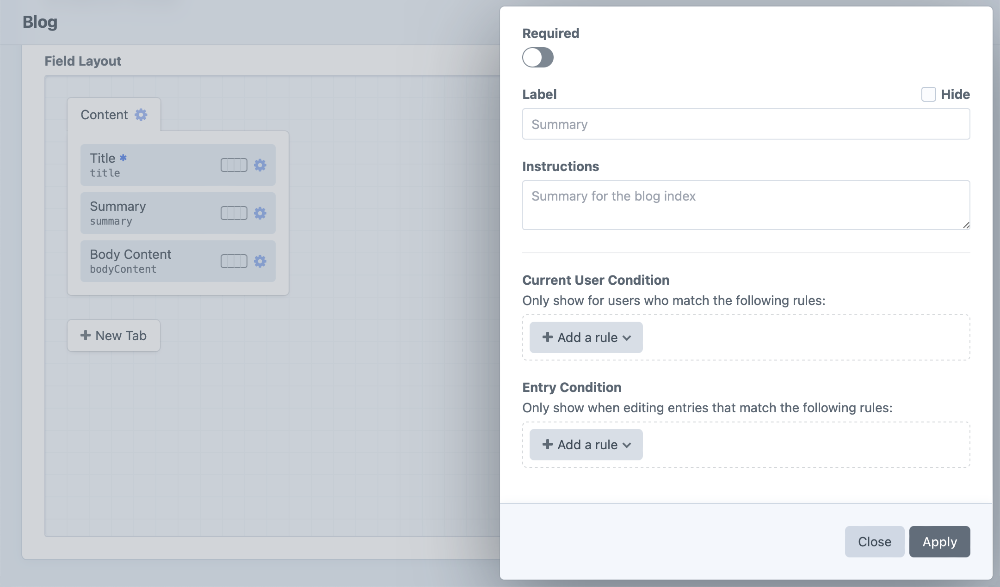
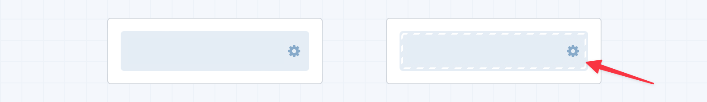

# Custom Fields

On their own, [elements](elements.md) only provide a scaffold for your content—the content itself will be stored in *fields*.

Fields are managed in **Settings** → **Fields**, and can be created on-the-fly from a [field layout](#field-layouts) designer. Field layouts and [conditions](#field-conditions) determine where and when your fields should appear for content authors.

All fields share a few settings:

- **Group** – The field group that the field is filed into;
- **Name** – How the field will be labeled throughout the control panel;
- **Handle** – How the field will be referenced from your templates;
- **Instructions** – Instruction text to guide authors;
- **Field Type** – What [type](#field-types) of field it is;

<BrowserShot url="https://my-project.tld/admin/settings/fields/new" :link="false" :max-height="500">

</BrowserShot>

::: tip
A field’s _name_ and _instructions_ can be overridden when adding it to a [layout](#field-layouts).  When a field supports [multiple instances](#multi-instance-fields) per layout, you can also override its _handle_.
:::

## Field Types

Choosing a field type determines what the field’s input UI is going to look like, how it stores data, and how you’ll interact with that data in your templates.

Craft comes with the following built-in field types:

Type | Description
---- | -----------
[Addresses](../reference/field-types/addresses.md) | Manage nested [address](../reference/element-types/addresses.md) elements.
[Assets](../reference/field-types/assets.md) | Relate [asset](../reference/element-types/assets.md) elements.
[Categories](../reference/field-types/categories.md) | Relate [category](../reference/element-types/categories.md) elements.
[Checkboxes](../reference/field-types/checkboxes.md) | Select any number of values from a list.
[Color](../reference/field-types/color.md) | Choose a color with the browser’s color picker UI.
[Country](../reference/field-types/country.md) | Select from a list of countries available in [address](../reference/field-types/addresses.md) elements.
[Date/Time](../reference/field-types/date-time.md) | Choose a date and/or time, as well as a timezone.
[Dropdown](../reference/field-types/dropdown.md) | Choose one value from a list.
[Email](../reference/field-types/email.md) | Validate text input as an email address.
[Entries](../reference/field-types/entries.md) | Relate [entry](../reference/element-types/entries.md) elements.
[Icon](../reference/field-types/icon.md) | Select from a palette of icons.
[Lightswitch](../reference/field-types/lightswitch.md) | Toggle a binary option.
[Matrix](../reference/field-types/matrix.md) | Compose advanced content structures with nested entries.
[Money](../reference/field-types/money.md) | Input a numeric value and choose a currency.
[Multi-select](../reference/field-types/multi-select.md) | Select any number of values from a list (same as checkboxes, but a different UI).
[Number](../reference/field-types/number.md) | Input a numeric value.
[Plain Text](../reference/field-types/plain-text.md) | Input arbitrary text.
[Radio Buttons](../reference/field-types/radio-buttons.md) | Choose one value from a list.
[Table](../reference/field-types/table.md) | Add rows of similar data.
[Tags](../reference/field-types/tags.md) | Relate tag elements, or create new ones on-the-fly.
[Time](../reference/field-types/time.md) | Set a time of day, without a date or timezone.
[URL](../reference/field-types/url.md) | Validate text as a URL/URI.
[Users](../reference/field-types/users.md) | Relate [user](../reference/element-types/users.md) elements.

## Translation Methods

If you’re running a multi-site Craft installation, most of your fields will have a “Translation Method” setting (depending on their type).

Fields can have the following translation method:

- **Not translatable** – The field will have the same value across all sites.
- **Translate for each site** – The field can have a different value for each site.
- **Translate for each site group** – The field can have a different value for each site group.
- **Translate for each language** – The field can have a different value for each unique language associated with your sites.
- **Custom…** – The field can have different values based on a custom differentiator.

If you choose “Custom…”, a “Translation Key Format” setting will appear below, where you can define an [object template](object-templates.md) that will help Craft which sites to copy the field value over to. When a new field value is saved, Craft will render this template for each site the element is configured in, and the field value will be copied to any site that produces a translation key matching the current site’s.

For example, if a field’s translation key format were `{site.handle[0:2]}`, then new field values would be copied over to any other sites where the first two characters of the site handle matches the first two characters of the original site’s handle. Looking at this from the opposite direction: any site that produces a _unique_ translation key for a field will have its value isolated from other sites.

If the translation key format returns an empty string (`''`), the field will not indicate that it’s available for translation. A key format of `{section.handle == 'blog' ? site.handle : ''}`, for example, would display its field as translatable per-site from _only_ the `blog` section—otherwise it would not be available for translation in any other context.

::: tip
Keep in mind that fields can be assigned to multiple element types. Accessing invalid properties of the current element (like `section` on an asset) may cause the key to end up blank (and therefore not translated)
:::

## Field Layouts

Everything in Craft that has content associated with it will expose a configurable _field layout_, to which you can add your fields:

- **[Entries](entries.md)** use the field layout defined by their entry type in **Settings** → **Entry Types** → [entry type name] → **Field Layout**.
- **[Global sets](globals.md)** each get their own field layout, defined in **Settings** → **Globals** → [global set name] → **Field Layout**.
- **[Assets](assets.md)** use the field layout defined by their asset volume in **Settings** → **Assets** → [asset volume name] → **Field Layout**.
- **[Categories](categories.md)** use the field layout defined by their category group in **Settings** → **Categories** → [category group name] → **Field Layout**.
- **[Tags](tags.md)** use the field layout defined by their tag group in **Settings** → **Tags** → [tag group name] → **Field Layout**.
- **[Users](users.md)** share a single field layout defined in **Settings** → **Users** → **User Fields**.
- **[Addresses](addresses.md)** also share a field layout, which can be found alongside **Users** in **Settings** → **Users** → **Address Fields**.

The field layout editor works the same way regardless of which content type you’re configuring:



### Tabs

Every layout starts with a “Content” tab at the top. Add more tabs with the **New Tab** button, or update an existing tab by clicking its gear icon (<icon kind="settings" />) and selecting **Settings**. Drag and drop those tabs into whatever order you prefer—the first tab is selected by default when editing an entry.

::: tip
If the field layout has only one tab (or only one tab is visible due to applied conditions), its fields will be displayed in the editor without the tab itself—so its name will not be visible until more tabs are added.
:::

A tab’s settings include its name and optional conditions that determine when it will be displayed for editors:


- **Name** – the label displayed for the tab when it’s visible in the editor.
- **Current User Condition** – optional rules for determining which users should see the tab in the editor. (When the tab is not displayed, its fields are hidden regardless of their individual conditions.)
- **Element Condition** – optional rules (based on the current element) that determine when the tab and its fields should be displayed in the editor.

### Field Layout Elements

Add however many fields you’d like to each tab, dragging them into your desired order. Most layouts include at least a **Title** field by default—even if it’s marked as _hidden_. Any available fields and UI elements will be available at the right edge of the layout designer, where you can drag them from the sidebar into your field layout. You can move fields back to the sidebar and out of your field layout (unless they’re _mandatory_ fields for the element type), but take care not to remove any fields already being used for important content.

By default, each field will be displayed at the full width (100%) of its tab. You can use the field width control, however, to designate a column size. This can be 25%, 50%, 75% or the default 100% width. Fields can appear side by side as long as the content editor’s browser window is wide enough. On small screens, fields may be shown at full width.

Click the gear icon (<icon kind="settings" />) next to a field to open a slideout with its settings:



The field’s settings let you control how and when it’s displayed:

- **Label** – Override the field’s default label.
- **Handle** – Override the field’s handle.
- **Instructions** – Override the field’s default instructions.
- **Current User Condition** – Set rules for determining which users can see the field and change its value.
- **Element Condition** – Set rules (based on the current element) that determine when the field should be displayed in an editor.
- **Required** – When a field is marked as **Required**, the element only validate when a value is present in the field. This may have different effects on different field types.
- **Use this field’s values for element thumbnails** — For fields that can be used as thumbnails in [chips and cards](elements.md#chips-cards), this option will appear.
- **Include this field in element cards** — Any fields with this enabled will appear whenever the element is rendered as a [card](elements.md#chips-cards). Fields that are also eligible for use as a thumbnail may be displayed twice!

::: tip
Only one field can be used as an element’s thumbnail at a time.
:::

Some field layout elements’ settings are bubbled up to the layout designer, beside the field’s name:

- An asterisk (<icon kind="asterisk" />) means the field is **Required**.
- A diamond means that it has been assigned one or more user or element condition rules.
- A photo icon means the field will be used as the thumbnail in element chips and cards.
- A check mark means the field will appear in element cards.

A field that’s required will have an asterisk (<icon kind="asterisk" />) beside the field’s name.

### Multi-Instance Fields <Badge text="New!" />

Some fields can be added to a layout multiple times. Craft will automatically assign a new handle to fields that are used more than once in a layout. To customize a field’s handle for a given layout, click the settings <icon kind="gear" /> icon on the field layout element and change the **Handle** setting.

Multi-instance fields behave as though they were entirely different fields, in almost every situation: templates, element queries, condition builders, search, and so on… The field layout will retain a reference to the underlying field, so any settings updated for the base field will be reflected on each instance. For example, a [plain text](../reference/field-types/plain-text.md) field named **Attribution** could be used two (or more) times in a single entry type’s field layout: once for an article “Byline,” then again as “Photo Credit.” In a template, you would use those fields exactly like any other field:

```twig{7,12}


<article>
  
    <figure>
      {{ image.getImg() }}
      <figcaption>{{ entry.photoCredit }}</figcaption>
    </figure>
  

  <h2>{{ entry.title }}</h2>
  <address rel="author">{{ entry.byline }}</address>

  {# ... #}
</article>
```

This example uses the same “Attribution” field as `photoCredit` _and_ `byline`, each storing its own content. Similarly, you can target one instance of field with [element queries](../development/element-queries.md), just as you’d expect:

```twig{4}

```

### Conditions

Any fields that have condition rules on them are displayed with a caution strip:



### UI Elements

Switch to the **UI Elements** tab at the right edge of the screen (replacing the **Fields** browser) to add special field layout elements. Each of these 

- **Heading** — Create a label that splits up form inputs, within a tab.
- **Tip** & **Warning** — Display a message with the corresponding urgency. Equivalent, except in visual design.
- **Template** — Render a Twig template from your [`templates/` directory](directory-structure.md#templates). The template will receive the element being edited under an `element` variable.
- **Horizontal Rule** — A thin divider line. Subsequent fields will start in a new row.
- **Line Break** — An invisible element that ensures the next field is rendered in a new row.

In addition to their own options, field layout UI elements share regular fields’ **Current User Condition** and **Element Condition** settings.
