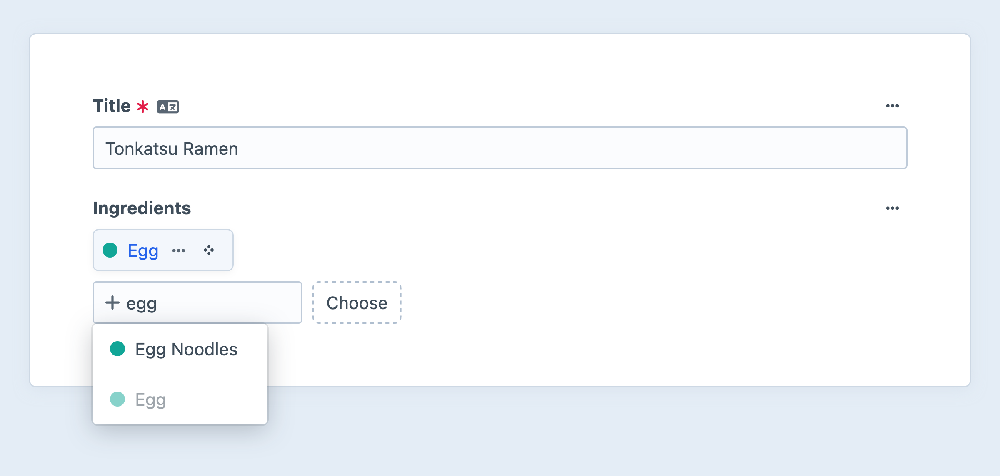
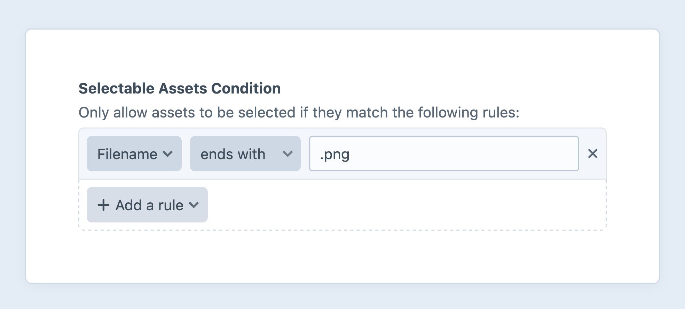

# Relations

Craft has a powerful engine for relating elements to one another with five [relational field types](#custom-fields). Just like other field types, relational fields can be added to any [field layout](./fields.md#field-layouts), including those within [nested entries](#relations-via-matrix).



_Unlike_ other field types, relational fields store their data in a dedicated `relations` table. In that table, Craft tracks:

- The element that is the **source** of the relationship;
- Which **field** a relationship uses;
- The **site** in which a relationship is defined;
- The element that is the **target** of the relationship;
- The **order** in which the related elements are arranged;

This allows you to design fast and powerful [queries](#the-relatedto-parameter) for related content, and to [optimize loading](../development/eager-loading.md) of nested and related resources.

## Terminology

Each relationship consists of two elements we call the *source* and *target*:

- The <dfn>source</dfn> has the relational field where other elements are chosen.
- The <dfn>target</dfn> is the one selected by the source.

Individual [relational fields](#custom-fields) can impose restrictions on what elements may be selected.
The element type is always determined by the field type; additional criteria narrowing eligible targets to existing [sources](elements.md#sources) or ad-hoc _conditions_ tailored to that element type:



## Illustrating Relations

Suppose we have a database of _Recipes_ (represented as a [channel](../reference/element-types/entries.md#channels)) and we want to allow visitors to browse other recipes that share an ingredient. To-date, ingredients have been stored as plain text along with the instructions, and users have relied on search to discover other recipes.

Let’s leverage Craft’s relations system to improve this “schema” and user experience:

1. Create another channel for _Ingredients_.
2. Create a new [Entries field](../reference/field-types/entries.md), with the name “Ingredients.”
3. Limit the **Sources** option to “Ingredients” only.
4. Leave the **Limit** field blank so we can choose however many ingredients each recipe needs.
5. Add this new field to the _Recipes_ channel’s field layout.

Now, we can attach _Ingredients_ to each _Recipe_ entry via the new _Ingredients_ relation field. Each selected ingredient defines a new relationship, with the recipe as the _source_ and the ingredient as the _target_.

<a id="getting-target-elements-via-the-source-element" title="Section “Getting Target Elements via the Source Element” has been renamed."></a>

## Using Relational Data

Relationships are primarily used within [element queries](../development/element-queries.md), either via a relational field on an element you already have a reference to, or the [`relatedTo()` query parameter](#the-relatedto-parameter).

### Custom Fields

_Ingredients_ attached to a _Recipe_ can be accessed using the relational field’s handle. Unlike most fields (which return their stored value), relational fields return an [element query](../development/element-queries.md), ready to fetch the attached elements in the order they were selected.

Craft has five built-in relational fields, each of which establishes connections to a different [element type](elements.md#element-types):

- [Assets](../reference/field-types/assets.md)
- [Categories](../reference/field-types/categories.md)
- [Entries](../reference/field-types/entries.md)
- [Tags](../reference/field-types/tags.md)
- [Users](../reference/field-types/users.md)

Additionally, the [link field](../reference/field-types/link.md) uses the relations system to store references to assets, categories, and entries.

[Addresses](../reference/element-types/addresses.md) (as well as other nested elements like those in [Matrix](../reference/field-types/matrix.md) or [content blocks](../reference/field-types/content-block.md) fields) and [global sets](../reference/element-types/globals.md) don’t have relational fields, in the traditional sense—the former are managed as nested elements and implicitly connected to their owners; the latter exist as static, singleton elements and are functionally equivalent to a boolean value.
If you do need to point to one of your global sets (say, to display one of a few fixed sets of data), consider adding a [dropdown field](../reference/field-types/dropdown.md) populated with the global set handles.
You can then directly load the corresponding global set element using a query:

```twig


{# Assuming `myGlobalField` is available on all the global sets that might be selected... #}
{{ source.myGlobalField }}
```

::: tip
Craft’s [eager-loading](../development/eager-loading.md) system makes it possible to efficiently load batches of related elements.
:::

Returning to our example: to output the list of ingredients for a recipe on the recipe’s page, you could do this (assuming the relational field handle is `ingredients`)…

```twig
{# Fetch related elements by calling `.all()` on the relational field: #}


{# Check if anything came back: #}

  <h3>Ingredients</h3>

  <ul>
    {# Loop over the results: #}
    
      <li>{{ ingredient.title }}</li>
    
  </ul>

```

Because `entry.ingredients` is an element query, you can set additional constraints before executing it:

```twig
{# Narrow the query to only “vegetables:” %}


<h3>Vegetables</h3>


  <ul>
    
      <li>{{ veggie.title }}</li>
    
  </ul>

  <p>This recipe has no vegetables!</p>

```

This query will display ingredients attached to the current recipe that _also_ have their `foodGroup` field (perhaps a [dropdown](../reference/field-types/dropdown.md)) set to `vegetable`. Here’s another example using the same schema—but a different [query execution method](../development/element-queries.md#executing-element-queries)—that lets us answer a question that some cooks might have:

```twig



  <span class="badge">Vegetarian</span>

```

::: tip
Each relational field type will return a different type of element query. _Entries_ fields produce an entry query; _Categories_ fields produce a category query; and so on.
:::

### The `relatedTo` Parameter

The `relatedTo` parameter on every [element query](../development/element-queries.md) allows you to narrow results based on their relationship to an element (or multiple elements).

Any of the following can be used when setting up a relational query:

- A single **element object**: <craft5:craft\elements\Asset>, <craft5:craft\elements\Category>, <craft5:craft\elements\Entry>, <craft5:craft\elements\User>, or <craft5:craft\elements\Tag>
- A single **element ID**
- A [**hash**](../development/twig.md#hashes) with properties describing specific constraints on the relationship:
  - Required: `element`, `sourceElement`, or `targetElement`
  - Optional: `field` and `sourceSite`
- An [**array**](../development/twig.md#arrays) of the above options, with an optional operator in the first position:
  - The string `and`, to return relations matching _all_ conditions rather than _any_;
  - The string `or`, to return relations that match _any_ conditions (default behavior, can be omitted);

See [complex relationships](#complex-relationships), below, for detailed information about the capabilities of hash and array syntaxes.

::: tip
Chaining multiple `relatedTo` parameters on the same element query will overwrite earlier ones. Use [`andRelatedTo`](#the-andrelatedto-parameter) to append relational constraints.
:::

### The `andRelatedTo` Parameter

Use the `andRelatedTo` parameter to join multiple sets of relational criteria together with an `and` operator. It accepts the same arguments as `relatedTo`, and can be supplied any number of times.

::: warning
There is one limitation, here: multiple `relatedTo` criteria using `or` *and* `and` operators cannot be combined.
:::

### The `notRelatedTo` and `andNotRelatedTo` Parameters

Find entries that _aren’t_ related to one or more elements with the `not*` relational query methods. This can be combined with the `relatedTo` parameter.

```twig{3-4}

```

## Simple Relationships

The most basic relational query involves passing a single element or element ID. Here, we’re looking up other recipes that use the current one’s main protein:

```twig
{# Grab the first protein in the recipe: #}



{# -> Recipes that share `protein` with the current one. #}
```

Passing an array returns results related to _any_ of the supplied elements. This means we could expand our criteria to search for other recipes with any crossover in proteins:

```twig
{# Note the use of `.all()`, this time: #}



{# -> Recipes that share *any* proteins with the current one. #}
```

Passing `and` at the beginning of an array returns results related to *all* of the supplied items:

```twig



{# -> Recipes that also use *all* this recipe’s proteins. #}
```

This is equivalent to `.relatedTo(['and', beef, pork])`, if you already had variables for `beef` and `pork`.

### Empty and Not Empty

Like most other fields, relational field query methods accept special `:notempty:` and `:empty:` tokens.
This allow you to query for elements that are related (or _not_ related) to _any_ other element—useful when the existence of a relationship has meaning:

```twig

{# -> Recipes that don’t require any specialized cookware. #}
```

You can still use the `specialEquipment` field’s data like any other relational field:

```twig



  {# Output a list of cookware... #}

```

## Compound Criteria

Let’s look at how we might combine multiple relational criteria:

```twig
{# A new relational field for recipes, tracking their origins: #}




{# -> Recipes from the same region that share at least one protein. #}
```

You could achieve the same result as the example above using the `andRelatedTo` parameter:

```twig

```

::: warning
These examples _may_ return the recipe you’re currently viewing. Exclude a specific element from results with the `id` param: `.id(['not', entry.id])`.
:::

## Complex Relationships

All the `relatedTo` examples we’ve looked at assume that the only place we’re defining relationships between recipes and ingredients is the _ingredients_ field. What if there were other fields on recipes that described “substitutions,” or “pairs with” and “clashes with” that might muddy our related recipes? What if an ingredient had a “featured seasonal recipe” field?

Craft lets you be specific about the location and direction of relationships when using relational params in your queries. The following options can be passed to `relatedTo` and `andRelatedTo` as a [hash](../development/twig.md#hashes):

### Sources and Targets

Property
:  One of `element`, `sourceElement`, or `targetElement`

Accepts
:  Element ID, element, [element query](../development/element-queries.md), or an array thereof

Description
:  - Use `element` to allow results on either end of a relational field (source _or_ target);
:  - Use `sourceElement` to scope the query to elements selected in a relational field on the provided element(s);
:  - Use `targetElement` to scope the query to elements that have the provided element(s) selected in a relational field.

One way of thinking about the difference between `sourceElement` and `targetElement` is that specifying a _single source_ is roughly equivalent to accessing related elements [via a field handle](#custom-fields):

```twig

{# -> Similar to `recipe.ingredients.all()`, from our very first example! #}
```

Using an _array of source elements_ returns any elements used as a relation on one or more of those sources—but each of the related elements will only appear in the results once!

```twig


{# -> Any ingredients in recipes you’ve added to your favorites. #}
```

### Fields

Property
:  `field` (Optional)

Accepts
:  Field handle, field ID, or an array thereof.

Description
:  Limits relationships to those defined via one of the provided fields.

Suppose we wanted to recommend recipes that use the current one’s alternate proteins—but as main ingredients, not substitutions:

```twig



```

By being explicit about the field we want the relation to use, we can show the user recipes that don’t rely on substitutions to meet their dietary needs.

::: warning
The `field` param does not honor handles overridden in a field layout. Craft doesn’t know until elements are actually loaded which field layouts are relevant.
:::

The `field` param has [additional features](#relations-via-matrix) when scoping a query to a Matrix field.

### Sites

Property
:  `sourceSite` (Optional, defaults to main query’s site)

Accepts
:  [Site](craft5:craft\models\Site) object, site ID, or site handle.

Description
:  Limits relationships to those defined from the supplied site(s).
:  In most cases, you won’t need to set this explicitly. Craft’s default behavior is to look for relationships only in the site(s) that the query will return elements for.

::: warning
Only use `sourceSite` if you’ve designated your relational field to be translatable.
:::

What if our recipes live on an international grocer’s website and are localized for dietary tradition? We can still provide results that make sense for a variety of cooks:

```twig



{# -> Recipes that share regionally-appropriate proteins, *or* that can be adapted. #}
```

Here, we’re allowing Craft to look up substitutions defined in any site, which might imply a recipe can be adapted.

## Relations via Matrix

Relational fields on nested entries within Matrix fields are used the same way they would be on any other element type.

If you want to find elements related to a source element through a [Matrix](../reference/field-types/matrix.md) field, pass the Matrix field’s handle to the [`field` parameter](#fields):

```twig{5}

```

In this example, we’ve changed our schema a bit: ingredients are now attached to nested entries in a `steps` Matrix field.
We still have access to all the same relational query capabilities!

We’ve specified a field handle to ensure that only elements selected as relations via a specific field are returned.
If you need to be more precise about the field those relationships come from, you can use a dot (`.`) to target a nested field:

```twig{5}

```

::: warning
Despite similarities to [eager-loading notation](../development/eager-loading.md#matrix-and-field-contexts), the `field` param does does _not_ support narrowing by entry type or beyond the first level of nested elements.
Relations in any fields with handles matching the second segment (after the dot) are considered.
Local handles are honored here, because Craft knows which entry types (and therefore field layouts) may be used by the nested entries.
:::
