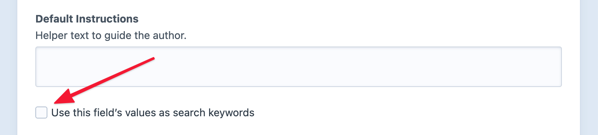

# Searching

Craft includes a system-wide search index used for finding elements via keywords. Search is supported wherever you see this field in the [control panel](./control-panel.md):


Anything you type into this bar is also a valid query when [searching from code](#development):

::: code
```twig

```
```graphql
{
  entries(search: "foo") {
    title
  }
}
```
```php
$results = \craft\elements\Entry::find()
    ->search('foo')
    ->all();
```
:::

## Supported Syntaxes

Craft supports the following syntax wherever you happen to search from:

Searching for… | will find elements…
-|-
`salty` | with any attribute or field containing “salty”.
`salty dog` | with any *single* attribute or field containing both “salty” and “dog”.
`salty OR dog` | with attributes or fields containing either “salty” or “dog” (or both).
`salty -dog` | with any *single* attribute or field containing “salty” but not “dog”.
`"salty dog"` | with any *single* attribute or field containing the exact phrase “salty dog”.
`body:salty` | where the `body` field contains “salty”.
`body:salty body:dog` | where the `body` field contains both “salty” and “dog”.
`body:salty OR body:dog` | where the `body` field contains either “salty” or “dog”.
`body:salty -body:dog` | where the `body` field contains “salty” but not “dog”.
`body:"salty dog"` | where the `body` field contains the exact phrase “salty dog”.
`body::salty` | where the `body` field is set to “salty” and nothing more.
`body::"salty dog"` | where the `body` field is set to “salty dog” and nothing more.

::: tip
If you are not seeing the expected results, make sure your field is [set up for indexing](#configuring-custom-fields-for-search) and that the index has been [rebuilt](#rebuilding-your-search-indexes) to reflect those changes.
:::

Searches are tokenized into *terms* for matching and [scoring](#scoring-algorithm). Without any special modifiers (quotes, operators, or attributes), a query is assumed to be a single term, meaning all words must be present within the same attribute to match.

For example, the query `salty dog` matches elements with both words in the same attribute or field, but _not_ elements with `salty` in one field and `dog` in another. The order of individual words is not enforced, unless the term appears in quotes.

When a query is tokenized into multiple terms, Craft treats them as through they were joined by an implicit `AND` operator.

### Wildcard Syntax

You can use a wildcard character (`*`) to modify search behavior:

Searching for… | will find elements…
-|-
`*ty` | containing a word that ends with “ty”.
`*alt*` | containing a word that contains “alt”.
`body:*ty` | where the `body` field contains a word that ends with “ty”.
`body:*alt*` | where the `body` field contains a word that contains “alt”.
`body::salty*` | where the `body` field begins with “salty”.
`body::*dog` | where the `body` field ends with “dog”.
`body:*` | where the `body` field contains any value.
`-body:*` | where the `body` field is empty.

::: tip
Use the [`defaultSearchTermOptions`](config5:defaultSearchTermOptions) config setting to adjust default search behavior.
:::

## Searching for Specific Element Attributes

Assets, categories, entries, users, and tags each support their own set of additional attributes to search against:

Element | Additional Search Attributes
-|-
Assets | `filename`<br>`extension`<br>`kind`
Categories | `title`<br>`slug`
Entries | `title`<br>`slug`
Users | `username`<br>`firstname`<br>`lastname`<br>`fullname` (firstname + lastname)<br>`email` 
Tags | `title`

::: warning
Searching is a great way to quickly find content by keywords—but the most reliable way to directly query against attributes and custom fields is via the element type’s [query parameters](element-queries.md#types--parameters).
:::

### Element-Specific Attribute Search Examples

If you wanted to search only for [Assets](./assets.md) that are *images*, it would look like this in the control panel:


The same search from your code:

::: code
```twig

```

```graphql
{
  images: assets(search: "kind:image") {
    title
  }
}
```

```php
$images = \craft\elements\Asset::find()
    ->search('kind:image')
    ->all();
```
:::

::: tip
Querying elements by specific attribute or field values is more efficient when using dedicated methods. The above is equivalent to:

```twig

```

This can still be combined with keyword search, and will often support more explicit and flexible [arguments](./assets.md#kind).
:::

If you were to search for Users with email addresses ending in `@craftcms.com`, it would look like this in the control panel:


The same search from your code:

::: code
```twig

```

```graphql
{
  users(search: "email:@craftcms.com") {
    title
  }
}
```

```php
$images = \craft\elements\User::find()
    ->search('email:@craftcms.com')
    ->all();
```
:::

As with the first example, this query could be simplified with the native [`.email()`](./users.md#email) query param:

```twig

```

## Search Filters

Clicking the icon inside the right edge of the search field opens a filter HUD:


You can add any number of conditions to further limit search results by those criteria.

## Development

`craft.assets()`, `craft.entries()`, `craft.tags()`, and `craft.users()` support a `search` parameter you can use to filter their elements by a given search query.

Queries don’t have to be static, though—suppose you wanted to let users define keywords:

::: code
```twig
{# Get the user’s search query from the 'q' query string param #}


{# Fetch entries that match the search query #}

```
```php
// Get the user’s search query from the 'q' query string param
$searchQuery = Craft::$app->getRequest()->getParam('q');

// Fetch entries that match the search query
$results = \craft\elements\Entry::find()
    ->search($searchQuery)
    ->all();
```
:::

::: tip
See our [Search Form](https://craftcms.com/knowledge-base/search-form) article for a complete example of listing dynamic search results.
:::

When using the `search` param, each returned element will be have its [`searchScore`](#scoring-algorithm) attribute populated with a value representing how well the query matched.

Passing user input to the `search` param is generally safe, but may allow discovery or enumeration of otherwise hidden field values. For instance, a savvy user might supply a query like `myPrivateNotesField:"*"` to test whether a field exists or has a specific value. _Carefully auditing which if your fields are [indexed](#configuring-custom-fields-for-search) will help prevent unwanted disclosure._

### Ordering Results by Score

Pass the special `'score'` value to order results from best-match to worst-match:

::: code
```twig

```
```graphql
{
  entries(search: "foo", orderBy: "score") {
    title
  }
}
```
```php
$results = \craft\elements\Entry::find()
    ->search('foo')
    ->orderBy('score')
    ->all();
```
:::

Keep in mind that unlike most other columns, the implicit order for `score` is _descending_. If you need to invert the order for any reason, explicitly pass `score ASC`, or use the `inReverse()` method.

#### Scoring Algorithm

Craft uses its own algorithm to score search results, which takes into consideration each “term” from the query and the complete text of a matched attribute.

1. All scores start at zero.
1. Scores for an element are totaled across rows.
1. Rows are scored against individual terms, using a weight of `1`.
    - Explicit “exact attribute” matches (terms using double-colons `::`) do not contribute to scores, as every result is a known match, already;
    - A base score is determined by how many times a term appears in a row’s keywords;
    - Base scores are divided by the number of keywords in a row;
    - Regular matches are given a 50x multiplier;
    - Partial-word matches get a 10x multiplier;
    - Coincidental exact matches are given a 100x multiplier;
    - Matches for the `title` attribute are given an additional 5x multiplier;
1. Rows are scored against term groups (using the `OR` operator), wherein the weight of each term is divided by the number of terms in the group. Otherwise, scores are calculated the same as individual terms.
1. A row’s total score is the sum of its individual term and grouped term scores.

For example, if we had two entries titled “Salty Dog” and “Greyhound” (both of which mention the _Greyhound_ in a custom field), a search for “greyhound” would be scored like this:

Title + Content | Scores | Rounded Total
--- | --- | ---
**Salty Dog** <br> A salty dog is a cocktail of gin, or vodka, and grapefruit juice, served in a highball glass with a salted rim. The salt is the only difference between a salty dog and a <u>greyhound</u>. <br> [Source](https://en.wikipedia.org/wiki/Salty_dog_(cocktail)) | **Body:** 1 match in 35 words, 50x multiplier | **1**
**Greyhound** <br> A <u>greyhound</u> is a cocktail consisting of grapefruit juice and gin mixed and served over ice. If the rim of the glass has been salted, the drink is instead called a salty dog. <br> [Source](https://en.wikipedia.org/wiki/Greyhound_(cocktail)) | **Title:** 1 match in 1 word, 5x title multiplier, 100x exact match multiplier<br>**Body:** 1 match in 33 words, 50x multiplier | **502**

This is an extreme example—but it shows how quickly exact or near-exact matches can rise to the top of searches. As an exercise, try scoring a search for “salt” against the above content!

## Configuring Custom Fields for Search

Each element type makes basic details, called _searchable attributes_, available as search keywords. It’s common to search for entries by title, for example, or for users matching a name or email address. (We just looked at these in the [Searching for Specific Element Attributes](#searching-for-specific-element-attributes) table.)

You can configure any [custom field](./fields.md) to make its content available for search by enabling **Use this field’s values as search keywords**:



Indexes are only updated once an element with the field is saved. If you have a large amount of content and users (admin or otherwise) rely heavily on search, consider [resaving the elements](#rebuilding-your-search-indexes) to populate the index.

::: tip
For Matrix fields, the top-level **Use this field’s values as search keywords** setting determines whether _any_ sub-fields will factor into results for the parent—individual fields must also opt-in to indexing for any keywords to be bubbled up.

For relational fields like [Assets](./assets-fields.md), [Categories](./categories-fields.md), and [Entries](./entries-fields.md), the setting determines whether titles of related elements should factor into search results.
:::

## Indexing Criteria

Any time an indexable attribute or field on an element is updated (as indicated by Craft’s change-tracking feature, which powers drafts and revisions), an “Updating search indexes” job is pushed into the queue. <Since ver="4.6.0" description="A more restrictive set of criteria for indexing elements was implemented in {product} {ver}." /> Prior versions generate an indexing job whenever an element with _any_ searchable attributes or fields is saved, regardless of whether or not those specific attributes changed.

The [eligible properties](#searching-for-specific-element-attributes) differ for each element type, the field layout a given element uses, and which of the underlying fields are flagged as searchable.

## Rebuilding Your Search Indexes

Craft does its best to keep its search indexes as up-to-date as possible, but there are a couple things that might render portions of them inaccurate. If you suspect your search indexes are out of date, you can have Craft rebuild them by bulk-resaving entries with the [`resave/entries`](console-commands.md#resave) command and including the `--update-search-index` flag:

```bash
php craft resave/entries --update-search-index
```

You can specify which entries should be resaved with the `--section` and `--type` options, among others. Run `craft help resave/entries` to see all supported options, or `craft help resave` for a list of commands for resaving other element types.

## Extending Search

You can modify both the indexing and scoring of results, programmatically.

### Customizing the Index

Craft generates keywords for element attributes and custom fields based on its understanding of their data types. Each [element](./elements.md) and [field](./fields.md) type also have an opportunity to customize keywords: Assets index their `filename`, `extension`, and `kind` attributes; [relational fields](./relations.md) load the attached elements and concatenate their titles.

Keywords can come in virtually any form, because Craft [normalizes](craft5:craft\helpers\Search::normalizeKeywords()) them before adding them to the index. You can supplant or augment keywords (or index additional attributes—real or virtual) by listening to specific search events.

::: danger
Do not modify records in the `searchindex` table, directly. Rows are cleared and rebuilt every time an element is saved, so changes made outside of the normal indexing process will be lost.
:::

#### Different Keywords

To replace keywords for an existing attribute or field (or prevent something from being indexed, entirely), listen for the <craft5:craft\services\Search::EVENT_BEFORE_INDEX_KEYWORDS> event:

```php
use yii\base\Event;
use craft\services\Search;
use craft\events\IndexKeywordsEvent;
use craft\helpers\StringHelper;

Event::on(
    Search::class,
    Search::EVENT_BEFORE_INDEX_KEYWORDS,
    function(IndexKeywordsEvent $e) {
        // Element being indexed:
        $element = $e->element;

        // Current attribute name:
        $attribute = $e->attribute;

        // Field ID, if indexing a custom field:
        $fieldId = $e->fieldId;

        // Keywords that will be indexed:
        $keywords = $e->keywords;

        // Overwrite the keywords (say, to remove common typos)...
        $e->keywords = StringHelper::replaceAll($e->keywords, ['speling', 'wirds', 'typox'], '', false);

        // ...or outright prevent something from being added to the index:
        if (StringHelper::contains($e->keywords, 'naughty words', false)) {
            $e->isValid = false;
        }
    }
);
```

At this point, `$e->keywords` is a space-separated list of terms, ready to be inserted into the index.

#### Additional Attributes

Adding searchable attributes is done via the <craft5:craft\base\Element::EVENT_REGISTER_SEARCHABLE_ATTRIBUTES> and <craft5:craft\base\Element::EVENT_DEFINE_KEYWORDS> events:

```php
use yii\base\Event;
use craft\elements\Entry;
use craft\events\DefineAttributeKeywordsEvent;
use craft\events\RegisterElementSearchableAttributesEvent;

Event::on(
    Entry::class,
    Entry::EVENT_REGISTER_SEARCHABLE_ATTRIBUTES,
    function(RegisterElementSearchableAttributesEvent $e) {
      // Add a new `author` search attribute:
      $e->attributes[] = 'author';
    }
);

Event::on(
    Entry::class,
    Entry::EVENT_DEFINE_KEYWORDS,
    function (DefineAttributeKeywordsEvent $e) {
        if ($e->attribute === 'author') {
            // Let Craft know that we’ve been able to set custom keywords:
            $e->handled = true;

            // You can set almost anything as keywords, and let Craft figure out how to normalize it...
            $e->keywords = $e->sender->getAuthor();

            // ...or do something more explicit:
            if ($author = $e->sender->getAuthor()) {
                $e->keywords = $author->getFullName();
            }
        }
    }
);
```

Your custom search attributes don’t have to exist on an element to be indexed! As long as you handle the generation of keywords, Craft will treat them the same as any other attribute or custom field.

### Altering Scores

To alter the [search score](#scoring-algorithm) assigned by Craft, listen for the <craft5:craft\services\Search::EVENT_AFTER_SEARCH> event [from a plugin or module](./extend/events.md):

::: code
```php Basics
use yii\base\Event;
use craft\events\SearchEvent;
use craft\helpers\StringHelper;
use craft\services\Search;

Event::on(
    Search::class,
    Search::EVENT_AFTER_SEARCH,
    function(SearchEvent $e) {
        // Original ElementQuery instance:
        $elementQuery = $e->elementQuery;

        // SearchQuery instance, with parsed tokens:
        $query = $e->query;

        // Site(s) the search was performed in:
        $siteId = $e->siteId;

        // Raw index matches (there may be multiple rows per element):
        $results = $e->results;

        // Corresponding element score totals, indexed by element ID:
        $scores = $e->scores;
    }
);
```
```php Example A
use yii\base\Event;
use craft\events\SearchEvent;
use craft\helpers\StringHelper;
use craft\services\Search;

Event::on(
    Search::class,
    Search::EVENT_AFTER_SEARCH,
    function(SearchEvent $e) {
        // Boost a specific element’s score by overwriting its value in $e->scores:
        if (isset($e->scores[12345])) {
          $e->scores[12345] = $e->scores[12345] + 10000;
        }
    }
);
```
```php Example B
use yii\base\Event;
use craft\events\SearchEvent;
use craft\helpers\StringHelper;
use craft\services\Search;

Event::on(
    Search::class,
    Search::EVENT_AFTER_SEARCH,
    function(SearchEvent $e) {
        // Make sure a result is always present (and highest-ranked) when certain keywords are used (anywhere in the query):
        if (StringHelper::contains($e->query->getQuery(), 'salt', false)) {
          // Find the highest score, or use `0` if there were no natural results:
          $highestScore = max($e->scores ?: [0]);
          $e->scores[12345] = $highestScore + 1;
        }
    }
);
```
:::

::: tip
Keep in mind that element IDs may not be stable between environments, so you may need to look it up (with an [Element Query](./element-queries.md)) or store it as an environment variable!
:::
