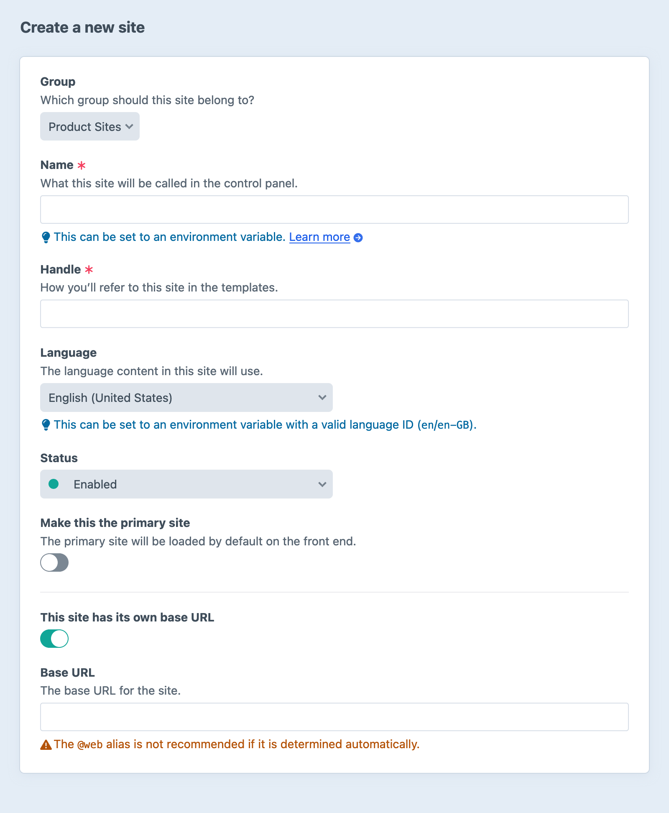
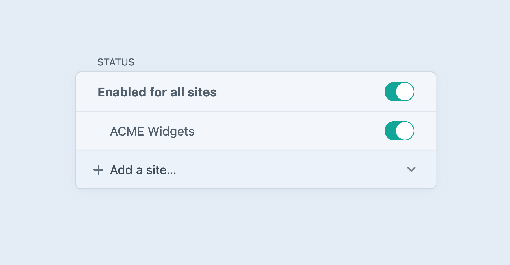

# Sites & Localization

A single Craft installation can power any number of websites.

Sites let you expand your presence to different domains, use unique [templates](#site-templates), and intelligently [localize content](#propagating-entries).

Craft’s multi-site feature is for sites with the same publishing team. You manage the multi-site content at the entry level, with the ability to enable sections you want included in a site.

::: warning
Craft’s multi-site feature is _not_ meant for managing multiple projects that have no relationship to one another. The Author experience is based on the assumption that some content is shared between them, and that users have some overlap in their capabilities or responsibilities.
:::

## Creating a Site

The first site is created when you install Craft, using the **Site Name** provided via the [setup GUI](kb:first-time-setup) or [CLI](../reference/cli.md#setup). Additional sites are created via <Journey path="Settings, Sites" />.


<BrowserShot
  url="https://my-craft-project.ddev.site/admin/sites/new"
  caption="Creating a new site in the Craft control panel."
  :link="false"
  :max-height="500">
  
</BrowserShot>

### Site Groups

Site groups allow you to organize your sites together by commonality, like language or site type.

Craft creates the first site group for you (named after the site created during installation) and assigns the default site to that group.

In addition to organization, site groups can be used in conjunction with a section’s [**Propagation Method**](#propagating-entries), or in some fields’ **Translation Method** settings.

You can access the current site’s group information using `currentSite.group`:

```twig
{# @var currentSite craft\models\Site #}
Site ID:          {{ currentSite.id }}
Site Handle:      {{ currentSite.handle }}
Site Name:        {{ currentSite.name }}
Site Language:    {{ currentSite.language }}
Is Primary Site?: {{ currentSite.primary }}
Base URL:         {{ currentSite.baseUrl }}

{# @var siteGroup craft\models\SiteGroup #}

Site Group Name:  {{ siteGroup.name }}
```

### Language

Choosing the language for the site determines how Craft formats dates, times, and numbers, and which [static message translations](#static-message-translations) are used, in the front-end.

In your templates, you can access the current site’s language setting via `craft.app.language`:

```twig{1}
<html lang="{{ craft.app.language }}">
  <head>
    <title>{{ siteName }}</title>
  </head>
  <body>
    {# ... #}
  </body>
</html>
```

::: tip
The current language can be used to conditionally display certain parts of a page—or you can create [site-specific templates](#site-templates) in your `templates/` directory.
:::

### Primary Site

Craft sets the default site (created during installation) as the **Primary** site, meaning Craft will load it by default on the front end, if it is unable to determine which site to load. If you only have one site then you cannot disable it as the Primary site.

You can change the primary site once you’ve created at least one other—Craft internally makes sure that only one site is marked as primary at any given time.

### Site URL

Each site has a **Base URL** that determines how Craft routes and generates links.

Multiple sites can share the same hostname and be distinguished by path (like `https://craftcms.com/` and `https://craftcms.com/de/`), or they can have different hostnames entirely (like `https://craftcms.com/` and `https://de.craftcms.com/`).

If you want to create a site with a different hostname, you must configure your server to handle traffic for it. The hostname can either point to the same web root as your current site, or its own web root (with unique `.htaccess` and/or entry script).

::: tip
If you have multiple sites using different root domains like `https://site-a.com` and `https://site-b.com`, with the way Craft’s [license enforcements works](kb:how-craft-license-enforcement-works), you’ll want to pick one of the domains to access the Craft control panel from for _all_ sites.

The domain you access the control panel from does _not_ affect what sites’ content you can edit!
:::

::: tip
If your primary site’s **Base URL** includes a subdirectory (i.e. `https://foo.dev/bar/`), you should set the [baseCpUrl](config5:baseCpUrl) config setting.
:::

### Site Templates

Whenever Craft loads a template, it looks in a subfolder of your `templates/` directory with the handle of the current site before trying the global space.

For example, if our site was named _Labs_ (with the handle `labs`), we could create a `templates/labs/` directory with any templates we wanted to override in the “global” space. Suppose the primary site and this Labs mini-site shared most of their page structure, but Labs had a simplified header and footer: we could put `` in a shared layout, and Craft would look in the current site’s template folder (`templates/labs/_partials/footer.twig`), _then_ fall back to the global space (`templates/_partials/footer.twig`).

(In this example, the layout template itself could also be controlled on a per-site basis!)

## Propagating Entries

[Entries](../reference/element-types/entries.md) support advanced rules for propagating content to other sites. Each section has a **Site Settings** table, in which you choose the sites its entries can be published in, as well as what their URIs look like.

_Channel_ and _Structure_ sections also include a **Propagation Method** setting, which determines how content is synchronized across sites, site groups, or languages when created or saved. _Single_ sections only contain one entry (and it’s automatically created when along with the section), so they don’t have propagation settings.

Only save entries to the site they were created in
:   Entries are created in a single site, and are not associated with content from other sites. Useful when creating similar content architectures for multiple otherwise unrelated sites—like a news feed for two unrelated products owned by a single company.

    ::: warning
    Keep in mind that entries created in this way cannot be added to other sites, later.
    :::

Save entries to other sites in the same site group
:   Entries are created only in sites belonging to the same **Site Group**, and are not associated with content from sites in other groups. Useful in scenarios where similar content architectures are important across multiple otherwise unrelated sites that are then available in multiple languages—like program-specific event feeds for a recreation center that are translated in multiple languages.

    Entries propagated in this way aren’t required to target different languages!

Save entries to other sites with the same language
:   Entries are created and managed in all sites that share a _language_. Useful in situations where the core content represented by an entry is only relevant in its original language, but might still be syndicated to other sites—like an archive of literary works or letters that might be a part of multiple digital museum collections.

Save entries to all sites enabled for this section
:   Entries are created and managed in all sites that are enabled in the **Site Settings** table.

Let each entry choose which sites it should be saved to
:   Leave these decisions up to each entry. Use the **Status** section in the sidebar to create the entry in another site:

    

    This option also allows entries to be deleted on a per-site basis (rather than just _disabled_).

When an entry exists in multiple sites, its content can be translated using similar (but even more flexible) rules, [on a field-by-field basis](fields.md#translation-methods).

## Setting Up a New Site

In this section, we’ll walk through the steps of setting up a new site in Craft. This guide assumes you already have Craft [installed](../install.md) and the default site setup and configured.

### Step 1: Create the Site

The first step is to create the new site in the **Settings** screen of your Craft installation.

1. Go to <Journey path="Settings, Sites" /> and press **New Site**.
2. Use the dropdown menu to choose the group your site should belong to. Site groups are used to control how content is translated.
3. Give your site a name. Craft uses the **Site Name** in the control panel, and makes it available in your [templates](../development/templates.md) as `{{ siteName }}`.
4. Based on the **Site Name**, Craft will generate a **Site Handle**. You can use the handle to refer to this site in the templates (i.e. `craft.app.sites.getSiteByHandle('beta')`), but it has no bearing on front-end URLs. It may appear in control panel URLs.
5. Choose the [language](#language) for this site.
6. If this site should be the primary or “default” site, toggle **Is Primary Site?** to enable it. The primary site is loaded whenever Craft can’t match the URL to a known site.
7. Check the box for **This site has its own base URL** and provide a **Base URL**.
8. Save the new site.

### Step 2 (Optional): Create Template Directories

If you’d like to experiment with per-site [template overrides](#site-templates), create a new subdirectory within your `templates/` folder with the handle of your new site.

### Step 3: Update Sections

1. Go into each Section that you want to be available in the new site and enable the site using the Site Settings table.
2. Set the **Entry URI Format**, **Template**, and **Status** for the new site in each Section.
3. Choose a [**Propagation Method**](#propagating-entries) that suits the section.

### Step 4: Define Translation Method of Fields

By default, custom fields are set to store the same value across all sites. If any fields should have unique values across your sites, then you will need to edit their [Translation Method](fields.md#translation-methods) settings.

::: tip
Multi-instance fields share a **Translation Method** across all instances. If you need different rules for each instance, it may be better suited as two separate fields.
:::

### Step 5: Test Your Settings

Using new or existing entries, verify that the section, field, and translation method settings work as you expect. View the entry in the front-end to ensure your URLs and templates are loading correctly, as well!

### Step 6: Check Your Asset Settings

If you have any _Local_ asset filesystems, you will need to make sure they (and the files in each volume that depends on them) are available from each of your sites. Relative paths (like `uploads/images/`) or root-relative paths (like `/uploads/images/`) may only work coincidentally. Filesystems’ **Base URL** setting should use a stable, absolute URL like `https://craftcms.com/` (or a special alias or environment variable).

::: tip
Review your translation method for asset titles and `alt` text to make sure they’re relevant to users and authors!
:::

### Step 7: Configure Your Web Server and DNS

1. Configure your web server so the domain (e.g. `labs.craftcms.com`) points at the `web/` directory. Craft will automatically detect which site is being requested.
2. Update your DNS records so the domain points at the web server.

## Static Message Translations

Most websites and apps will have some UI messages that are hard-coded into the templates or PHP files. These are called “static messages” in Craft, because they aren’t being written by editors in the CMS as content.

If you’re building a multilingual site or app, then these messages are apt to need to be translated, just like your CMS-driven content.

To do that, Craft employs Yii’s [Message Translations](https://www.yiiframework.com/doc/guide/2.0/en/tutorial-i18n#message-translation) feature, and pre-defines special translation categories:

- `site` is used for messages that belong to the project.
- `app` is used for Craft control panel messages.
- Each plugin gets its own category as well, based on the plugin’s handle.

### Prep Your Messages

The first step is to run all of your static messages through the translator. If you’re working on a template, use the [translate](../reference/twig/filters.md#translate-or-t) filter (`|t`). If you’re working in PHP code, use [Craft::t()](yii2:yii\BaseYii::t()).

::: code
```twig
{# old #}
<a href="/contact">Contact us</a>

{# new #}
<a href="/contact">{{ 'Contact us'|t }}</a>
```
```php
// old
echo 'Contact us';

// new
echo Craft::t('site', 'Contact us');
```
:::

### Provide the Translations

Once you’ve prepped a message for translations, you need to supply the actual translation.

To do that, create a new folder in your project’s base directory called `translations/`, and within that, create a new folder named after the target language’s ID. Within that, create a file named after the translation category you want to create messages for (`site.php` for project messages, `app.php` to overwrite Craft’s control panel messages, or `<plugin-handle>.php` to overwrite a plugin’s messages).

For example, if you want to translate your project’s messages into German, this is what your project’s directory structure should look like:

```treeview
my-project/
├── config/
├── ...
└── translations/
    └── de/
        └── site.php
```

Now open `site.php` in a text editor, and have it return an array that maps the _source messages_ to their _translated messages_:

```php
<?php

return [
    'Contact us' => 'Kontaktiere uns',
];
```

When Craft is processing the message translation for a German site, “Contact us” will be replaced with “Kontaktiere uns”.

::: tip
Craft uses `|t('site')` when showing your custom field names in the control panel, so you can use `site.php` translations for control panel users, too!
:::

#### Message Parameters

Static messages can have [placeholder values](https://www.yiiframework.com/doc/guide/2.0/en/tutorial-i18n#message-parameters). For example:

```php
<?php

return [
    'Welcome back, {name}' => 'Willkommen zurück {name}',
];
```

To replace the placeholder values with dynamic values when translating the message, pass the `params` argument when using the [translate](reference/twig/filters.md#translate-or-t) filter or calling [Craft::t()](yii2:yii\BaseYii::t()):

::: code
```twig
<a href="/contact">{{ 'Welcome back, {name}'|t(params = {
  name: currentUser.friendlyName,
}) }}</a>
```
```php
echo Craft::t('site', 'Welcome back, {name}', [
    'name' => Craft::$app->getUser()->getIdentity()->friendlyName,
]);
```
:::

## Limitations

Craft has a soft cap of 100 sites, determined by the `maxSites` property of the [Sites](craft5:craft\services\Sites) service. You can increase this at any time via your [application configuration](../configure.md#application-configuration) (it’s not a technical or license limitation), but we put it in place as a means of reminding users that sites are not _infinitely_ scalable!

To increase the sites ceiling, add this to your `config/app.php` file:

```php
return [
    'components' => [
        'sites' => [
            'maxSites' => 5000,
        ],
    ],
];
```

::: warning
While it’s _possible_ to run 5000 sites on a single Craft installation, we strongly discourage it. We have found that projects with more than a hundred sites are at significantly higher risk of author experience and performance issues, and are more difficult to maintain and troubleshoot.
:::

## Further Reading

- [The Power of t() in Craft 3](https://medium.com/@drifter/the-power-of-t-in-craft-3-b4bc3489edc4)
- [Language switcher for Craft 3 by Jan D’Hollander](https://www.thebasement.be/language-switcher-for-craft-3/)
- [Stack Exchange: Getting full native language name in Craft 3 language switcher](https://craftcms.stackexchange.com/questions/27116/getting-full-native-language-name-in-craft3-language-switcher)
