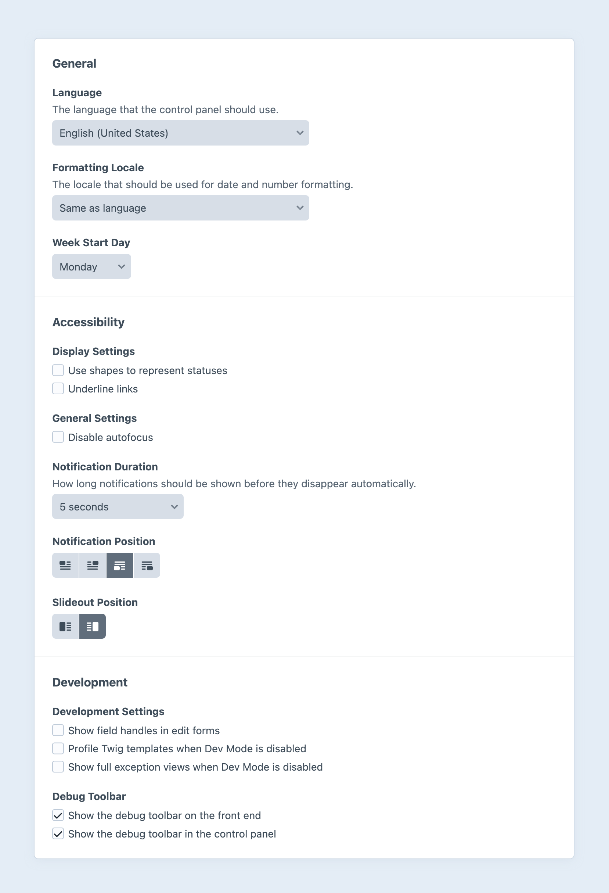

# User Management

[Users](../reference/element-types/users.md) in Craft represent humans that have some relationship with your site or application. They may be control panel users, member accounts, or records that represent people in general. Users implicitly have the ability to create passwords and [log in](#logging-in), but must be granted [permissions](#permissions) or added to [groups](#user-groups) to access the control panel or manage content.

The first user account is created during [installation](../install.md). The number of additional users that can be created (and their capabilities) depends on your Craft [edition](../editions.md):

- **Craft Solo** is limited to a single admin user.
- **Craft Team** <Badge text="New!" vertical="baseline" /> allows up to five users, and one [user group](#user-groups).
- **Craft Pro** has no limitations on the number of registered users or groups, and supports [public registration](#public-registration).

To create a new user, visit the **Users** control panel screen, then click **New user**. If you don’t see this item in the control panel navigation, your current user may not have the required [permission](#permissions) to register other users.

<BrowserShot url="https://my-project.ddev.site/admin/users/123&fresh=1" :link="false" caption="Creating a new user in the Craft control panel.">

</BrowserShot>

Users must be identified with at least an **Email** and a **Username** (or just an email address if the [`useEmailAsUsername` config setting](config5:useEmailAsUsername) is enabled). Select **Create and set permissions** <Since ver="5.3.0" feature="The revised user creation flow" /> to validate the user and move on to group and [permissions](#permissions) assignment.

::: tip
If you need to capture some information about a person but don’t have their email address yet, you can select **Save as draft** from the fly-out menu in the toolbar and come back to the draft later.
:::

The permissions screen will include a **Save and send activation email** button <Since ver="5.3.0" feature="The revised user creation flow" /> if the user is still _Inactive_. Users can also be activated by…

- …selecting **Send activation email** from the action menu <Icon kind="ellipses" /> in the toolbar;
- …selecting **Copy activation URL** from the action menu <Icon kind="ellipses" /> and sending it manually;
- …selecting **Activate account** without setting a password.

If an account is manually activated by another user _without setting a password_, the user can request a password reset via a [front-end form](#public-registration), or the control panel login screen.

## Statuses

Users may exist in the system in a number of states. A user is typically created in a **Pending** state (ready to be activated via an activation link), whether via [public registration](#public-registration) or by another user in the control panel. Changes to a user’s status can happen implicitly (via activation, failed login attempts, etc.) or explicitly (suspension by a moderator), some requiring additional verification by email or an [elevated session](#elevated-sessions).

Active
:   An **Active** user is able perform any task their permissions allow. Users are put in this state following account activation (either via an activation link or action taken by another user). However, an active account does not necessarily have a password—but once one is set (or the current password is reset), they _would_ be able to log in normally.

Pending
:   Public registration creates users in the **Pending** state, unless the **Deactivate users by default** setting is enabled in user settings. The only difference between a **Pending** and **Active** user is that they have never activated their account with an activation link, or had a user with the **Moderate users** permission activate it for them.

Suspended
:   **Suspended** users have been manually locked out of the system by an user with the [_Moderate Users_ permission](#permissions). They will be unable to log in or reset their password.

Inactive
:   New users and users that have been explicitly deactivated are marked as **Inactive**. An inactive user cannot log in, reset their password, or reactivate their account.

#### Special States

Credentialed
:   Craft has a special distinction for users who are able to log in _or could become able to log in_ under their own power. Any user that is either **Active** or **Pending** is considered **Credentialed**.

Locked
:   When a user makes too many unsuccessful login attempts (according to the <config5:maxInvalidLogins> and <config5:invalidLoginWindowDuration> settings), their account will be **Locked**. Another user with the **Moderate users** [permission](#permissions) can manually unlock a user in this state at any time, or the user can wait until the <config5:cooldownDuration> elapses and try again.

    ::: warning
    User locking is an automatic abuse-prevention behavior, not a moderation tool. If you need to prevent someone from accessing the site or control panel, **suspend** or **deactivate** the user.
    :::

Trashed
:   Like other elements, users can be _soft-deleted_. A trashed user cannot log in or restore themselves, and the user may be garbage-collected after remaining trashed for the configured <config5:softDeleteDuration>.

## Settings

The behavior of Craft’s user registration and authentication system is governed by a handful of config settings, and a few options (managed via <Journey path="Settings, Users, Settings" />) stored in [project config](project-config.md).

### Project Config

- **User Photo Location**: Which volume user profile assets are stored in. Files are always uploaded directly to a profile, and cannot be selected from the existing asset library.
- **Require two-step verification**: Choose which user groups (if any) are required to configure a two-step verification method to access the control panel. This has no effect on users who do not have control panel permissions.
- **Verify email addresses**: A user must demonstrate they have access to an email address before they can activate their account, or change the email on an existing account.
- **Allow public registration**: Whether or not users can register from the front-end.
- **Validate custom fields on public registration**: When registering via the front-end, require a complete user profile (including any fields marked as **Required** in the user field layout).
- **Deactivate users by default**: Place users in the **Inactive** state after registering, rather than sending an activation email. Another user with the **Moderate users** [permission](#permissions) must activate the user.
- **Default User Group**: The [group](#user-groups) that publicly-registered users are added to, if any.

In addition, the [users field layout](../reference/element-types/users.md#custom-fields) and [addresses field layout](../reference/element-types/addresses.md#setup) are stored in project config.

### Config Files

A combination of [user-specific](../reference/config/general.md#users), [session](../reference/config/general.md#session), and [security](../reference/config/general.md#security) settings are tracked via the [General](../reference/config/general.md) configuration file.

A summary of these settings (as they relate to front-end development) is available in the [Additional Tools](#additional-tools) section, below.

## Admin Accounts

Admin users are special accounts that can do _everything_ within Craft, including some things that don’t have explicit permissions:

- Modify all [Settings](control-panel.md#settings) (in environments with [admin changes](config5:allowAdminChanges) are enabled);
- Make other users admins (in editions that support multiple users);
- Administrate other admins (in editions that support multiple users);

The user you create when installing Craft is an admin by default. Users in Craft <Badge type="edition" text="Team" vertical="middle" /> can either have permissions from the single [group](#user-groups), or be an admin.

::: warning
Considering how much damage an admin can do, we strongly advise reserving this role for key members of your team or organization who cannot fulfill their responsibilities without it. Whenever possible, design a [permissions](#permissions) scheme that grants only the necessary capabilities.
:::

To make a user an admin, you must be logged in as an existing admin. Find the user in the **Users** screen, then select the **Permissions** tab, and enable **Admin**. The individual permissions checkboxes will be hidden, as admin implicitly have _all_ permissions. While admin can be part of groups, those groups’ permissions have no bearing on their capabilities unless they are stripped of the admin designation later.

You can also audit and create admin users from the [command line](#cli).

## User Groups <Badge type="edition" text="Pro" />

**User Groups** help organize your site’s user accounts, and uniformly set [permissions](#permissions) on them.

To create a new User Group, go to **Settings** → **Users** and press **+ New user group**. Groups have a **Name** and **Handle**, plus any **Permissions** you want every user within the group to have.

After you create your groups, you can assign users to groups by going into their account settings and choosing the **Permissions** tab. Permissions granted by groups are _additive_, so a user in multiple groups receives the combined permissions of those groups (as well has any permissions granted explicitly to that user). Removing a user from a group does not revoke permissions that are granted by another group they are a member of!

Users in Craft <Badge type="edition" text="Team" vertical="middle" /> belong to a single “Team” user group, the permissions for which are managed via <Journey path="Settings, Users, User Permissions" />.

## Permissions <Badge type="edition" text="Team" /> <Badge type="edition" text="Pro" />

Permissions govern what users can do—like access the control panel, edit content within certain sections, create and moderate other users, etc. You can assign these permissions directly to users, or via [user groups](#user-groups). Permissions applied to a user group are inherited by all users belonging to it.

::: warning
Make sure you trust users with access to settings that allow users to provide [Twig](../development/twig.md) code, like the **System Messages** utility. It’s possible to do malicious things via Twig (like permissions escalation), so these permissions are intended primarily for trusted admins and developers.
:::

The permissions Craft comes with are:

| Permission | [Handle](#checking-permissions)
| ---------- | ------
| Access the site when the system is off | `accessSiteWhenSystemIsOff`
| Access the control panel <InfoHud>This inherently enables limited read-only access to user data and most content via element selector modals and other means.</InfoHud> | `accessCp`
| <Indent :level="1" /> Access the control panel when the system is offline | `accessCpWhenSystemIsOff`
| <Indent :level="1" /> Perform Craft CMS and plugin updates | `performUpdates`
| <Indent :level="1" /> Access <CodePlaceholder>Plugin Name</CodePlaceholder> | `accessPlugin-[PluginHandle]`
| View users <InfoHud>Read-only access to user elements. In earlier versions of Craft, user management permissions were not nested within this one.</InfoHud> <Since ver="5.6.0" feature="View users permission" /> | `viewUsers`
| <Indent :level="1" /> Edit users <InfoHud>Non-critical actions like updating custom field values.</InfoHud> | `editUsers`
| <Indent :level="2" /> Register users | `registerUsers`
| <Indent :level="2" /> Moderate users <InfoHud>Moderation includes editing other users’ names, usernames, custom fields, and addresses, and sending activation emails. <Since ver="5.8.0" description="Users with the “Moderate users” permission were given the ability to send activation emails in {ver}." /></InfoHud> | `moderateUsers`
| <Indent :level="2" /> Administrate users <InfoHud>User administration includes changing emails, sending password reset emails, setting passwords, and deactivating users. This permission can be used to elevate one’s own permissions by gaining access to other administrators’ accounts!</InfoHud> | `administrateUsers`
| <Indent :level="2" /> Impersonate users <InfoHud>User impersonation allows one user to temporarily access the site as though they were another user with the same (or more restrictive) permissions.</InfoHud> | `impersonateUsers`
| <Indent :level="2" /> Assign user permissions | `assignUserPermissions`
| <Indent :level="2" /> Assign users to this group <InfoHud>This is not an actual permission so much as a convenience feature for automatically granting the ability to add peers to the <em>group</em> you are currently editing, as its handle/UUID may not be known, yet!</InfoHud> | See note.
| <Indent :level="2" /> Assign users to <CodePlaceholder>Group Name</CodePlaceholder> | `assignUserGroup:[UserGroupUID]`
| <Indent :level="1" /> Delete users | `deleteUsers`
| Edit <CodePlaceholder>Site Name</CodePlaceholder> <InfoHud>Site permissions are intersected with other permissions. A user will only be able to edit something if they have access to the site <em>and</em> the element itself.</InfoHud> | `editSite:[SiteUID]`
| View entries <InfoHud>This section is repeated for each configured section.</InfoHud> | `viewEntries:[SectionUID]`
| <Indent :level="1" /> Create entries | `createEntries:[SectionUID]`
| <Indent :level="1" /> Save entries | `saveEntries:[SectionUID]`
| <Indent :level="1" /> Delete entries | `deleteEntries:[SectionUID]`
| <Indent :level="1" /> View other users’ entries | `viewPeerEntries:[SectionUID]`
| <Indent :level="2" /> Save other users’ entries | `savePeerEntries:[SectionUID]`
| <Indent :level="2" /> Delete other users’ entries for site <InfoHud>Allow deleting other users’ entries for individual sites they have access to.</InfoHud> | `deletePeerEntriesForSite:[SectionUID]`
| <Indent :level="2" /> Delete other users’ entries | `deletePeerEntries:[SectionUID]`
| <Indent :level="1" /> View other users’ drafts | `viewPeerEntryDrafts:[SectionUID]`
| <Indent :level="2" /> Save other users’ drafts | `savePeerEntryDrafts:[SectionUID]`
| <Indent :level="2" /> Delete other users’ drafts | `deletePeerEntryDrafts:[SectionUID]`
| Edit <CodePlaceholder>Global Set Name</CodePlaceholder> | `editGlobalSet:[GlobalSetUID]`
| View categories <InfoHud>This section is repeated for each configured category group.</InfoHud> | `viewCategories:[CategoryGroupUID]`
| <Indent :level="1" /> Save categories | `saveCategories:[CategoryGroupUID]`
| <Indent :level="1" /> Delete categories | `deleteCategories:[CategoryGroupUID]`
| <Indent :level="1" /> View other users’ drafts | `viewPeerCategoryDrafts:[CategoryGroupUID]`
| <Indent :level="2" /> Save other users’ drafts | `savePeerCategoryDrafts:[CategoryGroupUID]`
| <Indent :level="2" /> Delete other users’ drafts | `deletePeerCategoryDrafts:[CategoryGroupUID]`
| View assets | `viewAssets:[VolumeUID]`
| <Indent :level="1" /> Save assets | `saveAssets:[VolumeUID]`
| <Indent :level="1" /> Delete assets | `deleteAssets:[VolumeUID]`
| <Indent :level="1" /> Replace files | `replaceFiles:[VolumeUID]`
| <Indent :level="1" /> Edit images | `editImages:[VolumeUID]`
| <Indent :level="1" /> View assets uploaded by other users | `viewPeerAssets:[VolumeUID]`
| <Indent :level="2" /> Save assets uploaded by other users | `savePeerAssets:[VolumeUID]`
| <Indent :level="2" /> Replace files uploaded by other users | `replacePeerFiles:[VolumeUID]`
| <Indent :level="2" /> Remove files uploaded by other users | `deletePeerAssets:[VolumeUID]`
| <Indent :level="2" /> Edit images uploaded by other users | `editPeerImages:[VolumeUID]`
| <Indent :level="1" /> Create subfolders | `createFolders:[VolumeUID]`
| Utilities |
| <Indent :level="1" /> Updates | `utility:updates`
| <Indent :level="1" /> System Report | `utility:system-report`
| <Indent :level="1" /> PHP Info | `utility:php-info`
| <Indent :level="1" /> System Messages | `utility:system-messages`
| <Indent :level="1" /> Asset Indexes | `utility:asset-indexes`
| <Indent :level="1" /> Queue Manager | `utility:queue-manager`
| <Indent :level="1" /> Caches | `utility:clear-caches`
| <Indent :level="1" /> Deprecation Warnings | `utility:deprecation-errors`
| <Indent :level="1" /> Database Backup | `utility:db-backup`
| <Indent :level="1" /> Find and Replace | `utility:find-replace`
| <Indent :level="1" /> Migrations | `utility:migrations`

You may not see all of these options, initially—only ones that are relevant based on the current content schema will be displayed. For example, everything under _View categories_ will be hidden until you have at least one [category group](../reference/element-types/categories.md#category-groups).

Plugins may register their own permissions, which can appear in a top-level group, under _Access the control panel_, or within _Utilities_.

::: tip
See the _Extending Craft_ [User Permissions](../extend/user-permissions.md) page to learn how to register custom permissions from a module or plugin.
:::

### Checking Permissions

You can check whether the logged-in user has a specific permission using its handle. Replace any bracketed items in the table above with the desired value (So `accessPlugin-[PluginHandle]` would become `accessPlugin-commerce`).

```twig

  <a href="{{ cpUrl() }}">Visit the Control Panel</a>

```

For UUID-driven permissions, you can either hard-code the value in Twig, or look it up dynamically.

::: code
```twig Verbatim
{# Store the UUID directly in the template: #}

  <a href="{{ siteUrl('account/vendors/add') }}">Add a Vendor</a>

```
```twig Dynamic
{# Look up the section by its handle: #}


{# Build the permission handle: #}

  <a href="{{ siteUrl('account/vendors/add') }}">Add a Vendor</a>

```
:::

This is not strictly necessary, but the `handle` of a given resource is often much easier to understand in the template context.

::: tip
UUIDs and handles are safe to use like this because they’re tracked in [Project Config](project-config.md) and will be [consistent across environments](project-config.md#ids-uuids-and-handles), unlike IDs.
:::

If your site or app doesn’t rely on specific permissions to control access to resources, you can check whether the user belongs to a group, instead:

```twig{3}



  <div class="banner">Thanks for your support!</div>

```

### Requiring Permissions

You can also require the logged-in user to have a specific permission to access an entire template:

```twig

```

If the requirements are not met, Craft will send a 403 _Forbidden_ response with the site’s [error template](routing.md#error-templates). Logged-out visitors will be forwarded to the configured [loginPath](config5:loginPath); after signing in, the user will be redirected to the original path—but may still encounter a _Forbidden_ error if their account doesn’t have the correct permissions.

### Forms + Content

When a user is given permissions to edit or create elements that meet certain criteria (say, entries in a specific section), they do _not_ need [control panel](control-panel.md) access to make updates.

When POSTing new data to actions like [`entries/save-entry`](../reference/controller-actions.md#post-entries-save-entry) (or the more generic `elements/save`), Craft checks for the appropriate permissions. This means that you can create secure, streamlined content management tools for users, without ever granting them access to the control panel!

Keep in mind that permissions issues are dealt with differently than [validation errors](../development/forms.md#models-and-validation), so it’s important to check permissions _prior_ to displaying an edit interface to a user. Attempting to POST updates to an element that the current user cannot edit will produce a 400-level HTTP error, and the changes will be lost. If you want to make only certain fields editable to certain users, add [user conditions](fields.md#conditions) to the element’s field layout.

### Querying by Permissions

You can look up users with a given permission using the [`can()` method](../reference/element-types/users.md#can) on a user query. To find users belonging to a specific group, use the [`group()` method](../reference/element-types/users.md#group).

## Preferences

Users have a few settings that govern their experience of the control panel and front-end, including their preferred **Language** and **Formatting Locale**, a number of **Accessibility** features, and (for [administrators](#admin-accounts)) debugging tools.



## Authentication <Badge text="New!" />

[Credentialed](#special-states) users in Craft can authenticate with one or more methods. By default, Craft uses a password to verify the user’s identity. In addition to passwords, users can set up [two-factor authentication](#time-based-one-time-passwords), or add a [passkey](#passkeys).


Plugins can also provide authentication methods!

### Time-based, One-Time Passwords

Craft has built-in support for one-time passwords via your favorite authenticator app or password manager. When enabled (via <Journey path="Settings, Users, Security" />), control panel users subject to your policy will be asked to set up an authenticator on their next login.

If a user loses access to their <abbr title="Time-based, one-time password">TOTP</abbr> provider, they can use one of the recovery codes generated at the time it was set up.

### Passkeys

Individual users can elect to log in with a [Passkey](https://fidoalliance.org/passkeys/). To configure a passkey, visit your user’s account screen via the menu in the upper-right corner of the control panel, then choose **Passkeys**.

::: tip
Some browsers and devices share passkeys via their own accounts or cloud services, so you may only need one passkey added to Craft to authenticate on multiple devices.
:::

### Elevated Sessions

The control panel may require users to reauthorize to perform some actions, like removing authentication methods, altering [permissions](#permissions), or modifying [GraphQL](../development/graphql.md) schemas.

An elevated session’s duration is governed by the <config5:elevatedSessionDuration> setting.

### Front-end Multi-factor Authentication <Since ver="5.6.0" feature="Multi-factor auth support outside the control panel" />

When **Require two-step verification** is enabled for user groups that _don’t_ have control panel access, those users may be sent to the Craft-provided [front-end login page](#front-end-pro) to perform additional authentication.

<a name="public-registration"></a>

## Public Registration <badge type="edition" title="Craft Pro only">Pro</badge>

Public user registration is disabled by default, but can be turned on by visiting <Journey path="Settings, Users, Settings" />, and checking **Allow public registration**. With that checked, you will also have the ability to choose a **Default User Group** that publicly-registered users are automatically added to.

Once you set up your site to allow public user registration, the last step is to create a front-end [user registration form](kb:front-end-user-accounts#registration-form). For a full list of params a user can set during registration (or when updating their account, later on), read about the [`users/save-user` controller action](../reference/controller-actions.md#post-users-save-user).

::: tip
By default, Craft puts new users in a [pending state](#statuses) and allows them to activate their own accounts via email. You can instead select **Deactivate users by default** to place a moderation buffer between public registration and eventual access.
:::

### Affiliated Site <Since ver="5.6.0" feature="Affiliated sites for user elements" />

During registration, Craft captures the current [site](sites.md) and stores it as the user’s **Affiliated Site**. This is primarily used to determine what language and template [system emails](mail.md#system-messages) should be use, when sent from site-agnostic contexts (like the control panel or CLI).

### Default Group

Users created via public registration are automatically added to the group designated by the **Default User Group** setting.

::: danger
Select this group’s [permissions](#permissions) carefully, ensuring that new users don’t immediately get access to tools that can negatively affect other users’ experience.
:::

## Logging In

Any [credentialed](#statuses) user can set a password and log in.

### Control Panel

Users with [control panel](control-panel.md) access should use Craft’s native login form, which is shown when visiting `/admin` (or the path corresponding to your <config5:cpTrigger>). Any time an unauthenticated client tries to access a resource in the control panel, they will be redirected to the login page. 

After logging in (and, when configured, completing [two-step verification](#authentication)), they will be returned to the [dashboard](control-panel.md#dashboard), or whichever protected page they originally attempted to access.

::: tip
When a control panel user authenticates and is redirected, their permissions _may_ still prevent them from viewing that resource.
:::

### Front-end <badge type="edition" title="Craft Pro only">Pro</badge>

Sites that support [public registration](#public-registration) or whose administrators create accounts without control panel access are apt to require front-end login forms.

The <config5:loginPath> setting determines where Craft sends users who access pages guarded by the [``](../reference/twig/tags.md#requirelogin) or [``](../reference/twig/tags.md#requirepermission) tags, as well as the value of the global [`loginUrl` variable](../reference/twig/global-variables.md#loginurl):

```twig{9}
<header>
  

  
    Welcome, {{ currentUser.fullName ?: currentUser.username }}!
    <a href="{{ siteUrl('my-account') }}">My Account</a>
    <a href="{{ logoutUrl }}">Sign out</a>
  
    <a href="{{ loginUrl }}">Sign in</a>
  
</header>
```

By default, this path is `login`, so `{{ loginUrl }}` would print something like `https://my-project.ddev.site/login`.

When this route is requested, Craft looks for the [corresponding template](#custom-template), `templates/login.twig`. If it can’t be found, a bare-bones internal version will be used: <Since ver="5.6.0" feature="Built-in front-end login template" />

<BrowserShot url="https://my-project.ddev.site/login" :link="false" caption="Logging in to the front end of a Craft website, for which a login template does not exist.">

</BrowserShot>

You can inject additional styles into this page using the <config5:systemTemplateCss> setting:

```php
use craft\config\GeneralConfig;

return GeneralConfig::create()
    // ...
    ->systemTemplateCss('/assets/styles/system.css')
;
```

Full reference for the CSS variables used on this page are [available in the source](https://github.com/craftcms/cms/blob/5.x/src/web/assets/theme/dist/fe.css). <Since ver="5.6.0" feature="System template stylesheet setting" />

::: tip
This template will also be displayed when users are required to set up a new [two-step verification](#authentication) method (or complete authorization, later).
:::

No template is rendered for requests matching the <config5:logoutPath>; the user’s session is terminated, and they are redirected to the <config5:postLogoutRedirect>.

### Custom Template

Create a new Twig file at `templates/login.twig` (or `templates/{loginPath}.twig`, if you have a custom <config5:loginPath>) with the following content:

```twig
<form method="post">
  {{ csrfInput() }}
  {{ actionInput('users/login') }}

  <label for="login-name">Username/Email</label>
  <input type="text" name="loginName" id="login-name">

  <label for="password">Password</label>
  <input type="password" name="password" id="password">

  <button>Sign in</button>
</form>
```

You are free to have this template extend an existing layout, or directly add `<head>` and `<body>` tags.

Visiting your site’s `/login` page in a _private_ browser, you should see the unstyled form. Opening the same page in a browser with an _active_ session may redirect you to the configured <config5:postLoginRedirect> (or the primary site’s homepage, by default).

<See path="../development/forms.md" label="Working with Forms" description="Learn about sending data to Craft with forms." />

::: tip
Additional information about handling login and account creation can be found in our [Front-End User Accounts](kb:front-end-user-accounts) guide.
:::

Any valid username and email combination can be submitted to log in. As mentioned above, if the user needs to set up or authenticate with a two-step verification method, they will be taken to the “system” login view to complete their login.

To help users understand the state of their session (and in some limited circumstances, specific issues with the submitted information), you can output [flashes](../development/forms.md#flashes) from the login action:

```twig



  <ul>
    
      <li>{{ flash }}</li>
    
  </ul>

```

### Custom Routes

The `loginUrl` Twig variable is set based on the corresponding config value. How this route is handled is actually up to your project! When the `loginUrl` path is requested by a client, Craft uses its normal [route resolution process](routing.md), including the normal element URI search, `routes.php` rule matching, and looking in your project’s `templates/` directory.

This means that you can decouple the route from the template by adding a [rule](routing.md) to your `routes.php` file:

```php
return [
    // Assuming your `general.php` config sets `loginPath` to `account/sign-in`...
    'account/sign-in' => ['template' => '_accounts/login'],
];
```

Then, you would be free to create `templates/_accounts/login.twig`, alongside other templates in a [hidden](../development/templates.md#hidden-templates) directory.

### Additional Tools

These variables are available in all Twig contexts:

- `loginUrl` — Defined by <config5:loginPath>. Used to build a link to the central login page, and where users will be redirected when requesting a protected resource.
- `logoutUrl` — Defined by <config5:logoutPath>. Used to build a link that immediately logs the user out.
- `setPasswordUrl` — Defined by <config5:setPasswordRequestPath>. Used to build a link to a central page where users can request their password be reset. A link is sent to the user’s email address (based on the <config5:setPasswordPath> setting) with `id` and `code` query parameters.

Other URLs are generated when activating accounts or resetting passwords, and are not available for direct use in templates.

Fine-grained control over registration and sign-in workflows are possible with these settings:

- Logging in and out…
  - <config5:loginPath> — Determines the `loginUrl` variable. (Default: `login`)
  - <config5:logoutPath> — Determines the `logoutUrl` variable, and maps the specified path to the `users/logout` controller action. (Default: `logout`)
- Account activation…
  - <config5:setPasswordRequestPath> — Determines the `setPasswordPath` variable. (Default: `setpassword`) Users will visit this page to _request_ a password reset link.
  - <config5:setPasswordPath> — Where users will be sent to _set_ a password. These secure, temporary URLs are generated by Craft when sending a password reset email, or when another user with the _Administrate users_ permission requests a password reset link via the control panel.
  - <config5:setPasswordSuccessPath> — Where users are redirected after successfully setting a new password.
- Changing and verifying email addresses…
  - <config5:verifyEmailPath> — Used when generating a link sent via email to verify access to an email address.
  - <config5:verifyEmailSuccessPath> — Similar to `setPasswordSuccessPath`, but for redirection after a user verifies their email address (either upon creating an account, or changing its email address).
  - <config5:useEmailAsUsername> — Simplifies record-keeping and authentication by eliminating discrete usernames.
- Security and timing…
  - <config5:autoLoginAfterAccountActivation> — Control whether users are immediately logged in after setting a password. (Default: `false`)
  - <config5:purgePendingUsersDuration> — How long Craft waits before deleting pending, non-activated users. (Default: `0`, or _disabled_)
  - <config5:purgeStaleUserSessionDuration> — How long Craft waits before dropping stale sessions from the `sessions` database table. This may (Default: 90 days)
  - <config5:invalidUserTokenPath> — Where users are redirected if the token or code in an activation or verification link is invalid or has expired.

## CLI

Craft’s [command line](cli.md) provides admin-level user management tools. With access to the underlying server, you can create, delete, and impersonate users, get activation URLs, set passwords, and even log out all users.

<See path="../reference/cli.md" hash="users" label="Users CLI Reference" description="Read more about managing users via the command line." />
